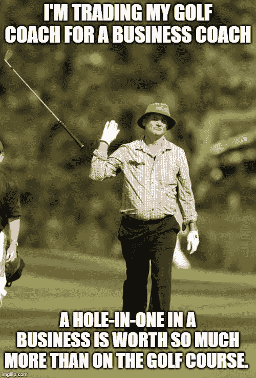
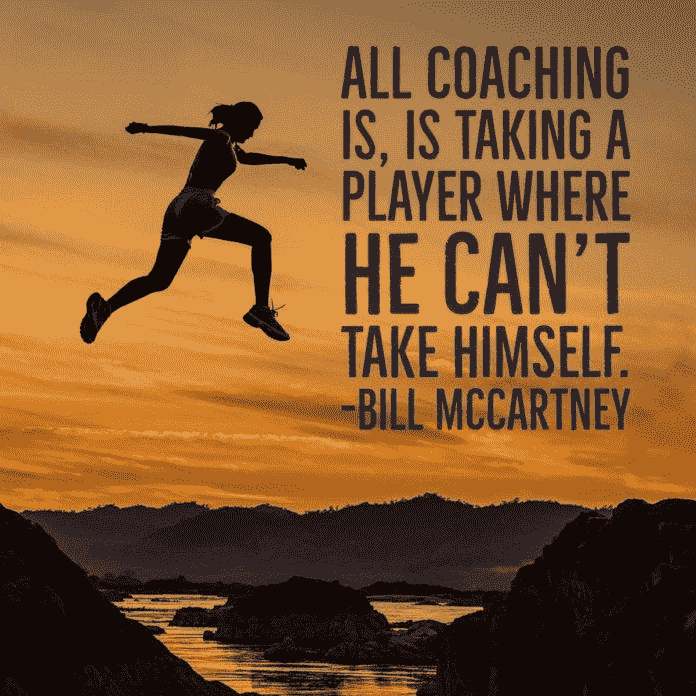
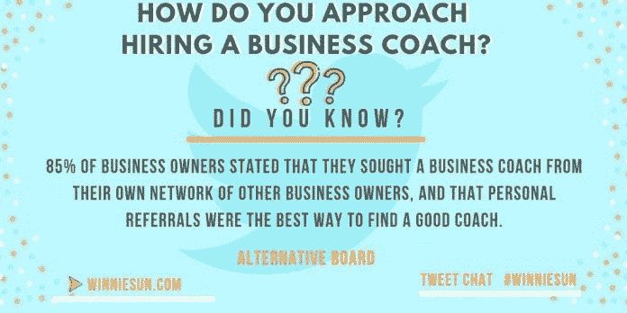
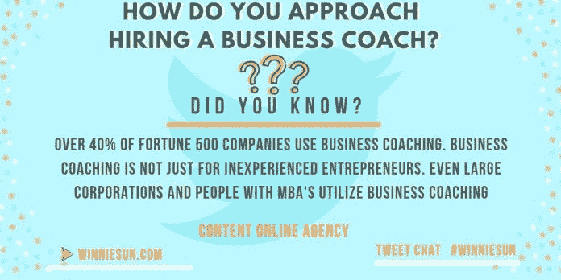
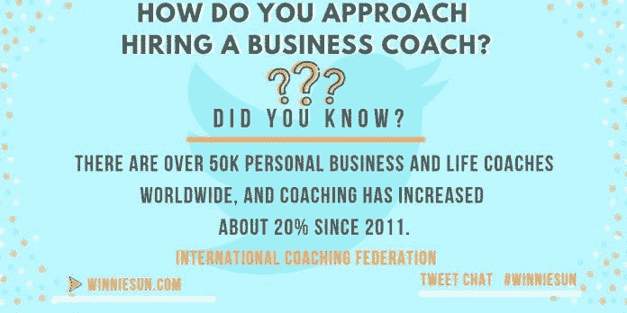

# 证据就在教练中

> 原文：<https://medium.datadriveninvestor.com/the-proof-is-in-the-coaching-f492aa1300b9?source=collection_archive---------9----------------------->

## 为了更好地做生意，给自己找一个商业教练

Photo by Nik MacMillan on Unsplash

一个教练可以给企业带来繁荣。这使得雇佣合适的人变得非常重要。

"如果你想成为一名更好的高尔夫球手，你应该请教高尔夫教练。"理财顾问[温妮孙](https://twitter.com/winniesun)说道。“如果你想成为一名更好的跑步者，你应该去找一名跑步教练。如果你想在业务上做得更好，难道不应该有一个业务教练吗？”

这对孙来说是一个重要的问题。作为《美国消费者新闻与商业频道》和《福布斯》等媒体的嘉宾，以及她自己的播客，她的观众依靠“财富密语者”来提供可靠的金融专业知识。一个好的教练有助于她保持对金钱的警觉。

“合适的商业教练的力量对你的企业来说可能是巨大的，但如果你不探索，你怎么知道呢？”凯瑟琳·海塞特(Kathleen Hessert)说，她通过与知名体育人士并肩工作，学会了“指导”他人，包括高管。

 [## 成功人生的 25 种自我提升方式|数据驱动的投资者

### “我活得越久，学到的就越多。学的越多，体会的越多，知道的越少。”―米切尔·莱格兰德时间到…

www.datadriveninvestor.com](https://www.datadriveninvestor.com/2019/03/12/25-self-improvement-ways-for-a-successful-life/) 

“高管和体育明星之间的主要区别在于制服——同样的不安全感，”他说。“教练职业每天都在完善自己。这是必须的，因为人们的期望值越来越高。

“这些年来，我和最杰出的奥运选手、精英运动员和教练一起工作过，”她说。“有趣的是，大多数 C 级高管首先会问我目前在和哪些教练一起工作。他们用我的指导来衡量他们的成功，尽管这并不总是公平的。我连网球都不打。”

Mellissah Smith 作为一名企业家、营销人员、编辑、演讲者、机器人和软件专家，她声名远扬，并被评为 100 名最具企业家影响力的人物。这位“热情的营销者”在澳大利亚和美国经营着一家营销技术公司和一家营销咨询公司。

“由于如此多的教练组织拥有成功的教练模式，企业家和个人都从中受益，”她说。"一个结构化的方法和简单的写下目标[会创造成功."](https://medium.com/datadriveninvestor/goal-setting-as-simple-as-it-sounds-d6d7ac7e4911)

孙、黑塞特和史密斯加入了布莱恩·克莱默的行列，布莱恩·克莱默是主题演讲人，“教练的教练”，也是畅销书《[没有 B2B 或 B2C:这是人与人之间的关系》的作者他们一起谈论优秀教练的优点和必要性。](https://www.amazon.com/There-No-B2B-B2c-Human/dp/1640079335/ref=sr_1_1?ie=UTF8&qid=1490565500&sr=8-1&keywords=human+to+human)

# 前卫的思想家

术语很重要，比如商业教练、教师和导师之间的区别。

“一个商业教练要向前看，”克莱默说。“老师给你批判性思维。导师有助于减少决策时间。”

 [## 接触商业教练的强大清晰

### 总有一个好时机去倾听伟大的建议

jkatzaman.medium.com](https://jkatzaman.medium.com/reach-out-for-the-powerful-clarity-of-a-business-coach-5b1b2c364d47) 

Hessert 利用了她在传统教练方面的经验。

“与运动员和教练一起工作了三十年，让我知道他们也是很棒的学生，”她说。“就像任何寻找并致力于接受指导的人一样，他们真诚地希望成为最好的，并且通常会努力实现这一目标。

“商业教练会问更多更深层次的问题，”他说。“当然，他们必须像冈比一样敏捷，必须能读懂字里行间的意思。教师通常会设置内容议程。导师的时间更加分散，内容也不那么具体。”

在她看来，一个人是教练、老师还是导师取决于专家的可达性、公司的预算以及对短期或长期解决方案的承诺。

“每个人在生活中的某些时候都能从这三种特质中受益，”他说。

史密斯认为跟踪记录很重要。

她说:“有成功案例的教练，以及符合你心理特征的优秀框架，可以改变游戏规则。”“对我来说，有一个导师是我睡觉时赚钱的生意和我为一种生活方式而工作的区别。

“他们可以给你一个框架，让你伸手摘星，实现你所有的目标，”史密斯说。"最终，你必须接受他们结构化的指导，并遵循它."

企业主需要采取一种接受的心态。

“企业家习惯于领导，”孙说。“接受他人的建议并实施他们所学的策略是一项脑力锻炼。”

找到合适的商业教练是一门艺术加上直觉。

“没有一种方法可以找到教练，但是在任何行业都没有什么比引荐更好，”克莱默说。“我们信任他人和朋友胜过一切。”

# 人与应用

史密斯对非个人的搜索持怀疑态度。

“我远离互联网和应用程序，”她说。“找到合适的教练不是通过谷歌算法就能做到的。你需要一个你尊敬的人，他会让你对自己的目标负责。教练必须比我更成功。”

 [## 瞧，这是一个聪明的教练方法

### 阿曼达的人工智能推动领导者采取行动

medium.com](https://medium.com/datadriveninvestor/behold-an-intelligent-way-to-coach-abf7aba72452) 

顶级教练知道如何让客户满意。

“责任就是一切，”史密斯说。“我们每个人都可能因为太忙而无法完成实现目标所需的艰苦工作。有一个教练让你专注于对你真正重要的事情。

“我想向最优秀的人学习，”她说。“如今，大多数商业教练都有很好的框架。他们需要这一点点额外的东西，让像我这样的人更上一层楼。”

没有心甘情愿的伙伴，教练是不会成功的。

“如果你花了时间和金钱去聘请教练，你需要倾听和学习，”史密斯说。“如果你不够尊重他们，带你踏上那段旅程，或者你认为你什么都知道，你就不会成长。什么都没变。什么都没变。

“我的导师对我来说是不同的，”她说。“我看着他从 1 亿美元增长到 30 亿美元。他也不怕告诉我我错了，或者接受事实。你不需要去上学就能成为一名好教练，但你确实需要一个框架，知道胜利是什么样子的。”

他还寻求口碑推荐，以找到合适的商业教练或客户。

“化学是至关重要的，”她说。确定这一点的第一步是询问个人风格，最好由你信任的人来回答。那个人可以是专家，但不是你的对手。”

# 相互尊重

给予和接受的建议对双方都必须是真诚的。

“许多人身边都是拍马屁的‘应声虫’，”他说。“当人们接受一名教练，但不喜欢他们给出的坦率建议时，他们会找到各种各样的借口。”

她不同意教练必须至高无上的观点。

“我母亲曾经告诉我:永远不要雇佣一个没有你成功的金融专家，”他说。“但就‘不要教我你自己没做过的东西’而言，我不同意。我所知道的最成功的体育教练之一甚至从未玩过这种游戏。”

 [## 商务攀登者拥抱他们的夏尔巴人

### 教练让人们和团队更上一层楼

medium.com](https://medium.com/datadriveninvestor/business-climbers-hug-their-sherpas-ab2f431041e) 

问正确的问题有助于得到正确的答案。这些问题包括在最初的咨询中向潜在的商业教练提问。

“你会想学习潜在教练的领导能力和商业哲学，”孙说。你会想知道他们的流程是什么。让他们在脑海中为你描绘出来，并与你分享在参与他们的服务之前要记住的事情。"

他问了这些问题:

*   你如何衡量成功？
*   我们如何合作？
*   你只在规定的时间和日期有空吗？
*   会议是虚拟的，面对面的还是混合的？
*   你能代表我和其他关键人物谈谈吗？
*   你会定期做书面报告吗？

“定义成功往往意味着偏离组织内成功的标准指标，以及当前、中期和长期的成功，这是非常不同的，”Hassert 说。

对克莱默来说，问你的教练最重要的问题是，“你能如何帮助我？”史密斯眼睛里的经验，抓住了她的问题的关键:

*   这是我所在的地方，也是我想去的地方。你能帮助我到达那里吗？
*   你遵循什么样的哲学？
*   你喜欢什么书？
*   你听什么播客？

“教练像你一样学习很重要，”史密斯说。

# 维持观点

与商业教练一起工作会提高期望值。企业家应该知道他们的企业将如何从引入教练中获益。

“了解不同的教练风格，”克莱默说。“有非线性直觉辅导，然后有利基过程辅导。这取决于你是谁，以及你希望你的性格适合的结果。

“在我自己的教练实践中，我总是喜欢说，如果我不能成功地帮助人们实现他们真正的快乐，我就没有做好我的工作，”他说。

 [## 投资回报全在数字里

### 有创造力的头脑聚集在一起以获取利润

medium.com](https://medium.com/datadriveninvestor/return-on-investment-is-all-in-the-numbers-cb252bd3cf24) 

根据 Hessert 的说法，教练的投资回报取决于教练和客户的关键绩效指标，以确保双方事先达成一致。史密斯表示同意。

“一个商业教练可以把你从今天的位置带到明天你想去的地方，”史密斯说。“你得让我自己想到那里去。每个企业都从辅导和发展中受益。持续不懈的改进总是必要的。

“投资回报率是垃圾进，垃圾出，”她说。“你投入什么，你就会得到什么。KPI 应该围绕教练的每一个领域，这样你就知道该努力什么。最终，你必须准备好信奉你教练的哲学。”

选择教练时，时机可以发挥作用，只要它被视为一个机会，而不是拖延的理由。

克雷默说:“在企业的每个阶段，每个人都可以使用观察者——或教练。“这个人可以帮助有盲点的企业，或者见证他们创造和完成的里程碑，朝着他们试图实现的巨大山顶目标前进。”

在正确的时间和成本引进的教练可以带来巨大的回报。

“时机是事情的一部分，”史密斯说。“有一些廉价的方法可以通过书籍或播客来利用自律提供一个教练平台。但当你负担得起时，雇一名教练是你在商业和生活中能做的最好的投资。”

# 为合适的人提出合适的问题

选择什么样的人会有所不同。

“商业生命周期的每个阶段都有一个质量教练，”他说。“你愿意在什么时候、花多少钱接受指导？你会听并表演吗？通常，情感和时间投资比预算更能决定成败。”

小企业通常与大公司不同。公司规模可能会影响教练的选择。

“这要看情况，”孙说。“许多小企业产生了大企业的生产力。如果一个教练没有和比我们更有成效的企业合作过，我会对他的工作持谨慎态度。”

 [## 难以置信的价值意味着体验

### 解决人们的问题让你不可或缺

medium.com](https://medium.com/datadriveninvestor/incredible-value-bespeaks-experience-75b319f97a86) 

经验是突出的关键指标。

“当你是一个小企业时，刚刚学会框架的人往往是不够的，”史密斯说。“你需要一个经历过这一切的人，一个能帮助你应对眼前挑战的人。

“每个人都是不同的，但我想要一个不害怕推动我发挥全部潜力的人，一个提醒我永远不要放弃的人，”她说。

完整的画面才是最重要的。

克雷默说:“与专攻某个领域或类别的商业教练合作没有任何优势。“你在指导整个人。很多时候，我认为教练更依赖于个性匹配。”

他提出了定义教练生涯的参数。

“一定要找一个不仅对你的规模和类似业务有经验，而且对你的目标有经验的教练，”她说。“如果教练不了解大，他们就不太可能把你带到那里。提前确定你们什么时候比对方活得长。

“以我的经验来看，最优秀的人只想变得更好，并且会接受即使是一件小事也能让他们从竞争中脱颖而出，”哈塞特说。"这需要愿意并能够被推动."

虽然熟悉一个行业听起来不错，但对于一名商业教练来说，这并不是必不可少的。

"如果你把自己局限于在你的行业中寻找教练，你可能没有找到最适合你的教练，"孙说。

“这真的取决于个人，以及教练的经验是否能很好地转化为你和你的领导风格和需求——如果你同意的话，”她说。"你可以很快找到一个与你的行业相符的精明教练."

# 寻求清晰

教练原则超越特定行业。

克雷默说:“教练会问最有力的问题，因为每个客户都有创造力、足智多谋和完整性。”“没有必要了解业务。问题是它们能引导你变得更加清晰。了解一个行业就成了最重要的事情。”

企业家保留了他们专业领域的专长。

“新的观点非常有价值，但要做好准备，教练们不得不增加他们对你所在行业的熟悉程度，这可能会导致沮丧，”他说。"不要害怕将他们与其他内部专家联系起来，了解关键的细微差别."

 [## 数字领导者希望打造最佳体验

### 企业家寻求优势，在网上找到最佳地点

medium.com](https://medium.com/datadriveninvestor/digital-leaders-want-to-build-the-best-experience-b4086fe630fa) 

关键因素是教练的建议，而不是输送系统。

“我是技术和营销行业的企业家，”史密斯说。“然而，我的导师甚至没有一台电脑在他的桌子上。你必须弄清楚你想从教练或导师那里得到什么，以及他们是否具备这些能力。

她说:“我希望有人了解商业，能够预见到我前进道路上的障碍，有时甚至比我更早。”。“这可以帮助我在一个我不太擅长的层面上理解商业。所以对我来说，这只是生意。”

雇用商业教练时，钱总是一个考虑因素。

“没有教练你会付出什么代价？”克雷默说。“从现在起一年后你会花多少钱，以及你为得不到教练指导而付出的代价？答案变成了你的教练预算。”

预算项目会有所不同。

“通常情况下，每月支付 2000 至 3000 美元的一天是一个很好的起点，”史密斯说。“你要最好的。如果你能做到每月一天以上，那就更好了。这是对你和你的发展的投资。那值多少钱？”

资源紧张的时候也有选择。

孙说:“如果你现在没有时间或预算来聘请商业教练，那就去网上或你的社区寻求宝贵的建议吧。”“现在网上有很多很棒的信息，也有很棒的在线课程。在过渡期间，它不会对你那么个性化，但也许最初会对你有好处。”

想要帮助却又负担不起的企业主应该主动出击。

“阅读，阅读，阅读和听播客，参加会议和网络研讨会，”他说。"研究同类最佳产品，并检验这些建议."

# 意见一致

克雷默说，资金紧张的企业家应该加入一个由志同道合者组成的私人智囊团，在那里他们可以获得影响他们业务和生活的指导。

教练不必是本地人。许多人远程咨询。

“我认为地点一点也不重要，”孙说。“我最信任的一些顾问分布在世界各地不同的时区。

“我以前更喜欢面对面的会议，”她说。“现在我觉得网上也一样有影响力。这实际上是在练习用不同的媒介进行交流。我只需要多沟通，花时间通过数字技术详细阐述。”

 [## 订婚是一个四个字母的单词

### 工作场所文化弥合了沟通上的差距

medium.com](https://medium.com/datadriveninvestor/engagement-is-a-four-letter-word-e49970cdd3fb) 

他用媒介给她的东西。

“技术是你的朋友，尤其是对受欢迎的教练来说，”她说。“这也有助于预算。我曾指导过一个顶尖的纳斯卡车手，当我在他比赛前给他发短信告诉他简明的指示时，他能最好地将指导付诸实践。当他下车时，他已经准备好了。

“我喜欢和我的客户以及指导我的人面对面交流，”哈塞特说。“没有什么比在一起更能感受到细微差别了。然而，有了 Z 世代——最初的数字原住民——他们可以通过数字交通工具消费比我们想象的多得多的东西。”

克莱默可能是远程教练的最好例子。

“我所有的教练客户遍布世界各地，”他说。“我认为地点不重要。也就是说，面对面的集体辅导可能更有效。”

另一方面，史密斯更喜欢近距离的个人交流。

“没有什么比面对面更好的了，”她说。“我并不是每周都能见到我的导师或教练，但我会确保每个月都有一次面对面的交流。你还需要在最需要帮助的时候去找教练。如果他们离得太远，Skype 或电话是不够的。

“我的一个非常成功的朋友决定当一年的教练，向她指导过的人学习，”史密斯说。"天才之举"

# 家庭作业

与教练一起工作需要做好准备，以便清楚地传达企业的目标和愿景。

“协议对建立任何关系都至关重要，包括教练，”克莱默说。“事实上，如果整个世界都从谈论两个人之间的协议开始，我们都会有更好的关系。”

 [## 关系是你最大的投资回报

### 商业和个人投资不仅仅是金钱

medium.com](https://medium.com/datadriveninvestor/relationships-are-your-greatest-return-on-investment-8b0c254281b5) 

从一开始，就计划长期的交往。

史密斯说:“要想从一个教练身上得到最大的收获，你不仅需要花时间在教练时间上，还需要花时间在你每月需要做的工作上。”“一个好的教练会帮助你定义目标，创造一个对你和你的未来最有利的愿景。

“这些企业家是在‘经营’企业，而不是‘经营’企业，”她说。“要想获得真正的成功，你必须能够花时间‘做’业务。任何优秀的商业教练都会教你这个。腾出时间，因为你值得。”

在一种期待快速结果的文化中，不急于求成的辅导效果最好。

“我从商业中了解到，许多最重要的教训是随着时间的推移而获得的，有时是偶然的，大多数是无计划的，”孙说。“好的企业可以很快建立起来。伟大的企业需要大量深思熟虑的耐心。”

这就是视角带来回报的地方。

“我发现，被辅导者的地位越高，能见度越大，最好是与具体的、即将到来的需求保持一致，”他说。“理论变得模糊不清，但当他们能马上将我的建议付诸行动时，他们会对结果更加满意，并能付诸实践。

“很少有伟大的事情是一夜之间发生的，”她说。"教练是一个跌宕起伏的过程，偶尔会有看似瞬间的突破."

与一位连续 23 年“极其成功”的客户合作，他向我们揭示了她成功的秘诀:

*   没有拍马屁，完全坦诚。
*   带来敏锐的市场意识。
*   推动新的想法，让他脱离自己的舒适范围。
*   我发展内容和技术。

“你应该在第一次训练后就能看到训练的效果，”克莱默说。"无论是正在进行的还是需要的，每次讨论总会有一个结果."

在史密斯看来，教练不成功的过错不在教练。

“教练需要着眼长远，”她说。“雇佣他们，并希望他们教给你的一切都能坚持下去，这是行不通的。第二天你应该会看到与聘请教练不同的地方。如果没有，你需要照照镜子。”

**关于作者**

吉姆·卡扎曼是[拉戈金融服务公司](http://largofinancialservices.com/)的经理，曾在空军和联邦政府的公共事务部门工作。你可以在[推特](https://twitter.com/JKatzaman)、[脸书](https://www.facebook.com/jim.katzaman)和 [LinkedIn](https://www.linkedin.com/in/jim-katzaman-33641b21/) 上和他联系。

*原载于 2019 年 11 月 27 日*[*https://www.datadriveninvestor.com*](https://www.datadriveninvestor.com/2019/11/27/the-proof-is-in-the-coaching/)*。*