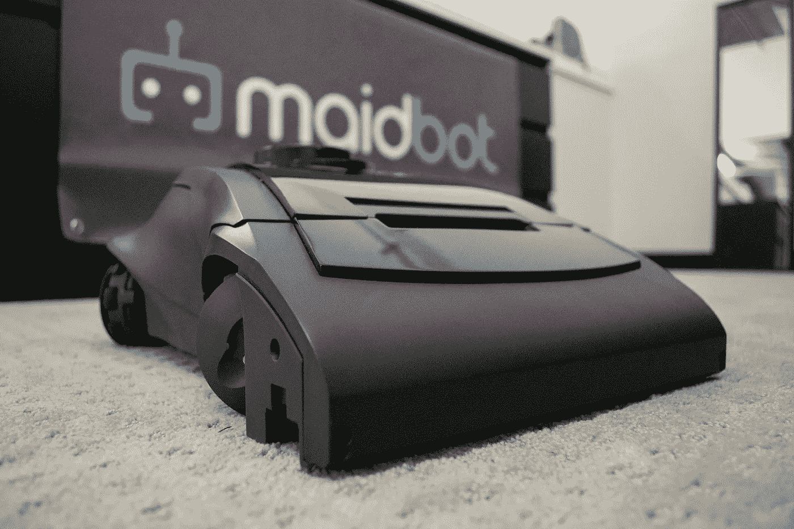
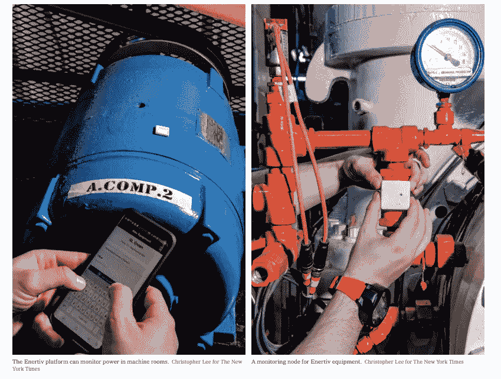
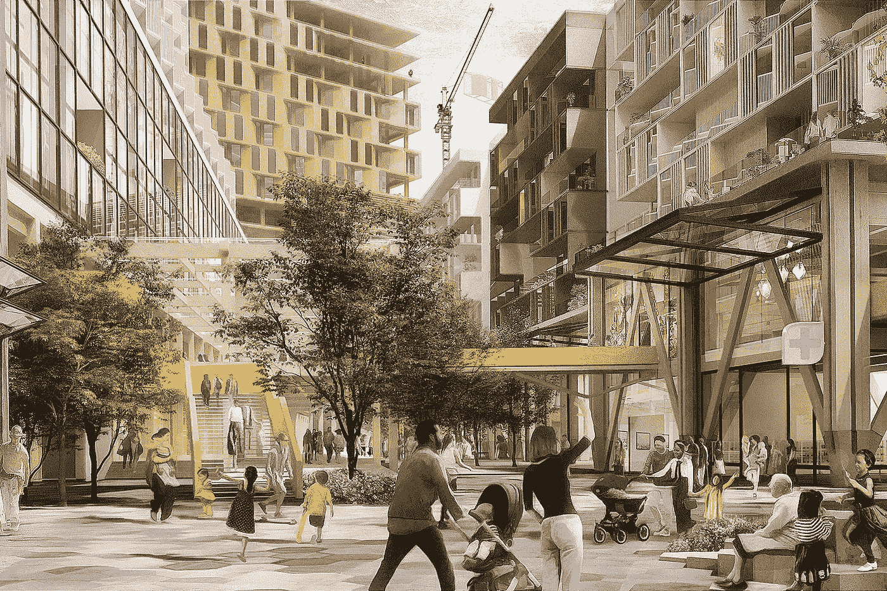

# PropTech 报告:硬件企业家的开放前沿

> 原文：<https://medium.datadriveninvestor.com/the-proptech-report-an-open-frontier-for-hardware-entrepreneurs-7f4822b7a60d?source=collection_archive---------8----------------------->

有两个不变的因素指引着我的职业生涯:风险投资和房地产。每年，我都迫不及待地想看看哪个投资组合会产生更大的回报。今天，用伟大的(虚构的)纽约人乔治·路易斯·克斯坦萨的话说，“世界正在碰撞！”T2 天使投资公司 Enertiv 不断壮大，客户包括物业管理公司和业主。这家智能建筑硬件初创公司是一系列新房地产技术(PropTech)创新中的最新一个，这些创新扰乱了 16 万亿美元的房地产市场。

在过去的六年里，投入 PropTech 的风险资本已经从 2013 年的 7.3 亿美元增长到今年的近 160 亿美元。反过来，这又催生了一大群令人生畏的独角兽，包括: [Trulia](https://www.trulia.com/) 、 [SMS Assist](https://www.smsassist.com/) 、 [Compass](https://www.compass.com/) 、 [Kattera](https://www.katerra.com/) 、 [Uptake Technologies](https://www.uptake.com/) 和 [Desktop Metal](https://www.desktopmetal.com/) (仅举几例)。同样令人印象深刻的是，从软银到喜达屋，从布鲁克菲尔德资产管理公司到 T21，这些支持者代表了行业巨头的策略。用 PropTech 风投公司第五面墙(Fifth Wall)的布兰登·华莱士(Brendan Wallace)的话说，“在过去三年里，房地产技术可以说创造了更多的企业价值，催生了比风险投资中任何其他单一行业领域都多的独角兽。”虽然价值超过了预期，但大多数分析师仍然认为市场还处于早期阶段，为更多十亿美元的企业敞开了大门。本周，我联系了三位 PropTech 人工智能企业家，表彰他们在彻底改变物业管理、建筑和酒店行业格局方面的贡献。

 [## 模式和机器人:复杂的现实|数据驱动的投资者

### 哈耶克的名著《复杂现象理论》(哈耶克，1964)深入探讨了复杂性的话题，并断言…

www.datadriveninvestor.com](https://www.datadriveninvestor.com/2019/03/04/patterns-and-robotics-a-complex-reality/) 

**智能建筑**

当游客们呆呆地看着纽约市灯火辉煌的摩天大楼时，业主们正紧张地适应着地下室的嗡嗡声，这些地下室在繁忙的冬季为租户提供电力和热量。尽管许多软件新贵已经简化了租赁和应付账款活动，但是仍然有大量的物理工厂信息是手工记录的。随着占用率的上升，能源消耗达到峰值水平，由于为满足需求而增加的服务呼叫，利润正在下降。大多数设备故障都是由小问题(未被跟踪)开始的，最终会产生数千美元的劳务费和加班费。为了缓解这些挑战，Enertiv 的传感器将供暖、通风和空调设备数字化，以最大限度地提高利用率并预测维护故障。正如 SL Green 首席运营官 Edward Piccinich 解释的那样，“利用 Enertiv 的数据，我们能够通过实施简单的优化(例如将室内送风风扇的时间表推迟几个小时)来节省大量成本。”这些调整包括“将室内送风风扇的启动时间从早上 5 点推迟到早上 7 点”节省了 15，000 美元，以及“在冷凝器水泵和冷冻水泵上安装 VFD 节省了 17，000 多美元。”根据该公司的案例研究，“除此之外，SL Green 和 Enertiv 在第三大道 919 号发现了另外 138，000 美元的潜在节约。接下来的步骤包括扩大范围以捕获更多设备级性能数据，以及确定部署物联网传感器的机会，以跟踪额外的数据流，如温度和湿度。”如果 SL Green 将第三大道 919 号的成本削减应用于其 93 栋建筑的整个投资组合，每年节省的成本将超过 1200 万美元。

像 Enertiv 这样的预测性维护公司的成功反映了商业房地产业主的一种新态度。用这家初创公司的创始人康奈尔·麦吉尔(Connell McGill)的话来说，“房东再也无法逃脱提供四面墙和收取租金支票的责任。业主担心任何会对他们的租户体验产生负面影响的事情，例如电梯陷阱和室内空气质量或温度问题。”在当今竞争激烈的租赁环境中，加上共同工作空间和短期租赁的增长，McGill 描述了业主如何接受一系列新的无人驾驶系统，“市场对自主解决方案的需求肯定会上升，尽管我们仍处于部署的早期。无人机正被用于自动勘测建筑工地，机器人正在对租户空间和机械室进行 360°和激光雷达扫描，越来越多的流程正在实现自动化。”Enertiv 的企业家表示，这不仅仅是自动化电表和 HVAC 系统，而是将整个建筑结构连接到云。“而且不仅仅是设备。一个让运营商夜不能寐的突出例子是，一个客户会支付他们的工程师加班工资，让他们在一年中最冷的晚上睡在他们的大楼里，以防管道冻结和破裂，这是一种灾难性的情况。相反，我们在建筑物的关键点部署温度传感器，并提前向操作人员发出警告，这样他们就不必再在现场睡觉了，”McGill 报告说。Enertiv 成功签约 AvalonyBay Communities、Equity Residential、Prologis 和相关公司等知名业主，进一步证实了这一趋势。

**施工管理**

在 ff Venture Capital，我们在加速建筑工作流程方面有两项无人机投资，分别是 [SkyCatch](https://www.skycatch.com/) 和 [CivDrone](https://www.civdrone.com/) 。然而，在人口密集的城市中心，无人驾驶飞行器不实用，也不能提供连续的数据环路。尽管如此，业主、建筑师和施工人员仍然要求全天候鸟瞰现场。今天，工作区的一切都被连接到互联网上——从安全背心到电钻到地面设备——产生了大量需要破译的信息。然而，该起重机作为提供 360 度操作意识的单一解决方案，一直困扰着项目经理。以色列初创公司[多功能性质](https://www.versatile.ai/)正在将这些高耸的机器转变为智能物联网设备，收集现场数据并提高现场安全性。通过提供实时的可操作数据，多功能设备提高了底线性能并减少了起重机事故。仅去年一年，美国就有 44 人死于起重机，175 人受伤。

多功能公司的首席执行官梅拉夫·柳文欢详细介绍了她的物联网解决方案，“我们捕获的数据为我们的用户提供了智能见解，支持他们做出更好的决策。提高预算、加快现场生产并在安全、学习和团队绩效方面设立新标准的决策。”与 Enertiv 类似，柳文欢自豪地说，“我们正在与一些全国最大和最有雄心的 GC 合作，通过强大的数据洞察力来提高现场生产率。”对于多功能的创始人来说，这不仅仅是专有传感器，而是她的专家团队对技术的应用。正如柳文欢所说，“我们团队中的许多人都是在建筑行业中成长起来的，并且有动力把它做得更好。凭借我们在行业中的实践背景，我们利用深厚的技术和强大的工具满足了现场团队的需求。”用她的话说，该公司的价值主张很简单，“我们将建筑专业人士转变为超级英雄，将建筑转变为真正可控的制造过程。”

**自动化接待**

酒店行业正处于恐慌状态，因为该行业在全国仍有 100 万个职位空缺。据[商业内幕](https://www.businessinsider.com/hotel-industry-major-workforce-shortage-affects-amenities-2019-9)称:“2018 年客房数量上升至 530 万间——但由于入住率为 66.2%，经季节调整后的住宿和餐饮服务职位空缺数量为 6.1%，没有足够的工人来保持正常运转。”在与 T2 库柏酒店集团的佩斯库柏交谈时，他认为，“我们最大的挑战仍然是招募和留住人才。我们知道技术如何缓解这一挑战的压力，这将在未来实现，但目前还不能提供明显的选择。”他的儿子杰里米补充说，“因此，一些重大举措是消除家务和前台劳动以及自动化收入管理的程序。”在日本，Henn-na(“Strange”)酒店著名地展示了一个由人形工作人员组成的前台，不那么花哨。美国的许多运营商已经在升级他们的前台，用自助服务亭代替员工。客房服务仍然是最重要的客人设施之一，但每间客房每天的费用高达 22 美元。随着越来越多的酒店依赖收取 15%佣金的在线旅行社(*如*Booking.com、Priceline、Expedia 等)，许多运营商的利润微薄。

2016 年，Maidbot 向酒店业推出了一款工业级机器人吸尘清洁产品，以提高物业性能。Rosie(受《杰森一家》的启发)已经被几家大型酒店品牌采用，作为客房服务自动化的第一步。Rosie 的创造者 Micah Estis Green 将他的创新描述为“本质上是一辆迷你自动驾驶汽车，专注于清洁商业地产的地毯区域——从酒店客房到走廊，再到办公场所和机场。”除了吸收灰尘，机器人专家还吹嘘了它的其他重要功能，包括收集“关于操作和环境条件的可操作数据，以便操作员提高效率和客户体验。”格林声称，这使得酒店员工可以花更少的时间来打扫房间，花更多的时间来提高“顾客满意度”，此外还可以延长“各自酒店资产(地毯)的寿命。”他进一步向我反映，他的机器人实际上正在改善员工的工作条件，因为许多清洁工“报告说不舒服和疼痛减少了——从手上的老茧到肩膀和手腕的疼痛。”

Proptech 是将城市社区转变为智能城市的第一道防线。Enertiv 的 McGill 透露，“我可以看到一个建筑基本上自我管理的世界。每一个可能出现的问题都会被预测到，资源也会被动态部署。”他进一步分享道，“在未来，我们将看到自动驾驶汽车连接到仓库码头门，用于交通控制和最后一个街区的机器人配送。维护这个分布式系统必须基于传感器并具有预测性，这正是我们今天要做的事情。”这种转变将把房地产资产变成脉动的技术中心，拥有丰富的数据、动态传感器和嗡嗡作响的机器人，让租户满意。正如格林预测的那样，“机器人最适合做枯燥、肮脏或危险的工作。对我来说，最好的服务是在客人提出要求之前就已经得到了照顾。”

*要去 CES？1 月 8 日上午 10 点，在拉斯维加斯会议中心，加入我的* [*机器人和其他零售机器人*](https://hightechretailing.com/2020-agenda-2/) *小组。*