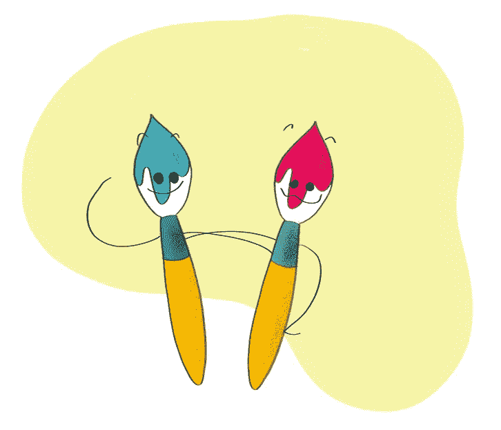
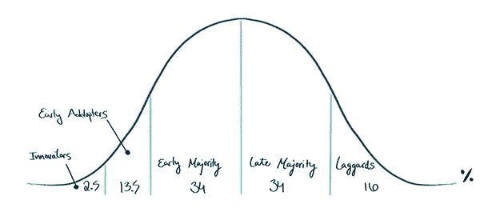
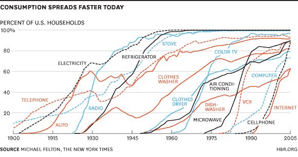
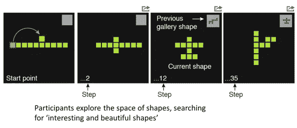
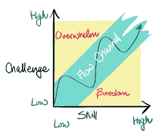

# 创造力和构思的心理学——我作为一个年轻企业家学到的基础。(第 2 部分，共 2 部分)

> 原文：<https://medium.datadriveninvestor.com/the-psychology-of-creativity-and-ideation-the-foundations-i-learned-as-a-young-entrepreneur-6fcbfca4ad25?source=collection_archive---------4----------------------->

# 思考的食粮……面向商业的个人——关于建立团队和“赋能”的创造性环境

从小到大，我是最大的书呆子，我指的不是今天在学校走廊里闲逛的酷的潮人书呆子。我是一个完全成熟的龙与地下城爱好者，小提琴演奏和动画/漫画爱好电脑呆子。

我童年最生动的记忆是周五晚上我和朋友们在外过夜的那次。我们熬夜到很晚(晚上 11 点在小学是件大事)，用毯子和枕头搭建堡垒。周六早上，我们会从临时搭建的卧房里跳出来，被“踢”到外面去玩我们自己做的泡沫剑。

我们偶尔看的一个节目是《终极幸存者》。因为我们被鼓励在户外玩耍，所以我们模仿了节目中挑战的想法。我们用绳子和棍子临时制作秋千，举行游泳比赛，玩球类游戏。

回想我的成长经历，它最像卡梅洛特。我今天的个性是我成长环境中接受、挑战和创造的结果。在早期，我和我的朋友们被给予了一个有利和包容的环境，并经常被鼓励去创造。

在大学里学习了一门名为“创造力和思维心理学”的课程后，我意识到我是多么的幸运。通过早期被接纳的环境所包围，我理解了将不同背景和兴趣的人结合在一起的潜力。

在心理学和人类学中，有一些研究领域证明了我年轻时学到的东西。从这些中，我收集了心理学和创造力研究中的一小群子课题，我相信通过承认它们，为任何试图建立最终创造性环境的个人提供价值。

## 群体创造力中的中心与边缘

在他关于杰出创造者的书中，加德纳描述了科学、艺术和政治领域的重大突破是如何来自于那些从他们领域边缘起步的个人(加德纳，2011)。

例如，爱因斯坦不是柏林的物理学教授，而是伯尔尼的专利编辑，当时不在物理学学术中心。

很多时候，好的想法来自研究主题的边缘而不是中心。加德纳声称，一个领域边缘的杰出人士较少受到主流范式的约束，因此更有可能想到革命性的想法。

处于系统中心的人(社会、科学领域或工作团体)通常更适应现状，而处于边缘的人可能更需要改变(例如为了获得更多资源)。

这方面的一个很好的例子是军队中不同单位发展的技术革新。

当我在军队时，我们单位的主要关注领域是网络安全的某个方面。当人们从外围加入并来自计算机和网络世界的不同专业领域时，我们设法开发新的方法来研究我们的研究课题。我们的单位并不是这方面的专家——但是远离问题的中心有助于我们以创新的方式处理这个问题。我们甚至因为解决问题的创造性而赢得了一个有声望的奖项！

## 多样性

“团队中没有我”，“独自一人我们能做的很少；“我们一起可以做很多”，“天赋赢得比赛，但团队合作和智慧赢得冠军”——我们都听说过团队合作的陈词滥调，但多样性呢？多样性被认为是促进创造力的主要因素之一。

创造性的“火花”经常发生在跨学科的环境中，原因有多种——“群体思维”很少发生在高度多元化的群体中，我们能够“混合和匹配”新的和意想不到的专业领域。

> kurtzberg(Runco，2007 年，第 165 页)证明了团队内部的多样性可能会积极促进团队的构思和解决问题的效率，但同时也会降低满意度。

在他的创业研究中，Yossi Maaravi 博士解释说，最佳群体在技能上有最大的多样性，但在价值观上差异最小。同样，Woolley (2010)已经证明了三个组成部分可以完全预测团队创造力-1。群体成员的平均社会敏感度，2。平等分配讨论中的话轮和 3。一个群体中雌性的数量(与#1 相关)。

经验证:更高的多样性+共同的目标=最大的创造力！

## 互联网如何让 10/10 成为 1/1 规则

是时候放大一点历史课了。背景——追溯到 1975 年，在百视达出现之前，一项新发明正在撼动市场——录像机！对于那些已经忘记/不知道录像机是什么的人来说—

> 录像机、VCR 或录像机是一种[机电](https://en.wikipedia.org/wiki/Electromechanical)设备，它将来自[广播电视](https://en.wikipedia.org/wiki/Broadcast_television)或其他来源的[模拟音频](https://en.wikipedia.org/wiki/Analog_audio)和[模拟视频](https://en.wikipedia.org/wiki/Analog_video)记录在可移动的[磁带](https://en.wikipedia.org/wiki/Magnetic_tape) [盒式录像带](https://en.wikipedia.org/wiki/Videocassette#Cassette_formats)上，并可以回放这些记录。

那时候——这有点神奇。如果你的邻居作为南加州齐柏林飞船追星族的一员随机出现在 7 点钟的新闻中，你现在就有能力记录下他让自己出丑的样子，供后人欣赏！还有 baaam——40 年后，有证据表明他在全国电视上跳来跳去谈论玛丽·简的合法化。

不考虑这个很酷的新产品提供的娱乐——先说开发它花了多长时间——大概 10 年！以今天的标准来看，那是一辈子。大众对科技的传播和采用呢？又一个 10！

Diffusion of Innovation Bell Curve ( Rogers, 1986)

为了更好地理解这个概念，让我们跳到“创新的扩散理论”(Rogers 1986，1995):
*“扩散是一个* ***创新*** *是* ***通过媒介*** *在一个* ***社会系统*** *的成员中随时间传播的过程。社会系统成员所感知的创新特征决定了其采用率*

《哈佛商业评论》的“[技术采用的步伐正在加快](https://hbr.org/2013/11/the-pace-of-technology-adoption-is-speeding-up)”解释了互联网和社交媒体的发明如何将 10 & 10(多年的开发和发行)变成 1 & 1。

我们可以看到，使用互联网支持的现有技术创造了一种局面，人们可以混合和重新混合现有的“构建模块”来创建新的数字产品。

复制和分发数字信息的便利性，以及互联网的基础设施，使得新思想能够更快地汇集，并在市场上分发。

一个很好的例子是网飞，他利用流媒体和视频协议等现有技术，在很短的时间内成功开发了自己的平台，创造了类似 Blockbuster 的概念。

## 勘探和开发

说到网飞，寻找新的电视连续剧是一个相当大的挑战。当我着手寻找一个新节目时，我会做两件事:

1.  查看与我以前喜欢的节目类别相似的电视节目。假设你喜欢“西装”，那么下一个节目就是“傲骨贤妻”(或者反过来？我不确定是哪个先发布的)。
2.  一旦你完成了一个类别中所有的“好”节目，是时候进入下一个了。一个小忍者战士和蛋糕烘焙师？

现在让我们把这两个概念转化为创造力的研究。在研究创造力时，有两种创造力——第一种是执行“创造性飞跃”(寻找创造性解决方案的新领域——探索)，第二种是在同一领域找到类似的解决方案，直到完全开发——开发。

研究人员 Noy 和 Hart (2017)在他们的论文“创造性觅食游戏”中更彻底地解释了这种方法。CFG 使用一个有界的和定义良好的搜索空间来研究创造性探索。

参与者被要求在一个视觉形状的空间中找到“有趣而美丽”的形状(运用他们自己的判断)。该空间由 10 个相连的正方形组成(可能性的数量约为~36，000 个形状)。

参与者一次移动**一个**方块来创造新的形状。当他们创建一个有趣的形状时，他们有能力将它“存储”在虚拟画廊中。在 10 分钟的游戏过程中，人们创造了几百个形状。

使用创建的模式，我们可以看到人们在两种创造力状态之间转换——开发(例如从 10 个正方形创建的所有数字组)和探索(寻找新的创造性类别)。

## 心流体验

在 CFG 的“游戏”中创建形状时，我们可以看到参与者体验了几种可能的感觉:

1.  行动和意识的融合
2.  技能和挑战之间的平衡
3.  毫不费力
4.  控制的感觉
5.  对时间的感知改变了
6.  目标清晰，反馈及时
7.  体验本身是有益的，而不是达到目的的手段(心流体验的质量

**所有这些都可以归功于*流*的轰动。*心流*心理学上的心流是一个人完全沉浸在一项活动中的状态，感受到一种高度的享受和一种不费力气的感觉。**

**在体育和表演艺术中，类似的经历被描述为“进入状态”。一些玩家称“进入状态”是一种兴奋。演员约翰·贝鲁西(1949-1982，“布鲁斯兄弟”)有一个著名的描述*在区域*中是他所知道的唯一的“比性更好”的快感。**

**很重要的一点是，在太容易(导致厌倦)和太难(导致无助)的任务之间的狭窄通道中，“流动”是可能的。**

****

**在团体即兴表演和其他团体活动中，参与者有时会体验到高性能、同步和沉浸在活动中的感觉。一些爵士音乐家描述了“音乐在演奏我们”的时刻。这些时刻可以被描述为**团聚**的时刻。团聚可以被认为是**团体心流**的一个特殊例子，一种由参与团体活动的几个参与者共享的心流体验，如团体即兴表演、舞蹈或团队运动。**

**作为以商业为导向的个人，努力鼓励我们团队中的创造力和思维能力，创造一个良好的环境是至关重要的。使用“是的，而且”，手电筒技巧，鼓励团结而不是集体思考，可以帮助人们在那一刻“迷失自我”。**

**鼓励失去自我控制和提高即兴创作中的“自由度”的一个很好的例子是，在我们小组面前对着镜子做最滑稽的鬼脸，或者戴上面具装傻。这有助于参与者在某种情况下感到舒适，并“放手”。**

## **思考“盒子里面”**

****

**让我们想想我们对保守的莎士比亚戏剧的看法——人们遵循剧本，穿着中年服装，用滑稽的居高临下的口音说话。(请不要生气，因为这只是我的经历——在你眼里可能完全不同，因为我不是戏剧专家)。**

**莎士比亚戏剧有非常具体的指导方针——有相对著名的情节、基本的循环设置和中年人的动机。**

**现在让我们转到今天的世界，以及中世纪以来所有对罗密欧与朱丽叶的精彩改编。电影、戏剧和音乐剧中有数不清的数百种语言的翻拍。**

**对原剧本的每一个改编都有一个方面使它变得独特和有创造性。无论是一种新语言带来的语调，不同颜色的服装，舞台上不同的植物种类。**

**《罗密欧与朱丽叶》的每个改编版本都需要一个大致的框架，这使得创作者能够在有限的空间内探索新的可能性。创造者现在在现有的界限内探索新的可能性。**

**我们可以在极端情况下看到同样的情况，比如军队中的单位。在我服役期间，我的单位没有得到多少资金，因为它应该不需要它。随着预算紧缩，我们需要考虑新的方法来利用现有的技术，以获得更好的结果。利用现有的网络基础设施、免费工具和编码技能，我们设法达到了前所未有的效果。利用我们先前存在的“盒子”中的信息，我们成功地突破了界限，证明了天空是无限的。**

## **我记下的想法…**

**总而言之，在创造力的研究中，有很多有趣的话题可以涉及。我试着尽可能多地关注与以商业为导向的个人相关的提示和话题。**

**令我惊讶的是，这篇文章很容易写。太简单了，我想把它一分为二，因为它太长了。如果有好的反馈，我肯定会写另一篇文章，因为这个主题有太多的内容。**

**我希望所提供的信息是相关和有趣的，并希望听到你的意见！**

## **如果你觉得这很有用，一定要给很多很多的掌声👏。提示，最多可以留 50！😉**

**请随时联系我@我的网站[https://www.maayanrosenthal.com](https://www.maayanrosenthal.com)或通过电子邮件发送到[maayan.rose1@gmail.com](mailto:maayan.rose1@gmail.com)/LinkedIn @ Maayan Rosenthal。**

**(如果你想了解更多关于创造力和与之相关的科学的话题，时代杂志发布了 2018 年 9 月的特别版，完全致力于这个话题[非赞助])。**