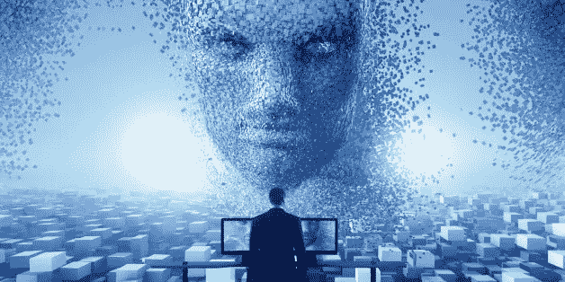
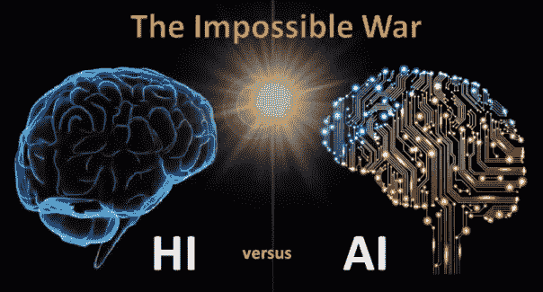

# 量子

> 原文：<https://medium.datadriveninvestor.com/the-quanta-15c06e148be9?source=collection_archive---------18----------------------->

# 独特的日常视角

Photo by [Markus Spiske](https://unsplash.com/@markusspiske?utm_source=medium&utm_medium=referral) on [Unsplash](https://unsplash.com?utm_source=medium&utm_medium=referral)

## 一般假设

> [按维基百科](https://en.wikipedia.org/wiki/Quantum)，量子在[物理学](https://en.wikipedia.org/wiki/Physics)，一个**量子**(复数:**量子**)是任何物理实体([物理性质](https://en.wikipedia.org/wiki/Physical_property#List_of_properties))参与一个[相互作用](https://en.wikipedia.org/wiki/Fundamental_interaction)的最小量。物理性质可以“量子化”的基本概念被称为“量子化[假设](https://en.wikipedia.org/wiki/Quantization_(physics))”。[【1】](https://en.wikipedia.org/wiki/Quantum#cite_note-1)这意味着物理性质的大小只能取由一个量子的整数倍组成的离散值。

1-生物学是**量子的输出之一。**

2-地球、人类、生物和/或任何种类的生命不断被**量子获取、转移和吸收。**

3- DNA、基因和量子力学给物理学带来了根本性的新见解。这些包括，例如，不确定性原理，描述量子力学物体状态的波函数，以及波粒二元论。

4-生物能源不仅仅是维基百科所描述的生物能源，至少在声明的第二部分是这样的:"**生物能源**是[可再生能源](https://en.wikipedia.org/wiki/Renewable_energy)，可以从生物来源的材料中获得。"人类是现有的最好的生物来源之一，但是维基百科把读者带到了有机转变。

生物能也存在于传统的中国医学和古印度医学中，它们将这种“人类技能”视为天地之间的能量回路。生命的能量通过特定的路径(经脉、气脉)在所有生物体内流动，不和谐(疾病)是由阻碍其自由流动引起的。

6-量子计算研究正在引领机器计算和框架新可能性的未来。人工智能和机器学习正在密切合作(据称)解决现代社会更大、更复杂的问题。

7-“一个可以写新闻故事和小说作品的革命性人工智能系统的创造者——被称为“文本的深度假货”——采取了不寻常的措施，不公开发布他们的研究，因为担心可能被滥用。”阅读更多关于埃隆·马斯克的“宝贝”。

8-机器可以模拟情感，但它们不能创造或产生情感。意识“不住”在算法里。[凯文·凯利](https://kk.org/)有一本很棒的书叫《[什么科技要什么](https://www.amazon.com/What-Technology-Wants-Kevin-Kelly-ebook/dp/B0043EV51W)》。机器有潜意识的需求和意愿，但人类(仍然)是唯一能够在这些未被发现的领域中，基于大量数据，考虑数据背景和行动的潜在后果，提供有意识决策过程的代理。作为人类，我们是否拥有这种关于人工智能和机器人目前正在做什么的意识，而没有我们人类和意识的理解？我认为不会。

9-人体和人类系统正在被抛在后面…也有关于人类电磁场的证据，量子在其中流动，而且不仅仅是在我们自己的神经元和突触中。我们的心脏是我们身体的主要电磁源，我们正在发展这个物种而不关心它……微软[项目艾玛](https://www.microsoft.com/en-us/research/project/project-emma/)或新一波医疗设备几乎没有触及我们作为重要能量来源的心脏。我们身体的免疫系统是我有生以来认识到的最复杂和最具学习性的系统之一。

10-像意图和动机这样的无形资产是两个重要的人类因素，它们使人类系统在一定程度上变得不可预测、复杂和独特。然而，如果我们使用正确的工具来理解人类系统，它们也是可以预测的。这种矛盾正是人类如此特别的原因。潜意识过程是可由人类训练的，而不是机器，至少在不与其他机器和/或人类交流的情况下。

Photo by [NESA by Makers](https://unsplash.com/@nesabymakers?utm_source=medium&utm_medium=referral) on [Unsplash](https://unsplash.com?utm_source=medium&utm_medium=referral)

## 每日战功

1-通过练习一些特定的活动，扩展潜意识过程和神经能力是可能的。

2-就我个人而言，我通过散步/跑步、瑜伽、冥想和抽象时间来训练他们。这些类型的活动结合对特定类型的复杂问题的精神集中，可以导致更好地了解我们自己的生产力和理想的工作环境。

3-实现了一些大脑可塑性增量后，也有可能放大自己认识的这些时期。如果你更好地理解自己，你也能最好地理解别人。

4-我每天都在体验专注和专注的切实后果。这些结果是可能的，因为在自己的理解中花费了时间，加上之前设计的技术挑战(在抽象阶段(潜意识思考)，促进所需任务的实现/执行(扩展生产力)。

5-今天，我觉得在体力劳动期间，练习运动让我思考得更好，放松大脑，让潜意识和半意识过程发生。职业攀岩者和职业运动员都经历过这些时期。

6-我总是渴望了解人类的努力和成果，我愿意相信人类将引领科技生产的未来。我认为我们没有相应地生活。

## 未来

1-我相信，在不久的将来，人类将能够控制[奇点](https://en.wikipedia.org/wiki/Technological_singularity)。

2-我相信，在不久的将来，我们将有一种医疗设备可供使用，它将允许人类连接到某个 IP，通过电磁刺激来测量和增强我们的免疫系统，而不需要起搏器或更具侵入性的方法，使我们更加稳定和受保护。关于退化组织、微生物或 DNA 突变过程的最佳医学研究是在突变细胞和遗传独特代码的独特组合中进行的。

3-如果人工智能能够让一台机器在我们的[纳扎尔](https://youtu.be/Ftok14M5p8g)的葡浪上冲浪，也许有一天我会相信有一天一台机器能够打败一个人。

4-我相信人工智能的未来将是积极和强大的，好人将赢得人类尊严和智慧的战斗。希望 [Tanmay Bakshi](https://www.linkedin.com/in/tanmay-bakshi-b15012a1) 会有他的头像！