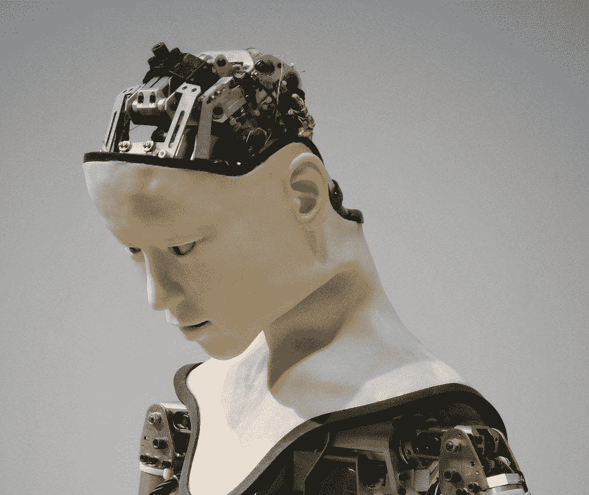

# 探索制造具有常识的机器人

> 原文：<https://medium.datadriveninvestor.com/the-quest-to-build-robots-with-common-sense-9f2ef30f672b?source=collection_archive---------4----------------------->

尽管有夸张和歇斯底里的媒体报道，今天的机器人并不真的那么聪明。当然，他们可以操作机动车辆，进行精确的手术，处理重复的组装工作，拆除炸弹，给你的家吸尘——所有这些都是非常有用的事情——但他们只能在一套固定的规则下在封闭的系统中发挥作用，这些规则通常是通过[机器学习](https://www.datadriveninvestor.com/glossary/machine-learning/)摄取大量数据而开发的。他们仍然固执地认为人工多于智能。

[人工智能](https://www.datadriveninvestor.com/glossary/artificial-intelligence/)和机器人科学领域的五个最大的名字想要改变这一切，并推出了一家新的加州帕洛阿尔托初创公司，名为 Robust AI，其雄心勃勃的目标是通过建立一个工业级认知平台，为机器人带来常识推理，来弥合当前人工智能和未来健壮人工智能之间的差距。

 [## 模式和机器人:复杂的现实|数据驱动的投资者

### 哈耶克的名著《复杂现象理论》(哈耶克，1964)深入探讨了复杂性的话题，并断言…

www.datadriveninvestor.com](https://www.datadriveninvestor.com/2019/03/04/patterns-and-robotics-a-complex-reality/) 

他们的网站描述了他们的方法:

> 目前的机器人极其有限，通常被置于高度受控的环境中，无法在动态、开放的环境中运行，并且无法应对突发事件。我们正在建立一个工业强度的认知平台，这是第一个此类平台，使机器人变得智能、协作、健壮、安全和真正自主，应用于从建筑和交付到仓库和家用机器人的广泛垂直领域。

Robust AI 的创始人和高管是该领域领导者的虚拟全明星团队:CEO Gary Marcus: NYU 心理学和神经科学教授；CTO 罗德尼·布鲁克斯:麻省理工学院 CSAIL 前主任，iRobot 创始人；首席社会官穆罕默德 [R](https://www.datadriveninvestor.com/glossary/r/) 。阿梅尔；SRI 国际视觉技术中心高级技术经理；首席运营官·安东尼·朱尔斯:首席运营官雷德伍德机器人公司前首席技术官福尔曼；Henrik Christensen:高通机器人学教授，加州大学圣迭戈分校教授。

[**相关文章:营销人员在 AI 大潮中争先恐后**](https://www.datadriveninvestor.com/2019/08/15/marketers-rush-to-rise-on-the-ai-tide/)

Robust AI 想要做的是将现代[深度学习](https://www.datadriveninvestor.com/glossary/deep-learning/)技术与一种叫做符号[人工智能](https://www.datadriveninvestor.com/glossary/artificial-intelligence/)的方法结合起来，这是从 20 世纪 50 年代中期到 80 年代末人工智能研究的主导范式。根据创始人兼首席执行官格雷格·马库斯的说法，两者的杂交应该使机器人能够像人类一样学习:

*“我们正在构建的是一个通用的认知引擎，可以用于许多垂直领域——任何你遇到动态、灵活世界的地方。没有通用的工具来帮助机器人在开放的环境中做决定……每个人都对深度学习感到兴奋，但它被夸大了。它没有人们想象的那么强大。我们可以看看其他方法，这就是 Robust AI 正在寻找的方法。”*

其他机器人领域的领导者对此相当怀疑，他们认为象征性的人工智能是一种过时的方法，但马库斯并没有被吓倒:

“众所周知，我是深度学习的批评者，但这并不意味着我们不会使用深度学习。我的批评并不是说它没有用；我的评论是，它只是众多工具中的一个。杰弗里·辛顿(被许多人称为机器学习之父)说，我们不需要旧东西，因为它像内燃机一样过时了。我认为有很多旧技术可以与新的深度学习技术融合。”

Robust AI 已经从 Playground Investment 以及其他未披露的投资者那里获得了“大量”的初创投资。Playground 的网站以“我们喜欢在不可能和不可能之间的某个地方投资”为开头，这也许表明了机器人 AI 面临的任务是多么具有挑战性。

[**相关文章:以就业为基础的经济即将失败:我们能做些什么来避免灾难？**](https://www.datadriveninvestor.com/2019/05/20/the-employment-based-economy-will-soon-fail-what-can-we-do-to-avoid-disaster/)

该公司预计在 12 个月内准备好样机。

人工智能和机器人初创公司如今多如牛毛，但这一家的不同之处在于与之相关的人才储备，以及越来越多的人怀疑智能机器人仅靠机器学习是有限度的。你真的准备好乘坐汽车或飞机，让人工智能自主决策了吗？

Robust AI 的想法很棒。专注于赋予机器常识和深度理解，而不是简单地专注于统计分析和收集越来越大的数据集合，可能会创造出我们可以信任的人工智能。

格雷格·马库斯承认，为机器人创建一个常识性的认知平台是一项高风险、高回报的事业，结果仍然不确定:

我们意识到最先进的机器人是多么令人沮丧。我们希望通过让机器人理解真实世界的运作方式，让它们变得更加聪明。

我们大多数人也仍在努力。

*原载于 2019 年 9 月 14 日*[*【www.datadriveninvestor.com】*](https://www.datadriveninvestor.com/2019/09/14/the-quest-to-build-robots-with-common-sense/)*。*