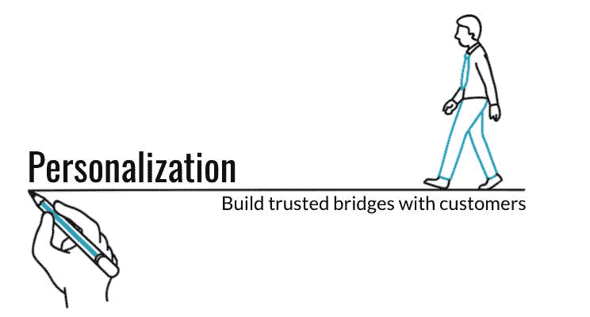
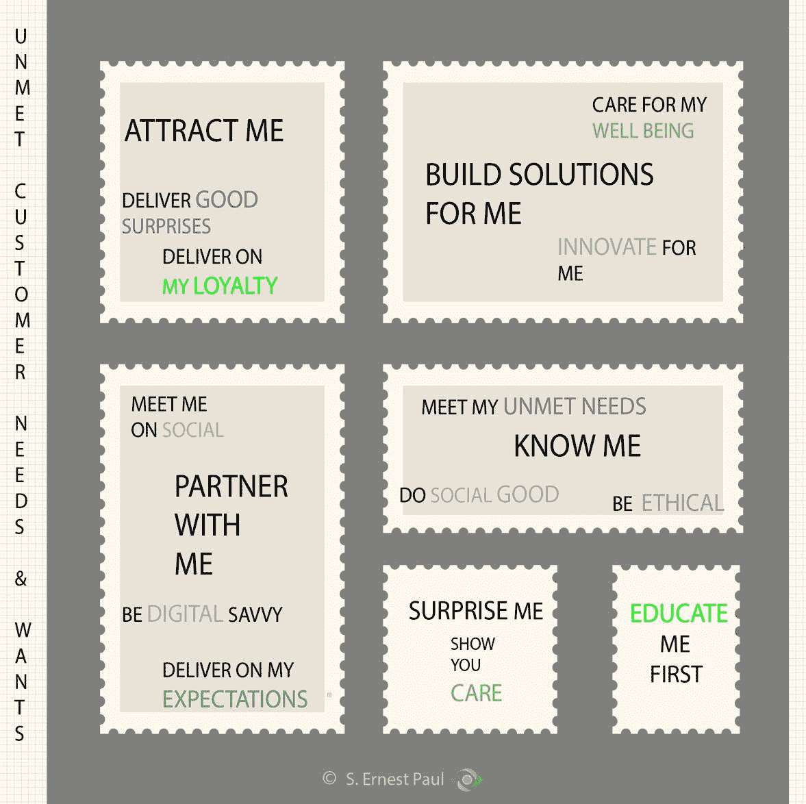
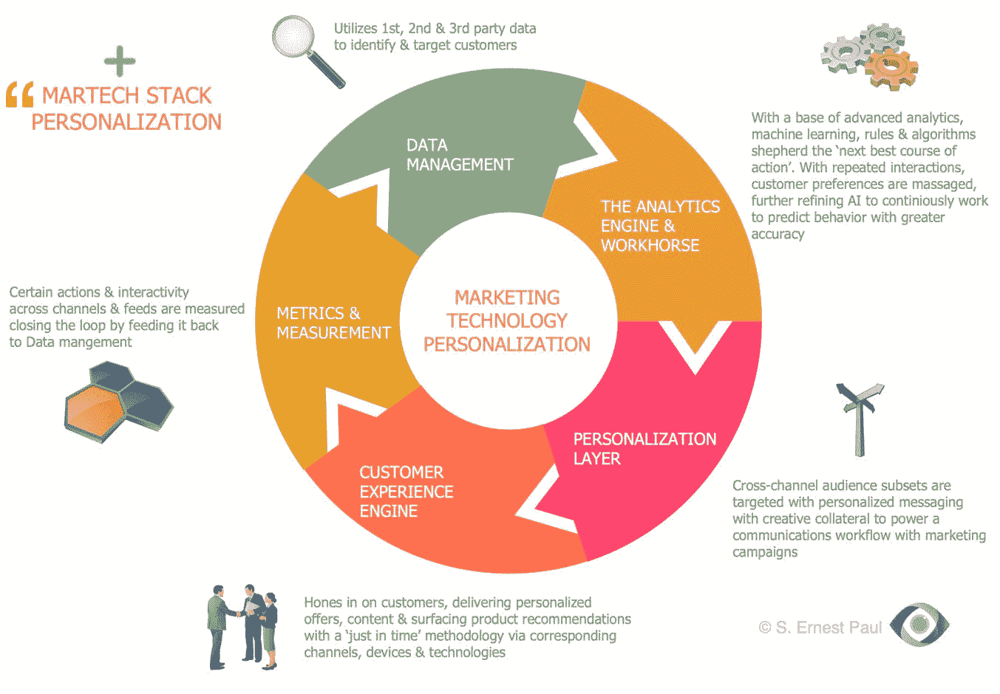

# 追求客户个性化——营销和技术

> 原文：<https://medium.datadriveninvestor.com/the-quest-to-deliver-customer-personalization-marketing-technology-d5d80322ba?source=collection_archive---------35----------------------->



S. Ernest Paul

# 品牌必须识别和理解每一个顾客

去过他们知道你名字的餐厅吗？服务员碰巧知道你喜欢的饮料，并像变魔术一样在你入座时把它端上桌。对于我们这些回忆起情景喜剧的人来说，这是一种“欢呼”的体验。这些一对一的个性化互动让体验变得特别。

我们现在生活在一个数字化的世界，需要品牌提供类似的体验。我们希望与了解我们的品牌合作。我们被这些品牌所吸引，尽管它们可能很稀有。然而，这样的约会会带来熟悉和舒适。信任很快就会到来。最近，我打电话给我的银行机构，我主动在电话上敲了几下，立刻就有一个友好的声音向我打招呼。瞧啊。都是用声纹完成的。我们期待相似的体验，极简、自然、高效、可跨设备转移。

```
"Patience in today's hyper connected world is on a diet due to clumsy marketing tactics" 
```

# 顾客想从品牌那里得到什么？

吃饭的时候，我经常看到坐在附近桌子上的所有人同时盯着他们的手机。很久以前，数字和手机可能已经席卷了我们所有人，但我们似乎更喜欢有人陪伴，即使是无声的陪伴。这种移动孤独可能会让一些人感到有趣，但不是营销人员。对于营销人员来说，这意味着实时位置数据、包括天气在内的相关上下文信息，可能会触发附近实体店的位置提醒。

客户希望从满足其特定需求的品牌那里获得相关、有意义和量身定制的信息和产品。不相关的优惠和电子邮件会导致客户瘫痪，结果适得其反。在这个即时满足和注意力持续时间不足的时代，几乎没有与目标客户沟通的空间。透彻了解客户需求后，双方都有可能受益。

顾客早就声明了他们的期望。*见下图:*



满足客户期望可提高客户参与度，进而提高品牌忠诚度，从而降低采购成本、增加收入并提高保留率。

# 旅程从数据开始

寻求以客户为中心的品牌首先必须以数据为中心。没有客户数据，这种程度的大规模超个性化是无法实现的。

```
"Data is the new oil. Refining or anticipating customer needs is the beginning of personalization"
```

这种原油或丰富的行为客户数据、客户交互、社交媒体活动、人口统计、客户生命周期阶段识别和交易数据可以被细分和进一步细分。今天，即使没有成熟的技术实现，如客户数据平台、CDP，也可以利用个性化红利。基于过去的购买和行为，现有数据可用于交叉销售计划、支持和激活一些消费者使用案例。有时，在合并外部购买的数据集之前，使用较少的数据会更有效。

第 2 和第 3 方外部数据的合并为细化流程增加了维度层，并进一步丰富了客户数据。许多消费者在线使用的多个数字身份可以合并成一个记录，以消除冗余。通过分析捕获的客户行为和互动的迭代周期不断完善客户数据。客户“数据集”中的行为一致性有助于模式发现和识别。随着模式的确认和准确性，*机器学习*将“数据集”提升了一个档次。随着*深度学习* & *人工智能*、*预测分析*的不断循环，开始解锁未来的客户行为。



```
How far along is your organization in channeling this new oil, 
piping it, refining it, triaging it, harnessing it to extract
measurable value?
```

# 敏捷的跨职能团队——营销、技术专家和运营必须协同工作

在筒仓里工作是个性化的克星。在测试和学习模式中拥有一个跨职能团队，在“不怕失败的文化”中分享见解是高效交付的最佳环境，最好是在类似作战室的环境中。

个性化 DNA 存在于行为数据中。它的应用依赖于客户旅程、触发器、设备、事件、营销活动和宣传材料的全面映射和交叉，与具有匹配行为的客户群保持一致。跨职能团队很好地服务于这一主张。

**营销&运营重组**

组织必须从整体上看待个性化生态系统，从数据管理到高级分析到客户参与，再到衡量和优化。营销资源通常由特定技能组织。*例如:*分析或营销活动管理，甚至是社交或搜索渠道。有一个非故意的孤立的生态系统风险需要警惕。尽管针对不同的元素进行优化很重要，但整体大于部分之和。对不同部分如何相互作用以及如何整合它们以支持个性化的理解是高绩效营销组织与低绩效营销组织的区别。

**打造客户之旅**

通过匹配需求和行为将客户分组是一个很好的起点。有了这些分组或细分，将每个细分与它自己的客户旅程联系起来，并绘制出与公司品牌的一系列互动。*示例*:访问经纪人、代理、公司网站、呼叫呼叫中心、社交媒体帖子，甚至跟踪潜在客户对公司品牌竞争对手的访问，等等。

**建立客户群**

旅行和客户细分相结合，可能会出现数百个迷你细分市场。每个细分市场都有细微差别，一个比一个更有价值。每一个都应该根据其相对价值进行考虑和优先排序。*例如*:考虑一家领先的保险公司，该公司可能会发现，通过向处于“续保窗口”内的客户发送保单即将到期的提醒，来吸引他们更有价值。保险公司选择发送限时保单续保忠诚度优惠，而不是将他们推向交叉销售产品，冒着客户流失到竞争对手手中的风险。

**利用客户信号**

客户通过他们的在线和离线互动提供信号来表明他们的意图。成熟的预测分析会捕捉这些信号，并将它们推入工作流中，然后做出适当的响应。然而，每个信号都值得一个响应，一个及时和相关的触发消息，以结束循环。

**信号&触发器在工作**

通过高级和细致的计划，必须维护和更新信号和匹配触发器的库。然后，可以动态执行具有匹配抵押品的每个触发器。这些组合中的每一个都通过分析不断得到完善和优化。当声明有效时，每个都成为一个业务规则。*例如*:考虑一家领先的健康保险公司，该公司得知一名受抚养人即将进入“*受抚养人 26 岁窗口期*”。客户和/或受抚养人迅速接收到触发消息，该消息具有针对受抚养人的新的个人健康保险政策的限时优惠。

# 制药和生命科学监管谨慎正让位于客户个性化

制药、生命科学、医疗保健等受监管行业一直在增加与个性化相关的支出。即使有天生的监管驱动的谨慎，投资组合轨迹也正在从*临床试验* *客户数据*支出转向*客户* / *患者体验*相关个性化支出。

客户数据和个性化一起帮助识别*高价值患者*，然后将他们介绍给*医生*和*治疗师*，实现量身定制的& *个性化处方集体验*。

# 保险公司在其投资组合支出议程中高度重视个性化

保险公司正在提高承保效率，实现为健康、生命和其他人提供即时保险的梦想并不遥远。他们现在为客户提供*人口健康*效率和*基因组学*重点承保，所有这些都是数据个性化的结果。比赛开始了，竞争很激烈。个性化的内部&外部客户数据，包括物联网客户数据，现在可以驻留在 CDP 或类似配置中。

# 将个性化 DNA 整合到您的营销技术堆栈中，或者添加一个 CDP

实现跨越所有渠道和地域的大规模增长需要大量的准备、协调、治理，最重要的是领导力和人才资本。

重新安排现有运营组织的一致性，重新调整运营流程和 *RPA* 驱动的工作流，在整个公司范围内进行增量和全球化扩展需要一个清晰的蓝图和一个同样敏捷的剧本。

新的营销技术配置配备了一个“T8”智能大脑“T9”，准备用规则算法来引导流量，最终可以培育一种新的一对一营销现实。

# 避免陷阱和陷阱

可能需要一系列步骤来武装现有的 MarTech 堆栈，以最大限度地减少新[技术投资的 ROI 泄漏。](https://content.allocadia.com/custom-stream-for-ernest)

很容易在数据集成上积累数百万的账单，这些数据集成将所有这些信息磁性地汇集到一个数据湖中，优先考虑最有价值的数据类型——推动高价值用例的类型。此时，确定每个数据元素所需的延迟至关重要。大多数用例需要有限的一组数据元素的实时信息，因此大多数实时功能可以令人欣慰地减速。

# 发现技术推动的业务用例，而不是相反

以敏捷开发过程为支撑，制定由*KPI*、*业务驱动*和*预测*支持的*业务用例*。现有的数字分析将有助于制定基准，揭示差异和未来预测。营销过程是迭代的，随着每个周期的优化和改进。

# 与营销团队密切合作，发现功能需求

在与营销运营团队的密切合作中，功能需求必须得到很好的阐述和记录。与构成 MarTech 景观的众多技术解决方案和提供商相比，这一步是一项基础工作。多个用例、故事板或多个上下文有助于识别某个缺失的技术组件。当您扩充技术以满足您的个性化目标时，这一发现可能会引导您选择不同的供应商。

# 用技术方法调整组织的需求和目标

主要的整合营销云套件供应商包括*甲骨文、Adobe 和 Salesforce* 不支持个性化生态系统*端到端*。品牌可能已经有了这些套件之一。在这种情况下，一个合理的折衷方案是利用现有 MarTech 堆栈中缺少的每种功能元素的最佳组合来扩展现有套件的功能。缺点是与支持特定功能或服务的元素的集成不够紧密。

分析引擎的一个关键考虑因素——分析引擎“大脑”应该是可定制的，包括算法、数据特征和特定于您需求的业务规则。解决方案集应该允许您控制分析引擎的输入。

# 通过试点逐步构建

一个谨慎的方法是将你的目光放在一个迭代的和增量的价值交付方法上，该方法由定义良好的试点项目支持。随着每一个新的元素被添加到一个新的用例中，成本就会上升。

然而，获得的增量价值可能与增量投资一致，从而证明投资是合理的。阶段驱动和阶段控制的方法将使首席财务官为增量支出提供资金的决策更加顺畅。

本文最初由 s·欧内斯特·保罗发表在 [LinkedIn](https://www.linkedin.com/pulse/quest-deliver-customer-personalization-marketing-s-ernest-paul-/) 上