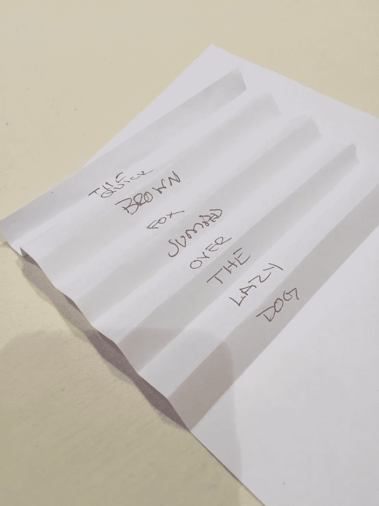

# 这只敏捷的棕色狐狸跳过了那只懒狗。区块链游戏化。

> 原文：<https://medium.datadriveninvestor.com/the-quick-brown-fox-jumped-over-the-lazy-dog-blockchain-gamified-f8ca115e091?source=collection_archive---------15----------------------->

区块链是最具创新性和时代性的技术，可以改变我们交易和生活方式的许多领域

我是威斯康辛州妇女创业日的演讲者之一，在 144 个国家庆祝 T2。

[“区块链是一个去中心化的、分布式的、公共的数字分类账，用于记录跨多台计算机的交易，无需改动，也无需网络的一致同意。”](https://en.wikipedia.org/wiki/Blockchain)

这听起来很残酷，让我们面对现实吧。人天生好奇，爱冒险。将体验游戏化是在一个普遍令人生畏的主题上积极影响观众的极好方式。

“后果”是我小时候玩的一个游戏，其中一些方法是一致的，我能够从游戏和技术中找到一些相似之处。你也可以这样做。

[TANIA](https://wedwisconsin.org/) DSOUZA @WEDWISCONSIN

*   给观众一张纸，有线条的那种。
*   让他们以竖排形式写下“敏捷的棕色狐狸跳过了懒惰的狗”，每行一个单词。
*   然后，你可以让他们把这张纸传来传去，让他们每人写一个单词，然后传来传去。
*   让他们在写单词时将纸折叠起来，然后重新打开。
*   偷偷给他们中的一个人一张被单，用“猫”代替“狗”。

区块链可以虚拟地用于各种类型的交易，包括金钱、资产和财产。在这个游戏中，我把写在每一行上的每一个“单词”关联成一个包含数据或交易信息的“数字账本”。该数字分类帐被分配给一个块。

每个块包含一个加密哈希(私钥)。来自前一个块的每个“散列”在验证和确认后被复制到该块上。在这个游戏中，它表示在下一行分类帐中，并且纸的折叠与在纸上输入的新数据(数字分类帐)的下一行相链接，表示块的序列是“链”块链基本上是一个链表。

在分类帐或块被存储之前，它被整个网络的“矿工”验证。一系列计算机，所有这些计算机在交易被记录之前对交易进行验证和批准。第一个解决难题的矿工将获得奖励并被记录到链中。

区块链是一种加密技术，它在一个分散的数据库中安全地记录和保存交易，每个人都可以看到总账的数字历史。在这种情况下，观众代表网络，每个人都可以检查信息是否正确，因为每个人都有文档的副本。我偷偷给了一个人一张纸，上面的单词“猫”被替换成了“狗”,以解释当块不能被验证时，攻击者如何被抓住。这台电脑将会受到惩罚，而不是奖励。

一旦数据通过验证，该数据块将获得之前事务的哈希，新数据块将与新哈希一起存储。块中的数据是不可变的，很难追加。这个概念在区块链是共识或“工作证明”区块链有助于减少欺诈，因为每一笔交易都将被记录并发布在公共账本上，供任何人查看。

我解释说，今天，我们使用像银行这样的可信机构来进行交易。我们都核实了信息，不需要第三方来核实信息。同样，区块链允许我们直接连接，进行交易，消除任何中介，节省成本和时间，并带来信任、透明和安全。区块链是我们这个时代最具创新性和时代性的技术。区块链旨在取代中介和机构。我很高兴看到它如何在所有行业和我们的生活中展开。

我希望你能给我一些反馈来补充 tania.dsouza@bvk.com 的比喻