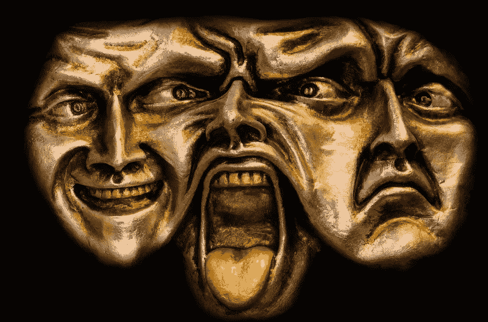
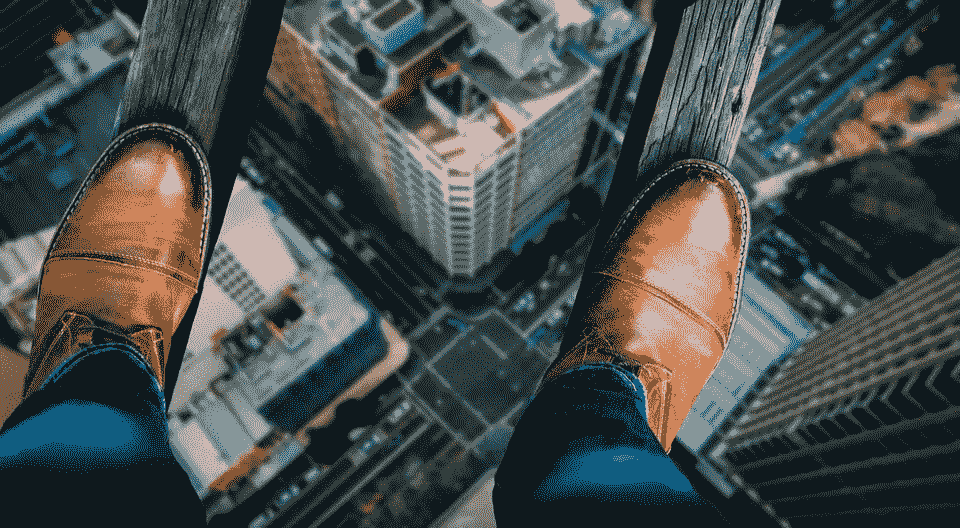
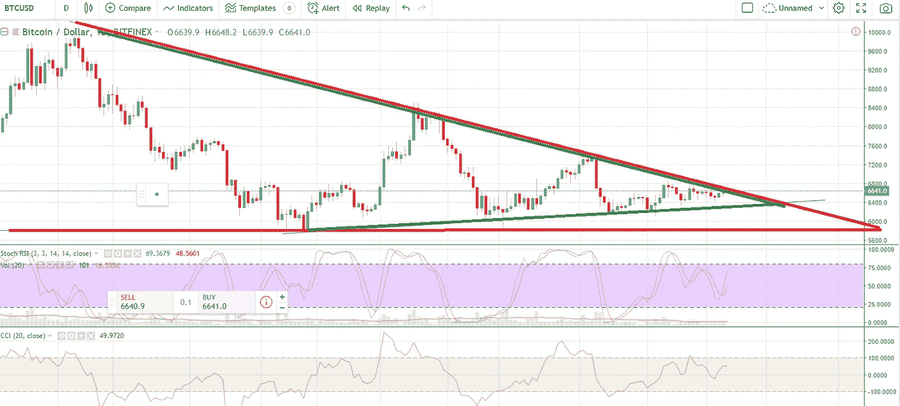
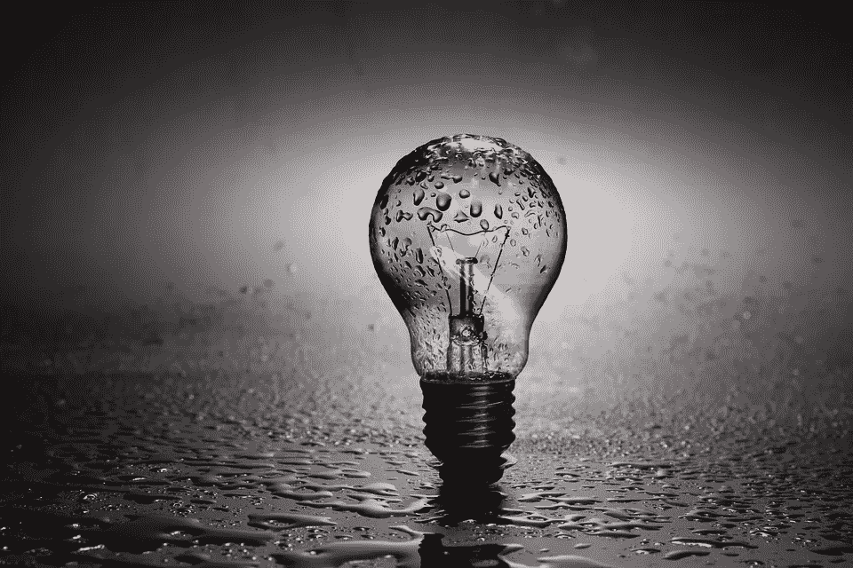

# 恐惧投资的剃刀边缘

> 原文：<https://medium.datadriveninvestor.com/the-razors-edge-of-fear-investing-bc8bd79f532?source=collection_archive---------10----------------------->

对于许多加密货币投资者来说，他们的感受取决于加密货币市场的当前表现。如果市场处于牛市(价格上涨的趋势)，那么投资者和新手都会有一种被称为 FOMO 的感觉(害怕错过)。如果在熊市中，价格下跌并呈下降趋势，那么就会出现 FUD(恐惧、不确定和怀疑)。这意味着许多投资者一直处于恐惧状态。这就是我所说的恐惧投资。恐惧已经被证明对精神和身体有很多负面影响。

> [根据明尼苏达大学](https://bigthink.com/laurie-vazquez/what-fear-does-to-your-brain-and-how-to-stop-it)的研究，“一旦**恐惧**路径加速，大脑**就会短路更理性的处理路径，并对来自杏仁核的信号立即做出反应。…虽然恐惧会影响你的记忆和对现实的感知，但它也会影响你的身体。**

这意味着恐惧不仅影响我们的身体，也影响我们做出的决定。作为加密货币投资者，需要非常迅速地做出决定。在传统股票市场中可能需要几个月或几年的时间，在加密货币市场中可能只需要几个小时或几天。财富可以在几分钟到几小时内创造或毁灭。

我知道我也曾被一时的恐惧冲昏了头脑，陷入了许多事后看来并不是最好的位置。我也让 FUD 影响了我的判断，做出了更多糟糕的决定。

老实说，我不想生活在一种隐秘恐惧的状态中。

第一，我知道这对我不好。

第二，我知道我的判断受到了影响，我做不出好的决定。

第三，不可持续。

> 我希望我的生活充满动力和热情，而不是基于恐惧。

## 市场现在走向何方

加密货币市场目前处于一个大型下降三角形的尖端(由下图中的红线决定)。绿线显示短期横盘三角形。

在趋势分析中，三角形形态显示了一段时间内从宽到小的交易范围。很多趋势分析投资者会等待价格突破三角形，以此作为判断价格走向的信号。如果价格与成交量一起向上突破三角形，那么这是一个看涨信号，投资者将开始买入。如果价格与成交量一起向下突破三角形，那么这是一个熊市信号，投资者将迅速卖出。

以上是比特币(BTC)的图表。正如你所看到的，随着时间的推移，价格从上至下的波动越来越小，因为价格被“漏斗”到三角形的尖端。这是一个有点自我实现的预言，因为那些遵循趋势分析的投资者将延续和加强这些信号，这意味着他们不会在这个范围之外买入或卖出，同时他们等待看价格如何突破该模式。这意味着，随着投资者观望，交易量会减少。

这种未知价格方向的状态造成了巨大的焦虑，因为投资者不想错过价格突破和上涨时做多的机会，也不想错过价格突破和跌破支撑位时快速抛售密码的机会。

比特币为王，几乎每一个 ALT 都跟随比特币的价格方向。这也是为什么有那么多眼睛在观望，等着看比特币价格如何突破这个三角形。它如何爆发将决定整个加密货币市场的走向。这都是基于恐惧。对未知的恐惧。

## 寻找价值而不是价格

作为投资者，我不想生活在恐惧中。我不想做出糟糕的决定，因为我的判断被恐惧所蒙蔽。我开始意识到，除了 FOMO 或 FUD 的感觉，还有第三种选择。是基于*寻找价值*。

如果我的动机是基于让我兴奋的事情和我觉得对投资有意义的事情，那么价格就不那么重要了。如果我投资那些与我自己的兴趣和价值观一致的加密货币项目，而不是简单地在担心价格波动的情况下进行投机，那么我就生活在一个不同的范式中。我不再生活在恐惧中，而是生活在兴奋、灵感和热情中，因为我知道我投资的不仅仅是价格，而是我是谁，我是什么样的人。这是对我的投资，也是对我如何为那些有助于世界的项目做出贡献的投资。

这就是我发现**均衡器**项目时的状态。Equaliser 是一个加密货币项目，其主要目的是为那些通常买不起房子的人提供负担得起的高能效住宅。equalizer 与我自己的价值观一致，因为它是关于帮助他人的，并通过融合建筑创新和区块链技术来建造低成本住宅，并确保 equalizer 区块链的所有权登记。均衡器加密货币硬币 **EQLI** 是均衡器自制的购买货币。这将进一步为均衡器加密货币提供价值和稳定性。Equaliser 正在设计和建造自己的极低成本建筑材料配方，这将使它能够大大减少劳动力和建筑成本，但仍能提供高强度、高质量的房屋。

我喜欢 Equaliser 项目的一点是，它通过瞄准存在住房危机和急需住房的人口的地区，来帮助那些最需要帮助的人。波多黎各将是 equalizer 推出其 equalizer 解决方案的主要目标地区。2017 年的飓风玛丽亚摧毁了波多黎各，摧毁了大片房屋，使数十万人无家可归。此外，10 年来不断上升的债务导致超过 45%的人口被认为处于贫困线以下。波多黎各岛是 Equaliser 伸出援手的最佳地点。均衡器计划将来在澳大利亚和英国等国家推广均衡器解决方案。

我很高兴摆脱 FOMO/FUD 仓鼠轮，并为一个对我有意义和价值的加密货币项目感到兴奋。我发现 Equaliser 社区非常热情和坚定。如果你想了解更多关于均衡器的信息，请点击下面的链接。

带着爱与和平，

保罗·克拉克

中号:果冻

推特: [@greenbergblue](http://twitter.com/greenbergblue)

**链接**

有关**均衡器**的更多信息，请点击:

 [## 平衡装置

### 均衡器是一个基于区块链的解决方案，旨在提供负担得起的，强大的，节能和美丽的家园…

equaliser.org](https://equaliser.org/) 

加入我们的 **Discord** 娱乐节目，聊聊均衡器

 [## EqualiserDiscord

### 参加

的乐趣和聊天的不和谐. gg](https://discord.gg/GFAnKGz) 

我们非常感谢您的捐赠，您可以将钱存入我的以下地址-

比特币(BTC):35 fjf 5 ztp FB 8 crhogjbxdmsf 9 cmknqvhmm
以太坊(ETH):0x 2 f 14 f 76 A8 BBA 608 c 7d 0 C4 Fe 27 b 66d 3 e 54075 BC 26

KMD/EQL:rse 7h 22 jkeykxnt 4 knypmjtbfe 5 fiz p8d

关于均衡器的短片

**均衡器白皮书**