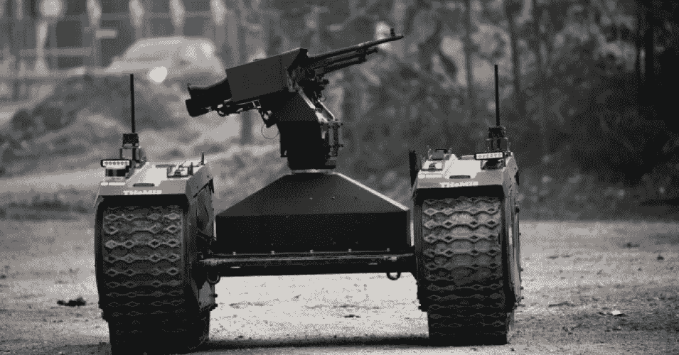
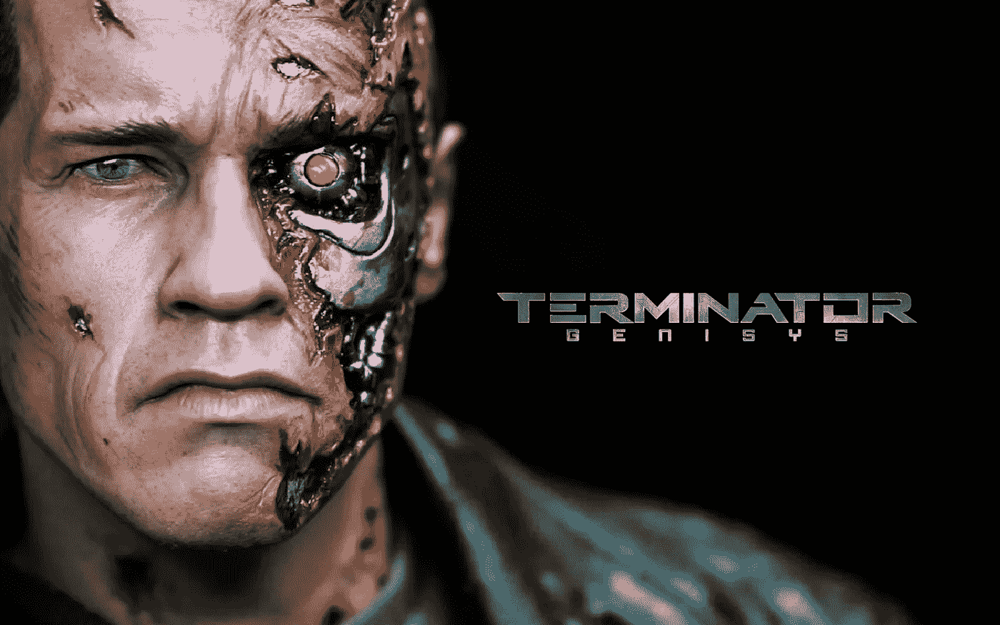
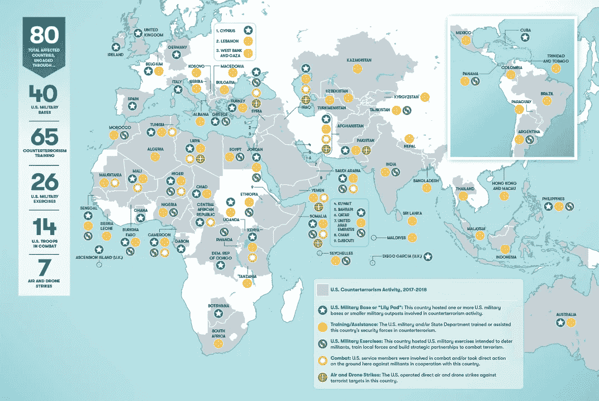
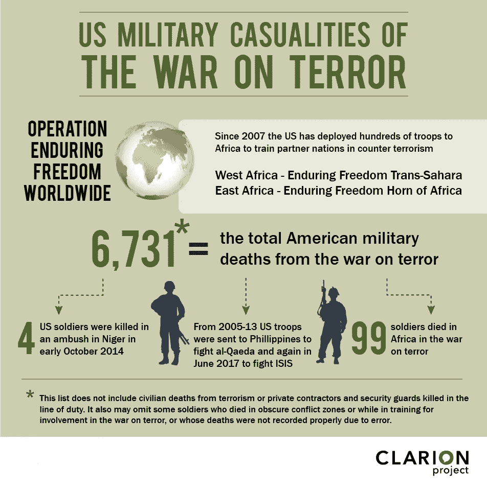

# 机器人战争背后的真正危险不是机器，而是我们！

> 原文：<https://medium.datadriveninvestor.com/the-real-danger-behind-robotic-warfare-is-not-the-machines-its-us-d83c7b976344?source=collection_archive---------42----------------------->

A developer demonstrates an autonomous tank at the Eurosatory 2018 Show, on June 10, 2018 in Villepinte, France. (Photo: Christophe Morin/IP3/Getty Images)

在过去的几十年里，新的武器技术得到了发展，这在以前只能在科幻小说作者的脑海中想象。也许其中最令人不安的是人工智能和武器的融合。2018 年 8 月，由奥地利、巴西和智利领导的 28 国联盟呼吁达成一项国际条约，禁止使用这些“致命的自主武器系统”。可悲的是，在让其他国家支持这项措施方面进展甚微。

 [## 我们为军事人工智能做好准备了吗？-数据驱动型投资者

### 今天，算法可能会以迷人的形状出现，例如索菲亚，一个态度可爱、开明的机器人…

www.datadriveninvestor.com](https://www.datadriveninvestor.com/2019/02/21/are-we-ready-for-military-ai/) 

这些武器的吸引力是显而易见的:一个国家能够发动战争而不用冒着士兵生命危险。美国使用无人机已经在较小程度上实现了这一目标，无人机可以由数千英里外坐在安全办公室的电脑屏幕前的“飞行员”控制。自主武器系统将这带到了一个新的、甚至更危险的水平。

在科幻体裁中，人工智能杀人机器的巨大风险通常符合“终结者”或“黑客帝国”的模式，在这种模式中，机器决定背叛它们的主人。虽然这种想法很可怕，但这并不是这些杀人机器构成的最大威胁。更大的威胁是，它将会以前所未有的规模释放军国主义，因为它消除了对这一结果的最有力的制约:当一个国家决定发动战争时，该国人民面临的风险。

以美国为例，正如马丁·路德·金博士所说，它显然是“世界上最大的暴力供应者”。事实上，这句话在今天比他在 20 世纪 60 年代说的时候更加真实。自 911 袭击以来的 17 年里，美国参与了两次大规模入侵，长期占领了伊拉克和阿富汗，无数次其他小规模干预，并在其他国家投下了数千枚炸弹和无人机。世界上没有其他国家接近这种程度的军国主义。但是这已经让美国人民付出了代价。除了花费数万亿美元之外，成千上万的美国人失去了生命，成千上万的家庭被拆散，因为家庭成员被送往海外，更多的人带着身体和心理上的伤害返回，最近这些战争的退伍军人以惊人的速度自杀。付出了沉重的代价。甚至那些在完全人身安全的情况下参与无人机战争的人也报告了 PTSD 事件。

不幸的是，历史表明，美国公众很容易被动摇，一次又一次地支持似乎永无止境的冲突。关于传播自由、将人民从独裁者手中解放出来、打击恐怖主义和“防御”的论点可以说服许多人支持入侵 10，000 英里以外的国家。许多人甚至对这给海外人民带来的伤害无动于衷。但是当美国军人(和他们的家庭)所付出的代价上升时，反应就不同了。这么多人为此付出的代价也是对政府发动战争能力的重要检验。正如我们在越南战争中看到的那样，当价格变得太高，让太多的美国人无法承受时，反战情绪就会建立起来，公众就会反击。如果战争可以在不伤害美国人的情况下进行，那么这个重要的检查就取消了。美国军队将被释放出来，甚至远远超过它今天所做的。政府会发现自己能够发动持久的战争，而不会受到公众的任何抵制。我们需要害怕的不是机器，而是一旦这些机器不再受任何约束，我们的政府将会如何处置它们。对于世界上的其他人来说，这个未来应该比科幻小说中的任何东西都要可怕。