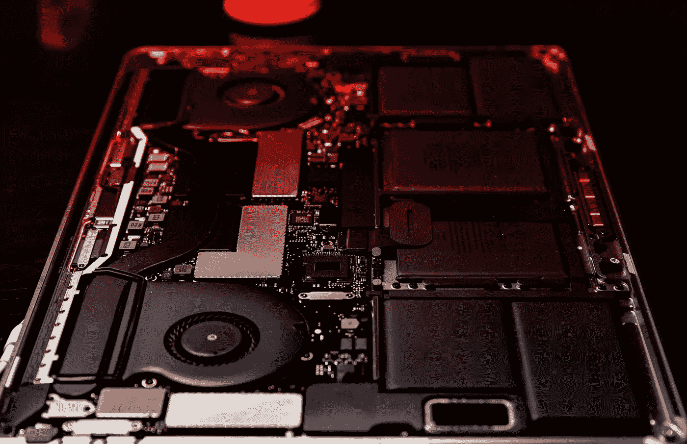
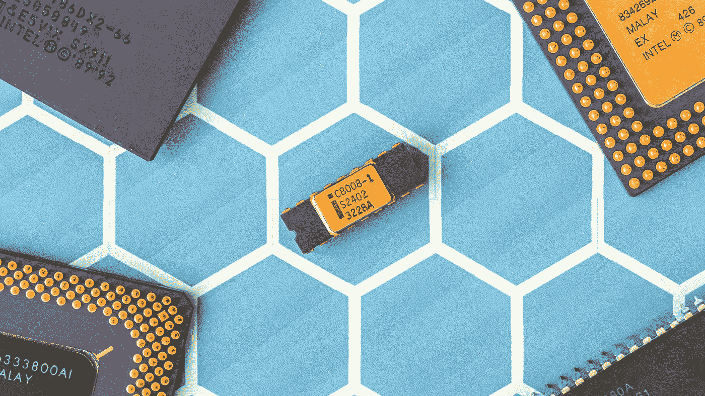

# 自满对创新的真正影响

> 原文：<https://medium.datadriveninvestor.com/the-real-effect-of-complacency-on-innovation-35140eb50224?source=collection_archive---------22----------------------->

## 陷入泥沼的半导体是技术自满的一个完美例子。

2018 年 9 月 12 日，高盛(Goldman Sachs)将其对半导体资本设备行业的看法从有吸引力下调至“中性”。在这篇文章中，他们说，

> “由于我们考虑到内存定价(以及利润)的恶化以及对未来内存的潜在影响，我们正在降低我们的覆盖率，并对部分评级进行调整。”

这标志着半导体行业最近的下滑，因为摩根士丹利最近警告说，对 DRAM 存储芯片的需求正在减弱，定价压力正在增加，供应商正在努力出售他们的产品。

现在，问题是:

**为什么高盛要降低电子世界的核心地位？**

答案是对管理层交付未来现金流缺乏信心。

**无论你是否在半导体领域经验丰富，这堂课都是有价值的。**

股价是一家公司预期交付的所有未来现金流的现值。因此，当市场对管理层有信心时，股价就会上涨，反之，股价就会下跌。因此，根据目前的信息，我们可以看到投资银行对半导体公司管理层提供未来收入的能力没有信心。

## 地球是平的

所有半导体生产公司的现金流都将下降，原因很简单:缺乏创新(从工艺到产品创新的转变，没有中断)。这些公司给客户他们认为他们想要的东西，这本身就是一个问题。

这就是颠覆困境。亨利·福特有句名言:“如果我问人们想要什么，他们会说是更快的马。”亨利·福特观察到的是苹果、谷歌和亚马逊(举例来说)的管理层非常清楚的事情——如果你只关注当前的市场需求，你将会被打乱，你将会失败。当 iPhone 推出时，Research in Motion(黑莓手机的制造商)以惨痛的代价认识到了这一点。

社交网络的缺点是，它们只告诉你你已经知道的事情，如果你的社交网络“知道”地球是平的，那就要当心了。

那么，为什么聪明、积极、薪酬丰厚的管理团队会走上自我毁灭的道路呢？你可能会问。

半导体行业有很大的进入壁垒。第一是现金，第二是知识。铸造厂的建造和运营成本非常高。然而，现代设备处于硅技术的前沿。

例如，5G 网络在硅上的性能不会达到最佳，更适合氮化镓等材料，但它很难制造，需要在新的代工厂和工艺上进行新的投资。

然而，现代设备通常在更高的温度下运行，是射频和/或光电设备，因此需要具有新架构的芯片组。

所有这些都意味着对权势集团的风险，所以他们更喜欢坚持自己的编织。

## 改变体制

我最近去了一家领先的半导体工厂，被要求去拜访一位客户，因为这家工厂的一款新设备遇到了组装和其他生产问题。

令我震惊的是，当工程团队试图组装纳米尺度的设备时，他们依赖的是 20 年前的数据，这些数据来自只能生产(充其量)12 微米工具和组件的工艺。

难怪那些更了解情况的人会降低这个行业的评级。我在电子制造业工作了 25 年，这个行业一团糟。很少有人想冒险，他们想使用不适合他们目的的工具，结果，这些工程师无法可靠地生产 10 纳米的半导体。它们怎么可能达到 7 纳米？它们怎么能移动到 5、3 或 1 纳米呢？

全球创新者不会被供应链束缚住翅膀，他们会按照自己想要的方式构建供应链。

苹果和亚马逊已经就此明确表态。苹果和亚马逊要么拥有自己的能力，要么与领先的代工厂合作，塑造自己的未来。

三星走得更远。他们不仅对自己的能力进行了大量投资，还向竞争对手提供设备。长期以来，三星的战略就是利用别人的钱——以折扣价为别人生产产品，然后在你的员工有能力做好时推出自己的产品。

这些合作和内部生产的策略很可能成为那些希望创新和提供下一代先进设备的公司的前进模式。在许多方面，这更简单，风险也更小。管理起来更容易，因为团队只有一个客户(可以这么说)，不会分心，并且有更可靠的资金。对管理层来说，风险更小，因为他们是更大的事情的一部分，有一个清晰的轨迹。

对消费者来说，不利的一面是只有少数公司能做到这一点，因此存在集中和可能垄断的风险。随着某些技术领域的价格上涨，我们可以看到这种情况开始出现，而且这些上涨不是由成本推动的。我们还看到半导体市场的整合在增加，这也是利润下降的一个迹象，并且可能会继续下降。

## 那又怎样？

这对英特尔、全球代工厂、TSMC、博通、高通等公司的股东意味着什么？最有可能的结果是，从长远来看，回报会减少，公司会消失。颠覆将会降临到硅基设备上，就像它降临到阀门制造商和老式晶体管上一样，而且，一如既往，在位者不会预见到它的到来。

当它第一次出现在地平线上时，他们甚至不会认为这是一种威胁。

那么，问题是我应该什么时候退出？

好吧，如果你的投资组合中持有半导体股票，你可能要考虑一下在接下来的几个月里你持有哪些公司，出售哪些公司。可能会有更多的整合，但有一点是肯定的:5G 已经到来，许多组织可能会提出消费设备的设计，但如果构建在硅芯片上，这些设计就不会发挥应有的作用。

作为 Datum Alloys 的创始人兼首席执行官，Ben 是技术领域的专业创新者和思想领袖，致力于为行业需求寻求直接的解决方案。

如果你喜欢这篇文章，请点击“喜欢”按钮，并在下面留下任何问题或评论。

查看我的 [LinkedIn](https://www.linkedin.com/in/pbnscott/) 了解更多信息。