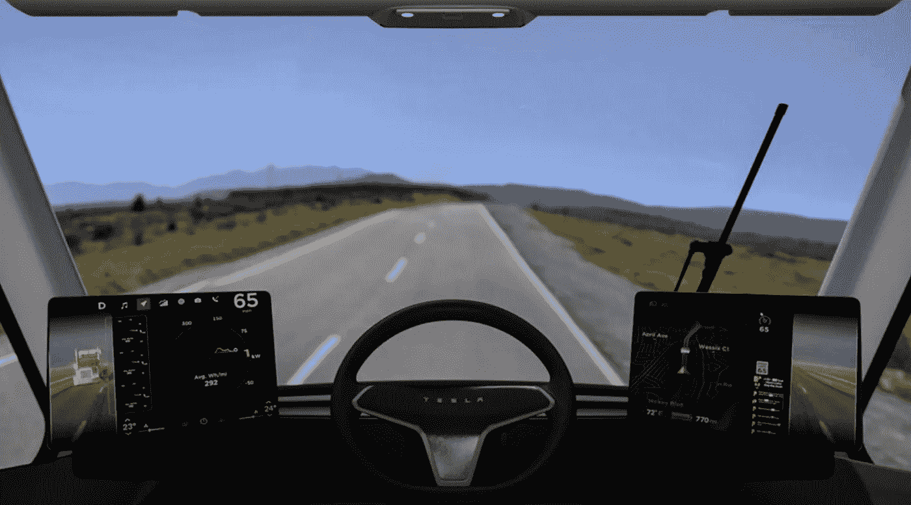
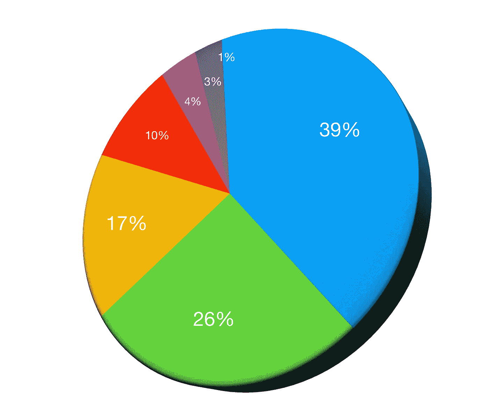

# 我们需要无人驾驶卡车的原因是

> 原文：<https://medium.datadriveninvestor.com/the-reason-we-need-self-driving-trucks-e5b85e4de402?source=collection_archive---------1----------------------->

## 自动化将如何改变卡车运输行业

Tesla Semi Cockpit (Photo Source Tesla)

那是 2017 年 11 月 16 日，我急切地等待着一款新的 semi 卡车的上市。应该没那么刺激，只是个半决赛吧？在这种情况下，它不是普通的半卡车，而是特斯拉的全电动自动驾驶汽车。这足以让人兴奋不已。它还将由埃隆·马斯克本人在加州霍桑现场演示。这带来的承诺将是另一次破坏，带来自动化如何从工人阶级手中夺走工作的辩论的两个方面。

立即吸引眼球的是设计。非常不落俗套，独一无二。它被设计得像子弹一样，所以它的空气动力学效率系数比为 0.36。现在，这意味着更小的阻力，使卡车移动更快，与空气的摩擦更小，从而减少交付时间。特斯拉半卡车实际上比布加迪凯龙星更符合空气动力学，后者的系数比为 0.38。由于它也是一种电动车辆，它产生即时扭矩。这是传统卡车在上坡或高海拔道路加速时的一个优势。

The Tesla Semi Rig Truck Introduced in 2017 (Photo Source Tesla)

特斯拉卡车的主要特点是 500 英里范围的电池和引入的“巨型充电器”，可以在 30 分钟内给卡车的电池充电。Elon 提出的一个要点是卡车的 100 万英里保证。在卡车的整个使用寿命中，大多数卡车在行驶 10 万英里后需要进行大量的保养。特斯拉向买家保证，你的卡车在 100 万英里之前不会抛锚，所以这似乎非常有利。

 [## 在自动驾驶汽车发生事故的情况下，谁应该承担法律责任？-数据驱动型投资者

### 我仍然认为自动驾驶汽车是一种奢侈品，而不是必需品…

www.datadriveninvestor.com](https://www.datadriveninvestor.com/2018/11/02/who-is-legally-accountable-in-the-case-of-an-autonomous-vehicle-accident/) 

特斯拉让你看到，与市场上的汽车相比，你可以从他们的汽车中节省多少钱。除了不需要司机来降低成本之外，这种卡车的运营成本将比柴油卡车低 20%，因为它不需要燃料和日常的车辆维护任务。它们的速度也非常快，5 秒钟就能达到 0-60 英里每小时。现在，它的其他功能包括自动刹车、车道跟踪和挡风玻璃的“防爆玻璃”。他们也有一个车队功能，允许司机操作后面的卡车车队。

特斯拉的商业主张很明确。

*   交付时间缩短
*   旅行次数的增加
*   降低驾驶员成本
*   更少的维护，更多的价值
*   绿色技术，无燃料
*   减少与驾驶员失误相关的事故

经常长距离运送货物的零售和商业公司将受益最大。没有司机和燃料的货物运输成本听起来好得令人难以置信。然而，卡车本身并不便宜。这项投资被宣传为“自我支付”，因为从长远来看可以节省成本。

特斯拉和沃尔玛已经宣布合作。沃尔玛投资无人驾驶卡车是非常有意义的，因为机器不需要像人类司机那样的监管。这意味着自动驾驶卡车可以进行更多的旅行和交付，因为他们不需要强制性休息，也不需要工作福利，如医疗保险、奖金等。这为公司削减了一大笔成本。除了特斯拉，还有其他自动驾驶卡车公司正在实施自己的项目，因此这将改变交通行业的这一领域。

车手将不可避免地被取代，这是现实情况。开始时，司机主要是出于安全考虑。虽然卡车仍在升级到 L5 全自动无人驾驶标准，但人类的存在将符合交通部门的法规。一旦确定卡车完全能够自动驾驶，那么这就是转变开始的时候。

根据[卡车司机报告](https://www.thetruckersreport.com)，美国卡车运输的总成本考虑了几个因素。他们的研究表明，卡车运输的平均每英里运营成本为 1.38 美元/英里，单辆商用卡车的平均运营成本为 180，000 美元/年。

*以下是按百分比进一步细分的成本:*

*   卡车运行所需柴油的 39%(0.54 美元/英里)
*   司机工资的 26%(0.36 美元/英里)
*   17%的卡车驾驶室和拖车维护费用(0.24 美元/英里)
*   10%的维修和一般维护费用(0.12 美元/英里)
*   4%的保险(0.05 美元/英里)
*   3%的轮胎(0.03 美元/英里)
*   1-2%的许可证、执照和通行费(0.02 美元/英里)

Graphical representation of the cost to operate a commercial truck from breakdown in cost percentage.

加起来并不完全是 100%，但我假设卡车驾驶室维护和一般维护的数据肯定有一些重叠，但这是[的分解数据](https://www.thetruckersreport.com/infographics/cost-of-trucking/)。尽管如此，如果我们与自动驾驶卡车做一个简单的比较，我们可以通过去除司机和燃料成本来消除 65%的成本。我们可以进一步降低任何与驾驶员或燃油相关的成本。也不再需要换油或发动机维护和修理。当然，在运营时，投资无人驾驶卡车也有初始成本。

自动驾驶卡车的成本因车型和制造商而异。据 [Engadget](https://www.engadget.com/2017/11/23/tesla-semi-electric-truck-price/) 报道，特斯拉 Semi 的起价低得惊人，为 15 万美元。实际上，我预计它的价格会高得多，大约在 30-50 万美元之间。让我们说一个更现实的数字是 500 英里的卡车 20 万美元。如果你能将一辆卡车平均 18 万美元的运营费用降低 80%，那么每年的运营成本估计可低至 3.6 万美元。这项投资可以在不到两年的时间内收回成本(考虑到收入和利润等其他因素)。这些数字不是实际的，它们只是估计值。我们需要一种方法来确定电池充电的实际成本，以及更快、更频繁的交付所节省的成本。我没有这方面的数据，所以这只是成本节约和投资回报率的近似值。

现在，关于自动驾驶卡车将如何导致大量失业，影响经验丰富的司机的生计的辩论开始了。取决于你站在辩论的哪一边，有研究表明，自动驾驶卡车可能在短期内实际上与司机合作。根据美国移动中心(ACM)委托来自密歇根州立大学和德克萨斯农工大学交通研究所的报告，这是一项 T2 研究。这项研究表明，短期内不会出现大规模裁员，因为出于安全考虑，司机仍然是需要的。

该研究认为:

> **…自动驾驶卡车“将在很大程度上*支持*卡车司机，而不是取代他们。”**

更大的图景是这里的长期利益。届时，卡车驾驶行业将不再需要培训新司机。这将为现有的司机提供退休或转向另一条道路的时间。这种司机将被取代的理解在反对者中引起了 FUD，但它实际上可能利大于弊。卡车驾驶可能是一项累人的工作，会消耗司机大量的健康和幸福。也占用了大量的时间和资源。叙述转移到像这样的工作如何更好地被机器取代，改善个人追求其他职业的福祉。

或许这份声明将试图解释卡车运输行业的自动化将会发生什么。

> **“自动驾驶汽车技术可能会被错误地视为一种将消除驾驶工作的变革；然而，更微妙的评估是，在未来十年，创新将促进更广泛的社会变革，导致工作场所和劳动力需求的变化。”
> ——密歇根州立大学教授希拉·科顿**

就算自动驾驶卡车不取代司机，还是有好处的。因为他们是电动汽车，他们将削减燃料费用。手动驾驶部分被排除在外，从而减少了驾驶员的工伤和意外风险。司机将在那里，以确保一切正常运行，并在关键决策期间超越卡车。我们还不知道自动驾驶卡车中人工智能的可靠程度，因此仍然需要人类的存在。监管机构也很可能要求自动驾驶卡车部署的初始阶段有司机。

据统计，美国实际上有一个[卡车司机短缺问题](https://www.businessinsider.com/truck-driver-shortage-staffing-industry-problems-2018-9)。这就更有理由转向无人驾驶的未来。越来越少的美国人想开卡车，因为工作环境艰苦，薪水可能不值得。从商业角度来看，这里的问题是，更少的司机意味着更少的运送货物到商店的旅行。这会限制公司的销售，导致更多的延期交货。即使顾客在网上购物，如果商品因为没有从仓库发货而没有库存，那么它仍然会影响零售。更少的卡车司机意味着更多的订单延迟，这可能会提高价格。

自动驾驶车辆的一个要点是交通安全和事故预防。目前还没有确凿的证据来证明这一点，但这是一个想法。大多数事故都是与人有关的，尽管也有一些由自动驾驶技术导致死亡的高调事故，例如亚利桑那州的优步和加利福尼亚州的特斯拉。事故预防和减少功能总是受欢迎的，但它们必须能够有效地工作。这不仅仅是因为它是自动驾驶的，它是 100%安全的。永远无法保证一个系统会如何运行，但是你可以安装检查和平衡来增加安全的可能性。

我们到了吗？看起来整个行业都在关注尽快实现这一目标的可能性。亚马逊是另一家正在探索自动驾驶卡车用于长途零售送货的大企业。他们正在与另一家自动驾驶公司 Embark 合作，该公司正在将该技术与 Peterbilt semis 进行整合。这个空间已经被如此多的创业公司挤得水泄不通，这也为客户选择更好的服务提供了更多的选择。

似乎卡车司机数量的下降和对更高效率的需求将推动对自动驾驶卡车的需求。早期阶段将需要人机交互。当人工智能和自动驾驶系统达到更高的自主水平时，将会逐渐转向无人驾驶操作。这对卡车运输业来说很有意义，从更大的范围来看，这对每个人都有好处。