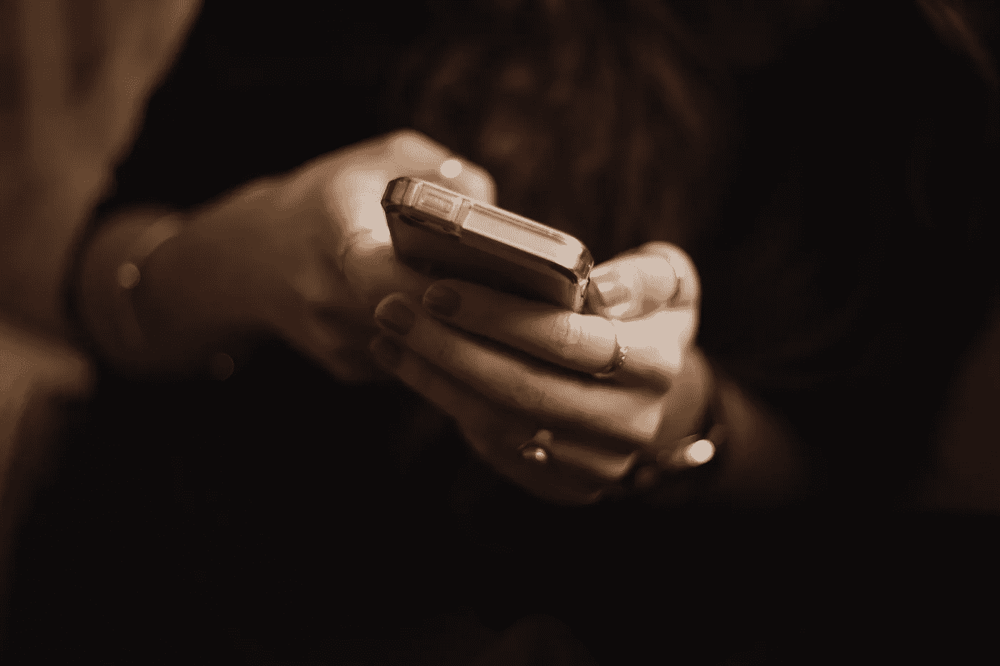

# 人们在社交媒体上关注你的原因是…

> 原文：<https://medium.datadriveninvestor.com/the-reason-why-people-are-ghosting-you-on-social-media-9047c81a978?source=collection_archive---------0----------------------->

## 对隐藏在不适中的不安全感的探索。

Credit: Unsplash

今天早上早些时候，我坐在开往奥克兰的火车上。像世界上大多数城市一样，人们因为粘在手机上而拒绝互相交谈。

当我坐着浏览我的 Instagram feed 时，我收到了一条来自一个我起初并不认识的名字的消息。但是当我打开话题时，我突然意识到:我已经做了七个多月的幽灵了。谈话进行到一半，他们放弃了，大约 236 天没有回复。我大吃一惊。

> 重影是指在没有解释或理由的情况下切断某人的动作。他们离开了。

这就相当于和一个朋友聊到一半，然后他们突然转身离开。再也看不见了。

 [## 我们屏蔽了社交媒体，这引起了公愤。-数据驱动型投资者

### 上瘾，我们看不出来。在最近的一项研究中，基于以前的研究成果，我们想…

www.datadriveninvestor.com](https://www.datadriveninvestor.com/2018/12/01/we-blocked-access-to-social-media-it-caused-an-outrage/) 

## 当它发生的时候。

我们大多数人都经历过被鬼上身。无论是在生意上，关系上，还是仅仅是友谊上，在一次有点尴尬的谈话中，连续几个月得不到回应已经开始变得司空见惯。

回想一下上次有人跟踪你的时候。为什么会这样？是什么引发了这种反常的行为？

也许是你的暗恋对象在尴尬的约他们出去后在脸书避开了你。

也许是你的朋友在请他们帮忙后避开了你，而他们可能不愿意完成。

还是你的前伴侣在社交媒体上避开你，以此来表达他们可能不想继续这段关系？

## 为什么会这样。

由于技术进步的速度，在过去几年中，重影无疑越来越受欢迎。没有一种标准的交流方式(比如 Whatsapp 或脸书信使)，放下一切从某人的生活中消失变得轻而易举。

最终，备份已经成为社会的一种应对机制，以避免在互联网上尴尬和不舒服的交流。

根据多项科学研究，众所周知，社会排斥会激活大脑中与身体疼痛相同的神经通路。这就是为什么当有人跟踪我们，或者我们在社会环境中面临拒绝时，我们会感到沮丧和情绪受到伤害。

虽然没有被证实的方法来避免被鬼上身，但是在某种情况下诚实和公开你的感受有助于鼓励另一方表达他们的观点。

## 我们的天性是避免冲突。

你看，重影与人们愿意感受的不舒服程度直接相关。如果他们不想处理他们做过/说过的事情的后果，他们会试图忽略你以避免任何负面影响。他们在心理上倾向于相信防止不舒服的情况是保持他们快乐或名誉的最有效的方法。

与所谓的“真实世界”类似，人们渴望数字关系中的真实性。如果我们不相信与我们交谈的人会直接有益于我们的未来，那么我们可能会忽视他们，而不是继续努力维持这种关系。在这种情况下，他们会停止交流，以避免与他人就他们的真实感受进行负面对话。

## 结论。

一般来说，重要的是要注意，如果有人跟踪你，与其说是关于你，不如说是关于他们的个性。他们只是想避免不舒服的程度。

一个很好的策略是诚实地对待你和他人之间的界限——不管在什么情况下。

要诚实。告诉对方你的感受。交流可以帮助他们继续他们的生活，这样你也可以继续你的生活。

> 如果是推销员试图向你推销产品，只需告诉他们你不感兴趣。
> 
> 如果是你第一次约会遇到的人，告诉他们你觉得你们在未来的关系中不合适。

我知道这听起来很刺耳。但这是事实。对双方来说，坦率地说出他们的感受和不安全感比因为极度的不适而隐藏起来要好得多。

每当我发布新文章时，希望得到通知吗？[点击这里](https://mattthenomad.medium.com/subscribe)。