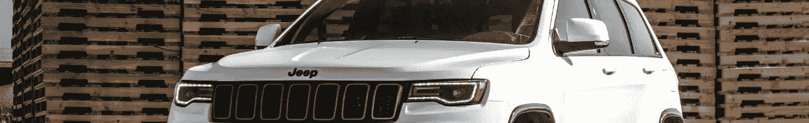

# 你放弃梦想的原因

> 原文：<https://medium.datadriveninvestor.com/the-reason-youre-giving-up-on-your-dream-848ccf651d8?source=collection_archive---------16----------------------->

## 你懒惰，没有动力，对自己的未来缺乏清晰的愿景，我知道这一点，因为不久前我也是这样..

*最初发表于*[*【millennialmoderator.com】*](https://millennialmoderator.com/the-reason-youre-giving-up-on-your-dream)*。*

这就是所谓的千年奔忙——你受到启发，开始做一些新的事情，然后几周(甚至几天)后，你放弃了那个项目，因为你还不是百万富翁，或者还没有实现你一夜情的错误期望。最棒的是，在许多这样的情况下，你一周后带着一个完全不同的梦回来，只是再次重复同样的循环。抛开所有的戏谑不谈，这会让你对自己感觉很糟糕，你的自我价值会降低到从你的同事那里借五美元而不还的程度，感觉这是一个“商业”机会。事实是，如果你想改变，你必须改变。

没有行动的梦想只是梦想。更重要的是，实现梦想需要大量的行动、训练和坚持，并被积极和无情的心态所覆盖。你必须**保持沉默，坚持不懈**才能在生活中获得[巨大的成功](https://millennialmoderator.com/a-formula-for-scalable-success)，否则你就会被归入“有点”这样做的人的行列。如果这就是你想要的，那就继续做你自己。“有点”做的人，“有点”明白，但“真的”做的人，“真的”明白，看到区别了吗？先说你的心态。

 [## 想知道领导是谁？请他决定。-数据驱动型投资者

### 一个有效的领导者能为组织提供的最有价值的东西之一是决策能力…

www.datadriveninvestor.com](https://www.datadriveninvestor.com/2019/01/25/want-to-know-who-the-leader-is-ask-him-to-decide/) 

# 缺乏积极的思考

我讨厌这个标题，但我用它来概括这个话题。积极思考意味着在任何情况下都只看到积极的一面，包括只关注**可能**是什么的积极方面。所以你有一个梦想或目标..你会专注于可能从中得到的不可思议的东西，在情感上拥抱你将经历的积极感受吗？或者你会纠结于一路上的障碍和失败的可能性吗？你是否关注于你可支配资源的缺乏？或者，你会考虑利用你所拥有的一切来让[变得足智多谋](https://millennialmoderator.com/resources-vs-resourcefulness)吗？你不必相信吸引力法则，但你必须相信振动法则——以积极的态度看待每一件事，活在每一刻，你会惊奇地发现你的日子和未来会变得多么光明。

我个人从不和只关注负面的人一起做生意。我更喜欢关注这个机会最终会带来的伟大，而不是前进道路上的障碍。我相信我们可以解决前进道路上的任何问题。所以，为什么你要放弃你的梦想的第一个建议——**你的心态糟透了**。爱上信念，只关注积极的一面，就这么简单。

# 缺少路线图

如果你想从西雅图开车到纽约，有一天你决定开始朝一个随机的方向行驶，你会迷路，最终到达完全不同的地方。你可能到了圣地亚哥，发现现在你到纽约的距离比原来更远了..这可能是一个令人不安的现实。这同样适用于你的梦想。如果你没有一张**精确的**路线图，来规划如何从这里到达那里以及中间的所有地方，你 100%不会到达那里。这适用于你生活的所有领域，尤其是在决定职业道路的时候。

当你读到它时，这是一个简单的原则，但它需要认真的思考和规划——你打算走哪条路？沿途你会在哪些城镇停留？你驾驶的是什么样的车辆(意思是，你照顾好自己的身体了吗)？这个清单可以一直列下去，如果你没有地图，通往梦想的道路也是如此。你放弃梦想的第二个原因是**你迷失了**。今天花些时间仔细计划你的未来之旅。

# 你的蓝图正在改变

我们都在成长和改变。今天对你来说似乎是一个热门的想法，可能会发展成完全不同的东西。造成这种情况的因素有很多——人在成长，认识新的人，更多地了解自己，等等。我们不能期望在生活中总是乘坐同一辆公共汽车，但我们绝对应该期望在途中修改和适应我们的梦想。也许你的梦想是开一个墨西哥玉米卷摊，通过不收取额外的 guac 费用成为城市英雄，但三年后你意识到你的利润很低，几乎不能支付你的日常开支，更不用说你突然喜欢上了意大利食品？你的梦想没有消退，它在改变，你的蓝图需要跟上。**重点是**，当你突然对自己已经做了很久的事情失去兴趣时，不要气馁。利用这种感觉来完善你的蓝图并继续前进。

这只是你放弃梦想的三种可能。我敢打赌，当你真正挖掘自己的生活时，你会发现这三个中的一个可能适用。如果你感到失落并在寻找答案，这是完全没关系的——你通过向同处一地的其他人学习来做正确的事情。下一步是学习如何[让自己随时有动力](https://millennialmoderator.com/four-ways-to-find-motivation)。本指南将向你展示我是如何做到的，并教授它。

如果你觉得这个 mod 有用，请与你的网络分享！有任何问题或意见吗？在[推特](https://twitter.com/alekseyweyman)上让我知道！

加入:[自我激励](https://millennialmoderator.com/the-reason-youre-giving-up-on-your-dream#)

*最初发表于*[*millennialmoderator.com*](https://millennialmoderator.com/the-reason-youre-giving-up-on-your-dream)*。*