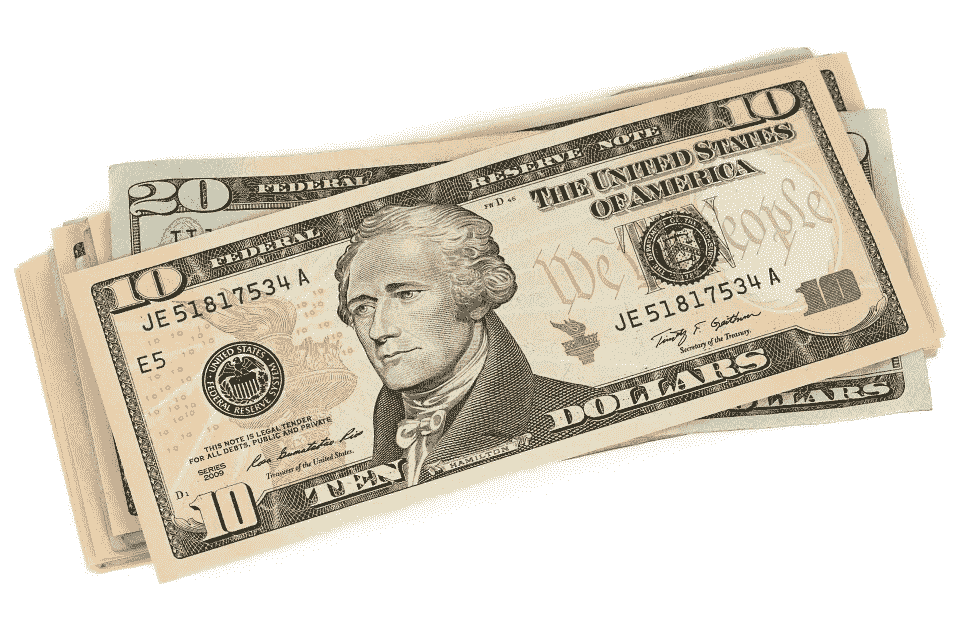

# 衰退即将来临

> 原文：<https://medium.datadriveninvestor.com/the-recession-is-nigh-6cca2f1f1180?source=collection_archive---------8----------------------->

美国和世界其他国家享受了十多年的积极和不断增长的经济已经结束。

虽然大多数经济学家认为，我们将在 2021 年陷入衰退，但我看到了我们现在可能陷入衰退的迹象，但最肯定的是不迟于 2020 年第二季度。

 [## 为什么包容性财富指数比 GDP 更能衡量社会进步？|数据驱动…

### 你不需要成为一个经济奇才或金融大师就能知道 GDP 的定义。即使你从未拿过 ECON 奖…

www.datadriveninvestor.com](https://www.datadriveninvestor.com/2019/03/08/why-inclusive-wealth-index-is-a-better-measure-of-societal-progress-than-gdp/) 

自 2008 年大衰退以来，经济一直稳步上升。值得庆幸的是，2008 年的经济崩溃在个人层面的严重程度上没有 1929 年的大萧条那么严重。这在很大程度上要归功于 20 世纪 30 年代开始实施的社会安全网计划。如果没有这些项目和其他政府行动，大萧条可能会比大萧条更严重。

在 2008 年衰退之前，政府政策(特别是本世纪初的房地产行业)鼓励了房地产泡沫，当泡沫破裂时，它导致了严重的经济收缩。房地产泡沫是由于美国和其他发达国家和发展中国家未能控制可获得的宽松信贷。正因为如此，几乎任何人都有可能拥有自己的房子，而不管其信誉度如何。宽松的信贷导致了不可持续的房价上涨。发放的信贷与债券市场和其他价值可疑的金融工具捆绑在一起，为危机制造了一场完美风暴。

国内外的许多人对正在发生的潜在经济变化没有做好准备。甚至在今天，在危机发生 10 多年后，许多美国人还在指望过时的经济前提，而这些前提已不再适用。不幸的是，美国和其他政府拒绝接受经济中发生的深刻变化。

总的来说，任何政府的政策对经济都是弊大于利。美国正面临着每年数万亿美元的赤字。在某一点上，我们可能已经达到了这一点，政府借贷将通过挤出私人借贷产生有害的影响。此外，在相对较好的时期，赤字在这个范围内，在衰退期间，通过增加政府支出来刺激经济的机会非常少。

美国的赤字目前支撑着政府的正常运转。美国的赤字没有为基础设施的重建提供资金。他们对就业和商业的增长毫无贡献。由于我们的税收已经很低，很难再通过减税来抵消经济衰退的影响。同样，利率处于历史低位，这让美联储在衰退中少了一个可以使用的工具。

政府已经决定，可以永远借款支付运营费用，而不是支付正在使用的服务，而不会产生任何影响。作为个人或企业主，如果我们借钱支付食品杂货或房租，在不久的某个时候，我们的信用将被切断。我们将会负债，却没有任何实际利益。然而，如果我们借钱买房子或卡车来帮助我们的生意，我们增加了我们的经济机会。同样的基本原则也适用于政府。与你我相比，错误的决定对美国产生影响需要更长的时间。

美国政府没有严肃而可持续的经济政策。举个例子，没有人愿意多缴税！在过去的 40 年里，我们屈服于这样一种观念，即如果税收减少，那么经济活动就会增加，因此，政府将比原来更高的税率征收更多的税。事实证明并非如此。从 20 世纪 80 年代到最近的 2018 年减税，唯一增加的是预算赤字。

这个理论在极端情况下是正确的。政府以 100%的税率征收很少的税，因为没有人愿意从事经济活动。当税率为 0%时，无论有多少经济活动，政府都不会征收任何东西。因此，政府税收最多、经济活动产生的税收最多的最高税率是多少？是 30%、50%还是 70%？

在制定税收政策时，税率应该是最重要的吗？还是政府应该根据支付日常运作费用的需要来确定费率？如果政府需要借款，就会有影响经济的机会成本。如果政府排挤私人借贷，经济就无法快速增长，从而减少税收。借钱修建一条需要的道路或一座工厂会增加财富，但做同样的事情来发工资却不会。

事实证明，企业福利和补贴除了让政客为了经济利益挑选受青睐的贡献者或朋友之外，没有任何作用。如果你给目标公司或整个行业提供价格支持、税收抵免或补贴，会有什么结果？你为什么要这样做？

这应该是政府的职能吗？通常，这种行为会人为地将价格保持在高于自由市场的水平。如果中国或德国能生产出美国消费者想要的比美国公司更便宜或更高质量的产品，我们的经济会有什么样的恶化？美国消费者得到更便宜和/或更好的商品，外国供应商以美元支付。不像 15 世纪那样，年底时国与国之间没有贵金属的交换。最终，中国或德国公司将需要把他们的付款投资到美国，或者用这些付款从最终会在美国购买或投资的第三国购买商品。

当前美国政府推出的是大幅提高关税，据称是为了提高美国的生产，阻止购买外国商品，特别是来自中国的商品。总统明确表示相信外国正在支付关税或税款，这不符合逻辑。最近特朗普的关税表明，我们的经济和中国的经济都受到了伤害。经济不是零和游戏。生产和消费的增加导致双方拥有更大的经济财富。

为了获得最好的国民经济成果，政府需要确保所有参与者的公平竞争。他们不应该补贴工业或商业。监管应该足以阻止不良行为者，但不能阻止竞争，无论是国外的还是国内的，进入或留在市场上。

尽管赤字本身并不坏，但当它们对社会没有经济效益时，就会变得更坏。税率应该产生正常时期支付服务和转移支付所需的收入，如果没有盈余来填补赤字的话。这将提供一个额外的工具，能够在经济低迷时期利用赤字支出。

我相信我们正处于或接近衰退。由于糟糕的经济政策，我们没有稳定经济的机制。这可能会导致比其他情况下更严重的衰退。总统和国会需要更多地关注自由市场和健全货币政策的实际基础，而不仅仅是理论。

