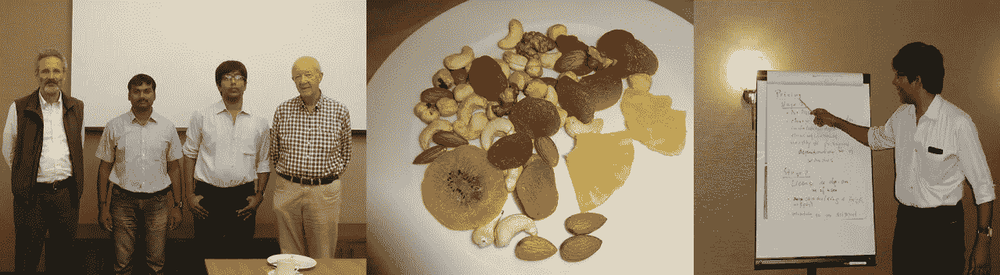
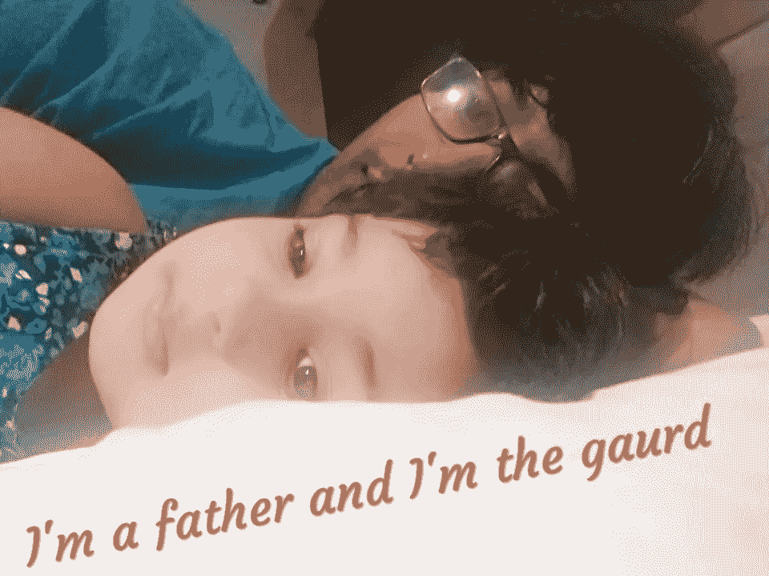

# 复苏

> 原文：<https://medium.datadriveninvestor.com/the-recovery-8308f73a842f?source=collection_archive---------2----------------------->

在 2014 年(我工作的早期——macksoftech ),我去了我的家乡——维扎格的维沙卡帕特南过节日。当时是上午 10 点。在那之前一切都很好，但是突然，我的下背部开始疼痛。我不知道，为什么会发生那种难以忍受的痛苦。控制不住眼泪，不得不赶紧去医院。一些药物+一些治疗帮助我站了起来，但这并没有帮助我回到我的工作场所

我决定在海得拉巴(我工作的城市)接受更好的治疗，在那里我可以处理多种事情。这是一个艰难的决定，我不得不做，在母亲和妻子的帮助下，我回到了海德拉巴。我旅行时穿得最轻。疼痛疼痛疼痛——没有别的了。

**谁是最好的医生！！！** 我的健康状况在我家里是相当新的，几乎没有任何信息。我每天都去新医院。是的…你没看错！！新院日报，因为每个人都开始说，以获得更换 L2，L5 这是受影响的地区，我的下背部。我每天都很沮丧，我以为我的生活就这样结束了。然后我不得不自己去寻找合适的医生。谁能帮助我，因为我是这份工作的新手，我必须去迪拜旅行一周——一切都计划好了，但我还没有准备好。一些医生说有手术的必要，一些医生让我更加担心。

有一天，我母亲和妻子不得不出去买杂货，而我在家。它开始像任何东西一样疼痛，我的手机在另一个房间。我爬着去拿我的致命喷雾和我的手机。那是我再也不想看到的一天

医生— [***文卡特·拉姆·普拉萨德***](https://www.facebook.com/venkat.vallamshetla) —刚刚看了一些好评就去找他了(感谢 google/practo)。我不知道，但我相信这个人是正确的人，是的，我在预测方面是完美的。他像朋友一样对待我，当我说我需要手术吗，他嘲笑我，我很清楚，我应该清除我的恐惧。没有手术也没有替换。一系列的物理疗法+一些药物，确保所有的照顾。我的理疗师 Siva reddy 先生明确表示，这是目前的一个普遍问题。我不知道这是否是一个普遍的问题，疼痛是个人的。

***这种痛苦的根本原因肯定是我…没有一个人或我家族的任何历史可以责怪***

**迪拜之旅** 所有的目光都盯着我，因为我才几周大，不得不和我的朋友 [***马诺哈尔***](https://www.facebook.com/manohar.gorantla) *一起坐飞机。我的朋友向我的家人保证一切都会得到照顾。我带着一套药物旅行，不得不睡在平坦的地板上，因为床对背部疼痛的人不好。感谢我的朋友，每当我感到痛苦时，他让我转移注意力。我喜欢这次旅行，但是是以不同的方式，是的…再也不会以这种方式了*

With Manohar and clients+ my limited diet + my belt

**@ 93:** *称之为药物——称之为过度饮食——由于无痛锻炼直到康复，我达到了我一生的高体重@ 93。OMG…我又开始担心了，因为是的，我的痛苦是我控制的，而不是体重。这当然不是一件好事。我查阅/阅读过，对我来说没有什么值得一动的。*

然后我又收集了关于如何减肥的数据。我准备了我的饮食，目标是一年内身体里不能有任何不好的食物。我的饮食保证了图表对我来说很难也很好，以至于它下降到我的裤子变松的位置。从那以后就很顺利了——我了解了我的身体。我的身体开始听我说话了(听起来可能很有趣，但是是的——它在听)。今天，不管我的旅行方式是什么，我从来不会不做运动就睡觉和醒来

**关于生活的再思考:** 生活变得例行公事——没有什么快乐。害怕做不了很多事情——但又不能呆在一个地方，这是生活中最令人恼火的部分。所以，我决定通过分享知识来转移我的日常工作。那是 2015 年 12 月 19 日，我在翁戈莱的一所大学里做了第一次正式演讲。(感谢[萨斯特里·夏鲁](https://www.facebook.com/sasbv)和[克里斯](https://www.facebook.com/Krish48?fref=profile_friend_list&hc_location=friends_tab))。我从不回头，很快就成了一名正式的演讲者。我的恐惧已经通过知识转移和社交活动转移了。我确保我的大多数活动都是互动的。控制体重/控制痛苦/职业激情都在我的关系网中。家人呢？？已经 4 年多了，我什么时候会成为一个父母，这在我的家庭里是一个棘手的问题，对我来说也是。

Me and My Anshika(Analytica)

永远不要相信神话——相信医生或专家。

***人生重大痛苦的根源是压力。称之为野心，称之为过度思考，称之为爱情，称之为家庭，称之为财务。它也有好有坏。但是，是的…生活不得不去。我相信这个世界上没有一个人品尝过没有压力的成功，但是什么程度的压力是有成效的总是一个有偏见的观点***

事实上——我对这些健康状况有了更多的了解，相信我……
我确保我的包里有一个药箱(只在需要的时候)，这个药箱在我旅行的时候也用来帮助别人。我对自己生活中的起起落落很满意。

有趣的是——在经历了这次痛苦之后，我开始经常旅行，因为我知道需要小心。2018 年去过奥斯汀一个月+从阿布扎比坐 16 小时的飞机，一共 26 小时的路程。我没有一台平板电脑，尽管我带了一堆，在 2019 年，我旅行时就好像要去另一个公寓一样(24 小时内多次飞行)

*我没有说这个问题不在我的生活中…是的，这在我的控制之中。每当疼痛爱我的时候，它就会痛…疼痛只会让你的生活停止几天，是的…你的心态让你跑起来*

> **下面是一些建议**
> *1。更喜欢站着工作——久坐对身体是一种威胁。尝试在家中使用立式办公桌，并增加办公室办公桌的高度
> 3。没有强制规定你必须每天吃同样的食物。比方说，如果你在家，没有工作要做，你不需要像周五那样摄入相同的卡路里。
> 4。只有饿的时候才吃。这只有在你保持适当的睡眠时间时才会发生。
> 5。压力是背痛/头痛/胃痛的主要原因。确保从娱乐中走出来。我仍然相信——压力是有成效的，它展示了真实的你。你是你痛苦的最佳研究者。所以，如果你的方法能带来好的结果，相信它。不要太依赖别人。
> 7。选择合适的医生，因为这个医生是唯一一个更了解你的人，他会建议你最好的药物。
> 8。按需锻炼，按需思考，按需生活，按需瞄准。超重、不真实的想法、消耗更多的东西真的很危险。有你自己的生活规则，否则，你必须被环境所控制*

***最后，你是你人生的领袖。尽可能以最好的方式生活。装满你的梦想，是的，期待障碍并敢于跨越它***

这完全取决于你如何设计你的生活——干杯

L OVE 生活
IVE 生活

感谢您阅读您的

M adhu
Vadlamani