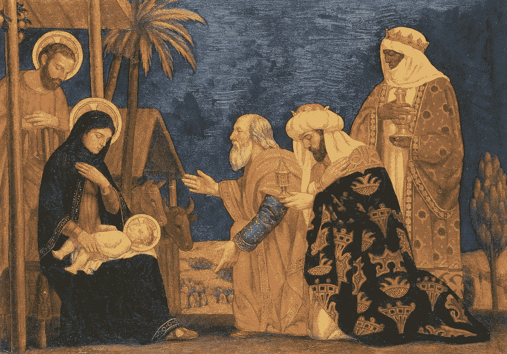

# 人工智能时代圣诞节的意义

> 原文：<https://medium.datadriveninvestor.com/the-relevance-of-christmas-in-the-age-of-artificial-intelligence-b4ae4f807e98?source=collection_archive---------23----------------------->

Adoration of the Lord Jesus Christ by the Three Magi

# 智人

在分类学上，智人是唯一现存的人类物种。这个名字在拉丁语中是“智者”的意思，是由卡尔·林奈在 1758 年引入的，此前他将人和猿归为同一生物类群，后来被称为灵长类。

有像知识、智慧和智力这样的术语。在智力上，有两个境界，一个叫认知，一个叫情感。这两点对于一个实体被称为人类级别的智能是必不可少的。

# 是什么让我们成为人类？

历代伟大的哲学家、科学家和智者都在这个问题上苦苦挣扎:是什么让我们成为人类？我们和同样是生物的动物或植物有什么不同吗？会有人类级别的智能或人工通用智能吗？一个模拟人类智能的人工智能体能真正被称为智能吗？意识的概念引起了各个时代人们的兴趣，就像它今天引起我们的兴趣一样。另一个在更高层次点燃我们思考过程的问题是:是什么让我们成为理性的人类？

# 科学和技术发展

今天，科学和技术正以前所未有的速度发展，我们面临着前所未有的技术风险，如全球变暖、砍伐森林、许多植物、动物和海洋物种的生物灭绝、新的大规模毁灭性武器的风险、军备竞赛或数十亿人的意外死亡。通过 CRISPR/Cas9 和合成生物学进行基因编辑，如果能够更广泛地获得，将使恐怖组织有能力合成比天花更危险的病原体；地球工程技术将赋予单个国家戏剧性地改变地球气候的力量；分布式制造可能导致更大规模的核扩散；人工智能的快速发展可以让一个国家、一个团体或一个人相对于其他人拥有决定性的战略优势。牛津大学和剑桥大学的一份题为“前所未有的技术风险 ”的报告非常详细地讨论了这些问题。

# 人工智能前所未有的进步

关于人工智能，斯蒂芬·霍金在他的上一本书《大问题的简要回答》中重申了严重的担忧。他指出*人工智能要么是发生在我们身上最好的事情，要么是最糟糕的事情。如果我们不小心，这很可能是最后一件事。*

大约在 20 世纪 50 年代，艾伦·图灵表达了类似的担忧，他认为超人类水平的人工智能将很快出现，因为“机器将不再有死亡的问题，它们将能够相互交流以提高它们的智慧”。图灵写道，即使我们可以通过在关键时刻关闭电源来保护自己免受敌对智能的攻击，作为一个物种，我们也应该感到非常谦卑。

今天人类面临的巨大而严峻的挑战的答案远非简单。因此，如果技术进步不能解决眼前这些紧迫的全球问题，那么答案在哪里呢？

# 智慧

答案不仅在于知识的进步，还在于智慧。根据《牛津词典》的定义，*智慧是在与生活和行为相关的问题上做出正确判断的能力*，即在选择手段和目的时做出正确的判断。另一位伟大的作家查尔斯·司布真将智慧定义为“*对知识的正确运用*”。所罗门王以他的智慧而闻名，将智慧人格化为一种精神实体，而不仅仅是能力，一个人必须努力寻找智慧。

圣经箴言 9:10 说:“敬畏耶和华是智慧的开端，认识圣者便是聪明。”

# 圣诞节和智慧

圣诞节标志着地球上终极智慧的诞生。在《圣经》中，耶稣基督被描绘成*逻各斯*，终极智慧，开端，我们所能看到、想到或想象的一切的第一原因。

*太初有道，道与神同在，道就是神。他一开始就和上帝在一起。万物都是借着他造的；没有他，任何已经被创造的东西都不会被创造。在他里面有生命，这生命是全人类的光。光在黑暗中发光，黑暗还没有战胜它。*

圣经中的另一段记载，

*犹太人求神迹，希利尼人求智慧，我们却传钉十字架的基督:对犹太人是绊脚石，对外邦人是愚拙，对那蒙神召的，无论是犹太人，是希利尼人，耶稣基督是神的能力，神的智慧。*

# 圣诞节的信息

圣诞节的信息是给人类的智慧信息，即对生命说是，对死亡说不。对和平说是，对暴力说不。对快乐说是，对忧郁说不。对真相说是，对谎言说不。

耶稣出生的那天晚上，伯利恒的同一个村庄里有牧羊人住在田野里，他们在夜间看守羊群。看哪，有主的使者站在他们面前，主的荣光四面照着他们，他们就极其害怕。那天使对他们说∶「不要害怕，我报给你们一个大喜的信息，是关乎万民的。因为今天在大卫的城里，为你们生了一位救主，就是主基督。你们要看见一个婴孩，包着布，卧在马槽里，那就是记号了。」

忽然有一大群天兵同那天使赞美神，说:

“至高无上的荣耀归于上帝，

地球上的和平，对人类的善意！"

# 收场白

我们庆祝感恩节和许多其他重要的日子，如情人节，以纪念感恩和浪漫的爱情。圣诞节提醒我们这一天致力于给地球带来和平与繁荣的智慧。今天，它与 2018 年前一样重要。

圣诞快乐！