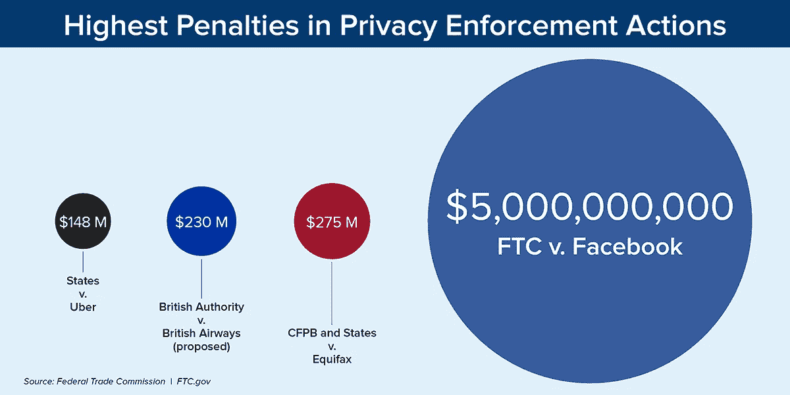

# 误导性披露的后果:脸书

> 原文：<https://medium.datadriveninvestor.com/the-repercussions-of-misleading-disclosures-facebook-4e6681920a8e?source=collection_archive---------6----------------------->

就在几周前，美国证券交易委员会(SEC)责令脸书支付 1 亿美元，因为它在滥用用户数据的风险方面误导了投资者。美国证券交易委员会宣布:

*上市公司必须识别和考虑其业务面临的重大风险，并制定程序，在所有重大方面准确披露信息，包括在风险实际发生时，不要继续将风险描述为假设。*

 [## 人们对隐私的不理解是什么？数据驱动的投资者

### 你知道那种感觉。无论是访问应用程序、订阅还是你最喜欢的运动鞋。你按下…

www.datadriveninvestor.com](https://www.datadriveninvestor.com/2019/04/11/privacy-and-convenience/) 

在该机构的[投诉](https://www.sec.gov/litigation/complaints/2019/comp-pr2019-140.pdf)中，SEC 指控脸书在两年多的时间里(从 2016 年——2018 年 3 月中旬)，在其要求的公开文件中就滥用其用户数据做出误导性陈述。脸书表示，滥用用户数据只是“假设”，而它已经意识到用户数据被不当出售给数据分析公司剑桥分析公司。(在美国和加拿大，每天有超过 1.85 亿人使用脸书)。

同样，美国联邦贸易委员会(“FTC”)已经对剑桥分析公司提起行政诉讼，指控其谎称没有从脸书用户那里收集任何个人身份信息，欺骗消费者。联邦贸易委员会声明(在另一份声明中)脸书将支付创纪录的 50 亿美元罚款“并接受新的限制，让公司对其做出的隐私决定负责”。和解令“要求脸书从公司董事会层面开始重组其隐私策略，并建立强有力的新机制，以确保脸书高管对他们做出的隐私决策负责，并确保这些决策受到有意义的监督。”

FTC 主席 Joe Simons 表示,“尽管脸书一再向全球数十亿用户承诺，他们可以控制个人信息的共享方式，但它破坏了消费者的选择。“司法部希望脸书认真对待其隐私义务，特别是因为委员会非常重视消费者隐私。

**脸书订单要求**(也扩展到 Whatsapp 和 Instagram)

*   脸书必须加强对第三方应用的监管，包括终止那些无法证明自己符合脸书平台政策或无法证明自己需要特定用户数据的应用开发商；
*   禁止脸书使用为启用安全功能(如双重认证)而获取的电话号码做广告；
*   脸书必须就其面部识别技术的使用提供清晰和明显的通知，并在任何实质上超出其事先向用户披露的使用之前获得用户的明确同意；
*   脸书必须建立、实施和维护一个全面的数据安全计划；
*   脸书必须加密用户密码，并定期扫描以检测是否有任何密码以明文形式存储；和
*   当消费者注册其他服务时，脸书被禁止向其询问电子邮件密码。
*   脸书现在有一个多层次的问责、透明和监督结构，以及联邦贸易委员会监测脸书的新工具。