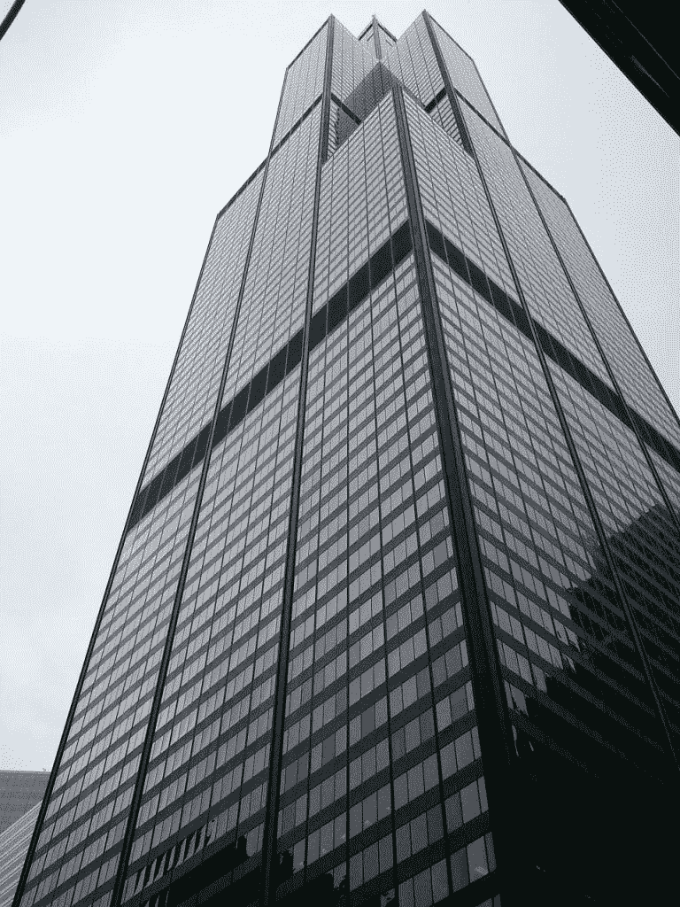
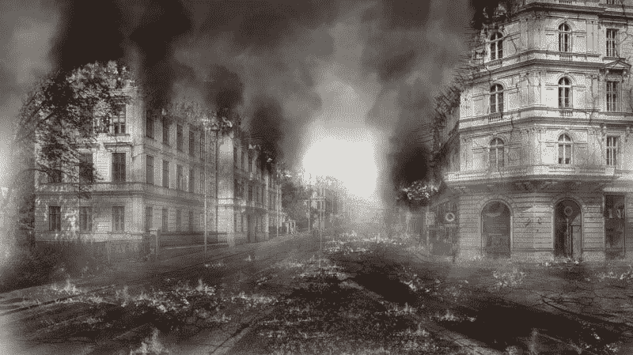
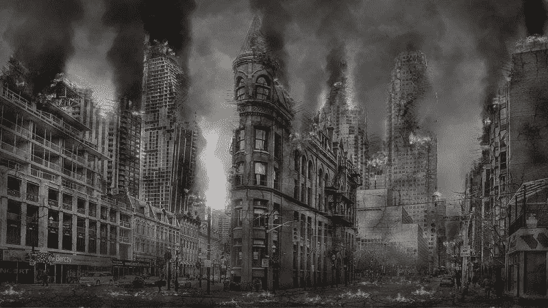

# 零售启示录变得更糟——市场疯人院

> 原文：<https://medium.datadriveninvestor.com/the-retail-apocalypse-gets-worse-market-mad-house-fd5830fa461f?source=collection_archive---------8----------------------->

零售启示录的怀疑论者并没有阅读或观看新闻或研究盈利报告。新闻和收益报告都显示，零售启示录正在恶化。

零售启示录的最新证据包括:

 [## 随着股市走高，系绳争议持续升温|数据驱动型投资者

### 总的来说，这是股票和加密货币的好周，强势的美元正在从最近的高点回落……

www.datadriveninvestor.com](https://www.datadriveninvestor.com/2019/03/18/tether-controversy-rages-on-as-stocks-break-higher/) 

# 使...烤焦

西尔斯控股计划裁员数百人；并关闭 96 家门店，*Business Insider*T2 报道。

比如，西尔斯百货的所有者 Transform Holdco 将在芝加哥和旧金山的公司办公室裁员 300 人。这是西尔斯今年秋天第二次裁员。今年 9 月，西尔斯在伊利诺伊州的公司总部裁员 250 人。

据《T4 商业内幕》估算，在最新一轮西尔斯门店关闭后，美国本土的西尔斯和凯马特门店将只剩下 182 家。西尔斯计划从 2020 年 2 月开始关闭 45 家 Kmarts 和 51 家西尔斯门店。

据《商业内幕》报道，在此之前，西尔斯已经计划在 2020 年 1 月之前关闭 122 家门店。因此，我计算出西尔斯打算在 2019 年节日季关闭 218 家门店。

2005 年西尔斯与凯马特合并；就在 14 年前，合并后的公司经营着 3500 家商店。因此，美国最大的零售商之一已经关闭了一年多。此外，西尔斯崩溃将造成大规模失业。然而，媒体中似乎没有人注意到这一点。

值得注意的是，西尔斯正在撤出整个地区。比如 Ideastream [就指出，俄亥俄州的 Kmart 门店将全部关闭。与此同时，位于纽约州西部的最后一家西尔斯百货商店也即将关门了。](https://www.ideastream.org/news/kmart-closing-all-remaining-ohio-stores)

我预测西尔斯的倒闭将成为一个政治问题。像杨安泽(纽约州民主党)、唐纳德·川普总统(纽约州共和党)和美国参议员利兹·沃伦(马萨诸塞州民主党)这样的总统候选人已经通过抨击 T2 亚马逊(纳斯达克股票代码:AMZN)吸引了选票。

杨和特朗普经常提到亚马逊；他们指责这是杀害乔布斯的罪魁祸首。此外，杨的电视广告中还有机器人在亚马逊配送中心工作的新闻镜头。

# 梅西百货(纽约证券交易所代码:M)

2019 年 11 月 19 日，**梅西百货公司(纽约证券交易所代码:M)** 的股价为 15.04 美元。很容易理解为什么投资者对这个百货公司传奇的投资如此之少。

梅西百货报告季度收入增长率为-0.77%，季度运营亏损为-2100 万美元，2019 年 8 月 3 日净收入为 8600 万美元。

面对这些损失，梅西百货计划在 2020 年底停止销售皮草，CBS [报道](https://www.cbsnews.com/news/macys-fur-macys-announces-it-will-stop-selling-fur-end-of-2020-fiscal-year/)。此外，梅西百货正在悄悄关闭几家门店。例如，该公司计划关闭西雅图市中心的标志性商店。

我预计，如果假日季不景气，梅西百货可能会宣布一波大规模的关店潮。特别是，我希望看到梅西百货退出怀俄明州这样的小市场。

# 巴尼的纽约

著名的纽约百货公司巴尼百货于 11 月 6 日关闭；并且让员工不付遣散费就走，*国际商业时报* [报道](https://www.ibtimes.com/barneys-bankruptcy-update-no-severance-pay-some-employees-amid-layoffs-2864768)。巴尼百货破产了，被卖给了 ABG 集团(正宗品牌)，时尚达人*，[报道](https://www.ibtimes.com/barneys-bankruptcy-update-no-severance-pay-some-employees-amid-layoffs-2864768)。*

巴尼在纽约经营了七家商店。wipkiedia[报道](https://en.wikipedia.org/wiki/Barneys_New_York)2019 年 8 月，巴尼百货在全国经营了 22 家门店。特别是巴尼百货。该公司以奢侈品牌闻名，于 2019 年 8 月关闭了 15 家门店。

于是，三个标志性的品牌；巴尼百货、西尔斯和凯马特正在从我们眼前的零售业中消失。

# JC Penney 公司(纽约证券交易所代码:JCP)

我预计这只零售恐龙将于明年初死亡。JCP 尸检的亮点(打扰了收益报告)包括:

美国消费者新闻与商业频道[报道](https://www.cnbc.com/2019/02/28/you-can-expect-more-jc-penney-store-closures-in-2020-and-beyond.html)JC Penney 计划今年关闭 18 家店铺。该公司在 2019 年夏天离开了家电业务，以节省资金。

我认为 JC Penney 的情况非常糟糕，在一个糟糕的假期后可能会崩溃。此外，我预计明年 JC Penney 将出现一轮大规模的关店潮。我估计彭尼公司经营着大约 800 家商店。

我预计，2019 年至 2020 年，数十家零售商将迎来一个惨淡的假日季，随后会有数百家商店关门。零售业的末日越来越糟糕，正在改变美国。我们需要处理这一现象及其给许多社区带来的痛苦。

[*最初发表于 2019 年 11 月 19 日 https://marketmadhouse.com。*](https://marketmadhouse.com/the-retail-apocalypse-gets-worse-2/)