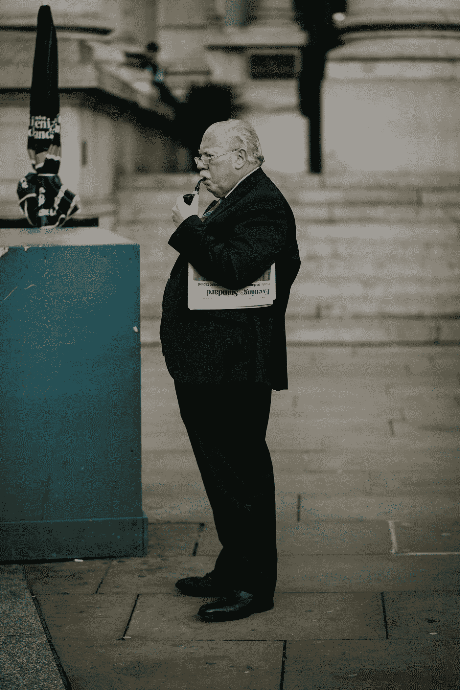

# 富人乐于接受资本利得税

> 原文：<https://medium.datadriveninvestor.com/the-rich-are-happy-with-capital-gains-taxes-d6499ea9f6ac?source=collection_archive---------3----------------------->

Photo by [Joel Barwick](https://unsplash.com/@joelbarwick?utm_source=medium&utm_medium=referral) on [Unsplash](https://unsplash.com?utm_source=medium&utm_medium=referral)

尽管人们都在谈论最富有的 10%的美国人如何支付 97%的所得税，但富裕的美国人仍在利用税法支付很低的税率。收入和资本收益之间的税收差异是沃伦·巴菲特的秘书以及成千上万像她一样的人最终比美国最富有的人支付更高的总体税率的原因。 工资按七种所得税率征税:10%、12%、22%、24%、32%、35%或 37%，视收入数额而定。然而，资本收益，即投资所得，被征收 15%或 20%的税——而 20%的税只适用于 434，551 美元或以上的投资所得。

这篇文章是我写的名为[的媒体文章的后续，富人不把钱存在银行账户里，你也不应该这样做](https://medium.com/datadriveninvestor/rich-people-dont-keep-money-in-a-bank-account-you-shouldn-t-either-de8cd890d649)。上一篇文章展示了为什么对美国人来说，投资收入比工资收入更划算。这篇文章应该进一步展示人们从投资中获得的巨大收益，如果你有能力每月将一部分固定收入投入股市，你应该这样做。

 [## 算法交易的机器学习-数据驱动的投资者

### 当你的一个朋友在脸书上传你的新海滩照，平台建议给你的脸加上标签，这是…

www.datadriveninvestor.com](https://www.datadriveninvestor.com/2019/01/30/machine-learning-for-stock-market-investing/) 

**资本收益不是双重税**

有时有人认为，资本利得税是一种“双重税”,因为公司纳税，而投资者在出售股票或收取股息时必须缴纳第二层税。但是，两者并不等同。与工人不同，公司可以从他们的收入中扣除几乎每一项支出:各种形式的债务、工资、投资等等。这些扣除是为什么有这么多成功的大公司缴纳零公司税的例子(看看你亚马逊)。此外，资本利得税从所得税率中扣除，因为他们假设公司在将利润转移给投资者之前要缴纳一些税。有趣的是，公司能够显示几乎没有利润的税收目的，但展示巨大的收益给他们的投资者。然而，税法不允许个人扣除费用。如果我买了一个新的 Xbox，我不允许从我的收入中扣除费用，但公司可以。

**延迟实现资本利得税**

当人们购买股票或通过股票期权获得股票作为其薪酬方案的一部分时，他们可以推迟支付任何税款，直到他们出售股票并获得现金福利。这种说法的理由是，人们可能在兑现投资之前没有现金纳税，这在理论上是有道理的。问题是普通美国人没有股票期权，或者无力投资股票。当一个年收入 80，000 美元的家庭支付 22%的税率，而一个年收入 200，000 美元的富有投资者只支付 20%的资本利得税，并且可以推迟到投资兑现后再支付时，这就变得不公平了。此外，收入还要缴纳社会保障税、医疗保险税和工人补偿税。对于资本利得，有 3.8%的医疗保险税，但只有当一个人的年收入超过 20 万美元时才开始适用。

**遗产税**

与资本利得税类似，遗产税是富裕家庭避免纳税的一种方式。2017 年，遗产税免税额提高到 1100 万美元，这意味着富裕的夫妇可以给他们的每个孩子/亲戚/朋友免税 2200 万美元。一些人试图证明他们已经为这笔收入交了税。然而，据估计只有三分之一的遗产被征税。例如，假设一对富有的夫妇在他们的职业生涯中一直获得股票期权，并且很少或没有支付股票。当一个家庭成员继承股票和财产时，他们可以获得 2200 万美元而无需缴纳任何税，尽管事实上其中很少一部分被征税。有时有人认为这是一种剥夺了家族世代相传的农场或企业的税收。但这大多是不真实的。

在 2017 年税法之前，当遗产税免税额为每人 550 万美元时，每年只有 1-3 个家庭农场受到遗产税的影响。有很多方法可以防止财富被遗产税侵占。对富裕家庭来说，最大的工具是信托，它允许人们在自己有生之年继续经营他们的企业，人们可以指定他们的子女在不纳税的情况下获得他们企业的所有利益。

**结论**

所有这些建议中最重要的一点是，如果你负担得起，你应该投资股市。政府认为通过股票投资公司对经济有益，因此为持有股票提供了非常有利可图的税收优惠。这是增加你财富的好方法。但是，也可能是时候改革我们的制度了，这样它就不仅仅是对富人有利。