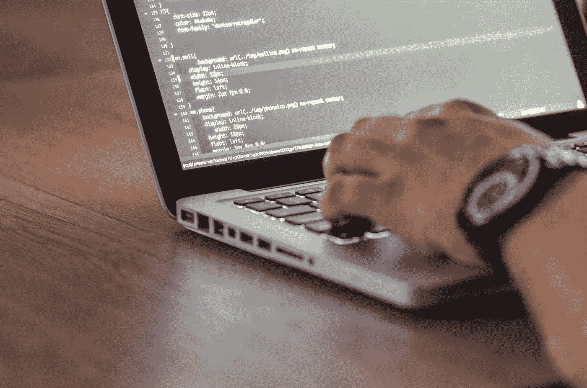

# 学习编程的正确方法——以及我是如何艰难地找到它的

> 原文：<https://medium.datadriveninvestor.com/the-right-approach-to-learn-programming-and-how-i-figured-it-out-the-hard-way-e767bfe7a828?source=collection_archive---------11----------------------->

学习编码可能是一个艰巨的过程，当我们开始的时候，可能会显得特别令人生畏。虽然我认为还有很多编程知识需要我学习(这是这个领域让我如此兴奋的部分原因)，但我相信我已经找到了最大限度利用我所付出努力的正确方法。如果你是编程初学者(或者只是需要复习)，在这篇文章中，我分享了一些有助于你最大化学习体验的智慧。事不宜迟，让我们开始讨论这些学习框架。

# 1.接受当你开始的时候你不会很好，并且知道与编程斗争是掌握它的先决条件

首先，我要坦白一件事。2012 年开始编程的时候，**很讨厌**。为什么？因为我不擅长这个。老实说，我很不擅长。大约 7 年前，当我使用 VBA (Visual Basic for Applications)开始我的第一堂课时，我还不习惯在任何方面比大多数同学差。在我的大部分工程课程中，从高中起就有很强的数学背景给了我优势。但是，我没有把我面临的障碍看作是可以克服的挑战，也没有把自己推得更远，年轻的我出于某种愚蠢的原因，决定编程是我不需要擅长的领域之一。我确实成功地完成了我的学士学位。通过在团队项目中与优秀的程序员合作(谢谢你，丹尼尔，如果你正在读这篇文章)，我能够在没有对编程基础和问题有很好理解的情况下生活。但是从长远来看,并不成功。到目前为止，如果有一件事可以改变我的职业生涯，那就是回到我在俄克拉荷马州立大学的本科时代，主修计算机科学，而不是机械工程。不要误会我；自我课程真的很有趣。我真的很喜欢学习大部分的主题，并解决给我的问题。然而，后来在大学，一旦我开始在我身上寻找工作机会，我并不觉得它们特别令人兴奋。我还发现，在我发现最令人兴奋的子领域(自动化控制系统和机电一体化)，我缺乏所需的编程准备。在这些领域，任何有更多计算背景的人都比我有明显的优势。跳到一年前，我开始攻读生物医学工程博士学位。我周围都是实验，不可避免的大量数据。那时我意识到，如果你现在正在读这篇博客，你可能已经意识到，编程是一项不可替代的技能。学习它会在你的职业生涯中打开无数的机会，如果你在科技相关领域工作，缺乏对它的理解很可能会回来困扰你。不幸的是，从我开始编程到意识到我应该从一开始就接受编码的独特挑战，而不是回避它们，花了我 3 年的时间。我终于学会了不要被我菜鸟级别的编码技能所打击，这才是真正的学习开始。然后，经过数千小时的练习和无数次的尝试和错误，我开始明白了一些更重要的原则。这些都是无价的教训，我希望有人在我第一次学习写代码时就向我反复强调。对你来说，好消息是我现在就在这里分享它们。

# 2.把学习编程语言看作是学习真实世界语言的类似过程

当我们开始学习编程时，我们中的一些人会比其他初学者好一点，但是没有人一开始就擅长编程。至少与那些花时间努力学习编程的人相比，这并不算好。这就像学习一门真正的语言。想象一下，如果有人一生只说英语，然后开始学习普通话。对他们来说，在短时间内讲一口流利的普通话是不可能的。**。**

我刚开始的时候，比我优秀很多的同学(不出所料)大多是以前做过一点点编程的人。但是不要气馁！好消息和硬币的另一面是，就像学习任何真正的语言一样，在投入足够多的时间后，你不可能变得**糟糕**。我在这里喜欢用的比喻是这样的:想象有人搬到一个不同的国家，被迫每天说一门外语。他们对这种新语言的掌握程度将是他们获得多少实践以及他们在多大程度上优先掌握口语行话而不是仅仅学习足够应付的一个因素。但是，不管他们有意识的努力程度如何，很难想象有人(假设他们没有学习障碍)被迫说一段时间(比如说 10 年)外语，而在结束时却不具备功能性语言技能。编程也类似。我想再次强调，寻求反馈和不断改进很重要。否则，就像我的类比一样，你可能最终知道的足够应付，但不足以用最好的方式去做。正如掌握你所居住的地方的语言只会使你的生活更容易一样，掌握由更广泛的社区定义的“好的”编程实践将使你免于浪费时间和计算工作。

# 3.认识到互联网和可用的文档是你最好的朋友

在我早期的大部分本科工程课程中，当我陷入困境时，最好的前进方式通常是从教授/导师那里获得帮助。很自然，这是我开始学习编程时使用的方法。采用这种方法的问题是，特别是对于编程来说，调试要比修复工程/数学问题中的一个步骤花费更多的时间。大多数编程脚本都是建立在前面的步骤之上的，随着它们变得越来越大，一个小小的 bug 就可能把它全部引入歧途。开始编程时，你可能犯的错误数不胜数，任何帮助你的人都必须首先了解你的问题设置。只有这样，他们才能开始寻找漏洞。因此，如果你每 15 个学生有一个导师(像我一样)，他们花 5 分钟试图解决每个学生的问题，你不会从他们那里得到很多时间/帮助。这就是为什么能够以书面形式交流您所面临的问题，并能够在网上或编程文档中找到答案非常重要的部分原因。在你之前，数以百万计的程序员已经经历了学习编程的相同障碍，其他初学者肯定也和你一样被困在了同一个地方，只是方式略有不同。如果没有人这样做过，那么有很好的资源(想想 [Stack-overflow](https://stackoverflow.com/) 或者 [Quora](https://www.quora.com/) )来问新问题。这些网站拥有数百万活跃用户，其中许多人像我一样，渴望看到你的问题并给出答案。写下你的问题的另一个重要方面是，它迫使你深入思考你的问题和你正在做的事情的过程。很常见的情况是，开始提出一个问题，然后写到一半的时候，你意识到你已经找到了你到底做错了什么。在网上寻找答案可能(也可能不会)比让导师检查你的剧本花费更多的时间，但学会在没有导师的情况下寻找答案是我们需要发展的一个关键实践，以加快我们的学习。除非你*总是*有一个导师可以帮你修改代码，而不需要任何等待，这会节省你很多时间。即使你有好的老师，最终他们的反馈也不一定比你在网上找到的由成千上万用户投票支持的解释更好。

# 4.遵循良好的编程实践

我认为再次强调这一点很重要。开发遵循一致规则的程序更容易:
a)其他人理解你写的东西，不管是为了帮助你修改你的代码还是为了重用你自己的代码
b)你在未来遵循你自己的工作，这样你就可以重用它或者扩展它

如果你是编程新手，你会惊讶地发现，如果你在编写代码时没有遵循一套标准的规则，b)经常会成为一个问题。我不打算深入探讨良好编程实践的一般准则。我的推荐是从阅读罗伯特·c·马丁 **的[**Clean Code 开始。这深入到了编写“好代码”的基础，我怎么推荐都不为过。除此之外，我相信最好的方法是在你投入编程之前，查找你正在使用的*特定的*编程语言的指南，并阅读一些好的实践。**](https://www.amazon.com/Clean-Code-Handbook-Software-Craftsmanship/dp/0132350882)**

# 5.当你学习新任务时，要学会将它们应用到独立的项目中

这是训练轮离开和真正工作开始的地方。我个人发现，像 Coursera/EdX/name-an-online-course-provider 这样的教育资源几乎总是提供解决每个问题的分步指导、详细的视频教程和干净的数据(如果你正在处理数据集的话)。虽然这种方法让学生尝到了所用方法的滋味，但它只教会了学生在一份工作中完成相同任务所需的一部分技能，而这种有用的指导不可能得到。这就是为什么我认为每个人在学习新的编程方法时，都应该在外部独立的项目中尝试这些方法。我发现南加州大学(我的研究生院)的课程在鼓励独立工作方面要好得多，但仍然没有达到我喜欢的程度。追求这样的项目，在那里你可以使用你学到的编程技能(并让专家/在线社区对它们进行评审),这是了解你的缺点并在最需要注意的地方进行改进的最好方式。因此，如果你的教育资源不要求你从事这样的项目，你肯定应该开始为它们留出一些时间，这样你就可以更好地掌握你正在学习的东西。这个过程实际上是非常愉快的。就我而言，做这样的项目比看课程讲座更有趣。

# 6.接受你喜欢的主题的项目

我第一次有机会选择一个编程项目是在南加州大学的一门课程上，关于计算机工程师的概率(EE 503)。当我听说我们要把我们的概率知识应用到我们选择的项目上时，我立即开始在课堂上与其他学生交谈，看谁准备好做一个关于 NBA 球员统计的小组项目。这是我从学术角度探索我每天都在书呆子气的东西的机会。我最终在这个项目上投入了比我在一个随机分配的主题上更多的努力(比如说像板球这样的不同运动的统计)。最终，我无法证明我想要做的，NBA 超级巨星拉塞尔·威斯布鲁克的“数据填充”对他的球队有害。然而，我从这个项目中学到了我没有预料到的新东西，比如 NBA 球队超级明星的哪类统计数据是球队获胜的最佳预测。总而言之，这是一次爆炸，我在学习为我的研究编写方法时获得了很多乐趣。我甚至开始在 Reddit 和其他社交媒体网站上向其他体育数据爱好者寻求建议。从那以后，我一直独立从事我觉得有趣的其他项目，无论是神经科学概念还是自行车共享系统的机器学习项目。最棒的是，鉴于编程只是一种工具，您可以用它来研究几乎任何您喜欢的主题。如果你在想，“等等。我对数据科学不感兴趣，因为我是一名网络/应用程序开发人员”，是什么阻止你创建一个关于你感兴趣的主题的应用程序或网站？正如一句被过度使用但真实的谚语所说，追随你的激情(在应用你新发现的编程技能的同时)会让你的工作更有趣。

# 7.找一群同样喜欢你所学的东西的人

确保你花更多时间学习编程的一个很好的方法是让你周围都是做同样事情的人。友好的竞争和看着你的朋友进步的动力相结合，可以促使你比其他情况下更加努力地工作。如果你像我一样幸运，住在洛杉矶这样的大城市，定期参加聚会，和有共同兴趣的人交往。如果你在一个偏僻的地方，不要害怕。在线社区对于认识学习伙伴同样重要。我曾经参加过的一个 Udacity 机器学习课程的 facebook 小组已经成为我对编程感兴趣的新闻的意外来源，这是一个研究其他学习者面临的问题的机会，最后但同样重要的是，这是一个数据科学迷因的优质来源。你也可以关注像 Medium 这样让你感兴趣的文章/作者，并与启发你的作者取得联系。有很多方法可以找到一个编程社区。另一方面，如果你开始与科技行业的其他人建立关系网，也不会影响你未来的就业前景。

# 8.找机会把你学到的东西教给别人

教一些东西通常是更好地学习它的最好方法。我发现从神经科学到数学再到编程的各个领域都是如此。当你给多个学生讲授一个概念时，你被迫思考和回答你自己永远不会想到的问题。我有幸在我的大学担任助教，能够教授 R 和 Matlab 编程。有趣的是，我发现与最挣扎的学生一起工作帮助我学会分解编程的步骤，并在更深的层次上理解编程逻辑。即使没有特定的观众提问，我也发现为指导机器学习编程项目编写在线教程(留意即将发布的帖子)有助于我从一个新的角度看待我自己的项目。教授编程对老师来说也是一种教育体验，如果有机会，我强烈建议你去做。

以上总结了我在编程领域学到的一些最重要的经验。如果你能走到这一步，恭喜你！感谢您的阅读，这可能表明您非常认真地学习编程业务。我希望这能对你有所帮助，如果你认为这可能对你认识的其他人有所帮助，请与他们分享。