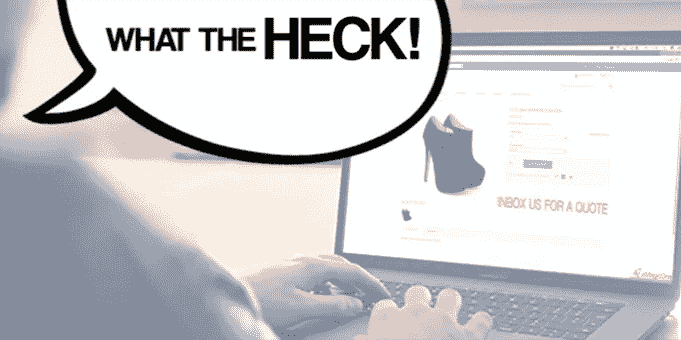

# 不把价格放在网站上的连锁反应

> 原文：<https://medium.datadriveninvestor.com/the-ripple-effect-of-not-putting-your-prices-on-your-website-8a821a2a0b7c?source=collection_archive---------11----------------------->

## 糟糕的生意:没有在你的网站上列出价格。

How am I expected to buy anything when there is no price!

当地小型服务企业主最大的误解是认为在网站上标价会让他们容易受到竞争对手的攻击。

这种不安全感是因为他们只了解自己的人口统计数据:客户的年龄、种族和性别，而不是选择去了解最初是什么真正吸引了他们的服务。这就是为什么他们最终会因为糟糕的服务而处于弱势地位，而不是因为竞争，以及顾客因此而离开。它们不会被“偷走”。

我在一家 it 公司工作，这家公司的价格比竞争对手要高得多，但是客户还是会因为两个主要原因而不断光顾。

1.我们的服务质量。
是的，我们提供最好的彩色照片等等。但是我们的工作总是准时。顾客也越来越信任我们，因为我们关注小细节，比如，如果他们把零钱放在柜台上，可能只有 25 美分。他们拿回来了。我们在办公室举行户外野餐，如果他们愿意的话，我们经常邀请他们参加。

2.**我们的流程**。
我通常需要 3 天时间来完成设计工作，并且在工作完成并准备交付之前，客户总是会得到通知。每当他们被转到公司内部或外部的其他分支机构时，他们都会大声说出他们的焦虑，因为“不知道在另一个分支机构或公司会发生什么，他们更喜欢我们服务的价值”。

因此，如果你有一个围绕你的价值观构建的系统，你很有可能获得更高的价格，同时赢得合适的客户。除此之外，你实际上说的是，在竞争中选择你的基础是你的价格。

你看出这个概念的问题了吗？

期望像你的定价这样微不足道的东西给你带来竞争优势，而不是你的品牌(客户与你的服务之间的情感联系)，是非常误导的。你不会说吗？虽然价值是通过你为服务定价的方式来表达的，但与价值相比，定价是次要的。让你自己相信你值得顾客是因为你的价格，而不是你提供的价值，会让你总是不得不降低价格来吸引客户，而不是增加你的价值来增加你的利润率。向顾客隐瞒你的价格是这种不安全感的一种表现，这种不安全感会助长三种情况中的一种，如果不是全部的话。

# 它使你的价值丧失信誉

设身处地为客户着想。如果有人引起你的注意，只是为了让你在得到他们宣传的东西之前经历无数的困难，你不会怀疑自己是不是被骗了吗？这也是客户离开你网站的巨大动力。

我知道，当网站从外面看起来很棒的时候，我已经做了很多，当你靠近时，它就会变得令人失望。这几乎和最终进入一个过度设计的网站一样令人讨厌，这个网站太分散注意力了，你甚至不知道你为什么会在这里，或者更糟糕的是，这个网站很容易导航，但除了表明这完全是浪费他们的时间之外，对客户的阅读没有任何帮助。

# **它激怒了顾客**

当你故意试图浪费别人的时间时，这是非常不尊重人的。想想那些[脸书的视频](https://www.facebook.com/Juliusmagic/videos/600164261292867)，它们让你有一个特定的期望，却故意阻挠结果。网站的意义是什么？去卖！因此，一个潜在的客户会希望你的价格显示出来。

当你故意试图浪费别人的时间时，这是非常不尊重人的。几天前的晚上，我有幸阅读了一篇[非常活跃的讨论](http://www.thebrandtub.com/angrycustomers)，其中的顾客对这种不标价的做法感到愤怒和难以置信的困惑。我也进行了自己的讨论。(如果喜欢，可以在这里 查看[)](https://www.facebook.com/photo/?fbid=10156297932406357&set=gm.2011139768938000)

# **你失去了生意**

我觉得这是很不言自明的。如果从你这里买东西是一件令人疲惫不堪或者看起来非常可疑的事情，为什么我会把你介绍给别人呢？即使你的服务有了结果，我会考虑的只是我与你的相遇，不想赌上别人“可能”有更好体验的“可能性”。

我就是这样相信，什么叫做“竞争才能继承客户”。当你让潜在客户别无选择，只能转向另一个方向时。我就是这种说法的证明，因为我获得的客户都是在为另一家公司工作了五年半之后建立起来的。想到以任何其他方式失去客户，而把它归咎于我们自己是不负责任的，因为我们经营业务的方式完全取决于我们作为所有者。顾客只是回应。

我是 Brand tub**的创始人和视觉品牌策略师**