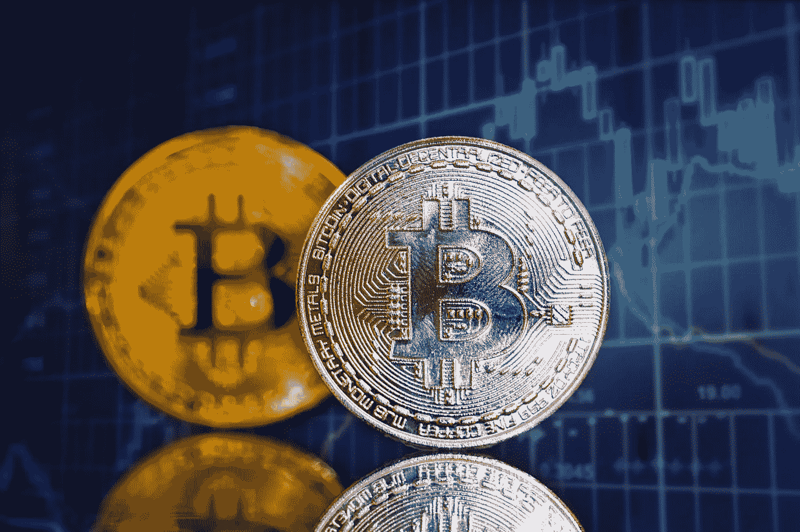
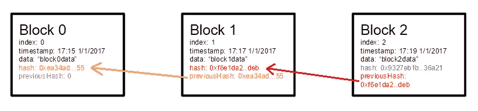
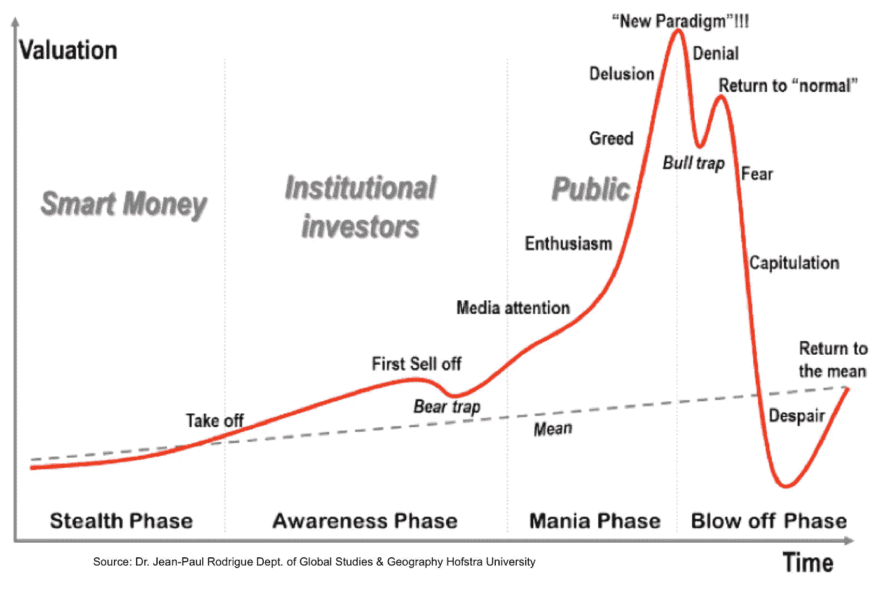

# 比特币的兴衰

> 原文：<https://medium.datadriveninvestor.com/the-rise-fall-of-bitcoin-cebe115eb17?source=collection_archive---------6----------------------->

目前， **1 比特币**的交易价格为**5255.21 加元。**好像很贵？如果你恰好在一年前买了 1 BTC，当时它的交易价格是 **19，772.59 加元**，那就不会了。不夸张……短短一年跌了 14517.38 美元。显然，在某个地方似乎有问题。

> 每个知情人士都需要了解比特币，因为它可能是世界上最重要的发展之一

# **比特币是什么？**

比特币是一种开源的加密货币，由一种被称为“区块链”的新概念驱动。有人称之为“数字货币”的开端，也有人可能称之为“加密货币”。无论哪种方式，它都是一种基于 P2P 技术的新的分散货币形式，用于促进即时支付。

> **比特币是开源的；它的设计是公开的，没有人拥有或控制比特币，每个人都可以参与其中，**bitcoin.org

这是集中式银行网络的一种新的创新替代方案。它是在 2009 年由一个化名为“中本聪”的匿名开发者开发的。作为比特币实现的一部分，Satoshi 还创建了有史以来第一个区块链数据库，数据存储在*交易*中。交易被附加到*块*，块被进一步附加到*块链*

Example of a Blockchain

# 什么是区块链？

> 比特币只是使用区块链的一个例子。加密货币只是分散技术的一个例子。

区块链是区块链；或者更专业一点:用户所有交易的数字分类账。在整个计算机网络(节点)上维护该数字分类账的副本。全球大约有 500 万台电脑在使用比特币。每当一个新区块被添加到区块链时，都要通过工作证明进行验证。

*工作证明*是人们花费计算机能力(GPU)解决复杂计算的概念，结果获得奖励(本例中的 BTC)。这也被称为“挖掘”。要求开采区块的目的是验证交易的合法性，避免重复支出，并在此过程中产生新的货币。

哈希是一个函数，它接受输入并返回固定长度的加密输出。区块链的每个块部分包含该块的事务的散列+前一个块的散列。这意味着如果有人更改了旧块上的事务，他们将不得不重新计算并更改新块上的所有散列。

因此，删除一个块是不可能的，修改一个现有的块也是极其困难的。它需要一个比所有其他用户的能量总和还要大的恶意网络。

# 当事情出错时…

共识机制是区块链的精髓。一旦 51%的挖掘节点验证并记录了该块，就添加该块。

**51%攻击:**一种被称为 *51%攻击*的假想攻击是——如果一群矿工设法控制超过 50%的计算能力(哈希速率)。他们将能够阻止任何新的区块获得确认，他们也可以扭转任何交易；允许他们双倍消费货币。尽管这对于已经拥有大量矿工的比特币来说不太可能，但较小的加密货币(和区块链数据库)更容易受到这种攻击。

2016 年 8 月，氪和 Shift 这两种基于以太坊的货币遭受了 51%的攻击。同样的，比特币黄金也在 2018 年 5 月遭到了 51%的攻击。据估计，黑客能够在几天内加倍花费，最终窃取了价值超过 1800 万美元的比特币黄金。

**犯罪活动:**由于没有中央权力机构监管货币的流动，加密货币对犯罪活动来说是无价的。美国 DEA 执法机构估计，比特币 90%的使用来自非法服务。

**PayPal** 是一种安全可靠的人与人之间转移集中货币(即美元)的方式，然而，他们收取 2.9%的交易费。比特币爱好者可能会声称，这样的收费是荒谬的；我不这么认为。随着费用而来的是一个[买方和卖方保护](https://www.paypal.com/ca/webapps/mpp/paypal-safety-and-security)协议，带来交易期间的安心。用比特币消除交易费用可能会增加利润，但也会增加相关的风险。企业从不热衷于增加风险。

涉及货币时，欺诈是常见的。美国银行和加拿大信托等银行可能有集中管理，但他们全天候监控和防止帐户欺诈。密码丢失:重置；盗卡:块卡；被黑账号:屏蔽账号。当涉及到分散的货币管理时，上述服务都不提供。丢失 32 字节的私钥意味着失去对帐户及其余额的永久访问权，没有例外。

比特币和区块链的概念总体来说可能很有趣。然而，日常市场和加密货币之间似乎存在巨大的脱节。比特币会缩小这些差距吗？也许吧。是否足以获得消费者的信任？我不这么认为。也许弊大于利，至少对我来说是这样。我对分散货币的未来相当怀疑。

A general Time vs. Valuation Graph created by Dr. Jean-Paul Rodrigue