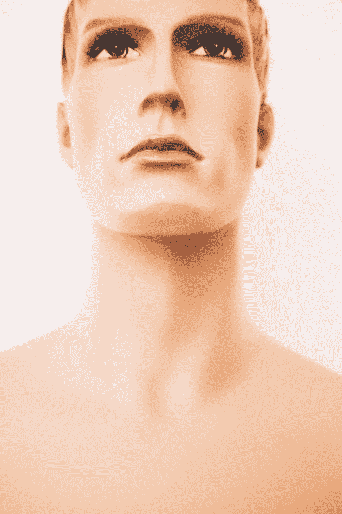

# Instagram 上网络模型和人工智能账户的兴起

> 原文：<https://medium.datadriveninvestor.com/the-rise-of-cyber-models-and-ai-accounts-on-instagram-82c096a8fce1?source=collection_archive---------0----------------------->

欢迎来到未来，现在是 2018 年，CGI 模型在 Instagram 上“生活”在我们中间。请注意，一开始可能不容易发现它们。他们的账户可能看起来像任何其他 Instagram 影响者或模特的反馈。品牌赞助的照片，穿着名牌服装的照片，自拍——你知道该怎么做。对 AI(人工智能)账户的着迷部分是因为我们实际上对它们的了解非常有限。他们背后的创造者是谁？他们正在变得像他们的开发者可能引导我们相信的那样自由思考吗？以下是一些网络模型和人工智能影响者的例子，以及它们对 Instagram、通信和时尚的未来的潜在影响。

# 它们是什么？

无论你如何称呼他们，机器人影响者、网络模型、CGI 模型、人工智能账户，他们都是通过 3D 动画软件创造的虚拟化身。我们给它们起的名字之多证明了我们对它们的存在是多么困惑。随着动画技术的进步，这些 CGI 模型看起来怪异地像人类。如果你在你的探索页面上遇到他们，如果不仔细看，你甚至可能意识不到他们是机器人。这些模型没有物理形态，尽管他们试图迷惑追随者。然而，这些帐户已经发展了人们在评论区联系的个性。许多人工智能模型已经发展了政治观点，并且已经将自己确定为种族、社会或性别群体的一部分。其他人更愿意成为 CGI，开发者很清楚他们参与了这个账户。

# 例子和“社区”

# 米凯拉索萨、布劳科和百慕大

以上是由同一家公司创建的三个“Brandfluencatars”又名品牌影响者头像的名称。从本质上来说，这三个人都有自己的个性、时尚感和职业生涯(Miquela 有她自己的 [SoundCloud](https://soundcloud.com/lilmiquela/over_you) 账户，记录了她电脑化和自动调音的声音。)它们被设计用来做 Instagram 影响者所做的事情。他们都声称隶属于名为 [Brud](https://docs.google.com/document/d/1V5N5tcfm7wBuUshgrmIOz9ijAO-VRqvkUbGRu0uKdI8/edit) 的开发者，其网站指向一个谷歌文档，该文档含糊地回答了关于他们的参与和与账户的关系的问题。Brud 称自己是一个“[跨媒体工作室，创造数字角色驱动的故事世界。](https://docs.google.com/document/d/1V5N5tcfm7wBuUshgrmIOz9ijAO-VRqvkUbGRu0uKdI8/edit)“米凯拉是否真实的答案是，“和蕾哈娜一样真实。”他们在自己的“网站”上引用人工智能账号，就像引用真人一样。

如果这还不够混乱的话，这里有一些关于账户的背景故事。

当社交媒体上爆发一场争执时，密凯拉( [@lilmiquela](https://www.instagram.com/lilmiquela/) )和百慕大( [@bermudaisbae](https://www.instagram.com/bermudaisbae/?utm_source=ig_embed) )账户引起了公众的注意。据称，百慕大“入侵”了密凯拉的账户。百慕大威胁要揭露密凯拉的大秘密。在这里，请击鼓，事实上，她不是一个人。好吧，任何视力正常和大脑功能正常的人都可以发现这一点，但这导致了媒体关注的爆发和帐户追随者的涌入。

其次是正在进行的 Instagram 戏剧，因为这两个人工智能模型的政治观点冲突。百慕大的边缘白人至上主义者、右翼观点和米凯拉的自由主义观点以及对“有色人种妇女”的认同。(我必须强调一个事实，她不是一个女人，而是一个计算机生成的图像。)从理论上来说，这种不和似乎是一种真正的性格冲突，但事实上，这两个“女孩”都不存在，这让整个事件看起来像是一场公关秀。如今，CGI 的影响者是朋友，他们发布照片“闲逛”

关于这些账户最令人惊讶的事情可能是他们与真人一起参加活动的摆拍照片。密凯拉经常上传名人摆姿势的照片，并收到关于他们在一起度过了多么美好时光的评论和确认。米凯拉甚至将一些她与 150 万 Instagram 粉丝分享的动画墨水归功于乔恩男孩纹身。这种幻觉永无止境，没有一个据称见过她的名人透露过她的开发者是谁，或者他们是如何“相遇”的。

# [蜀都](https://www.instagram.com/shudu.gram/?hl=en)

更直接的说法是，摄影师卡梅隆-詹姆士·威尔森创造了一个 CGI 模型。没有人声称她是真实的或有自我意识的，而是说她是一件数字艺术作品。然而，这并没有使她不那么成功。实际的品牌已经“打扮”了她，她甚至出现在 Fenty Beauty 的 Instagram 页面上。这就加大了悬在下一代车型上的不断膨胀的问号。人类过时了吗？用 CGI 可以达到的真实感是惊人的，如果你不相信我，看一看: [@shudu.gram](https://www.instagram.com/shudu.gram/) 。她的简历简单地写着“世界上第一个数码超模”。这很有意思，而且可能比 CGI 影响者的问题更少。

# 他们是威胁吗？

这取决于你如何定义威胁。如果你是相信 CGI 模型具有合法的自我意识的阵营的一员，而不仅仅是运行动画角色 Instagram 的开发者，那么是的，也许他们是，这肯定是一个令人不安的想法。那么为什么 AI 会让我们如此紧张呢？这是一个潜在的生存威胁。自 2014 年以来，埃隆·马斯克实际上一直非常明确地表示人工智能是对社会的真正威胁，称[人工智能对美国来说是比朝鲜](https://www.livescience.com/62775-humans-why-scared-of-ai.html)更大的风险。

在社交媒体和人工智能影响者的层面上，危险可能不像马斯克的预测那样极端，但肯定会导致不安全感和自我怀疑。如果模特和人类现在都必须与完美的动画化身竞争，我们将我们的自尊置于比以往任何时候都更高的风险之中。

# 他们有帮助吗？

CGI 影响者无疑吸引了公司的注意。这样做的原因是，他们可以准确地操纵头像广告的内容。出现的问题是美国联邦贸易委员会最近的更新，要求有影响力的人披露他们的营销关系并确定付费帖子。虚拟的影响者使这变得困难，因为他们不是真正的人，在 Miquela 的案例中，活生生的开发者神秘地不为人知。

[“如果这个有影响力的人不披露某个帖子是有偿的，那么联邦贸易委员会会去找谁？”影响者营销公司# paid 的联合创始人兼首席营销官亚当里维耶茨问道。](https://www.wired.com/story/lil-miquela-digital-humans/)此外，如果一个虚拟的影响者正在推广一个服装品牌，并对布料的质量赞不绝口，那么*对布料的感觉*，**消费者应该如何以及为什么相信它**？毕竟，它并不是物理意义上的“存在”，所以他们怎么能提升产品的质量呢？

在社交媒体领域，CGI 影响者可能是无害的。它们是娱乐、艺术和潜在广告的来源。他们的网页看起来确实很吸引人，但是他们对企业的帮助可能没有来自真实账户的广告有影响力。

# 对时尚的影响

在最近的 Balmain 活动中，三名 CGI 模特穿着该品牌的服装亮相。时尚界 CGI 模特的崛起，无疑让真正的模特更加难以驾驭。(好像遵守行业设定的身材标准还不够难。)如今，如果你的身材或脸型不符合标准，时尚品牌可以招募一些人来创造他们所设想的精确模型。[它使得模型很容易被替换](https://www.bbc.com/news/newsbeat-45474286)并且最终可能完全接管这个行业。这不仅减少了对真人的需求，也降低了生产成本。

摄影师 Manny Roman 在 Instagram 上表达了他对 Balmain CGI 模特活动的担忧。他担心看到模特会对自尊产生影响。“虽然我很欣赏这场运动的数字艺术，但我不喜欢巴尔曼向社会发出的不现实的信息，”他说。“我担心 CGI 模特的形象会升级身体和形象变形 [**流行**](https://www.bbc.co.uk/news/newsbeat-43501074) 。”

# 对人的影响

对于所有的技术，要记住的是现实和 CGI 领域之间的分离。正如在《儿童沉迷电子游戏》中看到的那样，模糊技术和现实之间的界限的最大危险是它可能对你产生的精神影响。开发者和追随者都有责任明确区分真人和 AI Instagram 账户。如果我们不让它们变得危险，它们就不会变得危险。

最终，关于 CGI 模型，尤其是 Instagram 上的影响者，仍有许多问题没有得到解答。因为这是一个相当新的社会发展，所以很难判断人工智能 Instagram 账户的崛起对未来是积极的还是消极的。

*作者德尔菲娜·福斯特曼*

# 关于 BOLDFISH 的相关文章

[数字时代孤独的危险|我们需要人际交往](https://www.goboldfish.com/dangers-of-loneliness-we-want-human-interaction/)

[社交媒体如何影响你的健康和整体幸福感](https://www.goboldfish.com/how-social-media-influences-your-mental-health-and-overall-happiness/)

[你能使用社交媒体而不上瘾吗？](https://www.goboldfish.com/can-you-use-social-media-without-becoming-addicted/)

*最初出现在*[*www.goboldfish.com*](http://www.goboldfish.com)上