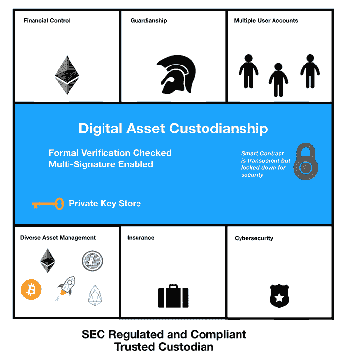
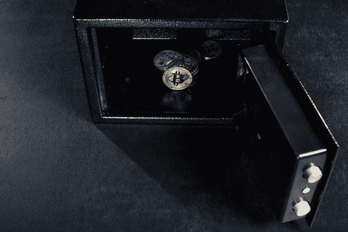
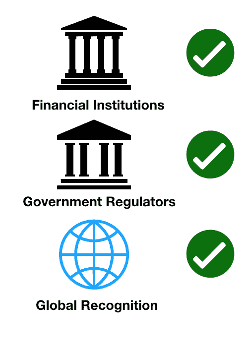

# 数字资产托管解决方案的兴起——数据驱动的投资者

> 原文：<https://medium.datadriveninvestor.com/the-rise-of-digital-asset-custody-solutions-data-driven-investor-e975fbabbb25?source=collection_archive---------3----------------------->


向令牌化经济的转变始于数字资产。[区块链](https://www.datadriveninvestor.com/glossary/blockchain/)提供[分类账](https://www.datadriveninvestor.com/glossary/ledger/)来记录他们的所有权，并用密码保护其不被篡改。目前使用起来很复杂，不容易理解。仍然有很多人不了解[加密货币](https://www.datadriveninvestor.com/glossary/cryptocurrency/)，甚至不知道区块链能做什么。他们刚刚开始意识到他们的好处。要让更多人参与进来，让他们相信一个新的金融体系，需要大量的支持。

根据纽约梅隆银行的研究:

> **“市场对传统、成熟的托管机构提供加密货币安全存储的需求日益增长。”**

许多人可能没有意识到他们已经在使用某种形式的监管解决方案。一个完美的例子是像币安和比特币基地这样的数字交易所。没有从这些交易所转移数字资产的用户将它们委托给保管钱包。用户不拥有他们的私有密钥，并且[交换](https://www.datadriveninvestor.com/glossary/exchange/)提供了一种在区块链上管理这些资产的方法。由于缺乏知识，大多数加密货币领域的新来者在开始时可能会更好。还有一些用户更喜欢传统的第三方帮助他们管理数字资产，就像典型的投资组合一样。

## 数字资产托管人(DAC)

这就是**数字资产托管人** **(DAC)** 介入的原因。他们像传统金融机构一样向需要帮助的客户提供服务。对于首次投资数字资产的人来说，这实际上是一条很好的入门路线。DAC 可以作为负责维护和管理客户数字资产的可信第三方来处理服务。在现实世界中，仍然有许多人喜欢这种类型的关系，而不是完全独立的非第三方解决方案。



数字资产托管人的目标是在区块链提供金融服务，使用一个可信的系统[智能合约](https://www.datadriveninvestor.com/glossary/smart-contracts/)，为养老基金和代币等数字资产提供服务。这为客户提供了第三方提供商来保护他们的数字资产。这些形式的托管解决方案是许多人对金融服务已经习以为常的规范。在加密货币领域，这并不完全是[去中心化](https://www.datadriveninvestor.com/glossary/decentralization/)的模式，而是将责任推给了其他人。如果这能带来内心的平静，那么这将是一个很好的使用案例。

DAC 可以实现所谓的智能合同，提供存储在[以太坊](https://www.datadriveninvestor.com/glossary/ethereum/)网络或另一个区块链平台上的数字资产的监管权。DAC 使用 [API](https://www.datadriveninvestor.com/glossary/application-programming-interface/) ( [应用程序编程接口](https://www.datadriveninvestor.com/glossary/application-programming-interface/))，它使用微服务架构方法与链上和链下服务进行交互，具有以下功能:

*   财务控制(多个签署人、审计跟踪等。)
*   受监管的数字资产监护人
*   具有独立权限的多用户帐户
*   支持广泛的数字资产和货币
*   保险(在某些情况下)
*   网络和物理安全

发展援助委员会的责任很重。他们必须像对待自己的数字资产一样对待它。它们也将受到政府的监管，以遵守关于加密货币的法律。

## 传统投资者的人口统计

一些传统投资者不了解加密货币的工作原理。与传统投资不同，在传统投资中，你可以查看指数并收取股息，加密货币以不同的方式工作。入职过程也要困难得多，因为人口统计也往往处于不同的年龄范围。更懂科技的千禧一代，从小就在互联网上长大。他们可以很快学会如何建立一个数字钱包，并在数字交易所进行交易。

据[财富](http://fortune.com/2018/01/24/young-men-buying-bitcoin/)报道，说到像[比特币](https://www.datadriveninvestor.com/glossary/bitcoin/)这样的加密货币:

> **“他们中 71%的人是男性。大多数人(58%)都很年轻，年龄在 18 岁到 34 岁之间。与更广泛的美国人口不同，他们中有近一半是少数民族。”**

而 50 岁及以上年龄段的人是加密货币的潜在投资者，他们还没有进入加密货币。对一些人来说，这是一个更陡峭的学习曲线，而对另一些人来说，这要么是因为他们不经常使用计算机，要么是因为他们还没有听说过比特币或以太坊这样的加密货币。

当金融机构准备好提供这些服务时，入职就变得更容易了。富达投资(Fidelity Investments)等公司正在提供托管服务，其他公司也在效仿。银行也是 DAC 的理想选择，因为他们已经有客户愿意使用他们的服务。在这种情况下，DAC 将教会传统投资者如何使用政府监管和批准的不同类型的金融工具将资金投入加密货币。这样，投资者就能保证他们所做的是完全合法的。这给了通常交易股票的投资者更多信心，以进入加密货币等波动性更大的市场。



尽管存在波动性，DAC 最有可能为其客户提供锁定数字资产的智能合同。在这种情况下，DAC 将处理交易的所有方面，就像股票经纪人的工作方式一样。当价格值较高时，他们可以抛售一些加密货币，然后以较低的价格回购。最有可能的是，在波动性很大的时候，这些数字资产将被清算成一枚稳定的[硬币](https://www.datadriveninvestor.com/glossary/coin/)，以最大限度地减少损失。其他客户可能只是 HODL(珍惜生命)，尤其是如果他们将它视为长期投资和价值储存。

## 反对 DAC

当然，让第三方处理数字资产也有不利之处。加密货币被做成 [P2P](https://www.datadriveninvestor.com/glossary/peer-to-peer/) ( [点对点](https://www.datadriveninvestor.com/glossary/peer-to-peer/))，在交易过程中完全独立于第三方或仲裁。甚至还有 DEX(分散交易所),它在一定程度上是自治的，作为一个平台发挥作用，但在交易过程中从不拥有或持有用户的数字资产。除了你自己，没有人能控制你的钱。然而，仍有一些投资者并不真正关心分散化，而是更关心他们的投资组合管理。他们将数字资产交由 DAC 管理。

就安全性而言，这可能不是最安全的，因为侵入托管人的系统会严重影响客户。投资者可能意识到了风险，但他们更愿意相信专家，而不是自己去尝试。这些投资者中的一些人也没有时间检查市场并积极交易，特别是在只想放松的退休人员和养老金领取者中。

## 潜在市场

1.  **养老金(全球 41.3 万亿美元)** *(* [*来源*](https://www.ft.com/content/7a8822be-05b9-11e8-9650-9c0ad2d7c5b5%C2%A0in%202018)) *)*
2.  **保险(美国 1.2 万亿美元)** *(* [*来源*](https://www.iii.org/publications/insurance-handbook/introduction/insurance-industry-at-a-glance) *)*
3.  **期货合约(12.7 万亿美元——542 万亿美元)** *(* [*来源*](https://www.investopedia.com/ask/answers/052715/how-big-derivatives-market.asp) *)*

加密货币交易和投资领域的金融服务市场看起来非常大。进军养老金、保险和期货等传统市场，在加密货币市场引发了许多兴奋。这些市场将带来急需的流动性，推动价格上涨。下面列出了下列市场的价值金额。

**潜在市场及其价值(美元)** 如果一定比例的人通过 DAC 进入加密货币市场，这可以为市值带来数十亿至数万亿美元。截至 2019 年 5 月，加密货币的总市值从未超过 1 万亿美元，因此流动性将在实现这一目标方面发挥作用。一旦有了流动性，价格就会稳定，波动就会小。DAC 可以通过交易量带来更多的收入。更高的交易量带来了更多的流动性，并对数字资产的价格产生了积极影响。

比方说，25%的全球养老基金(P)进入了加密货币市场。那就是:

```
P = 0.25(41.3 Trillion) = 10.325 Trillion
```

如果总市值(M)为 1920 亿美元，则:

```
Total Market Cap = M + P = 10.517 Trillion
```

这是一笔可观的流动资金。现在，随着越来越多的人上船，这一数字还会进一步增加，并产生网络效应。根据市场的接受程度，如果需求增加，随着更多资金进入市场，总市值也会增加。

## 规章制度

既然传统金融机构正在向数字资产提供工具，监管将发挥重要作用。在美国，客户将被要求将[客户](https://www.datadriveninvestor.com/glossary/client/)的资金交由合格的托管人保管。然而，加密货币是一种新型的资产类别，它确实没有明确定义的规则或清晰度。该法规为向这些托管人投资的客户提供保护，防止数字资产被欺诈和盗用。这是传统投资者需要的法律类型，因为他们知道，在这种情况下，他们的托管人将承担责任。



DAC 能够建立声誉的三个因素是:作为一家金融机构，受政府监管，并获得全球认可。

无论是试水还是成为常态，传统的加密货币投资方法都有助于带来流动性。别介意这些投资者并不控制他们自己的数字资产。他们需要一个 DAC 来帮助他们，这是一些人(如果不是很多人)进入市场的方式。随着监管的更加清晰，托管解决方案将成为加密货币投资的理想切入点，变得更加主流。

DAC 提供服务的也不仅仅是传统的散户投资者。由于对数字资产交易和所有权的监管变得清晰，这也将是更大的机构投资者进入市场的一条途径。DAC 为这些企业提供了他们所需要的信任，为他们的数字资产提供所需的管理和安全服务。长期以来，缺乏能够帮助加密货币市场投资者的服务一直被认为是一个障碍。曾经的路障现在有了通往区块链的道路，这肯定会为更多的兴趣打开空间。

*原载于 2019 年 5 月 22 日*[*【https://www.datadriveninvestor.com】*](https://www.datadriveninvestor.com/2019/05/22/the-rise-of-digital-asset-custody-solutions/)*。*