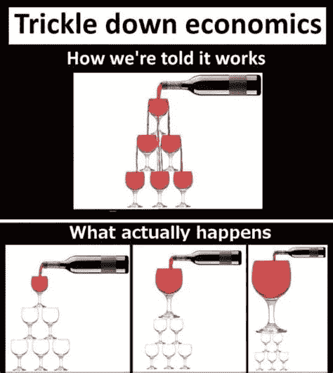
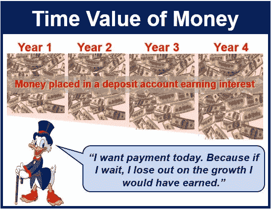
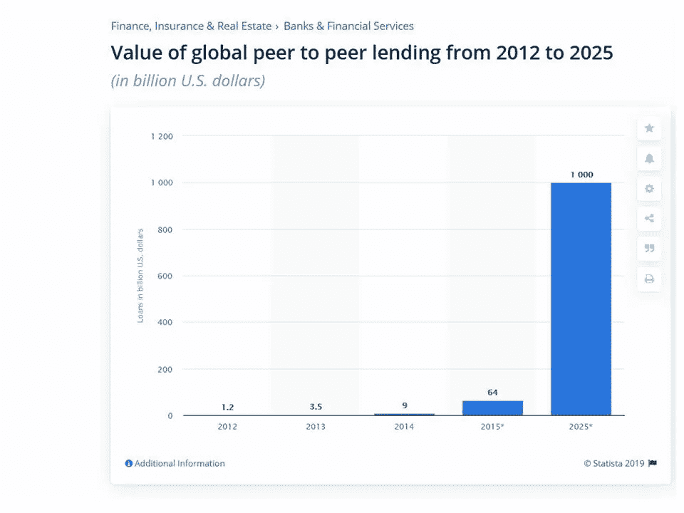
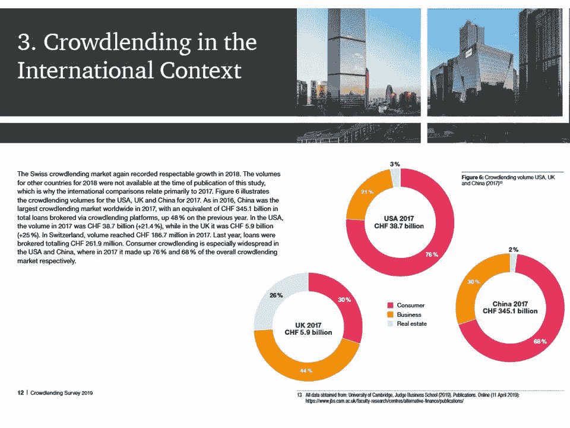
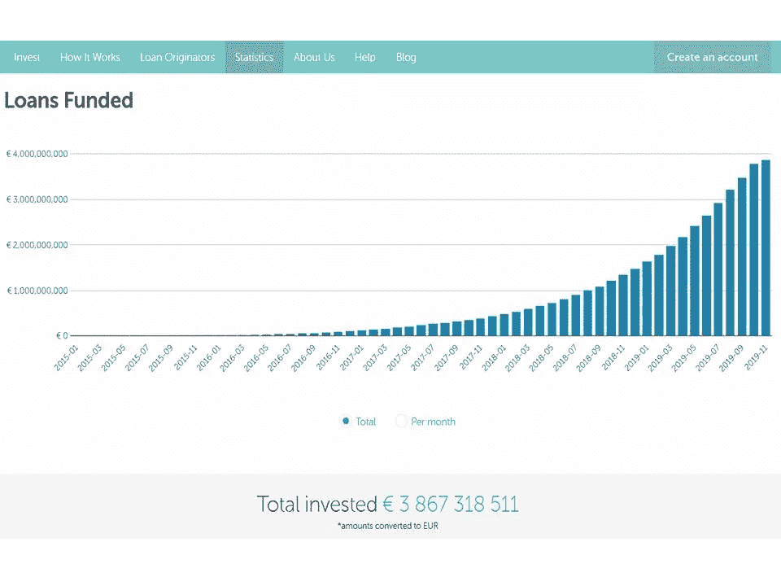
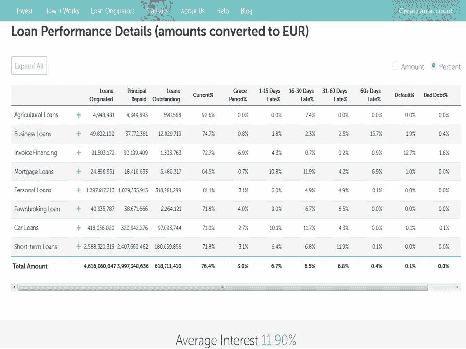

# P2P 大众借贷的兴起，银行的缓慢消亡，以及令牌化会给这个行业带来什么

> 原文：<https://medium.datadriveninvestor.com/the-rise-of-peer-to-peer-crowd-lending-the-slow-death-of-banks-and-what-tokenization-can-bring-to-54ba85b1ce60?source=collection_archive---------7----------------------->

peer to peer lending and tokenization

雷伊·达里奥在他最近的帖子中总结得很好——“世界已经疯了，系统被打破了”——[采访美国消费者新闻与商业频道](https://www.marketwatch.com/story/founder-of-worlds-biggest-hedge-fund-warns-of-big-squeeze-with-investors-buying-dreams-rather-than-earnings-2019-11-05?mod=MW_section_top_stories)。

很明显，机会主义的原因、贪婪、对权力的追求和任人唯亲结合在一起，解释了为什么在过去几十年里，自由主义游说团体和特殊利益集团与政客同床共枕，向大众兜售*废话*[*涓涓细流*](https://en.wikipedia.org/wiki/Trickle-down_economics) *】向下*的经济学——尽管它有着历史上的失败和证据确凿的批评。

这不仅导致了当今严重的经济和金融失衡、资产价格扭曲和收入不平等的急剧加剧，这是自 20 世纪 20 年代以来从未出现过的，而且更危险的是，还导致了社会崩溃，戴利奥将其描述为从字面上看，正在滑向社会/民间“类似战争的环境”。世界各地内乱的例子不胜枚举，从法国的 [*黄背心*](https://en.wikipedia.org/wiki/Yellow_vests_movement) ，到智利和黎巴嫩人民，仅举最近的例子。最近在黎巴嫩发生的银行挤兑事件是过去十年中在冰岛、希腊和塞浦路斯发生的欧盟银行危机的似曾相识。

但是已经有很多关于这个话题的文章了。我更希望关注的是，市场经济如何自下而上(而非反过来)找到新的解决方案，并为投资者创造新的机会，为商品和服务的生产提供融资，而不会出现负利率的经济异常现象，也不会受到传统银行体系的影响。

 [## 分散金融的出现|数据驱动的投资者

### 当前的全球金融体系为拥有资源、知识和财富的人创造了巨大的财富

www.datadriveninvestor.com](https://www.datadriveninvestor.com/2019/03/14/the-emergence-of-decentralized-finance/) 

# 金钱的时间价值与 p2p 借贷的兴起

资本主义市场的基本原则之一是资本必须得到回报。必须有储蓄和将储蓄投资于经济的动机。这是通过基于市场的利率来实现的，利率是付给借钱的人的。零/负利率的怪异之处——顺便说一下，这不是市场动态的结果，而是央行的任意和欺诈性操纵——撕裂了“ [*货币具有时间价值*](https://en.wikipedia.org/wiki/Time_value_of_money) ”的基本原则(即今天的一单位货币比明天的一单位货币更有价值)。

但人们可能忽略的是，尽管此类金融愚蠢行为有增无减，但实体经济仍在健康的资本主义体系的常规动力下运转——在这个体系中，正利率由市场参与者决定，以便向生产性企业放贷。

到目前为止，信用状况不够好的企业家、初创企业、中小企业或不够富裕、无法提供抵押担保的人，很难向银行为他们的业务或消费融资，尽管金融系统一直充斥着全球央行注入的流动性。

因此，当银行停止做它们应该做的事情(放贷)，人们没有得到足够的利息回报来将他们的存款留在银行时，他们就把钱从银行取出来，开始贷给其他人和企业，而这些人和企业无法通过传统的银行系统获得融资。你可以称之为*另类非银行贷款*或*点对点贷款*或*众筹*，随你便。

如今，金融科技正在推动一种全新的 P2P 贷款平台的发展，在这种平台上，贷款人和企业会面并确定基于市场的利率，以奖励资本部署。

一些数字和数据会让你更好地了解被许多人忽视的正在发生的事情。

 [## 5 行业转型区块链应用|数据驱动投资者

### 除非你一直生活在岩石下，否则我相信你现在已经听说过区块链了。而区块链…

www.datadriveninvestor.com](https://www.datadriveninvestor.com/2019/02/13/5-real-world-blockchain-applications/) 

# 万亿美元的市场

股权众筹市场比点对点贷款市场(crowdlending)更为人所知，它也有着悠久的历史。根据 Statista.com 的这项研究，这个全球市场价值约为。2019 年 70 亿美元。不到*称帝*。据 fundly.com[称，股权众筹行业预计到 2025 年](https://blog.fundly.com/crowdfunding-statistics/)将增长至 3000 亿美元。不过，没什么可过分兴奋的。

现在让我们看看 P2P 贷款部门正在做什么。

[据《Statista.com》](https://www.statista.com/statistics/325902/global-p2p-lending/)称，2014 年该行业成立之初价值 90 亿美元，第二年就已经价值 640 亿美元，预计到 2025 年该行业将增长到 1 万亿美元。现在，那不是*花生*。

Source: Statista.com

[普华永道 2019 年的研究](https://blog.hslu.ch/retailbanking/files/2019/05/Crowdlending-Survey-2019_EN_web-1.pdf)估计美国 P2P 贷款行业的当前价值为 387 亿瑞士法郎，而中国市场的价值是 3450 亿瑞士法郎的十倍。

**众筹市场使股权众筹相形见绌，其增长很可能超过预测的 1 万亿美元大关。**

Source: PWC.ch

更多信息请见本期 Business Insider 报道“[2019 年非银行和替代贷款行业概览](https://www.businessinsider.com/alternative-lending-nonbank-industry?r=US&IR=T)”。

# 爆炸性增长

下面的图表比文字更有价值。 [Mintos](https://www.mintos.com/en/statistics/) 是一家拉脱维亚金融科技公司，成立于 2015 年，旨在成为“*个人对个人贷款*的全球市场”。通过他们的平台，小投资者可以向实体经济的几乎任何部门放贷。你能想到的，农业、林业、汽车贷款、消费贷款、发票融资、房地产抵押贷款等等。

Source: Mintos.com

根据他们的数据，截至 2018 年 8 月，小投资者通过他们的平台贷款近 10 亿€。然后，在接下来的 15 个月里，由于新一轮的零/负利率浪潮，投资增加了两倍多，达到 38 亿€。而且这不是唯一的一个。仅举几个例子，像 [crowdestor](https://crowdestor.com/investments/) 或[abb rate](https://www.ablrate.com/)或[investy](https://www.investly.co/)这样的公司，它们都有自己的市场焦点，并且都声称有两位数或三位数的增长。

更重要的是，查看公布的贷款业绩，我惊讶地发现**披露的违约风险平均相当低，在交易额的 0.5%到 1.3%之间，而贷款业绩相当高，贷款人的平均利率回报约为。11.9% * ***。

Source: Mintos.com

这是人们对银行家欺诈性操纵利率的回应，就像比特币是对法定货币持续贬值的回应一样。

虽然银行正在缓慢但不可阻挡地被剥夺其作为贷款人的传统社会角色，但人们正在将自己的储蓄控制权夺回来。在我们知道之前**这些平台将接受加密货币，因为它已经发生了。他们将通过与传统银行系统平行的渠道运营，因此通过使用稳定货币和加密货币而不是法定货币来减少交易成本和资金转移时间**。总部位于英国的金融科技银行 Revolut 现在开设了传统法定账户旁边的加密账户，也接受加密资金。

# p2p 贷款组合的令牌化

下一步将是将整个贷款组合令牌化，这样一个全球性的、无摩擦的二级贷款市场将会诞生。

**此类贷款组合的令牌化将带来许多重要优势**:

(I)通过智能合同在令牌内贷款条款的**可编程性；**

(ii) **半自动和即时结算和执行贷款条款**，例如利息支付和本金偿还，以及扣除平台费用(一些功能不能完全自动化，因为借款人必须总是发起支付)；

(iii)**令牌**和基础贷款权利在二级市场的无摩擦转让；

(iv)在多个二级市场交易代币的可能性**，前提是代币标准与这些市场兼容。这也将提高流动性，目前流动性仅限于单一平台的出价和报价，完全缺乏互操作性。这也解决了当前的问题，即如果平台资不抵债，整个二级市场(直接依赖于平台)将停止运作。即使从法律上讲，贷款人对基础贷款的权利不会受到平台破产的影响，如果平台没有履行其关键的中介角色，对贷款人来说，总是会有不可避免的中断；**

(v)您个人钱包中代币私钥的**自行保管**，从而降低交易对手风险，该风险将被限制在借款人的固有违约风险内。目前，一些平台明确声称，客户账户是分开的，在平台破产的情况下，这些资金不能被接管人扣押；

(六)减少目前所需的文书工作**，并减少平台履行的中介职能。尽管一些无法自动化的关键功能仍将由平台执行，例如:**

-收回抵押资产或强制执行贷款担保(个人或银行)或抵押

-向借款人追讨逾期付款/违约

-在违约情况下启动债务回收程序。

# 结论

据我所知，还没有人将 P2P 贷款组合符号化，我问过 Giuseppe Morlino——符号化初创公司 [Stonize](https://stonize.com/) 的创始人——为什么会这样:“*金融部门在数字化方面已经落后了，这可能是因为它的特点是高度集中化，至少到目前为止是如此。* ***记号化之所以是金融领域的游戏改变者，是因为它民主化了获得流动性和投资机会的途径*** *。换句话说，金融去中心化的真正价值是民主化:DeFi(去中心化金融)意味着 DeFi(民主化金融)。而点对点借贷只是最好的可能使用案例之一。我们正在仔细研究这一领域，并且已经在与贷款发放者进行讨论。我们的 Stonize T3 协议(可信令牌传输)提供了一个无缝的合规性解决方案，在发行和二级交易中强制执行管理数字安全的规则，它是不可知的。目前，它与以太坊、恒星和阿尔格兰德生态系统兼容，并准备利用更先进的去中心化无许可区块链，因为它们将出现。这是我们为 DeFi 的崛起做出贡献的方法，未来的民主化金融，特别是点对点贷款*。

**我们所知的商业银行模式正在我们眼前消亡，而银行家们却没有看到这一点**。如果只有 7.6%的银行业首席信息官同意 Morlino 的上述观点，即认为区块链对银行业具有破坏性，这意味着我们可以合理地预期，今天的传统银行很少会在这场革命中幸存下来。**未来 5 到 10 年将是全球银行业的一个** [***重磅炸弹时刻***](https://en.wikipedia.org/wiki/Blockbuster_LLC)**。**

***********************************************************************

**如果你喜欢这篇文章，请在左下角“鼓掌”x 次，这样它会被更多的人分享。非常感谢**

****请仔细阅读下面的免责声明。在把你的钱投资到上述任何一个平台之前，做好你自己的尽职调查。重要的是，如果你决定贷款，将你的投资分散到尽可能多的贷款中，以减少任何可能违约的不利影响。仔细阅读贷款的条款和条件，并仔细考虑交易对手风险、违约风险和投资支持者代表的任何其他风险。**

**#区块链# bianconiandrea # crypto # think block tank #比特币#金融科技# peertopeerlending #众筹#众筹**

***********************************************************************

****法律免责声明**:本网站及其中包含的信息仅供一般指导，并不构成法律意见。因此，它不应被用来替代就具体问题与律师的磋商。本文中的所有信息均按“原样”提供，不保证完整性、准确性、及时性或任何形式的明示或暗示的担保。**

****投资免责声明**:本网站及其中包含的信息并非旨在成为与所提交材料相关的建议或信用分析的来源，本网站中包含的信息和/或文件不构成投资建议。**

**www.bianconiandrea.com—2019**

***原载于 2019 年 11 月 13 日*[*https://medium.com*](https://medium.com/@andreabianconi/the-rise-of-peer-to-peer-crowd-lending-the-slow-death-of-banks-and-what-tokenization-can-bring-to-1f53308a4a8f)*。***