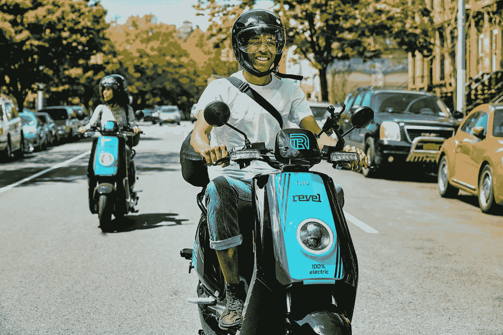

# 纽约市狂欢和微观流动性的兴起

> 原文：<https://medium.datadriveninvestor.com/the-rise-of-revel-and-micro-mobility-in-new-york-city-433fb54f7595?source=collection_archive---------1----------------------->

## 这些电动助力车因其在纽约市或华盛顿特区为任何有驾照的成年人提供的乐趣、便利和可能存在的危险而受到激烈的批评和赞扬。在本文中，我将概述一种新型车辆共享街道的利弊，并研究 Revel 踏板车对行人安全和出租市场的影响。

(Source: Revel Transit)

微观交通被视为填补城市现有交通基础设施缺口的重要途径。风靡纽约的微型交通工具的最热门趋势之一是电动自行车和踏板车，如 Revel 踏板车。Revel 最初是为了帮助市民应对 L 火车隧道(或“L-pocalyse”)维修造成的压力而开发的，它为用户提供基于应用程序的可租赁轻便摩托车式滑板车。Revel 踏板车与轻便摩托车一样受到监管，与汽车和卡车共享街道，速度可达每小时 30 英里，距离约为 60 英里。

然而，在纽约市，它们目前被限制在布鲁克林区和皇后区，不能在高速公路上行驶。虽然它们的速度有限制，但 Revel 仍然是一种电动车辆，可以比传统的自行车或踏板车快得多。Revel 踏板车的设计缺陷之一是高度敏感的油门，这导致了快速或颠簸的骑行。在观看必需的[“如何狂欢”介绍视频](https://www.youtube.com/watch?v=Iww53Y3bacY)时，他们甚至向用户提供警告，告诉他们“小心，油门很敏感。”一个欢迎视频可能不足以培训没有经验的用户如何操纵一辆 200 磅的轻便摩托车穿过与更大更快的车辆共用的街道。Revel 确实为初学者提供免费课程，但他们的顾客抱怨上课地点和时间不方便，而且等候名单太长。

 [## 在自动驾驶汽车发生事故的情况下，谁应该承担法律责任？数据驱动的投资者

### 我仍然认为自动驾驶汽车是一种奢侈品，而不是必需品…

www.datadriveninvestor.com](https://www.datadriveninvestor.com/2018/11/02/who-is-legally-accountable-in-the-case-of-an-autonomous-vehicle-accident/) 

骑手们将乘坐狂欢的体验比作骑“小型摩托车”，并将其描述为“惊险”和“有趣”。然而，骑小型摩托车的好处也伴随着潜在的危险。虽然目前还没有与 Revel 踏板车相关的事故的具体数据，但从逻辑上讲，由于电动自行车、踏板车或轻便摩托车的速度更快、重量更大，因此骑电动自行车、踏板车或轻便摩托车的人比骑传统自行车的人更容易受伤。类似地，骑摩托车的人发生事故的可能性是开汽车的人的 30 倍(T2)。Revel 的大部分客户对这种类型的车辆几乎没有经验，而且已经有几起事故报道。一名布鲁克林居民正在起诉 Revel 和它的一名骑手，因为他被骑手和滑板车从后面撞了，导致脚踝骨折，需要手术。人身伤害律师丹尼尔·弗兰齐格提起了诉讼，他说他希望看到更多类似的诉讼，针对大量使用强大滑板车的未经训练的骑手。他认为 Revel 的错误在于没有正确筛选他们的客户，也没有要求培训。

> 他说:“你所要做的就是上传你的驾照，这样你就可以在没有任何培训或背景调查的情况下驾驶一辆汽车。”

那么狂欢热潮是如何影响纽约市目前的拼车的呢？Revel 首席执行官 Frank Reig 表示，他认为 Revel 的主要竞争对手不是自行车或踏板车，而是像优步或 Lyft 这样的[租车服务。诚然，Revel 为布鲁克林和皇后区的用户提供了使用出租车或拼车应用程序的替代选择。Revel 一般比较实惠；成本仅为每分钟 0.25 美元，该公司甚至为参与地方、州或联邦援助计划(如公共住房计划、补充安全收入(SSI)等)的个人提供了一个](https://finance.yahoo.com/news/revel-rideshare-moped-scooter-uber-lyft-150517295.html)[狂欢访问计划](https://gorevel.com/revel-access/)。该计划为用户提供 40%的折扣，每分钟 0.15 美元，以及一次性 25 美元的骑行积分。

由于 Revel 的可负担性加上它的时尚性，出租车和拼车司机可能会被诱人的助力车抢走生意。由于该应用程序易于使用，客户可以注册并在大约 15 分钟内完成一次性背景调查。在那之后，你所要做的就是找到现在分散在布鲁克林和皇后区的 1000 辆狂欢踏板车中的一辆，并使用应用程序解锁。另一个附加的便利设施是 Revel 滑板车有足够的座位空间供两个骑手乘坐，甚至在后备箱里有两个头盔。

Revel 对优步、Lyft 和出租车司机的另一个影响是，他们现在在路上面临更多的碰撞威胁。纽约市出租车和豪华轿车委员会(TLC)注册的出租汽车和一辆 Revel 小型摩托车已经发生事故。今年 8 月 8 日，一名狂欢骑手被一辆拼车撞上[，从踏板车上摔下来，在街上滑行，严重受伤。](https://www.businessinsider.sg/revel-e-scooter-injury-accident-ridedsharing-nyc-2019-8/?r=US&IR=T)

First responders at the scene of the August 8th crash (Source: David Slotnik/Business Insider)

这可能是自今年 5 月车队出现在布鲁克林街头以来，狂欢骑手第一次受到重大伤害。虽然这可能是第一次受伤，但肯定不会是最后一次，这次事故引起了许多人对 Revel 滑板车与大型车辆共用道路的安全性的担忧。由于 Revel 仍然是一个非常新的项目，还没有收集到足够的数据来确定它们的安全性或它们如何适应现有的交通基础设施，我们将不得不等待和观望，以更好地衡量该公司和其他形式的微移动对我们城市的影响。