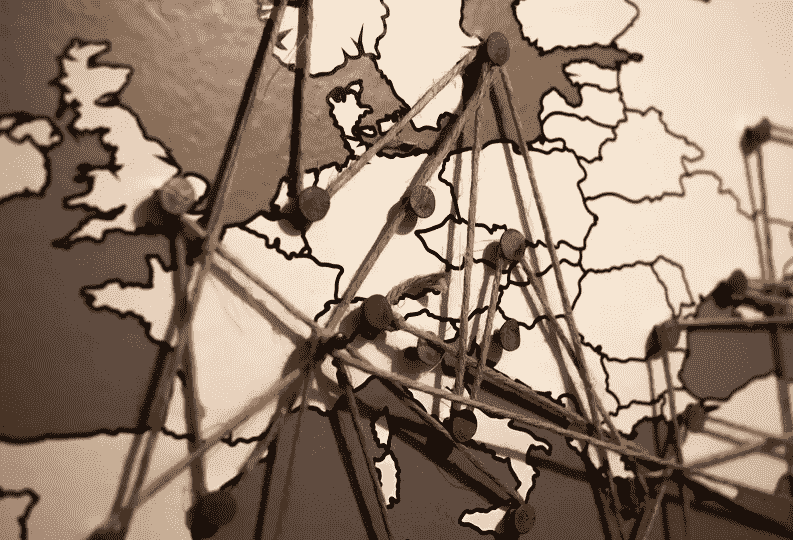

# 分散式网络(d Web)的兴起和你需要知道的。

> 原文：<https://medium.datadriveninvestor.com/the-rise-of-the-decentralized-web-dweb-and-what-you-need-to-know-cab9e61e1b89?source=collection_archive---------6----------------------->

网络(去中心化的网络)正在慢慢进入主流和更广泛的意识。它会起飞吗？DWeb 能成为大多数人都会使用的网络主流版本吗？也许吧，但是做出任何形式的可靠预测还为时过早。现在，虽然这是一个伟大的概念，但它还没有准备好进入黄金时间。

什么是 DWeb？

关键词是去中心化。现在，大多数网络流量都是通过由谷歌、脸书、苹果、AWS 等公司控制的中央服务器。以脸书为例。这是一个有围墙的花园，他们控制谁可以进入，谁可以连接。通过所有这些，他们也可以获得你的数据。你是谁，你做什么，什么时候，用什么设备，一天中的时间等等。他们挖掘所有的数据，并出售或与生态系统中的其他人交易这些数据。消费者得不到补偿，几乎没有控制权。

DWeb 使用分散的方法。它允许用户控制他们的数据，决定谁可以使用它以及如何使用。它以两种方式工作。第一，作为点对点(还记得 [Napster](https://en.wikipedia.org/wiki/Napster_(pay_service)) ？)所以你的电脑接收和发送信息。第二，链接的工作方式不同，它不是指向信息在哪里(脸书拥有的服务器)，而是指向实际的内容。这样，没有一个中央服务器控制一切，内容可以存在于多个地方。

DWeb 能生存并繁荣吗？

本质上，正如我之前发表的，我们消费者/用户是相当懒惰的。要访问谷歌、脸书或 LinkedIn，只需一个书签或输入网址并登录即可。因此，无论是谁为 DWeb 开发应用程序和工具，都需要记住这一点。也许这方面最好的例子是[Graphite Docs](https://www.graphitedocs.com/)…它的工作方式就像谷歌文档一样，但却是真正属于你的。它由你加密和控制。还有其他的，很多是基于区块链技术的。还有一个名为 [OpenBazaar](https://openbazaar.org/) 的应用程序市场，用于买卖物品。

使用 DWeb 可以发生许多有趣的事情。伟大的新工具，更好地保护您的个人数据。你可能会支付更多的东西，但在小额支付中，许多人可能会使用加密货币，以太坊是目前最受欢迎的一种。

然而，为了让 DWeb 真正实现这一目标，创建应用程序的公司和创业公司需要让它们变得简单易用，并考虑不仅仅使用加密货币，因为大众市场不理解它们，而且鉴于黑客、诈骗和勒索软件的故事，他们很大程度上害怕它们。但那是另一个帖子了。

在美国，对 DWeb 的一个潜在威胁是网络中立性和当前 FCC 对它的扼杀。然而，好的一面是，去中心化也提供了一个机会，服务器可以在世界的任何地方。

[现在是早期](https://webconomist.info/2019/01/07/will-the-dweb-take-off-thrive/)。但是会很有趣的。