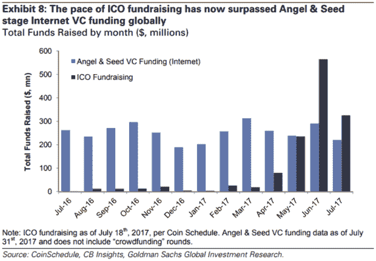

# ICO 的崛起

> 原文：<https://medium.datadriveninvestor.com/the-rise-of-the-ico-4a7f018a7fcf?source=collection_archive---------2----------------------->

到目前为止，你很可能已经听说过“ICO”这个术语。

事实上，除非你一直生活在岩石下，否则你会注意到没有一天不听到它是不可能的。事实上，它通常与所有的[加密术语](https://www.coinpursuit.com/definitions/)混在一起，这很可能会让你晕头转向。

但不用担心，ico 是拼图中相对简单的一块。

**什么是 ICO？**
英文缩写代表*首发币*。这是一个在线筹款活动，由一家羽翼未丰的区块链公司举办，为期几天或几周，为其进一步发展融资。你可能会认为 ico 与股票市场的首次公开募股(IPO)有些相似之处。从很多方面来说，的确如此。例如，在这两种情况下，一家公司正在筹集资金，并为此提供一种“股份”，而投资者拿自己的资本冒险，希望在未来某个时候获利。

但是也有一些关键的区别。或许最重要的是，只有符合严格监管要求的合格投资者才能参与 IPO 鉴于*任何人*都可以投资 ICO。这使得 ico 更像是众筹活动，而不是 IPO。此外，作为投资者，ICO 不会向您提供公司的股票，也不会授予您任何所有权。相反，该公司发行自己的加密货币代币，你购买代币，当项目启动并运行时，代币在项目中具有价值。

**ICO 如何工作**
在 ICO 期间，投资者通常会使用现有的主要代币之一购买该公司的代币，最常见的是*以太*，以太坊的加密货币。事实上，我们最近看到这么多 ico 正在举行的部分原因是因为以太坊让任何人都可以轻松地创建自己的令牌，并在平台上举办自己的令牌销售活动。ERC-20 令牌**的创建提供了一种标准格式，使新项目能够克隆自己的令牌，这些令牌可以在 ICO 期间在以太坊平台上使用。**

然后，该公司的代币通过一个**智能合约**发行给投资者，智能合约由任意代码块组成，这些代码块在以太坊区块链上制定合约安排，并且不需要人类交互——它们表面上是*防篡改*，自动执行和自动实施。此外，通过为开发者保留一部分代币，项目可以从一开始就直接货币化。

如果这项技术最终像该公司声称的那样发挥作用，它可能会获得更多的兴趣。这应该会增加对代币的需求并提高其价值，这有利于那些在 ICO 阶段获得代币的人。事实上，正是这种“提前进入”并希望随后获得丰厚回报的机会，推动了 ICO 行业的大部分增长。例如，那些在 2014 年参与以太坊 ICO 的人无疑很高兴看到他们的代币现在价值约 300 美元。

**解释 ICO 热潮**
说到以太坊 ICO，正是这个事件让全世界的目光转向了这种新的筹款方式。虽然这不是第一次代币销售活动——2013 年的冠军属于 Mastercoin 但在那之前，它很容易筹集到最多的资金。从 7 月底到 9 月初，以太坊 ICO 吸引了 1840 万美元的投资。从那以后，这个记录被多次打破。目前，它的冠军是瑞士区块链公司 Tezos，该公司在 7 月份筹集了令人震惊的 2.32 亿美元，但鉴于我们现在看到的投资者不可抑制的渴望，这个数字不久将再次被超越。

我们现在看到，融资总额和 ico 数量都在大幅增长。为了对这种增长有所了解，高盛(Goldman Sachs)最近的数据显示，6 月和 7 月是加密货币和区块链初创公司通过[ico 筹集的金额超过通过早期风险资本融资筹集的金额的头两个月](https://www.cnbc.com/2017/08/09/initial-coin-offerings-surpass-early-stage-venture-capital-funding.html)！

更重要的是，[附加数据](https://www.coindesk.com/ico-tracker/)显示，2014 年至 2017 年 7 月，区块链初创企业通过 ico 总共融资 16.7 亿美元，其中仅 2017 年一年就融资了惊人的 82%。这相当于高达 600%的年增长率。

但如果你认为 ico 只局限于新公司，那就再想想吧。*现有的*公司现在正在考虑成为分散机构并举办自己的象征性销售活动的可能性，这可能是该领域的一个重大改变。 *Kik* 是这个方向的领路人。社交信使服务[正准备](https://kin.kik.com/papers/Kin_Whitepaper_V1_English.pdf)在今年晚些时候举办其 ICO，作为与脸书和 WhatsApp 竞争的一种方式。如果 ICO 被视为成功，它很可能会激发一波现有公司效仿。这就是我们将看到事情真正起飞的地方。

然而，我们应该注意到，并非所有的 ico 都一帆风顺。也许最臭名昭著的是，虚拟公司 *The DAO* 在去年的 ICO 期间设法筹集了 1.5 亿美元，却眼睁睁地看着大约 5000 万美元被盗，因为黑客设法利用智能合同代码中的漏洞。此次黑客攻击促使美国证券交易委员会(SEC)对“道”的代币销售展开调查，进而引发了对 ICO 领域监管的相关质疑。

尽管如此，人们对 ico 的热情依然没有被打消。通过为资本在初创企业和支持者之间流动提供更直接的途径，这种新的、颠覆性的、非常受欢迎的融资机制正在迅速取代传统的融资方式。因此，这些新的科技公司不仅为世界提供了存储和转移资产的创新方法；他们还建立了一种获得资本的新方式。考虑到 ico 的全球性和非歧视性，似乎越来越多的人正面临着新的和独特的有吸引力的投资机会。

*原载于 2017 年 9 月 17 日*[*www.datadriveninvestor.com*](http://www.datadriveninvestor.com/2017/09/17/the-rise-of-the-ico/)*。*