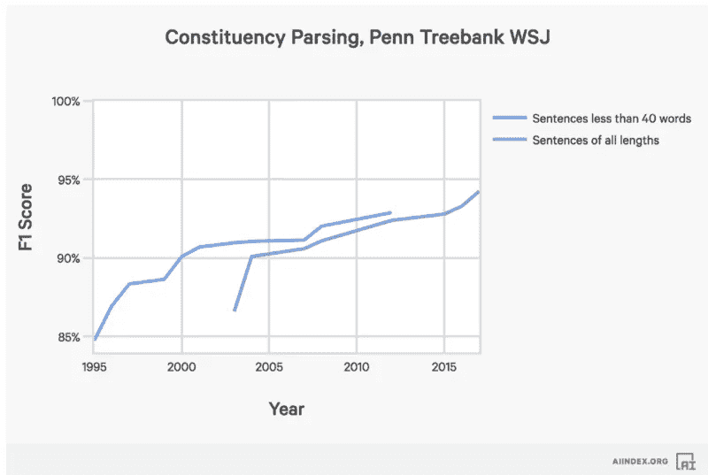
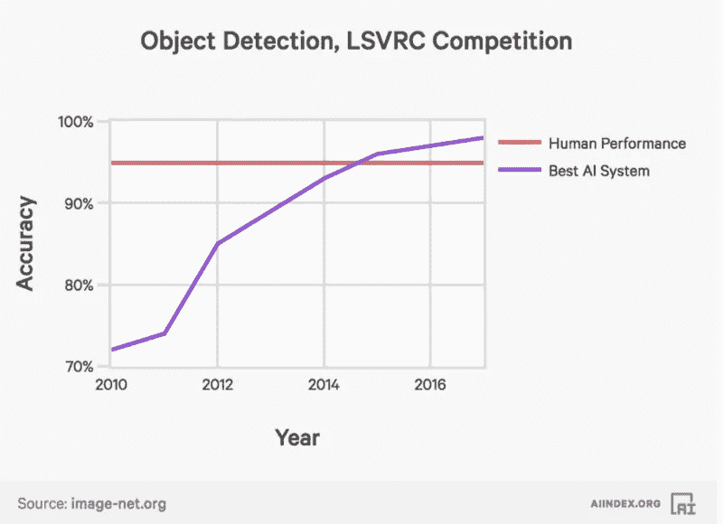
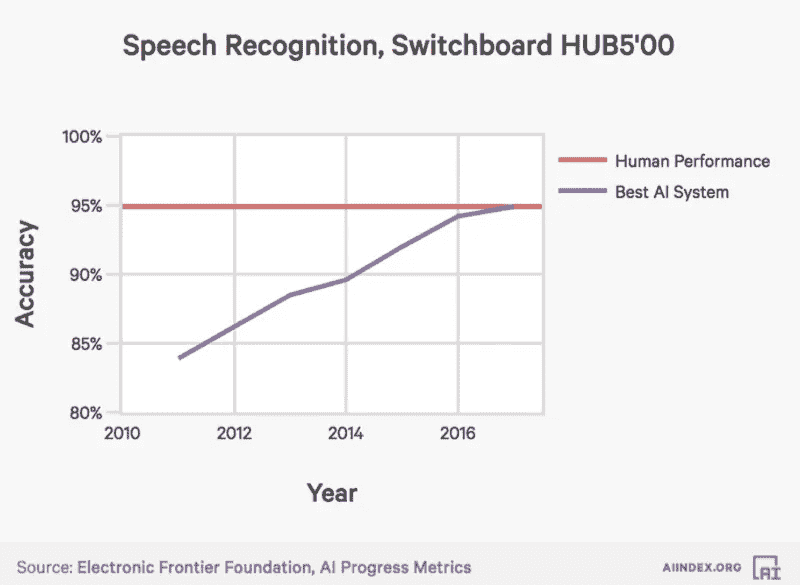
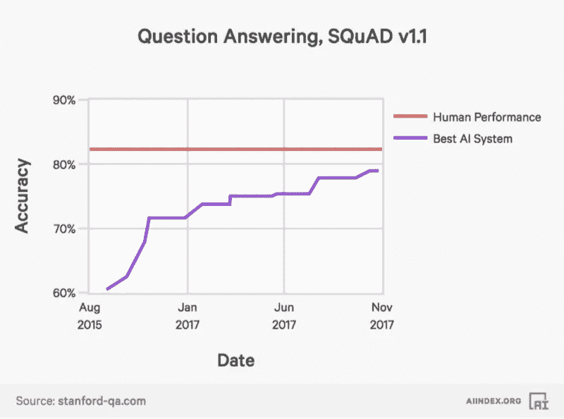
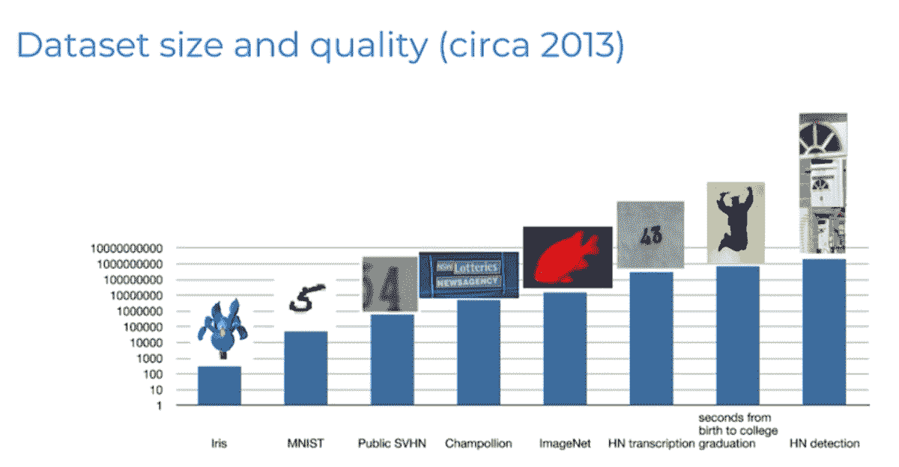
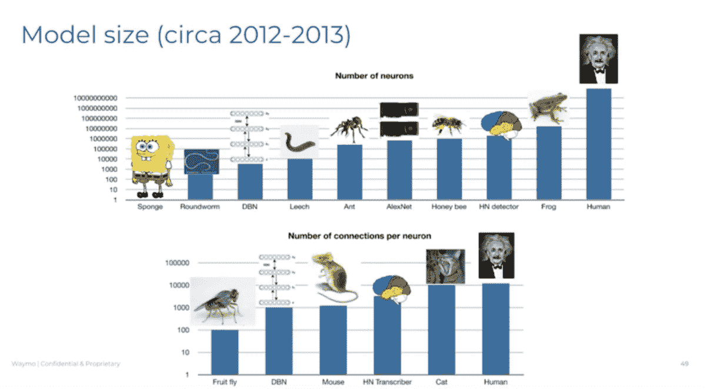
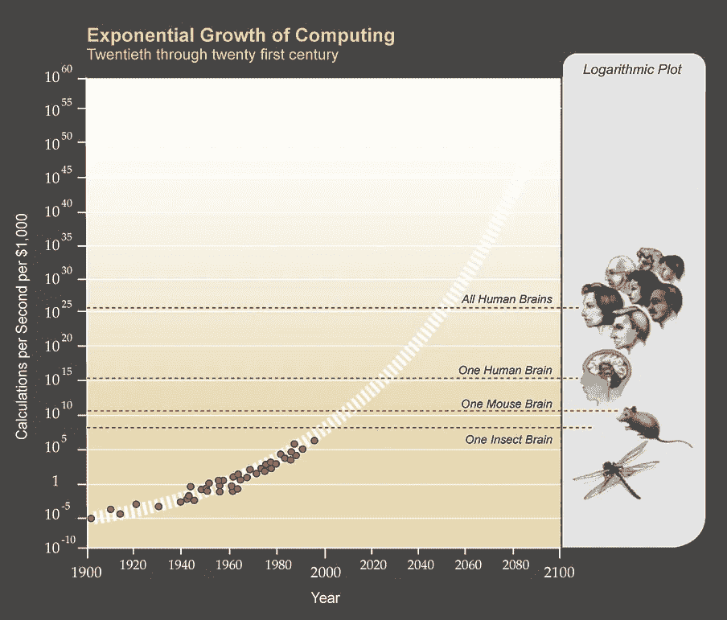
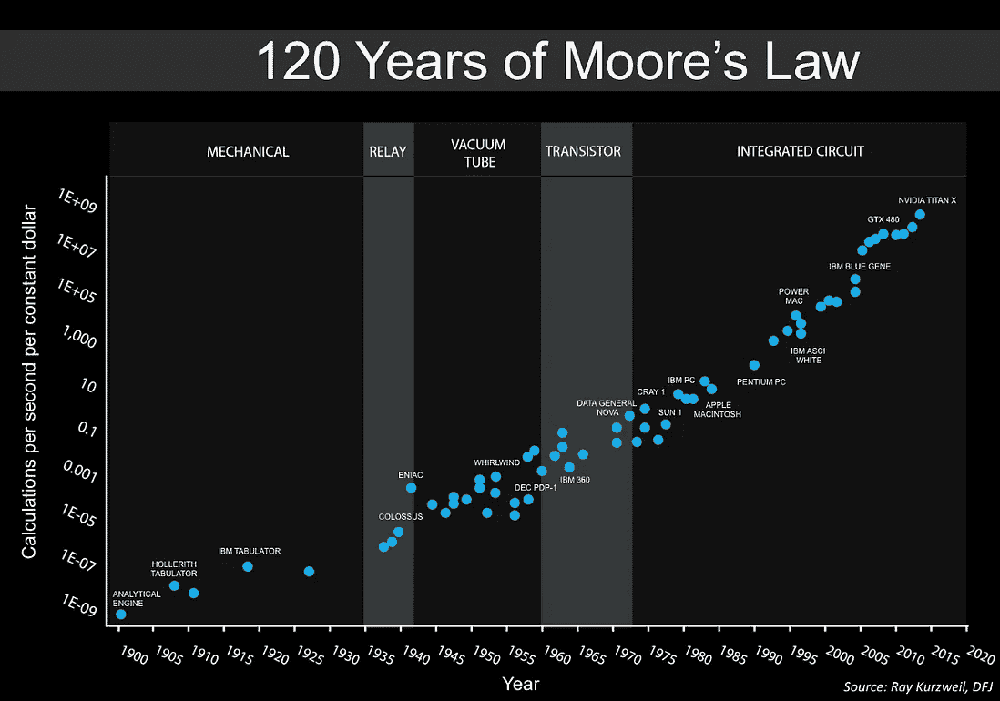

# 人工通用智能之路

> 原文：<https://medium.datadriveninvestor.com/the-road-to-artificial-general-intelligence-cfcb37bdc432?source=collection_archive---------0----------------------->

> 戴尔·史普纳侦探:人类有梦想。连狗都有梦想，但你没有，你只是一台机器。对生活的模仿。机器人会写交响乐吗？机器人能把……画布变成美丽的杰作吗？
> 
> 桑尼:你能吗？"
> 
> —摘自《我，机器人》的一段话

这最后一章讲述了人工智能系统可能如何演变成人工智能，使用过去作为未来的指标。它解释了*知道*和*知道如何*之间的区别。鉴于大脑是这些系统如何进化的一个很好的指示器，我们知道对于动物王国来说，智力与大脑皮层和大脑皮层神经元的数量有很高的相关性。

深度学习也是如此。神经元的数量越多，多层神经网络的性能越好。虽然人类大脑的神经元数量存在几个数量级，但我们正在向它迈进。在这一点上，我们将遇到奇点，一个人工智能可能难以控制的时代。

# 过去是未来的指示器

亚瑟·C·克拉克有一句有趣的话，他说，“任何先进的技术都和魔法没什么区别。”如果你回到 19 世纪，想象汽车在高速公路上以每小时 100 英里的速度行驶，或者用手持设备与地球另一端的人联系是不可想象的。

自从人工智能领域和达特茅斯会议创立以来，已经取得了长足的进步。许多人对计算机的最初梦想，即比人类更好地完成任何智力任务，比以前更加接近了。一些人认为这可能永远不会发生，或者仍然在非常遥远的未来。

然而，过去可能是未来的一个很好的预示。软件在玩跳棋、国际象棋、危险游戏方面比最好的人类都强！、雅达利、围棋、Dota 2。它已经能比普通人更好地翻译一些语言的文本。如今，这些系统改善了数百万人在交通、电子商务、音乐、媒体等领域的生活。自适应系统帮助人们在高速公路和街道上驾驶，防止事故发生。

起初，可能很难想象计算机系统执行曾经是脑力劳动的任务，如工程系统或撰写法律摘要。但在同一时间，也很难想象系统战胜最好的人类下棋。人们声称机器人没有想象力，或者永远不会完成只有人类才能完成的任务。其他人说计算机不能解释为什么事情会发生，而且永远也不能解释。

## 知道和知道如何做

问题在于，在许多任务中，人类无法解释事情发生的原因或方式，尽管他们可能知道如何去做。一个孩子知道自行车有两个轮子，轮胎有气，你蹬着踏板转圈往前骑。但是这些信息和知道如何骑自行车是不同的。第一种知识通常被称为“知道”，而骑自行车的技能是“知道如何”

这两种知识是相互独立的，但它们可能会相互帮助。知道你需要向前推动踏板可以帮助一个人骑自行车。但是“知道如何做”不能简化为“知道如何做”知道如何骑自行车并不意味着你了解它的工作原理。同样，计算机和人类执行不同的任务，要求他们知道如何做，但不“知道”。许多规则适用于英语中某些单词的发音。人们知道如何读这些单词，但他们不能解释为什么。当资源可用时，能够使用汉语词典的人实际上可以理解汉语。计算机也是一样，执行任务，可能无法解释细节。问计算机为什么做它们所做的事情可能和问为什么有人在打棒球时像他们那样挥动球棒是一样的。

很难预测未来一切会如何发展，接下来会发生什么。但是，观察人工智能不同子领域的进展及其随时间的表现，可能是对未来可能发生的事情的最佳预测。鉴于此，让我们看看人工智能不同领域的进展，以及它们是如何叠加的。从自然语言处理和语音识别到计算机视觉，所有系统都在线性改进，没有停止的迹象。

A.I. advances at different benchmarks over time

## 数据

算法只能用正确的数据解决像自动驾驶汽车、赢得围棋比赛和其他任务这样的问题。对于这些算法的存在，有正确标记的数据是必不可少的。在研究界，人们正在努力减少创建适当算法所需的数据集的大小，但即使有了这些工作，仍然需要大型数据集。

Dataset size comparison with the number of seconds that a human lives from birth to college graduation

数据集已经可以与人类一生中捕获的数据相媲美。图 32.2 比较了用于训练计算机的数据集的大小和人类从出生到大学毕业的对数时间。图中的数据集之一是本书前面描述的费的 ImageNet。图片中的最后一个数据集被谷歌用来创建他们的模型，以理解房屋和建筑物立面上的街道号码。

在机器学习中，整个研究领域都在研究如何组合机器学习模型，以及人类如何修复和更改标记数据。但很明显，我们可以捕捉的数据量已经相当于人类一生的工作量。

## 计算

但是机器学习软件并不仅仅依赖于数据。另一个难题是计算。分析今天部署的神经网络的计算能力与人类大脑使用的计算能力的一种方法是查看这些模型中神经网络的大小。图 32.3 用对数标度对它们进行了比较。

Comparison of the model size of a neural network and the number of neurons and connections of animals and humans

该图中显示的神经网络用于通过自动驾驶汽车的模型检测和转录图像。图 32.4 比较了神经元数量和每个神经元连接的规模。两者都是神经网络性能的基本因素。人工神经网络距离人类大脑的大小还有几个数量级，但它们开始对一些哺乳动物具有竞争力。

The world’s $1,000 computers now beat mouse brains, which are about a 1,000th of the human level

随着时间的推移，计算的价格已经下降，而社会增加的计算能力已经增加。花一美元可以获得的计算能力一直呈指数增长。事实上，在第 16 章中，我展示了在最大的人工智能训练中使用的计算量每 3.5 个月翻一倍。一些人认为，由于物理限制，计算能力无法继续这一趋势。然而，过去的趋势并不支持这一理论。该地区的资金和资源也随着时间的推移而增加。越来越多的人在这个领域工作，开发更好的算法和硬件。并且，人脑是一个可以达到的极限，因为它满足物理约束。

# 奇异

随着计算能力的提高和软件的改进，人工智能系统可能会超越人类的智能。这些系统比人类更聪明、更有能力的点叫做奇点。对于每一项任务，这些系统都会比人类做得更好。当计算机超越人类时，一些人认为它们可以变得越来越好。换句话说，如果我们让它们变得和我们一样聪明，没有理由相信它们不能在不断改进的机器的螺旋中变得更好，转向超智能。

有人预测奇点最早将在 2045 年到来。尼克·博斯特罗姆(Nick Bostrom)和文森特·c·穆勒(Vincent C. Müller)进行了一项调查，在一系列会议上询问了数百名人工智能专家，奇点(或人类级别的机器智能)将于哪一年发生，概率分别为 10%、50%和 90%。答复如下:

*   乐观年份中位数(10%的可能性): **2022 年**
*   现实年份中位数(50%可能性): **2040**
*   中位悲观年份(90%可能性): **2075**

所以，这意味着在大约 20 年内，人工智能专家相信机器会像人类一样聪明。

这对社会意味着什么？

如果奇点像许多人预测的那样接近并超过人类智能，即实现人工一般智能，其后果对我们现在知道的社会来说是不可想象的。想象一下狗创造了人类。狗会明白在它们的生活中创造这样的生物的结果吗？我表示怀疑。就像人类创造比我们更聪明的东西一样。

乐观主义者认为，由于奇点的激增，以前认为不可能的问题将很快变得显而易见，这种超级智能将解决许多社会问题，如死亡率。然而，悲观主义者说，一旦我们实现了超智能，那么我们所知道的人类社会将会灭绝。人类没有存在的理由。事实是，很难预测这种技术创造出来后会发生什么，只是许多人同意奇点就在附近。