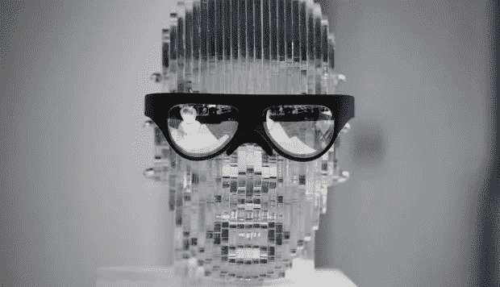
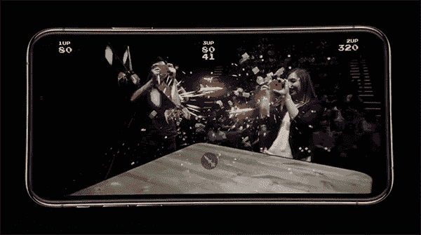
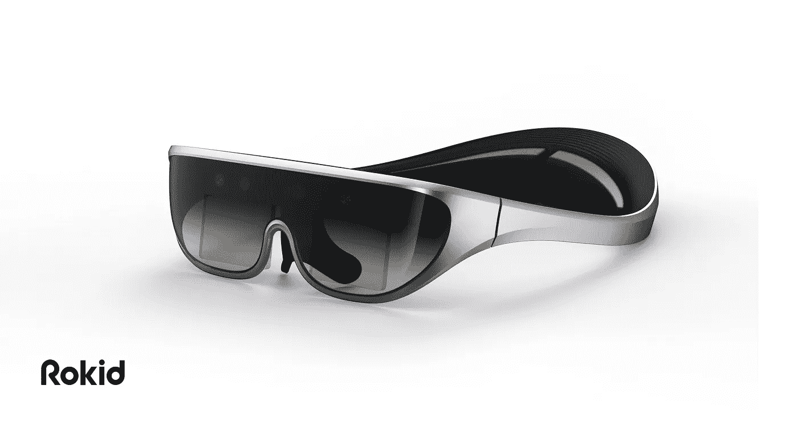

# 消费者 AR 之路

> 原文：<https://medium.datadriveninvestor.com/the-road-to-consumer-ar-62983368602c?source=collection_archive---------20----------------------->

# 回望 CES 2018

2018 年 1 月 7 日，去年的今天，我们在 CES 上展示了我们的第一个 ar 项目，Rokid Glass，这是一款单目 AR 眼镜原型，仅在活动前两周制作。在整个展会期间，我们收到了超过 2000 条来自消费者、媒体、经销商、投资者和其他许多 AR 行业参与者的建设性用户反馈。

许多媒体问我，是什么给了我们勇气在 CES 上展示硬件原型，而大多数公司都是在那里推出他们的消费产品。我告诉他们这是我们在硬件产品开发上的敏捷策略。我们在那里验证我们的产品理念、技术堆栈，以及最重要的业务用例。

Rokid Glass @ CES 2018

# 将客户反馈转化为真正的机会

在展会期间，我们收到了许多入境销售，牵引合作伙伴，以及后来证明是最佳投资的可能机会。我们将市场重心从消费者市场转移到企业和工业市场。我们收集的所有这些可靠的用户反馈有助于我们完善硬件规格、人体工程学和软件堆栈设计。在过去的几个月里，我们与早期的合作伙伴和客户一起为不同的业务用例开发和交付 AI + AR 解决方案。

AR 行业仍处于早期步兵阶段，因为大多数基础技术解决方案和核心组件尚不支持日常智能眼镜。这完全是关于具体的使用案例、产品特性的折衷以及其背后的平衡。许多大众媒体认为空间识别和 3D 重建是 AR 产品的必要功能，然而，“所见即所得”已经并将继续成为 AR 应用的主要用例。我相信通过大量集成人工智能的超级能力，它将在未来三年内演变为“理解你所看到的”场景，更多的企业将受益于它，并获得合理的投资回报。

# 对新项目感到兴奋:灵感和更新

怀着设计一副真正的消费者 AR 眼镜的梦想，我们在旧金山的 Rlab 团队一直在研究多种形式的因素，包括不同的光学解决方案、计算架构、用户界面和软件算法。

其中一个项目的灵感来自 ARkit 的一个推广视频，视频中两个人将手机举在面前，但双手颤抖。所以后来我想，为什么我们不能设计一副 AR 眼镜，可以利用越来越强大的移动设备，提供更好的沉浸式体验，而不是一直用手握着屏幕。接下来是极光计划…

极光项目是一副由现有手机供电的系留式 AR 眼镜，通过 USB-C 电缆与笔记本电脑连接。它使您能够随时随地使用所有现有的应用程序和数字内容。这款眼镜为你提供了一个便携式的 110 英寸大屏幕(4 米)，酷的是你可以在 2D 和 3D 之间切换内容模式:)。我们还为开发人员提供 IMU 和 SLAM SDK，以轻松定制他们的应用程序，获得更好的 AR 体验，想象一下一个游戏使用你的实际头部运动来避免射向你的投射物。

# 通用平台支持

为了帮助一位同事因玩太多任天堂 Switch 而导致的脖子问题，我们决定让 Aurora 支持更多的计算平台，像**任天堂 Switch，Xbox One，以及更多的**。因此，我的团队可以在办公室使用所有游戏和工作设备充分享受游戏之夜。

从我们的极光项目拍摄的堡垒之夜游戏供您娱乐: