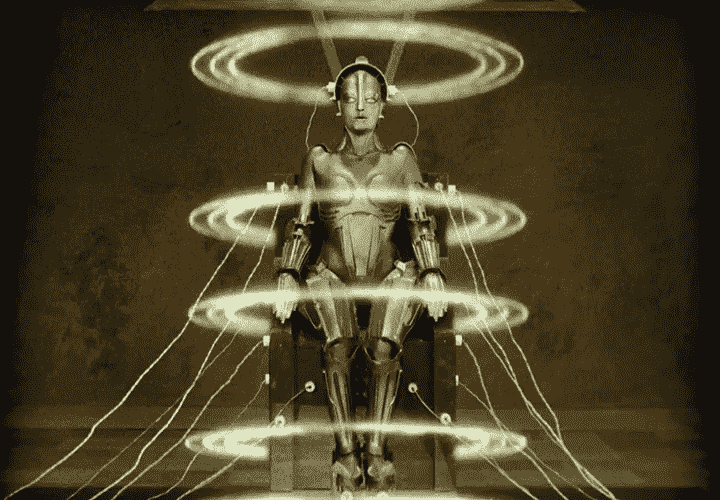
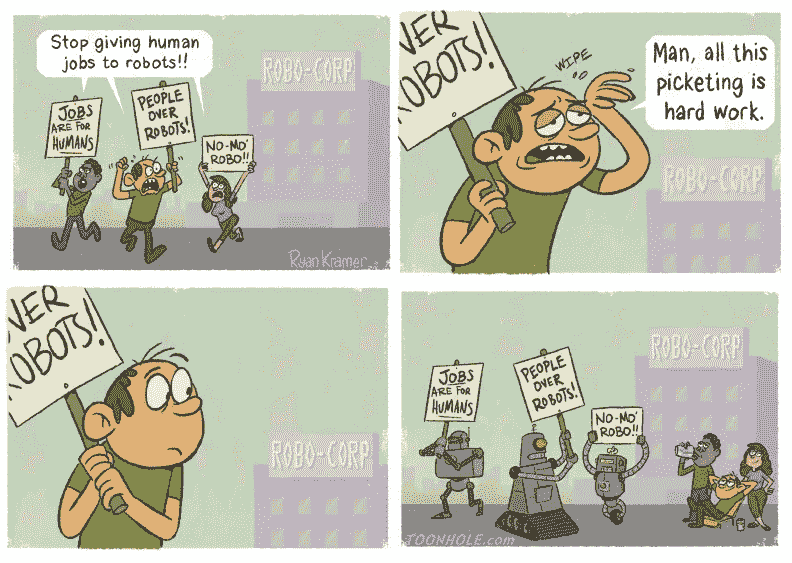

# 机器人接管——不像电影那么简单

> 原文：<https://medium.datadriveninvestor.com/the-robot-takeover-not-as-simple-as-the-movies-1f38cee6ecbc?source=collection_archive---------8----------------------->

听到“机器人”这个词，你首先想到的是什么？

也许是关于著名的人形机器人索菲亚，她出现在由吉米·法伦主演的《今夜秀》中。不过，有可能是关于他们有朝一日将如何接管世界。这就像我们生活在一些难以置信的讽刺*终结者*的笑话即将达到高潮。

“接管”实际进展如何？如果发生了，会是什么样子？或许更重要的是，这对其他人类意味着什么？

Robots dominating the human race… and posting memes on Twitter.

问题是，这个“机器人接管”的想法不是什么革命性的东西。想象一下基于机器人将如何进化并成为日常生活不可或缺的内容而创作的数百万部科幻电影。早在 1927 年，随着德国无声电影《T4 大都会》的上映，这个想法就已经出现了。

而且，通常情况下，它会以整个世界被机器人征服而告终。多有趣啊。

It definitely looks like the kind of thing that’ll enslave us all. *(Metropolis, 1927)*

然而现实是，机器人正在成为我们社会的重要组成部分。公司已经开始在他们的业务中实施机器人。在日本， **Henn-na Hotel** (意思是“怪异的酒店”)的全体员工都是由机器人组成的:接待员、客房服务员等等。

 [## 模式和机器人:复杂的现实|数据驱动的投资者

### 哈耶克的名著《复杂现象理论》(哈耶克，1964)深入探讨了复杂性的话题，并断言…

www.datadriveninvestor.com](https://www.datadriveninvestor.com/2019/03/04/patterns-and-robotics-a-complex-reality/) 

诚然，该酒店最近报告称，今年早些时候已经“解雇”了近一半的机器人员工。他们经常无法回答顾客的问题，被困在走廊里，收到许多居民的投诉。这些“被解雇”的机器人中的大多数已经使用了很多年，正在被磨损，这表明了完全机器人同化中的另一个问题。

An inside look at the Henn-na Hotel in Japan.

但是，谁能说这些实际问题不会得到解决呢？也许有一天，比任何人意识到的都要早得多，人类会开发出完美的机器人，适合融入人类活动。在我们知道之前，这个世界开始变得与科幻电影惊人地相似，而科幻电影本应只是“虚构”的。

# 机器人正在取代我们所有的工作…对吗？

A possibility in the near future?

对机器人接管的最大担忧之一是就业问题。机器人可能会让数百万人瞬间失业。这也不完全是错误的——涉及**可预测或重复性工作**的工作，例如出租车司机、工厂工人，肯定**有自动化的风险**。今天已经有一些机器人*可以很容易地取代它们，而且已经实现了。考虑到这一点，公众并不欢迎这些新助手也就不足为奇了。*

> *根据皮尤研究中心(T2)的数据，大约 48%的美国成年人认为自动化普遍伤害了美国工人(t 4)。更有 76%的成年人认为广泛的自动化将会加大贫富差距。*

*呀。不太乐观吧？但是不仅仅是看上去的那样。*

*随着机器人在劳动力中的引入，这意味着特定岗位对人类工人的需求减少了。然而，反过来也是正确的——机器人无法轻易模仿的技能将比以往任何时候都更需要。*

*这些素质主要围绕人际交往和社交技能展开，被称为**【软技能】**。这包括同理心、同情心、善良等特质。因此，护士、教师和社会工作者等工作可能不会受到自动化的影响。*

*毕竟，让我们回头看看 Henn-na 酒店:被令人兴奋的机器人恐龙包围是很有趣的，但正如一位住客所说，过一会儿，即使这样也变得**“无聊】**。事实是，这些机器人还没有达到不仅理解人类需求，而且以自然的方式与他们交谈所需的情商。这就是实验失败的原因——在看到真实机器人的最初兴奋之后，客户没有再来的必要。*

*当然，随着人工智能的指数级发展，机器人很可能会超越这一障碍。没有人知道人工智能和机器人技术的极限在哪里。*

**

*Photo by [Andy Kelly](https://unsplash.com/@askkell?utm_source=medium&utm_medium=referral) on [Unsplash](https://unsplash.com?utm_source=medium&utm_medium=referral)*

*最终，新技术给无数行业带来了巨大的利润；不可否认。但是我们必须从实践和道德的角度来看待机器人同化的整体，才能对社会的未来有所了解。显然，主要的社会和经济影响使得整个场景比电影向我们展示的要复杂得多。*

# *关键要点*

*■由于媒体和电影业的发展，“机器人接管”的想法自 20 世纪 20 年代以来就一直存在。*

*■如今，机器人正在企业中使用，但完全同化机器人的想法仍面临实际挫折，至少在 Henn-na 酒店是如此。*

*■许多美国人对新技术在工作场所的影响保持警惕。*

*■重复性或可预测的工作面临自动化的最大风险。然而，涉及“软技能”的工作风险最小。*

**感谢阅读！欢迎在 Medium、*[*LinkedIn*](https://www.linkedin.com/in/alexis-wang-a50285180/)*上关注我，或者发邮件给我了解更多。**

*电子邮件:alexiswang55@gmail.com*