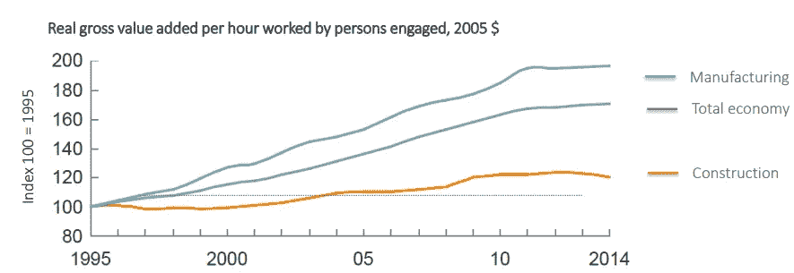
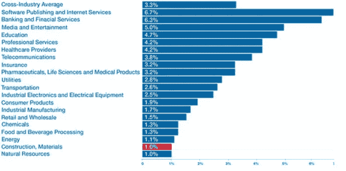
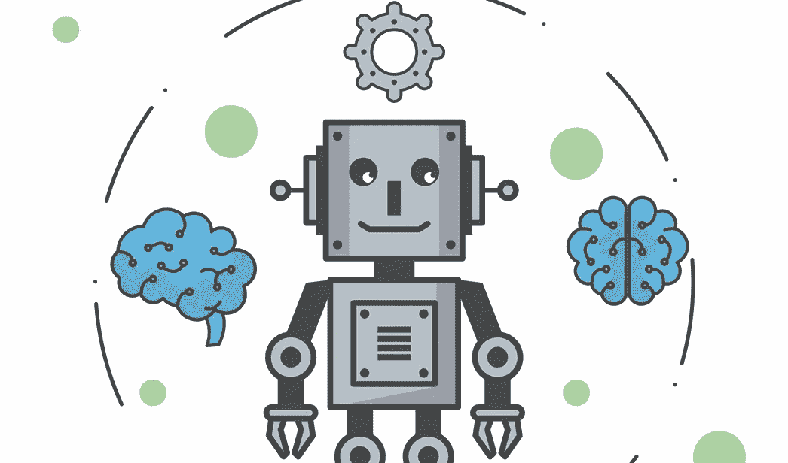
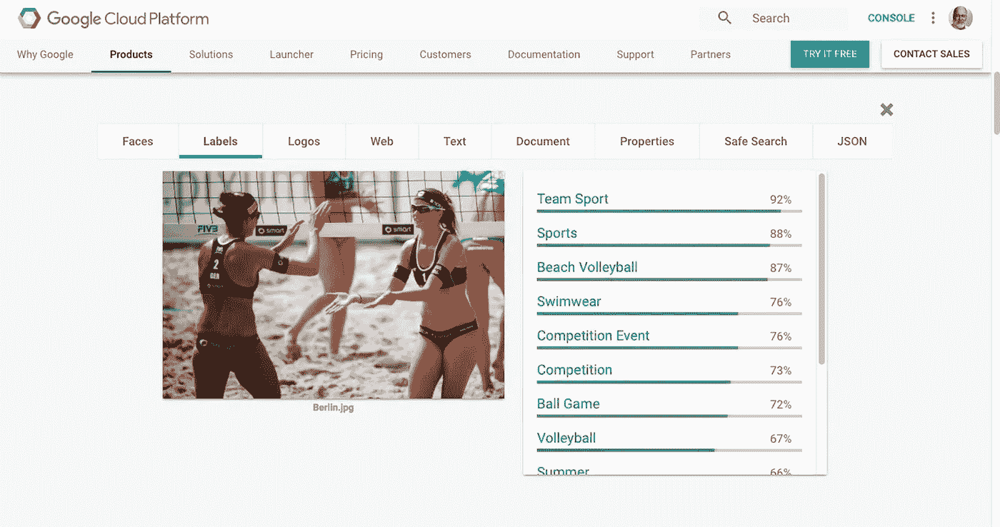
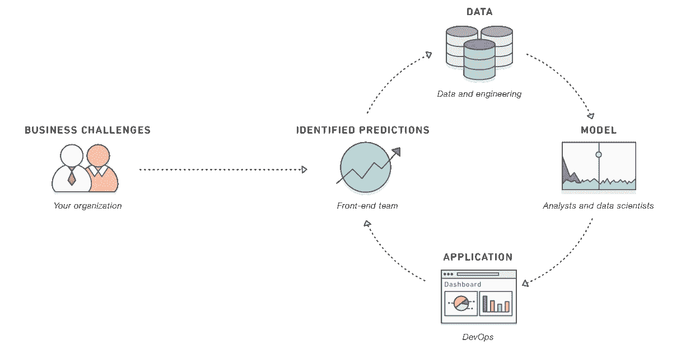

# 人工智能在建筑领域的作用

> 原文：<https://medium.datadriveninvestor.com/the-role-of-ai-in-construction-sector-891cff096fd1?source=collection_archive---------13----------------------->

如果你与建筑行业的专家交谈，他们总是说这个行业很混乱，而这些混乱的状况增加了个人在生产中的作用。你可以在建筑工地上找到很多英雄，他们解决关键问题，并根据他们的经验做出预测。

**技术呢？**

建筑行业有很多技术解决方案。但正确的问题是，为什么该行业的生产率相当低。我们应该找到真正的问题。

The productivity of the sector

是的，劳动力质量、临时条件、多学科协调等方面存在问题，但这些不足以解释上面的图表。

不幸的是，现有的技术解决方案无法在生产上取得预期的效果。像 BIM 和高级规划工具这样的技术对行业有着重要的影响，但在建筑工地上，项目经理更相信自己的经验而不是技术。此外，分包商和主管通常将这些技术视为完成工作的障碍。

如果你在 BIM 方法中不关注“我”(信息)，你就不能对现场产生预期的影响，因为现场的人需要按时到达数据。此外，规划工具用于报告目的，但关键点应该是数据管理，而不是数据报告。

数据应该被用作支持站点团队的工具。如果你不提供这种支持，你需要英雄来维持你的项目。我不反对英雄，但是你不能用一个骑士赢得一场现代战争。

**科技可以帮忙！**

科技可以处理混乱的局面。首先，现在成功是关于数据和对数据的解释。因此，应该主动收集、存储和使用数据。

一个建设项目中的数据源有哪些？设计、BIM、规划工具、规范、技术报告、合同、机器、员工、照片、视频、环境信息(天气、社会、政治问题)。目前，其中 90%的数据都有软拷贝。

问题是这些数据应该是可访问的。这个问题的解决方案是所有的项目数据都应该在一个有版本控制系统的中央云中，以创建一个单一的事实来源。

**数据收集不当**

是的，您正在收集数据，并且有一个中央数据库。这些都很完美，但这并不意味着你的生产力在提高。收集数据的新问题是，没有正确使用它。

如果数据是在问题发生后使用的，这意味着数据只能作为报告的支持性统计数据。有时，一个有经验的工程师在决定现场的行动之前只使用一小部分数据，因为他觉得应该很快，所以他使用自己的经验和一些经验法则。有时这种方法工作得很好，但问题是，如果不记录所有的问题和解决方案，它就不能创建一个顺畅的业务流程。高生产率需要各方面的持续改进。

**从报告到管理**

当然，报告是至关重要的，承包商可以通过定期报告来拿钱。但是，如果您从事建筑项目，您会觉得您只是在创建报告。这种方法将项目的重点从生产计划转变为报告。这种转变导致了意想不到的问题。例如，如果承包商浇注的混凝土质量不好，他们会试图通过制定规范和合同来赚钱。他们没有找到问题的根源，而是责怪员工。虽然我们在主服务器中有混凝土质量的相关数据，但技术团队无法在需要时获取数据。我们应该找到一个解决方案，让他们在需要的时候使用这些数据。否则，互相指责只会产生新的问题。

> 我们应该关注如何更主动地使用数据。

**R & D 是关键……**

建筑公司应该在 R&D 上花钱以创造竞争优势。否则，他们可能会把位置让给新的玩家。

R&D percentage of different sectors

对一家公司来说，使用不同的技术并创造价值并不是一件容易的事情。因此，公司应该创造 R&D 文化，将自己与竞争对手区分开来。

仅仅使用软件包而没有技术策略不会使生产变得更好。或者没有协调和 BIM 计划，BIM 将只是一个花哨的报告工具，在项目结束时，我们无法感受到差异。

**你可以在建筑工地听到这样的声音；**

*   春华没用！
*   BIM 增加了我们的工作量。
*   我不喜欢用这个手机 app！
*   规格在哪里！
*   你看过合同了吗？
*   分包商在哪里？
*   新工程师会犯巨大的错误！
*   我的计划在我脑子里！
*   今晚我们应该完成报告。

技术应该消除网站上的所有声音。否则，混乱和临时的工作条件会给站点团队提供使用这种论点的借口。我们应该注意，站点团队希望让他们的工作做得更好。但首先，技术应该让他们的生活更轻松。

这张图中 AI 在哪里？

AI is coming

我们一般将一个建筑项目定义为混沌，混沌的条件是人工智能实现的最佳场所。因为我们无法成功预测混沌系统。人工智能系统可以使用和评估复杂的数据，并创建无监督的学习系统。

你可以把 AI 想象成一个处理能力更强的人。从这个角度来看，AI 有能力使用 ML 函数进行数据评估和自然语言理解。

**视觉处理**

在一个建筑项目中，一个技术团队每天都要拍摄大量的图片和视频。但是对这些视觉效果的标记和分类是不够的。因此，它们通常用于报告目的。到那个时候，AI 就可以做你的助手了。人工智能系统可以学习建筑工地中的不同物体和位置，并对它们进行评估。AI 可以标记视觉效果，并从安全、活动和资源管理等不同方面做出一些评估。

Image Tagging

人工智能很容易将你的图像转换成有意义和可搜索的数据。并且该可视数据可以用于建筑工地中的实时决策支持。

**自然语言处理技术/数字助理**

现场技术团队将数据输入系统的时间很短。自然语言编程提供了创建平滑数据流的优势。数字助理可以成为建筑工地团队收集数据的实用界面。

**物联网数据流**

正如我们之前提到的，我们需要更多的数据来使用人工智能的力量。因此，我们应该使用传感器从现场收集数据。机器、设备、位置标签可以成为物联网数据流的第一来源。此外，我们可以测量速度、位置、温度和压力，用于 ML 算法。

IoT in construction sector

**人工智能驱动的专家系统**

如果你有来自物联网、员工、BIM、ERP、规划软件的数据流，你就可以开始使用 AI 来管理施工现场。ML 算法试图捕捉不同数据组之间的相关性。利用这种关系，人工智能开始提出建议。这些建议可能是对的，也可能是错的，但是在反馈系统的帮助下，AI 继续学习和调整决策系统。

**人工智能战略**

你应该为你的公司制定一个坚实的人工智能战略。数据驱动的人工智能系统可以解决建筑工地的复杂问题。如果你用人工智能创造了一个竞争优势，它将你的公司与你的竞争对手区分开来。

**我们是谁？**

我是 Botmore 技术的创始人，我们正在研究人工智能技术。我们为建筑部门开发了人工智能驱动的数字助理。请联系我们进行更多讨论。

你可以在我们的网站上看到详细信息。

 [## 伯特莫尔技术公司

### 伯特莫尔技术公司正致力于人工智能驱动的数字建筑技术项目。

www.botmore.co.uk](http://www.botmore.co.uk)