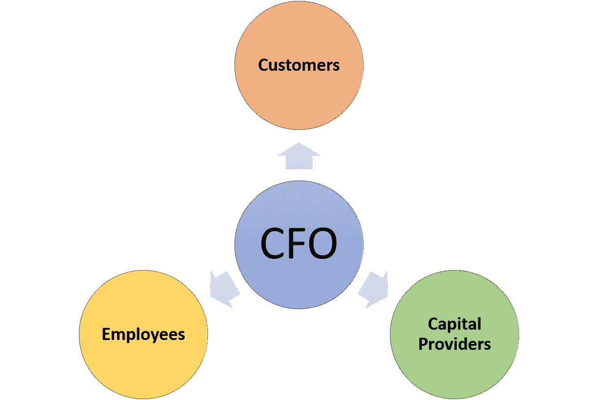

# 首席财务官平衡法

> 原文：<https://medium.datadriveninvestor.com/the-role-of-the-cfo-value-creation-while-balancing-stakeholder-interests-f8b711e90c26?source=collection_archive---------16----------------------->

在工作面试和非正式的网络交谈中，我经常被要求定义首席财务官的角色。

**首席财务官的角色**:我的观点——他/她推动*创造价值*，同时平衡企业中关键*利益相关者的需求*。

**价值创造**:*价值创造*“是个人投资和公司财务界经常重复的一句口头禅。我为经常使用这个表达方式而感到内疚――它出现在我的 LinkedIn 个人资料和简历中。最近，我以前的一个直接下属向我挑战，要我完全定义价值创造。

**平衡利益相关者的需求**:我的回答如下:所有组织中都有三个主要的利益相关者——客户、员工和资本提供者。战略和运营首席财务官/首席运营官的主要任务是维持这三个利益相关者之间的平衡，同时增加组织的总价值。

可持续的、长期的价值创造就是巧妙地平衡这三个群体的需求，而这三个群体的需求往往是不一致的。如果这些利益相关者中的任何一个在一段时间内没有得到他们应得的价值份额(感知的或真实的)，问题就出现了。

通常，当一个利益相关者群体以牺牲另一个群体的利益为代价获得不成比例的利益时，问题就会出现。这似乎正在发生，资本提供商正在补贴使用拼车和送餐服务的消费者。如果不平衡持续很长一段时间，其中一个利益相关者可能会“走开”他们可能会停止向企业提供资本或要求更高的回报率，他们可能不再购买/使用产品或服务，或者他们可能会离开公司或要求更高的薪酬来留下或加入。当这种情况发生时，组织会失败或经历一个痛苦的“再平衡过程”WeWork 目前正在经历这一痛苦的过程，包括大规模裁员、出售业务部门和对业务进行重大重估。过去 20 年来，整个印刷媒体行业都面临着这一挑战。随着利用新技术的新竞争对手的进入，客户对价格和价值的预期发生了巨大变化。几十年来，他们一直在努力适应当地垄断的“印刷”金钱，许多组织倒闭或萎缩到原来的空壳。

平衡这些利益相关者的需求的主要挑战是这三方对价值的定义不同。

**顾客**:在某些情况下，有两种截然不同的顾客——为产品付费的购买者(无论是家庭单位中的父母、企业中的部门主管还是免费终端用户产品中的广告商)和产品的实际终端用户。

当产品/服务的购买者和使用者获得的利益超过他们支付的价格一个合理的数额时，价值就自然产生了。买方获得的价值是新产品/服务的收益减去支付的价格后的差额。营销和销售如果执行得好，可以帮助购买者了解好处，并对每项好处进行具体估价。

当消费者的问题得到比以前更好的解决时(更快和/或更少的错误)，产品/服务的质量高时(满足更多的需求，满足比以前更高水平的需求或满足较少的“返工”)，产品易于使用并融入他们的生活/工作中(与以前的解决方案相比节省时间)，以及与销售者的互动令人愉快时，利益就实现了。支付的价格包括硬成本(实际货币支付)和软成本(学习如何充分使用新服务/产品的时间，工作流程的变化等)。).

定期衡量客户满意度或 NPS(净推广者分数)并努力提高它们的公司将能够随着时间的推移为客户提供价值。

**员工**:员工将价值定义为:(a)他们的总薪酬——基本工资、奖金/佣金和期权奖励价值的总和；(b)他们的福利――医疗保健、401(k)、通勤补贴、健身房福利、办公室食物等。；另外，(c)公司提供的其他软福利。员工价值等式的前两个元素很容易用美元来衡量。因此，公司从市场上收集数据，这样他们就可以在这两个要素上竞争。软收益更难衡量和量化。它们也是经验性的，意味着员工会随着时间的推移获得这种价值。

员工看重和寻求的这些额外的软福利到底是什么？我把它们定义为自主、掌握和目标的结合。

自主性是建立在信任和授权的基础上的，管理者相信员工能把工作做好，并给他们提供挑战，这些挑战可能会超出他们迄今为止所表现出的能力。寻求自主权的经理将允许员工以他们认为合适的方式(主要由员工定义的流程)和在最适合他们的时间(在家、正常工作时间后等)完成分配给他们的任务。)同时仍能满足业务需求。

精通是从学习和发展中获得的成长。经理和公司投资于员工的长期成功——帮助他们更好地胜任当前的角色和未来的角色(即使是员工在离开当前公司后仍将担任的角色)。

目标来自于员工找到他们的价值观和组织使命之间的契合点，以及了解他们的工作如何有助于客户的满意、同事的成功以及增加对所有资本提供者有吸引力的财务回报的可能性。

成功的组织向他们的员工提供这些软福利，并能够利用软福利在竞争激烈的市场中吸引和留住人才。

**资本提供者**:资本提供者包括营利性企业中股权投资者和债务提供者，以及非营利性组织中的捐助者/贷款者。任何企业中的贷方都将价值定义为在协商的时间内用商定的利息收回本金。当他们的捐款被有效地用于他们所选择的事业时，非营利组织的捐赠者就看到了价值。对于营利性企业的股权投资者来说，价值创造意味着对他们的现金分配超过他们的投资加上风险调整后的回报障碍。现金分配可以来自在投资于持续增长后分配自由现金流(股息)和出售(部分或全部)企业股权(在首次公开募股或并购交易中)。

**时间范围**:如何最好地实现这种难以捉摸的平衡？我的经验告诉我以下几点。专注于在短期内(几分钟或几小时，最多几天)让客户和用户满意。当雇佣和入职员工时，要清楚达到他们的目标需要时间(最少几个月，可能几年)。选择资本提供者来资助你的组织，他们愿意成为你多年的合作伙伴。他们应该从比客户或员工更长远的角度来看待价值——至少三年，可能五到七年。

**如何到达那里**:平衡这一切听起来是一项艰巨的任务。的确如此。近几十年来，随着更多颠覆性公司利用快速的技术变革推出，对现有企业提出挑战，这变得越来越难。因此，组织的平均寿命正在缩短。上世纪中叶，上市公司的平均寿命超过 50 年。截至 2015 年，这一数字已缩减至约 15 年。

根据我的经验，没有灵丹妙药。如果让我当场发言，我会鼓励企业领导人把眼光放得更长远，这应该会让他们做出更“保守”的决定——不要那么快地扩张，不要那么快地招聘，也不要那么多资本——从而在如何最好地平衡客户、员工和资本提供者的需求方面减轻一点压力。只要记住有三个利益相关群体。不要让任何一个群体的需求或声音变得比其他两个群体重要得多。