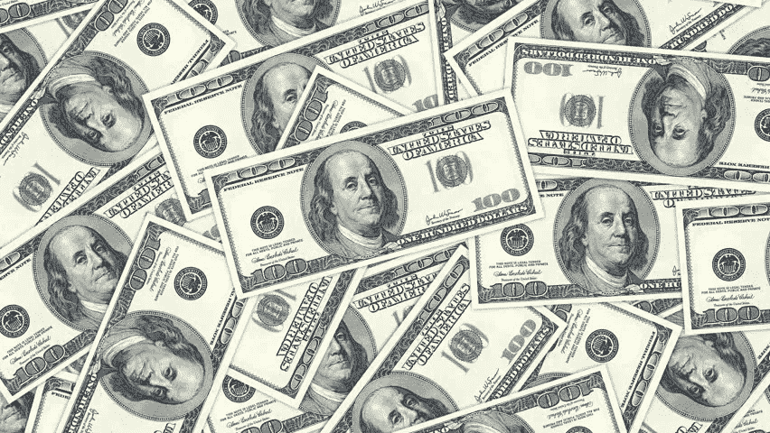
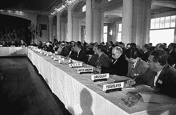
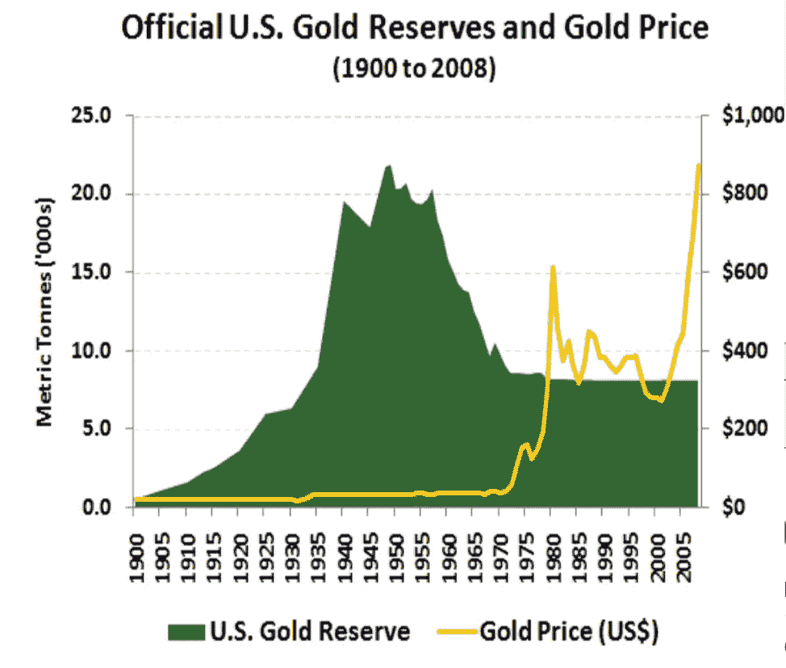
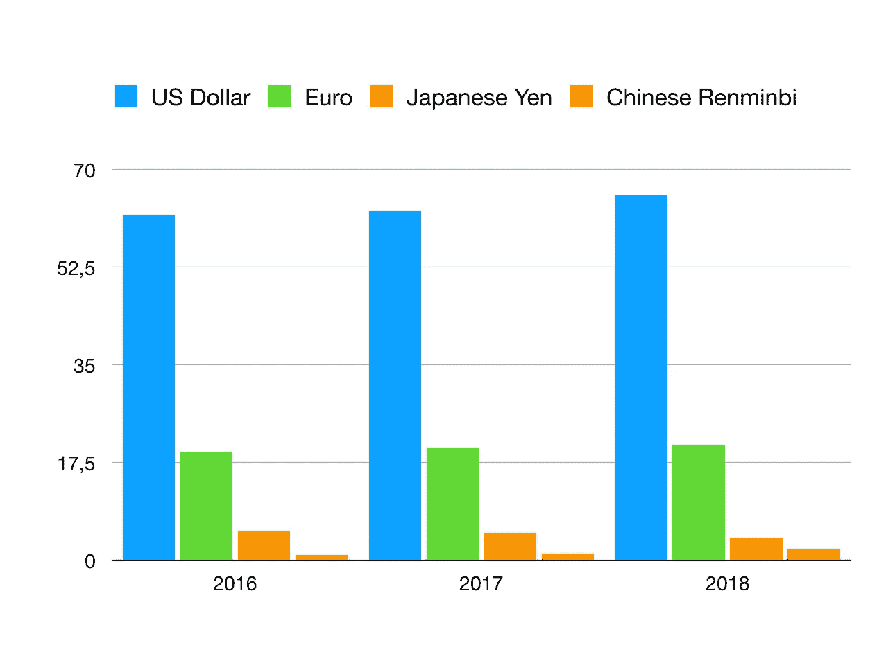
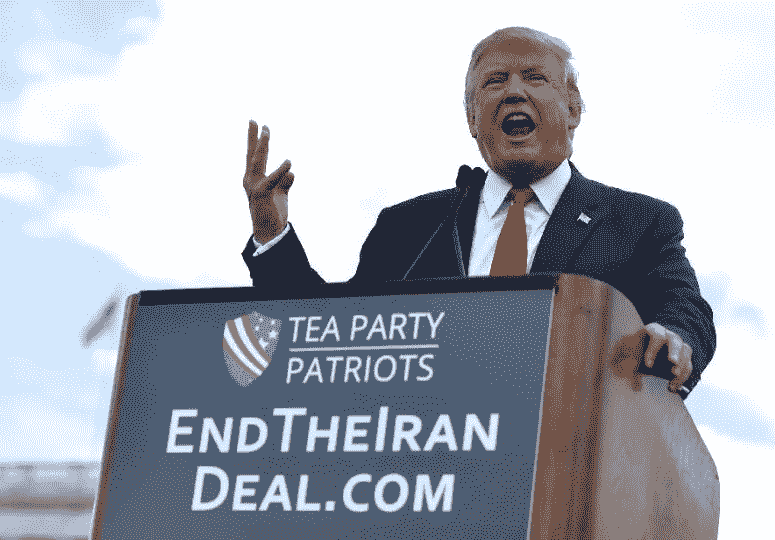

# 美元在美国对外经济政策中的作用

> 原文：<https://medium.datadriveninvestor.com/the-role-of-the-dollar-for-the-usa-foreign-economic-policy-4cbcef4ec899?source=collection_archive---------2----------------------->

或者如何利用美元作为全球货币的角色，将外交政策决策强加于其它国家。

当谈到其**外交政策的影响力**时，美国无疑是全球*最强的演员*。这大部分来自其*的好战态度*，背后有 [*全球最强大的军事*](https://www.worldatlas.com/articles/29-largest-armies-in-the-world.html) *。然而，另一个经常被低估的因素是对增强美国在世界上的影响力有最大影响的因素。*

这篇文章的目的是调查美元在美国对外经济政策中的作用。由于美元是用于全球贸易的全球标准，美国可以利用其权力对其他国家实施其外交政策。

为了理解**和**这两个问题，我们将重点介绍和解释**美元作为全球标准货币的作用**；文章最后将讨论**伊朗交易和制裁**作为美元工具化的一个例子。

# 布雷顿森林体系的建立

美元的主导地位始于 1944 年第二次世界大战后布雷顿森林体系的形成。它建立了现代国际货币体系，创建了国际货币基金组织和世界银行等机构。

## 在布雷顿森林体系下，建立了国家间经济关系的规则。它包括美国、加拿大、澳大利亚、日本和西欧

> 这是历史上的第一个:*由独立国家建立的管理它们之间货币关系的制度。*

**美元**被放置在这个系统的**核心。
**在**二战之前，大多数**货币汇率都是浮动的**，因此产生了*不稳定性*和*不确定性*。各国也在使用货币政策和竞争性贬值来促进出口和经济增长或降低通货膨胀，策略的选择在很大程度上取决于期望的结果*(货币越便宜，出口越多:货币越强劲，进口越多)。***

他们的问题之前已经用金本位制解决了，也就是说，将货币与黄金挂钩，黄金作为储备存在一个洞穴里。然而，由于二战结束时的特殊政治形势，这一选择被认为不再可行。

## 相反，**布雷顿森林体系建立了一个固定汇率体系，使用美元作为金本位货币和中央银行的储备货币。美元与黄金挂钩，其他货币与美元挂钩。**

这意味着美国向其他国家保证，他们可以用黄金以固定汇率兑换美元储备。

**美元****因此被用作****世界范围内的主要储备货币。所有央行都持有大量美元。储备货币也普遍用于全球经济的各个方面，用于贸易和投资。******

****为什么选择美元作为储备货币？主要是因为当时的美国在政治和经济上都处于优势地位:****

1.  ******政治上:**美国刚刚在自己的土地上未受伤害地赢得了二战，还提供外国直接投资帮助重建欧洲国家，还有 [**马歇尔计划**](https://www.marshallfoundation.org/marshall/the-marshall-plan/history-marshall-plan/) **。******
2.  ****经济上:当时，美国控制着全球三分之二的黄金储备，也正在成为全球最大的经济体。****

****从历史上看，这是一个非常重要的事件，美元事实上成为世界国际货币体系的标准货币。**当一个国家的货币同时作为全球储备货币时，就会产生**的利益冲突:最明显的是短期的国内目标和长期的国际目标之间的**。当这两个不同时会发生什么？此外，当时世界分为两极，美国和苏联。美国能够确保世界上很大一部分国家在国际贸易中使用自己的货币，从而使他们在一定程度上依赖于它。通过这样做，美国也能够将俄国、中国和所有其他亲共产主义的国家(T21)排除在这个体系之外。******

# ****尼克松冲击和金本位制的终结****

********

****美国国内政策和国际经济体系之间的利益冲突在 20 世纪 60 年代和 70 年代尤为突出。美国最终在 1971 年结束了美元与黄金的可兑换性。****

****20 世纪 60 年代，著名经济学家特里芬注意到，持有美元实际上已经变得比黄金更有价值。基本上，黄金的供应不足以让体系运转起来，而美元是为世界贸易提供必要流动性的基础。这是因为美国一直处于赤字状态。选择维持预算赤字是一项必要的国内政策，以确保经济增长并为市场提供流动性。然而，尽管有必要跟上世界经济增长的步伐，赤字也可能意味着其他国家会对美元作为储备货币失去信心。****

****20 世纪 60 年代的特点是**经济越来越不稳定:**英国被迫贬值英镑，美国经历**持续赤字**，**公共债务** *(源于越战)*，**通胀加剧**。所有这些都因其国家货币作为全球储备的货币问题而加剧:事实上，**政府通常通过操纵货币供应来实现货币政治** — *要么印刷更多的货币，要么操纵利率*—*金本位制下，*这是不可能做到的，因为美元的价值与黄金挂钩，如果不改变全球平衡，它就不能增加或减少。****

****到 1968 年，美国不再能够以 35 美元/盎司的固定汇率将美元兑换成黄金。这意味着到了 20 世纪 70 年代，美元失去了与美元挂钩的地位，美元贬值。结果，大多数国家开始购买黄金来换取他们的美元储备。****

****黄金流动加速，美国失去了大部分黄金储备:仅仅几年时间，美国的黄金储备就从 55%下降到了 22%!****

********

****[Source:](https://www.bullionvault.com/gold-news/US_gold_reserves_01120092) [World Gold Council](https://www.gold.org/goldhub/data)****

> ****简单地说，世界正在对美国失去信心。****

****尼克松在 1971 年被迫退出。他们停止了美元与黄金的兑换，结束了布雷顿森林体系。这一行动实际上使美元成为许多国家使用的储备货币。事实上，各国都持有大量美元，因为它们可以兑换成黄金。一旦联系汇率被打破，他们仍然拥有大量的美元储备。****

## ****美元比以前更成为全球标准。****

****从这一天起，货币的价值不再以黄金为基础，而是一无所有。****

# ****过去 30 年全球流动性和美元的作用****

> ****美元作为全球储备货币的确立意味着每一个希望参与全球市场国际贸易的中央银行或公司都必须使用美元进行交易。****

****在 20 世纪 70 年代，美国的经济和政治霸权开始受到新兴经济强国的质疑:*欧盟*和*日本开始成为全球行动者，并且**他们各自持有的货币储备规模开始增长。**截至 **2016** ，**中国人民币也成为世界储备货币之一。*******

## *****然而，尽管与这一趋势相悖，美元的重要性一直在增加。*****

## *****如下图所示，到目前为止，美元是全球最大的储备货币，而且其份额还在增加。*****

**********

*****[World Currency Composition of Official Foreign Exchange Reserves](http://data.imf.org/regular.aspx?key=41175) — IMF*****

*****[尽管美国拥有巨额公共债务](https://www.nytimes.com/2019/02/22/business/dollar-currency-value.html)—***—*22 万亿美元，其金融体系距离大萧条以来最严重的金融危机只有十年之遥，但美元仍保持着其作为全球贸易首选货币的地位。为什么会这样？*******

******嗯，基本上主要原因是同样的事实，美元是首选货币。全球范围内发生的大部分全球交易都使用美元，很难从这个系统中转移或脱离出来。******

******变化只能缓慢地发生，或者随着美国作为全球超级大国的衰落而逐渐发生。其他国家已经多次试图用一种[全球货币](https://next.ft.com/content/7851925a-17a2-11de-8c9d-0000779fd2ac\)来取代这一体系，这种全球货币将*与单个国家脱离，从而能够摆脱使用本国货币的内在缺陷。*尽管最近有建立替代系统的会谈，特别是在*中国*和*俄罗斯*之间，但由于以下几个原因，这些会谈仍然不可行:******

1.  ******中国和俄罗斯的货币仍在通货膨胀——*平均每年约 5%。*******
2.  ******中国和俄罗斯都持有大量美元储备，如果他们想出售，就必须在市场上抛售，这将导致负面的多米诺骨牌效应，使他们的储备贬值。******
3.  ******在没有替代体系的情况下放弃美元实际上意味着**将自己孤立于全球经济之外。********

********第二大全球储备货币欧元**也是如此。欧盟的进口仍然依赖美元。
这是[最近由**欧盟能源专员**提出的](https://www.forbes.com/sites/davekeating/2018/12/05/the-eu-just-made-a-push-to-dislodge-the-dollar-from-energy-transactions/#7c5ae77b8d3c):******

> ******“欧盟是世界上最大的能源进口国:它所需的大约 90%的石油和大约 70%的天然气都是进口的[……]我们每年的能源进口费用高达 3，000 亿€欧元，其中大约 85%以美元支付”。******

******目前，大部分进口合同都是以美元计价的。虽然欧盟目前正在讨论如何减少对美元的依赖，但前者仍优于欧元，原因如下:******

1.  ******寻求投资场所的投资者用欧元进行投资的选择仍然有限。例如，欧盟最信任的投资，德国政府债券是出了名的供不应求[—](https://www.nytimes.com/2019/02/22/business/dollar-currency-value.html)—*相反，美国债券在市场上很容易买到；*******
2.  ******欧元仍然是一个支离破碎的联盟的货币。欧盟仍然缺乏共同的财政政策，当欧盟由 27 个不同的国家组成时，欧洲央行发起的货币政策往往被证明是无效的。******

******目前，**美元可以说是最好的保值手段，** *因为它比其替代品更稳定、更安全。与此同时，随着全球地缘政治局势从单极世界慢慢转向多极世界，这也应该反映在全球经济中。建立混合储备货币体系可能对许多国家都有利。特别是，通过使用自己的货币，欧盟、俄罗斯、中国或伊朗不会受到美国外交政策的严重影响。*******

## ******美国如何利用美元作为全球货币的角色？让我们着重谈谈最近的一个具体例子:对伊朗的制裁。******

# ******美元在美国制裁伊朗中的作用******

************

******当美国希望把它的外交政策强加给敌人和盟友时，美元的霸权地位经常被利用。******

> ******作为一种全球储备货币的发行者，可以赋予国际货币权力，特别是“武器化”进入金融和支付系统的能力。******

******最近在伊朗发生的事情就是一个明显的例子。总而言之， [**川普退出了伊朗核协议**](https://www.vox.com/world/2018/5/8/17328520/iran-nuclear-deal-trump-withdraw) **，该协议包括结束对伊朗的制裁，以换取其核能野心的结束。美国退出了交易，对已经瘫痪的伊朗经济实施了进一步的制裁。此外，他们还威胁要对所有继续用美元与伊朗进行贸易的国家实施制裁。********

******虽然这一外交政策决定对美国公司没有什么损害，但对那些与伊朗有经济往来的国家影响尤其大。 *其中有中国、土耳其、韩国、印度和德国。*******

## ******由于银行不能冒失去依赖美元的全球经济的风险，它们经常被迫与美国结盟，遵守制裁。******

******随着特朗普发起激进的贸易政策，现在比以往任何时候都更应该重新讨论美元作为全球货币的角色。全球货币不应被用作执行和遵守发行国政策的工具。美国的短期国内目标不应凌驾于全球经济的长期目标之上，尤其是当这些政策有助于增强其霸权时。******

> ******全球力量的规模正在慢慢转移，美国意识到了这一点。可以说，美元作为全球货币，是其全球影响力的基础。这方面的任何变化都会同样反映在地缘政治和经济影响力的丧失上。******

******由于我们不可避免地要走向一个多极世界，全球货币应该与一篮子不同的货币挂钩，以使这个体系对试图利用本国货币的作用来推行其政策的个别国家不那么敏感。看看会有什么样的结局将会非常有趣。**在目前的状态下，**美元仍然是全球使用最多、最受信任的货币。但是**在几年的时间里，新兴经济体和现有经济体将会想要采用一个反映全球经济中众多交易者的体系。**这将导致美国**失去权力**，**所有其他国家经济自由度的镜像增长。***这将意味着对全球经济体系领域的平整，*******

> ******我们的传统体系已经过时，因为它是在国际贸易刚刚开始时构想的。******
> 
> ******贸易和投资的步伐以及普遍的全球化要求建立一个新体系，一个适合所有人的体系。历史最终将走上正确的道路，因为经济体系没有永恒——它们最终将被新的模式所取代，以适应世界的发展。******

## ******如果你喜欢这个故事，请点击👏按钮并分享，帮助其他人找到它！欢迎在下方留言评论。******

******在 [**金融市场和分析**](https://app.ddichat.com/category/financial-markets-and-analysis) **:** 中安排一个 DDIChat 会话******

****** [## 专家-金融市场和分析

### DDIChat 允许个人和企业直接与主题专家交流。它使咨询变得快速…

app.ddichat.com](https://app.ddichat.com/category/financial-markets-and-analysis) 

在这里申请成为聊天专家。
与 DDI 合作:[https://datadriveninvestor.com/collaborate](https://datadriveninvestor.com/collaborate)
在此订阅 DDIntel [。](https://ddintel.datadriveninvestor.com/)******