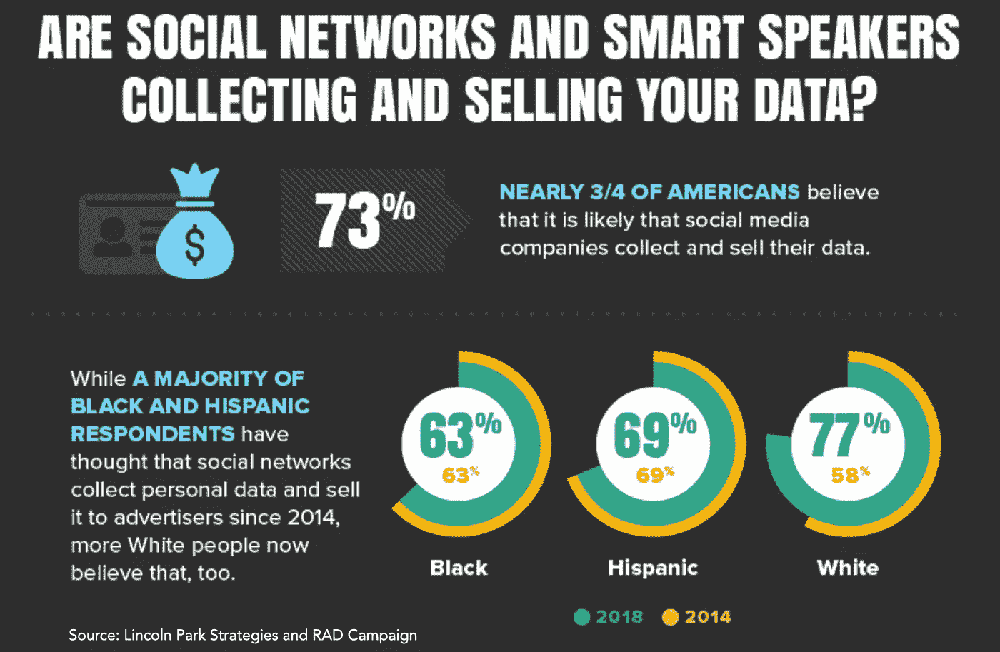

# 信任在人工智能机器人时代的作用

> 原文：<https://medium.datadriveninvestor.com/the-role-of-trust-in-an-era-of-ai-bots-d68af332a51?source=collection_archive---------0----------------------->

[许可营销](https://www.forbes.com/sites/onmarketing/2014/04/30/seth-godins-permission-marketing-turns-15/#5c7a156958e4)并不新鲜。但是选择加入营销的原则经常被滥用。人工智能将对抗关于隐私和个人数据使用的日益紧张的局势。

在讨论人工智能对个人数据使用的影响之前，回顾一下隐私伦理的现状是有帮助的。剑桥分析危机[围绕着利用人们的数据](https://www.nytimes.com/2018/04/04/us/politics/cambridge-analytica-scandal-fallout.html)，特别是他们的朋友网络被利用。实际上，他们在使用免费社交网络脸书的同时，也选择允许脸书出售他们的用户数据。大多数用户都没有注意到用户策略下面四段的小字。

也就是说，数据的使用令人震惊，在广泛的基础上破坏了信任。虽然极端的例子冒犯，数以千计的不为人知的虐待也发生了；他们只是没有被曝光。

随着社交网络营销人员不断滥用基于许可的数据，大多数消费者不再相信他们在网上读到或看到的任何东西。2018 年 5 月由[林肯公园战略和 RAD 竞选](http://onlineprivacydata.com/)进行的一项民意调查揭示了一些关于美国人在线数据使用的惊人数据:

73%的人认为社交媒体公司正在收集和出售他们的数据

74%的人不阅读或浏览社交网络服务条款

75%的美国人认为他们的数据在未经他们同意的情况下被 cookies 跟踪

58%的人认为家用智能音箱会收集他们的数据

欧洲关于公司数据使用的新法规——GDPR——试图通过强制在欧洲做生意的公司完全选择收集数据并通知用户数据泄露来纠正一些问题。许多美国公司遵守 GDPR 保护国际客户的规定，在他们的网站上使用允许 cookies 的提示。

林肯公园战略/RAD 活动研究表明，无论数据使用情况如何，大多数美国人都会放弃这些选择加入服务。然而，他们认为他们的数据正在被利用。

人工智能只会让问题变得更加复杂，因为机器人被部署来寻找镜像受众，并实施一系列自动化通信服务——从电子邮件和短信到弹出窗口和聊天机器人——来转化客户。进一步的客户细分与更大规模的相似客户数据库相匹配，以产生新的业务线索。

由于客户数据广泛传播，并通过随意选择加入政策在线使用，许多人会收到来自他们从未交往过的公司的无用信息。通常，这以广告和垃圾邮件的形式出现，但也可能包括其他方法，如 robocalls。多亏了人工智能，我们看到这类活动急剧增加。

## 人工智能将如何为公司提供一面道德镜子

以这种方式使用人工智能的危险是多方面的。数据和开发者的偏见可能会阻止一些客户群享受服务，这将继续给公司带来道德和伦理危机。到目前为止，非故意的数据和算法偏见可以将品牌描绘成有偏见或有政治动机的。

此外，公司将承受消费者焦虑的冲击。他们只是部署了机器学习程序来改善他们的业务，这并不重要。客户认为他们审查了他们的数据和人工智能的使用，如果没有，那么品牌就会破坏信任。

大多数营销人员根据供应商的承诺和过去的表现，整合第三方提供的机器学习程序。当购买一个数据库或一个算法时，营销策略师假定它是干净的。消费者不会允许将由此产生的问题归咎于第三方科技公司，即使是谷歌或脸书。

Forrester 报告“人工智能的伦理:如何避免有害的偏见和歧视”研究了偏见面临的挑战，并做出了每个营销人员都应该知道的伦理结论。不能指望政府制定有效的法规来保护在线数据。相反，消费者将期待企业成为数据好坏的仲裁者。因此，当数据泄露、偏见或其他形式的数据利用因人工智能而发生时，品牌就会受损。

Forrester Ethics of AI 报告的作者 Brandon Purcell 写道，“正如当消费者质疑银行拒绝向他们提供信贷的决定时，FICO 不会被追究责任一样，亚马逊、谷歌和其他经过训练的机器学习模型的提供商也不会对其他公司如何使用他们的模型承担责任。相反，公司本身作为这些模式的整合者，将承担不道德做法的后果。”

审查人工智能和数据解决方案以确保良好的实施将需要营销部门深化其审查流程。在许多方面，虽然供应商可能有一个好的答案，但品牌本身需要检查算法的完整性，防止偏见。这就要求品牌拥有或接触到高质量的数据科学家来保证质量。

有些人可能认为这是个人偏见，但在营销领域工作了 20 多年后，我真诚地怀疑绝大多数品牌会这样做。虽然我们作为一个职业在谈论道德和最佳实践方面做得很好，但大多数人没有或不能调动内部资源、买入或知识来保护他们的公司免受机器学习产生的违规行为的影响。

因此，许多品牌将被布兰登·珀塞尔(Brandon Purcell)称为“道德镜子”的东西推到身上，向他们和他们的客户展示他们企业的无意识偏见。不幸的是，这些挑战将在公共舞台上播出，几乎肯定会在最坏的情况下造成危机。道德之镜会变成[黑镜](https://www.netflix.com/title/70264888)。

营销人员和他们的执行团队应该重新审视他们的危机公关计划。具体来说，营销人员应该为人工智能相关的不良事件制定指导方针——具体来说，就是以令客户满意的方式解决数据利用或偏见的能力。