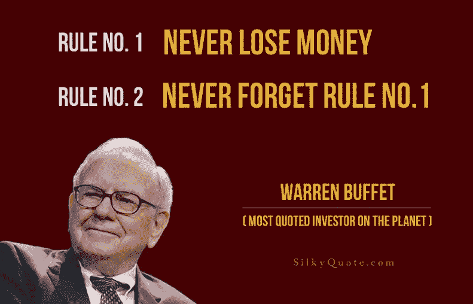

# 长期投资的“规则#1”。

> 原文：<https://medium.datadriveninvestor.com/the-rule-1-of-long-term-investing-5e34c5702e49?source=collection_archive---------1----------------------->

价值投资最早是由哥伦比亚商学院的教授本杰明·格拉哈姆提出的。他以前的学生，现在是世界上最富有的投资者之一，沃伦巴菲特使它成为一种流行的投资策略。这篇文章是当这些原则通过菲尔镇时产生的。

本杰明·格拉哈姆的书《证券分析》于 1934 年首次出版。1949 年他的第二本书《聪明的投资者》。这两本书被认为是价值投资的圣经。它们值得研究，但它们不容易阅读，并且它们不能反映 2019 年发展的世界。

 [## 算法交易的机器学习|数据驱动的投资者

### 当你的一个朋友在脸书上传你的新海滩照，平台建议给你的脸加上标签，这是…

www.datadriveninvestor.com](https://www.datadriveninvestor.com/2019/01/30/machine-learning-for-stock-market-investing/) 

一个更新更容易阅读的是菲尔镇的书“规则#1”。这本书以循序渐进的方式包含了本杰明·格拉哈姆和沃伦·巴菲特的所有教导，而且只需 15 美元。这本书已经讲得够多了，让我们更深入地探讨一下该做什么和不该做什么。

# 重要的事情，首先。

先说书名吧。为什么是“规则 1”？这条规则指的是什么？答案是，不亏任何钱。沃伦·巴菲特曾经说过..

Image is taken from — [http://www.silkyquote.com/](http://www.silkyquote.com/)

..这句话成了这本书的标题。

# 如何找到一家「很棒的公司」？

菲尔镇提到，投资者需要找到一家“出色的公司”，并在它被低估时投资。

为了让投资者找到一家“优秀的公司”，他需要使用四个“m”作为指导。那些是..

1.  **意为**
2.  **护城河**
3.  **管理**
4.  **安全裕度**

投资者需要考虑的第一件事是，他或她需要真正热爱他或她想要投资的公司，这就把我们带到了第一个 M，意思是。

# 含义—寻找企业

菲尔镇提到..

> …企业对你来说是有意义的——你对它的理解足以让你想要拥有整个企业，你会为拥有它而自豪，而且企业反映了你的价值观。

为了确定一家公司对我们的意义，我们用这些术语来思考..

*   你想拥有整个企业吗？
*   你对它的了解是否足以拥有它的全部？"
*   你愿意持有公司 10 年甚至永远吗？

这种个人对公司的了解和联系，将有助于一个投资者了解公司的来龙去脉，阅读公司的新闻，成为公司的客户，并作为其产品的现实测试者有所见解。

# 壕沟

A moat surrounds a castle.

就像城堡周围的护城河保护它免受外来入侵一样，它也需要将自己的策略运用到商业中。如果一个企业很容易受到挑战，那么它就没有护城河。制药公司是有护城河的公司的好例子。他们的研究和专利不容易被他人复制和挑战。另一方面，大宗商品公司很容易受到其他公司的挑战。

作者提到了五种护城河..

1.  品牌护城河
2.  秘密护城河
3.  收费护城河
4.  开关护城河
5.  价格壕沟

品牌护城河只是给了一家企业来自客户的信任，这种信任是企业在任何宏观和微观经济环境中生存所必需的。苹果和耐克就是两个很好的例子。

秘密护城河使得与一家公司的直接竞争变得非法或非常困难。辉瑞和可口可乐就是两个很好的例子。

收费护城河赋予一家公司控制特定市场的能力，并使这家公司成为任何想要进入这个市场的人的看门人。两个很好的例子包括雀巢和埃克森美孚。

转换是第四条护城河，它让一家公司有能力成为一个人生活的一部分，以至于他或她会对它产生某种依赖。微软和谷歌就是两个例子。

当一家公司想与竞争对手展开价格战时，拥有价格护城河的公司总是会赢，因为它能把价格拉得如此之低，以至于没人能跟得上。两个例子是 Lidl(在德国)和 Migros(在瑞士)。

为了验证一个广的微尘，我们可以计算“五大数字”

## 五大数字

每家上市后的公司都需要向公众公布其财务报表。三种主要的财务报表是资产负债表、损益表和现金流量表。

*(关于 IPO 过程和股市的更多信息，请阅读过去的文章“*[*《IPO 与股市》*](https://medium.com/@gourtzilidisdemetris/the-ipo-and-the-stock-market-9ae71ecf40f3)*”)*

## 财政年度和季度

日历年分为四个季度，缩写为 Q1、Q2、Q3、Q4，包括以下日期..

*   Q1–1 月 1 日至 3 月 31 日(闰年为 90 天或 91 天)
*   Q2——4 月 1 日至 6 月 30 日(91 天)
*   第三季度–7 月 1 日至 9 月 30 日(92 天)
*   第 4 季度–10 月 1 日至 12 月 31 日(92 天)

在 Q1 结束时，公司发布他们的“年度报告”,因为财政年度结束了，新的一年开始了。在 Q2 的结尾，收入被释放，表演形成了 Q1 的结尾，直到 Q2 的结尾。在第三季度和第四季度，循环继续，我们再次从 Q1 开始。

## 财务报表

正如维基百科提到的，资产负债表是..

> …个人或组织(无论是独资企业、商业合伙企业、公司、私人有限公司还是其他组织，如政府或非营利实体)的财务余额汇总。资产、负债和所有者权益在特定日期列示，如财政年度结束时。资产负债表通常被描述为“公司财务状况的快照”。在四种基本的财务报表中，资产负债表是唯一适用于一个企业日历年某一时间点的报表。

正如维基百科提到的，损益表是..

> …公司的财务报表之一，显示公司在特定时期的收入和费用。它表明收入(也称为“顶线”)如何转化为净收入或净利润(所有收入和费用都已计入后的结果)。损益表的目的是向经理和投资者显示公司在报告期间是盈利还是亏损。损益表代表一段时间(现金流量表也是如此)。

正如维基百科提到的，现金流量表是..

> …一份财务报表，显示资产负债表账户和收入的变化如何影响现金和现金等价物，并将分析细分为经营、投资和融资活动。本质上，现金流量表关注的是企业的现金流入和流出。作为一种分析工具，现金流量表有助于确定公司的短期生存能力，尤其是支付账单的能力。

## 规则 1 上的五个大数字

这里需要注意的一点是，在过去的 10 年中，每个数字每年都需要"**大于或等于 10%(与上一年相比的增长或变化)"**，以确保公司没有放缓。

1.  **投资资本回报率(ROIC)**
    Investopedia 提到*“ROIC 是一种计算方法，用于评估公司在其控制下将资本分配到盈利投资的效率。投资资本回报率反映了一家公司利用资金创造回报的情况。ROIC 的公式是(净收入-股息)/(债务+权益)。”*
2.  销售增长率这个指标不言自明。
3.  **每股收益(EPS)增长率**
    Investopedia 提到*“每股收益(EPS)的计算方法是公司的利润除以其普通股的流通股。得出的数字可以作为公司盈利能力的指标。每股收益的计算方法是净收入(也称为利润或收益)除以可用股份。”*
4.  **每股账面价值(BVPS)或权益、增长率** Investopedia 提到*“每股权益账面价值(BVPS)是普通股股东可获得的权益除以发行在外的股票数量。这代表了公司股本的最低价值。由于优先股股东比普通股股东对资产和收益有更高的要求权，优先股从股东权益中扣除，得出普通股股东可获得的权益。每股权益的账面价值=(总权益-优先股权益)/发行在外的总股份"* Phil Town 还写道*“原始数字本身对于确定价值并不重要，因为拥有大量房地产和机器的企业，如麦当劳，可能拥有相对于其价值的巨大权益，而像谷歌这样完全关于知识产权的企业，可能拥有相对于其价值的较小权益。”*
5.  **自由现金流(FCF 或现金)增长率** Investopedia 提到*“自由现金流代表公司在现金流出后产生的用于支持运营和维持其资本资产的现金。与收益或净收入不同，自由现金流是对盈利能力的一种衡量，它排除了损益表中的非现金支出，包括设备和资产支出以及营运资本的变化。FCF 可以从现金流量表上经营活动的现金流开始计算(因为这个数字已经调整了利息支付、非现金支出和营运资本变化的收益)+利息支出(来自损益表)-利息支出的税收保护(来自损益表)-资本支出(来自现金流量表)=自由现金流。因此，我喜欢快速增长的业务(并且不支付股息……*

虽然这是一个学习如何计算这些数字的好技巧，但不是必须的。这些数字已经在大多数网站上计算过了。

菲尔镇笔记..

> 我会告诉你先去 ROIC。如果一个企业没有一个健康的 ROIC——在过去的十年里平均每年超过 10%——那就转向另一个企业。最好看一下 ROIC 的三个数据:(1)十年平均值，(2)过去五年平均值，以及(3)去年平均值。

第二重要的数字是**账面价值增长**，然后是**每股收益**增长，然后是**销售增长**，最后是**自由现金流增长****。**

**菲尔·汤提出的另一个重要观点是..**

> **…当你查看资产负债表时，你会碰到债务数字，不知道如何处理它们。一旦你对这五个数字说是，继续下去，确保债务负担是合理的。简单地用一家公司的长期债务总额除以它当前的自由现金流。**

# **管理**

****

**Image is taken from — [https://abc.com/shows/shark-tank](https://abc.com/shows/shark-tank)**

**如果你曾经看过《鲨鱼池》,你会注意到，在天使投资和风险投资的早期阶段，一家公司没有上面提到的“五大数字”。企业拥有的一切都是它的产品和管理团队。鲨鱼池投资者经常会说“我喜欢这个产品，但我是因为你(所有者)才参与进来的”。菲尔·敦认为，管理层在公司中发挥着巨大的作用，以下是投资者需要在首席执行官身上寻找的一些“第一法则”。**

**菲尔·敦认为，首席执行官需要的两种品质是..**

1.  **首席执行官需要以所有者为导向**
2.  **首席执行官需要被驱动**

## **驾驶**

**一个首席执行官不仅仅是为了钱而去做 it。埃隆·马斯克在这个问题上给了我一个很好的引语。他说..**

> **我收购 PayPal 的收益是 1.8 亿美元。我在 SpaceX 投了 1 亿美元，在特斯拉投了 7000 万美元，在太阳城投了 1000 万美元。我不得不借钱付房租。**

**Phil Town 提到我们应该在网站上寻找这样的故事，比如**

*   **[www.forbes.com](http://www.forbes.com)**
*   **www.businessweek.com**
*   **【www.fortune.com **
*   **[www.fastcompany.com](http://www.fastcompany.com)**
*   **[www.wsj.com](http://www.wsj.com)**

**在“驱动”类别下，我们还需要检查(1)内幕交易活动的法律方面，以及(2)首席执行官的薪酬。如果首席执行官在 48 小时内通知 SEC 他或她的交易，不要认为是非法内幕交易。这些变动通常是公司未来发展的一个重要标志。菲尔·敦说，如果一位首席执行官卖出了超过 30%的股票，这就是卖出信号，即使其他所有标准都满足了。**

**Phil Town 提到，每个规则 1 投资者都需要检查他们将要投资的公司的首席执行官的“大胆的大目标(袋子)”。他是有使命还是信口开河？即使他或她成为亿万富翁，这种生活使命也会驱使他们去工作。**

**Phil Town 分享了一个关于 CEO 驱动力的重要细节..**

> **例如，管理层获得超额报酬的一个关键途径是股票期权。股票期权不会给经理带来任何损失。它们是来自企业的奖励，给予经理在未来某个时候以固定价格购买公司股票的权利。授予股票期权的想法是激励经理抬高股票价格，使期权有价值。**

# **安全系数**

**这一节的一个关键点是购买一家被低估的公司，就好像我们会在黑色星期五购买下一个家庭影院一样。**

**首先，我们需要确定我们研究的公司的价格应该在哪里，然后我们需要检查公司现在以什么价格出售其股票，“标价”。菲尔镇提到..**

> **首先我们确定价值——标价。然后我们确定安全边际价格 MOS，它是标价的一半。**

**标价的关键因素是“一件东西的价格并不总是等于它的价值”。这是商业中的一条基本规则。假设我们公司生产冬季夹克。我们生产一件冬季夹克的成本是 50 美元。我们以 100%的利润出售它，因此消费者价格是 100 美元。从另一方面来说，如果消费者看到这件夹克打了 50%的折扣，这意味着这件夹克以其生产价格出售，是时候购买了。同样的原则也适用于公司股票。**

**我们可以用以下数字来计算一家公司的标价:**

1.  **当前每股收益**
2.  **预计(未来)每股收益增长率**
3.  **预计未来 PE**
4.  **该投资的最低可接受回报率(默认为 15%)**

**在接下来的文章中，我将向你展示成为一个“规则 1”投资者需要遵循的所有步骤。**

# **结论**

**到目前为止，菲尔镇告诉我们..**

> **第一层是必须充分理解在这个行业中意味着什么，这样你就知道这是一个持久的行业。其次，确保它有一个很宽的护城河，这样你就知道你可以从它过去的五大数字中对未来做出合理的预测。第三，确保你爱上了这位经理，这样你就知道他或她会表现得像一个长期所有者。第四层——也许是最重要的一层——是购买时要有很大的安全边际，这样如果出了什么问题，你就不会受到损失。这些层是四个 Ms。**

**在下一篇文章中，我将发布一个完整的关于“规则 1”投资的实用指南！**

***来源***

1.  **菲尔镇的第一条规则**
2.  **https://en.wikipedia.org/wiki/Cash_flow_statement**
3.  **【https://en.wikipedia.org/wiki/Income_statement **
4.  **[https://en.wikipedia.org/wiki/Balance_sheet](https://en.wikipedia.org/wiki/Balance_sheet)**
5.  **[https://www . investopedia . com/terms/r/returnoninvestmentcapital . ASP](https://www.investopedia.com/terms/r/returnoninvestmentcapital.asp)**
6.  **https://www.investopedia.com/terms/e/eps.asp**
7.  **【https://www.investopedia.com/terms/b/bvps.asp **
8.  **[https://www.investopedia.com/terms/f/freecashflow.asp](https://www.investopedia.com/terms/f/freecashflow.asp)**

**免责声明:**

**为了投资这些市场，你必须意识到风险并愿意接受它们。不要用你输不起的钱去交易。本文包含的信息仅用于教育目的，不作为任何特定投资的建议。在任何市场交易都有很高的风险，可能不适合所有的投资者。**