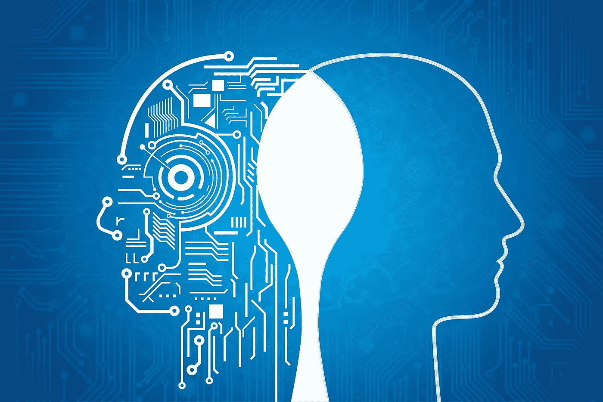

# 现代狂热背后的科学；人工智能

> 原文：<https://medium.datadriveninvestor.com/the-science-behind-a-modern-day-craze-artificial-intelligence-ec8c0bd9b2da?source=collection_archive---------4----------------------->

[https://www.geospatialworld.net/wp-content/uploads/2017/03/Cover-Story.jpg](https://www.geospatialworld.net/wp-content/uploads/2017/03/Cover-Story.jpg)

人工智能。你可能以前听说过这个术语，并想象机器人做你的工作或为你开车，但这不是人工智能的全部。每次你打开你的网络浏览器，人工智能都在猜测你要搜索什么。你在边上看到的所有广告都是基于你的搜索而针对你的公司。

## 那么 AI 到底是什么？

简单来说，人工智能是计算机科学的一个领域，旨在让机器像人类一样工作。为了实现这一点，我们有两个主要想法:**狭义的**和**广义的**艾。

## 狭义人工智能

如今，狭义人工智能无处不在，存在于我们的电脑、手机、汽车等等。它们都有智能系统，已经学会如何完成特定的任务，而不需要**明确编程**这样做。以自动驾驶汽车为例；程序员没有告诉汽车如何在皇后街左转，他们只是告诉汽车如何左转。通过反复试验，汽车学会了根据具体环境左转的最佳方式。

然而，与人类不同，狭义人工智能只能学习如何完成特定的任务，这就需要许多专门的人工智能机器。

## 艾将军

通用人工智能的概念是一台人工智能机器能够像人类一样执行多项任务。这将减少对许多特定人工智能机器的需求，提高单台机器的生产率。然而，AI 将军仍然只是在电影中出现，而不是在现实世界中。尽管如此，许多进展正在使这成为现实。

## AI 是如何工作的？

人工智能在三种理念下发挥作用；机器学习、深度学习和神经网络。

**机器学习**通过使用提供的数据自学，让计算机有机会在没有明确编程的情况下学习。计算机在数据中寻找模式，以便在未来做出更好、更明智的决策。机器学习可以用来理解不同的数据集，如语言、图像和声音，并可以帮助人类在给定数据量的情况下需要很长时间才能做出的决策。

**深度学习**是机器学习的一种形式，计算机对某一特定特征进行深度学习。这有助于它更加准确，进而可以改善自动驾驶汽车的结果。深度学习通常通过使用神经网络来发挥作用。

**神经网络**由几层组成，每层都像人类神经系统一样处理信息。有一个输入层和一个输出层，以及它们之间的一个或多个隐藏层。所有层都连接在一起，并使用前一层的输出作为其输入。

An example of what a neural network could look like.

神经网络训练得越多，结果的准确度就越高。在完成特定任务方面，神经网络比机器学习更好。

## 关键要点

*   人工智能是计算机科学的一个领域，旨在让机器像人类一样工作
*   人工智能有两种类型，狭义和广义，但目前只有狭义人工智能是现实
*   机器学习是让计算机在没有明确编程的情况下进行学习
*   深度学习是深入研究数据的一个特定特征
*   神经网络是我们在一个特定的特征中处理信息的方式

感谢你阅读我关于人工智能的文章，我希望你现在对人工智能是什么以及它是如何工作的有了更好的理解。