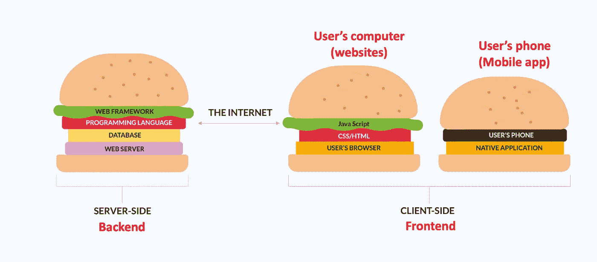
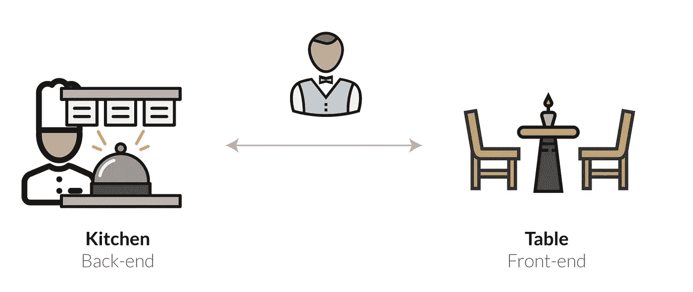
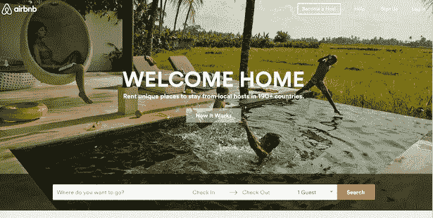
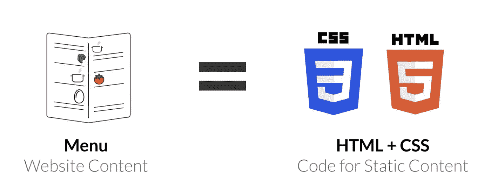
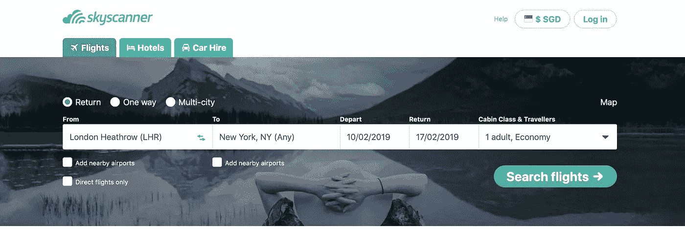
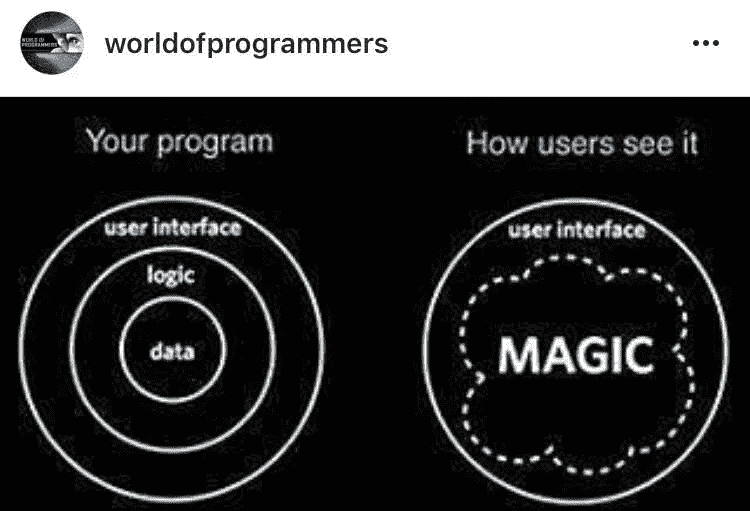

# 非技术人员使用“技术”语言的“秘方”

> 原文：<https://medium.datadriveninvestor.com/the-secret-sauce-for-non-techies-to-speak-the-language-of-tech-7816080f4147?source=collection_archive---------1----------------------->

Image by James Pond via Unsplash

如果你是一个不懂技术的人，不明白为什么会有这么多编程语言(Python，Javascript，SQL)存在，为什么像谷歌/脸书这样的公司需要雇佣一大群开发人员来构建他们的网站/应用，这篇文章就是为你准备的！

好吧，让你听起来像是能谈论技术的“秘方”是首先理解应用程序/网络应用程序开发的基本要素。

开发网站、烤蛋糕或创业都有一个共同点——**‘一套创造奇迹的积木’**就像你需要一个“食谱”来烤蛋糕或“商业模式”来执行一项成功的业务一样，你需要一个*【技术栈】*用于网站/应用程序！

Image by Tenor

# 什么是技术堆栈？

> 技术栈指的是一组编程语言、软件和工具，它们协同工作来创建和部署网站、应用程序和其他数字产品。应用程序的每一层都建立在下一层之上。因此，它是一个堆栈。

## **一个‘堆栈’的主要组件**

所有网站/应用程序都有两个主要组成部分:

1.  **客户端** ***(前端)*** 是用户在屏幕上看到和交互的一切，包括图像、按钮、下拉菜单、过渡等。前端的三项主要技术是:

*   HTML(标记语言)
*   CSS(样式表)
*   JavaScript(脚本语言)

2.**服务器端** ***【后端】*** 对用户来说是不可见的，但它在支持所有令人上瘾的 Instagram、网飞、youtube 的功能中起着至关重要的作用。后端通常由 3 部分组成:

*   服务器
*   后端应用程序
*   数据库ˌ资料库

我会用一个**餐馆类比**来揭开所有这些大术语的神秘面纱。

当顾客走进一家餐厅时，你会受到一位友好、整洁、面带微笑的服务员的问候。服务员会主动询问你的情况，并询问你是否准备好入座。入座后，会给你一份菜单，服务员会确保你有做出明智决定所需的所有信息。

> 服务员的作用就是保证你带着最好的顾客体验离开餐厅！

在 web 开发中，这正是前端开发人员的角色——确保网站对用户友好，确保用户体验尽可能好。

另一方面，厨师和厨房工作人员负责为你做美味的饭菜。作为客户，你看不到这些人在努力工作。类似地，对于 web 应用程序的后端，或者运行在服务器端的代码，用户看不到它们，也不能与它们直接交互！

Image via codeAnalogies

既然你已经了解了大局…让我们更深入地了解前端和后端是如何相互作用的！

# **什么是前端？**

你有没有想过，为什么一个头脑简单的人可以在 Airbnb 上预订一个位置，或者不需要说明书就可以轻松预订优步/grab？

不要被忽悠以为这些 app 的内脏很简单！一切看起来很容易，只是因为他们有一个由编程语言 HTML、CSS 和 Javascript 支持的**非常棒的**用户界面(UI)。

## 这些语言之间有什么区别？

Image via codeAnalogies

HTML & CSS 等编程语言允许你构建**静态内容**，让用户更容易理解他们的选项。也就是说，菜单让你知道餐厅供应什么食物。

但是如果你想订购一件商品呢？通过少加盐来定制你的菜？单单一份菜单并不能帮助你向厨房传达你的需求！

Image via codeAnalogies

这就是 Javascript 的用武之地。Javascript 扮演服务员的角色——回答你所有的基本问题，把你点的菜送到厨房！简而言之，Javascript 控制着顾客和厨房之间的所有基本交互。

## 那么，后端到底有什么关系呢？

Image via Hellkitchen

如果你看过《地狱厨房》的一集，你就会明白在厨房做厨师是一份压力很大的工作。

一名主厨必须是一名专家，能够根据顾客的口味创造出新颖和融合的菜肴，确保上菜的高质量和安全性，这样的例子不胜枚举…

想象一下像 Gordon Ramsey 这样的厨师不得不一边做饭一边服务他的顾客？！这会让他发疯，并给他所有的顾客带来灾难性的体验！

就像一家餐厅需要厨师和服务员来使事情运转一样，我希望你理解 web/app 开发需要前端和后端开发的实际原因！

## **等等，每个网站都需要后端开发吗？**

不一定。一个简单的静态网站，只需要用户浏览项目并通过联系表单发送一个简单的查询，就可以使用纯前端开发来开发。

> 然而，大多数流行的网站/应用程序，如脸书、推特、Instagram，都需要后端开发，因为它们的内容是动态的，不断变化和实时更新

一个很好的例子就是 Airbnb——我们所有收到的创建账户的请求，帮助我们找到正确的匹配和欺诈检测，以确保我们不会与连环杀手生活在一起，都需要由一群遵守指令(代码)的计算机来驱动。 Backend 可以让你从这一堆电脑中获取你需要的信息。

# 什么是后端？

简单回顾一下，后端由 3 个组件组成:

1.  服务器
2.  后端应用程序
3.  数据库

# #1:服务器

后端运行在服务器上，要么在你的数据中心(你拥有或租用的计算机)，要么在像亚马逊网络服务(AWS)这样的云托管提供商。

Image by Youtube

还记得在硅谷的一个场景吗，Gilfoyle 通过构建他的服务器来处理 Pied Piper 的 50，000 次浏览请求，从而拯救了 Pied Piper？一个完美的服务器工作的例子！

事实上，大多数公司会选择云托管提供商，因为零前期投资，而且你可以随着业务的变化而扩展和缩减服务器资源。一些流行的云托管服务包括:

1.  IBM 云
2.  亚马逊网络服务(AWS)
3.  微软 Azure
4.  谷歌云

好了，让我们深入了解厨房厨师如何与服务员沟通，以确保顾客获得最佳用餐体验！

# #2.后端应用程序(BA)

我想把后端应用程序想象成一个运行整个厨房的人工智能机器人。人工智能是头脑，而厨房是身体。人工智能负责处理顾客的食物请求，管理厨房地板，并按时将成品交付给顾客。

后端应用程序(BA)有 3 个角色:

1.  通过应用程序/网站获取用户需要的信息
2.  组合和转换这些信息
3.  将新形状的信息返回给请求者

为了简化事情，我们假设 Val 已经厌倦了生活，决定休息一下，并选择 Skyscanner 预订航班。

***瓦尔去***[***www.skyscanner.com***](http://www.skyscanner.com)***去纽约预定假期。***

Image via Skyscanner

Skyscanner 神奇地获取了 Val 请求的所有相关信息！

Image via GeekyExplorer

Skyscanner 等旅游应用程序让我们能够在搜索功能中输入“任何地方”，这样你就可以看到按最便宜价格组织的目的地，这难道不令人惊讶吗？

对于精打细算的旅行者来说，我们也可以根据当天路线的价格，在最便宜的时候提前计划和旅行。

这怎么可能？世卫组织创建并交付所有这些内容？

Image via GIPHY

后端程序员有！

就像你在 Excel 中编写函数一样(比如“对这一列求和”、“对这一行求平均值”)，你在编写程序！后端程序员做同样的事情——他们在各种数据库中找到用户需要的特定信息，将代码翻译成人类语言，并回答用户的问题！

Image via GIPHY

厉害吧。现在，让我们来看看典型程序员用来描述他们工作的所有流行词汇。

一些用于应用程序的常见后端语言包括:

*   红宝石
*   计算机编程语言
*   服务器端编程语言（Professional Hypertext Preprocessor 的缩写）
*   Java(注:这和 JavaScript 完全不同)
*   C
*   C++
*   Javascript (Node.js)

## 我如何选择我的魔杖？

这些编程语言中的每一种都可以实现大致相同的事情，但是为您的公司选择正确的毒药取决于(1)专门研究该语言的向导的可用性，(2)速度，(3)性能，等等。

> 祝贺你，你刚刚学会了一个与技术人员交谈的完美开场白！下次你陷入尴尬的对话时，问问工程师不同编程语言之间的权衡是什么，为什么他们会选择那种特定的语言？

# **#3。数据库**

最后，移动到后端的最后一个组件(差不多了！).

## 什么是数据库？

一个*数据库*储存了一个网站需要保存的所有信息。

在很多方面，这类似于 Excel。把 Excel 想象成一个巨大的数据库，保存你需要的关于你的产品的每一点信息。

Pls do not attempt to decipher what this excel is saying

这些数据通常被组织成*表格*。表可能会变得很大，包含大量的列和记录。

我们存储这些数据的地方叫做数据库。数据库系统的一些例子包括 **MySQl** ， **Oracle** ， **MongoDB** ， **Cassandra** 等。用于编写查询和从数据库获取数据的语言称为 **SQL** 。

## 唷！你完了！

# 总结一切

**第 1 课**:技术堆栈简单地指一组编程语言、软件和工具，它们一起工作来创建和部署网站、应用程序和其他数字产品。

第二课:厨房=后台|餐厅=前台

**第三课**:为什么同时需要前端和后端开发人员？

> 3 .1。前端开发人员构建用户可以看到并与之交互的网站部分。
> 
> 3.2.后端开发人员使用多种编程语言、库和现有软件构建和维护支持这三个组件(服务器、应用程序、数据库)的技术

## 什么是全栈开发者？——既做**前端又做**后端的人

第四课:我为什么要关心？

对网站/应用程序的开发有一个高层次的理解，你可以从技术和商业两个方面来看待事情，并且作为一个非技术人员，通过设定现实的期望和关注重要的功能来提供更好的支持！

嗯嗯，干得好！你可以从技术角度(房子的左侧)查看现在的编程！

我希望这篇信息丰富的帖子已经帮助你实现了你的目标，向使用科技语言和提升你的科技水平迈进了一步——VANA！

## 来自 DDI 的相关故事:

 [## 数据科学和软件工程哪个更有前途？-数据驱动型投资者

### 大约一个月前，当我坐在咖啡馆里为一个客户开发网站时，我发现了这个女人…

www.datadriveninvestor.com](https://www.datadriveninvestor.com/2019/01/23/which-is-more-promising-data-science-or-software-engineering/)