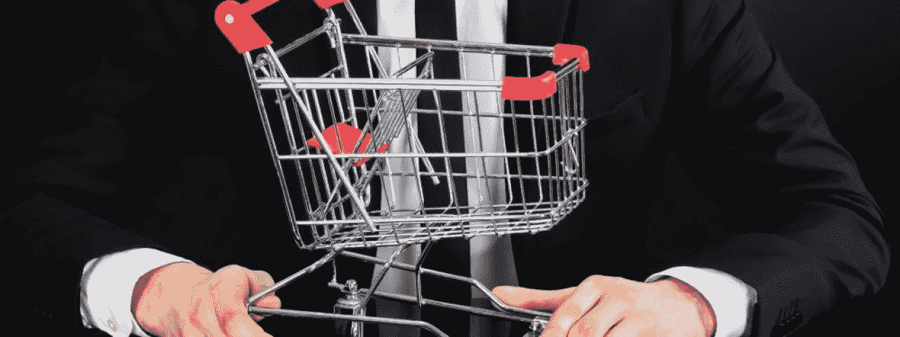
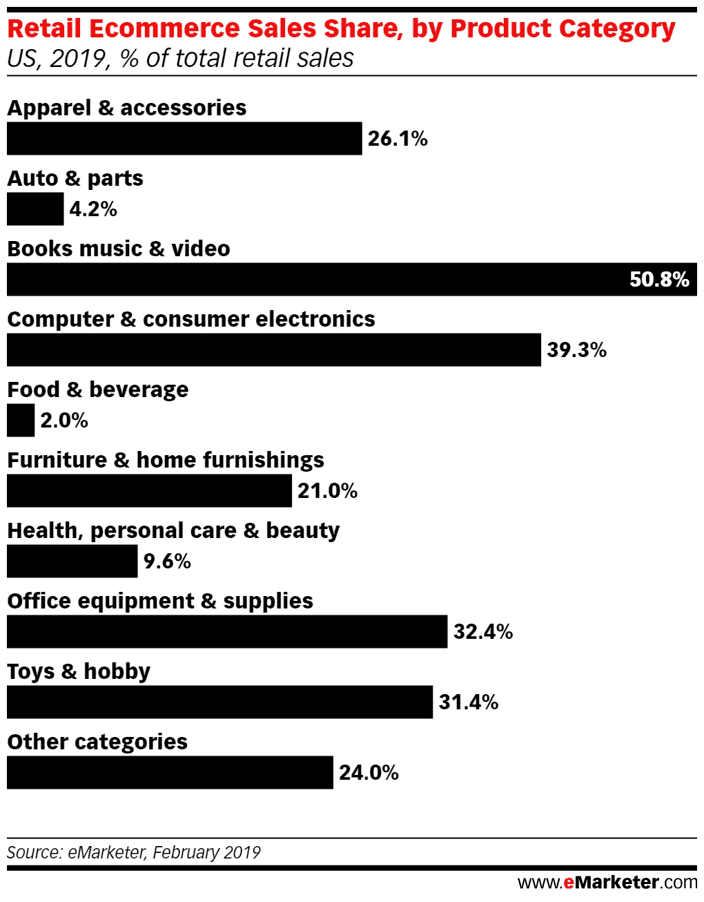

# 在下一次大的电子商务爆炸中，这些部门将会成为主角

> 原文：<https://medium.datadriveninvestor.com/the-sectors-that-will-star-in-the-next-big-ecommerce-bombings-1c88963ca6cf?source=collection_archive---------12----------------------->

## 在不久的将来，食品将成为电子商务增长的主要因素之一。

在市场中取得成功的最重要的关键之一是知道下一次大的消费热潮将来自哪里。这些公司的战略基于一个非常重要的部分，即猜测消费者现在想要什么，以及他们在不久的将来想要什么。他们需要预测自己的需求，设计、营销和销售消费者想买的东西。

互联网的繁荣以及网络在消费者习惯中——以及在各个层面的购买过程中——日益增长的影响力，意味着企业不得不开始着手解决另一个决定性问题。为了未来，他们必须突出自己的位置。在新的参与者接管市场、信息和与消费者的联系之前，他们必须预测消费者想要什么和必须做什么。

鉴于近年来网络中诞生了许多公司，这些公司发现了市场的新脉络，并走在了变革的前面，对于那些能够在这个新兴领域稳固定位的“老”公司来说，这比以往任何时候都更加重要。

未来的消费场景会是怎样的？什么将主导市场，潜在客户将以不同的方式越来越多地消费什么？电子商务正在触及越来越多的领域，让消费者通过网络购买越来越多的东西。在这场消费竞赛中，为了让自己在采购过程中占据突出地位，企业现在不得不假设，在线消费的范围越来越广，而“下一个大事件”可能发生在传统上认为自己不会进入电子销售的领域。

因此，电子商务未来最有潜力的市场是非常引人注目的。正如 eMarketer 的[分析](https://www.emarketer.com/content/these-three-industries-have-huge-potential-online)所指出的，个人护理产品、汽车产品以及食品和饮料在电子商务热潮中有些不受控制。然而，如果仔细分析你的现在和潜在的未来，你会发现潜在的增长空间很大。这是下一个电子商务的重磅炸弹。

# 未来炸弹的钥匙

毕竟，50.8%的图书、音乐和视频销售市场(在美国)已经掌握在网络和 39.3%的电子产品销售手中。相比之下，汽车产品为 4.2%，个人护理产品为 9.6%，食品和饮料为 2%。它们是他们在 eMarketer 中处理的数据，以及他们认为在不久的将来会改变的数据。

例如，在个人护理市场，消费者趋势的变化正在影响着商品的销售方式。到目前为止，他们控制着消费品巨头，这些巨头在将消费引入网络方面进展缓慢。如果东西是在他们的传统网络中出售的，这个行业就把它们留在那里。然而，在这个市场受到重创的直接消费品牌的繁荣正在改变这一切。

这些品牌利用互联网作为接触消费者的途径进行销售，并利用这一工具为自己定位。也就是说，它成功的关键是利用互联网来定位自己和销售，这在广义上对市场发生的事情有直接影响。随着它们成为新兴事物，然后出现在标记议程的品牌中，它们也带来了电子商务市场的增长。

# 喂养的例子

但毫无疑问，最引人注目的变化可以在食品市场上看到。这片土地上的产品消费与实体店紧密相连。购物包括去超市看看买的是什么。网上超市能改变现状吗？

事实是，时代的变化已经使网上超市不再是一个遥远的想法，它与公众的联系越来越密切。

eMarketer 的分析并不是第一次指向这个方向。几个月前，Kantar Worldpanel 的一项研究已经指出，尽管食品和消费品的在线销售仍然很低，但电子商务的增长高于该行业的整体增长。食品和消费品市场的一般销售额上升了 1.6%。然而，电子商务增长了 13%。一些特定的市场，如中国或美国，也在大规模快速增长。

# 为什么他们现在在成长

根据 Kantar 的报告，这一增长的关键是传统商业巨头进入利基市场。阿里巴巴和亚马逊在他们的网上超市上下了赌注，结果显示。

eMarketer 的分析也是如此。他们指出，超市巨头正在网上销售方面进行大量投资。美国巨头沃尔玛在电子商务发展上投入了大量资金，但其电子商务销售额在一年内增长了 40%。就电子商务巨头而言，也有百万富翁运动来创造在食品市场定位所需的肌肉。亚马逊收购全食超市就是如此。

为了在行业中找到自己的位置，他们必须拥有一个大型的在线基础设施，并了解电子商务是如何工作的(这是超级个人巨头所缺乏的)，并且必须拥有必要的网络，以便在广阔的地域内进行快速交付(这是电子商务巨头所没有的，他们没有连锁的实体超市来支持他们的工作)。

消费者更容易接受在网上购买食品，部分原因是电子商务比以前更多地出现在他们的生活中，部分原因是他们已经在其他层面上这样做了。网上食品和餐馆订单的繁荣打破了第一个进入壁垒。