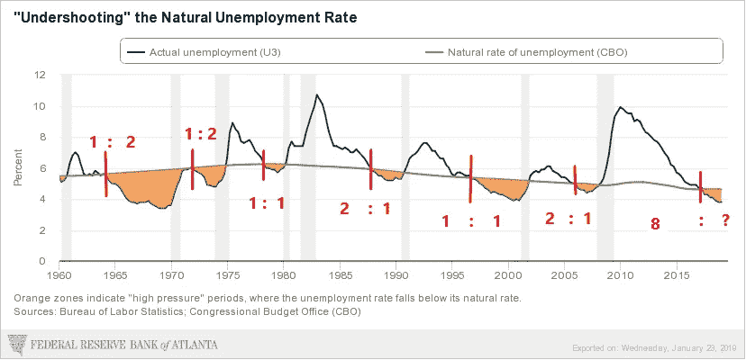
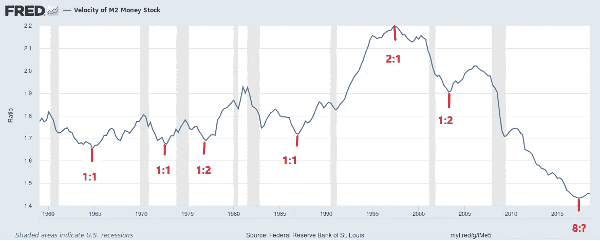

# 长期牛市还有几年的寿命

> 原文：<https://medium.datadriveninvestor.com/the-secular-bull-has-several-years-of-life-left-a06bfc4c9353?source=collection_archive---------5----------------------->

自回调开始以来，人们普遍认为，美国经济正处于崩溃边缘，股市已进入熊市。此外，自调整开始以来，我们一直认为经济甚至没有接近衰退，也没有达到市场顶部的乐观确定性。在这篇文章中，我们得出的结论是，当前的牛市还有 2 到 14 年的寿命。这听起来可能很疯狂，但当你与大多数人唱反调时，听起来往往就是这样。

# 高压经济

“高压经济”是指将失业率推至被认为是自然长期失业率(T3)以下的经济。对于自然失业率的水平，没有一个普遍接受的定义，但它通常被定义为可持续且不会导致更高通胀的水平。美国现在处于高压经济中，失业率为 4.0%，低于 4.6%的自然失业率。高压经济总是出现在扩张期的后期，是衰退的前奏。*问题是:一个经济体在陷入衰退之前会保持多长时间的高压？*

每一个扩张期(衰退之间的时期)都是以失业率高于自然失业率开始的，在每一个扩张期都会有失业率低于自然失业率的时候(下图中的红色垂直线)。自 1960 年以来，在六个扩张期内，非高压期与高压期的时间比率有所不同；发现了三种不同的比率，1:1、1:2 和 2:1，每种比率都出现了三分之一的时间(见下图)。

来源:ANG Traders，亚特兰大联邦储备银行。

当前的扩张在 2017 年变成高压，扩张进入第八年，并持续到今天，但还能持续多久？如果我们考虑 2:1 的比例，它可以再持续两年，如果 1:1 的比例发生，再持续六年，如果 1:2 的比例成为现实，再持续十四年。这给了我们一个理论范围，在我们看到衰退之前还有 2 到 14 年。这听起来很疯狂，当然*不是大多数分析师所说的*，但它支持了一个结论，即**我们正处于熊市的开端*而不是*。**

# M2 速度

同样的模式也出现在 M2 货币存量的速度上(见下图)。在这种情况下，扩张期从速度下降开始，达到拐点(下图中的红色垂直线)，然后随着衰退的临近而增加(只有 1991-2001 年是相反的)。

来源:ANG Traders，FRED。

在拐点之前的时段*的长度与拐点*之后的时段*的长度之比与我们在上面的非高压/高压比中看到的相似。1960 年以来的 6 次扩张期，3 次是 1:1，2 次是 1:2，1 次是 2:1。*

M2 速度的当前拐点发生在 2 年前(2017 年)和扩张开始后的 8 年，这与当前高压经济的开始相匹配，并导致下一次衰退的相同时间可能性:如果比率为 2:1，则为 2 年；如果比率为 1:1，则为 6 年；如果比率为 1:2，则为 14 年。(上图)

大多数分析师都在呼吁“牛市结束的开始”。当你反对大多数人时，你听起来很疯狂。然而，我们发现大多数人在大多数时候都是错的。市场距离熊市至少还有 2 年，甚至可能长达 14 年。剩下的时间还多着呢。

**昂商**

**在**[**www.angtraders.com**](http://www.angtraders.com)**加入我们，复制我们的交易和利润。**

## 来自 DDI 的相关故事:

 [## 为什么数据会改变投资管理

### 有人称之为“新石油”虽然它与黑金没有什么相似之处，但它的不断商品化…

medium.com](https://medium.com/datadriveninvestor/why-data-will-transform-investment-management-4a60966c1c81)  [## 股票市场投资的机器学习

### 当你的一个朋友在脸书上传你的新海滩照，平台建议给你的脸加上标签，这是…

medium.com](https://medium.com/datadriveninvestor/machine-learning-for-stock-market-investing-f90ad3478b64)