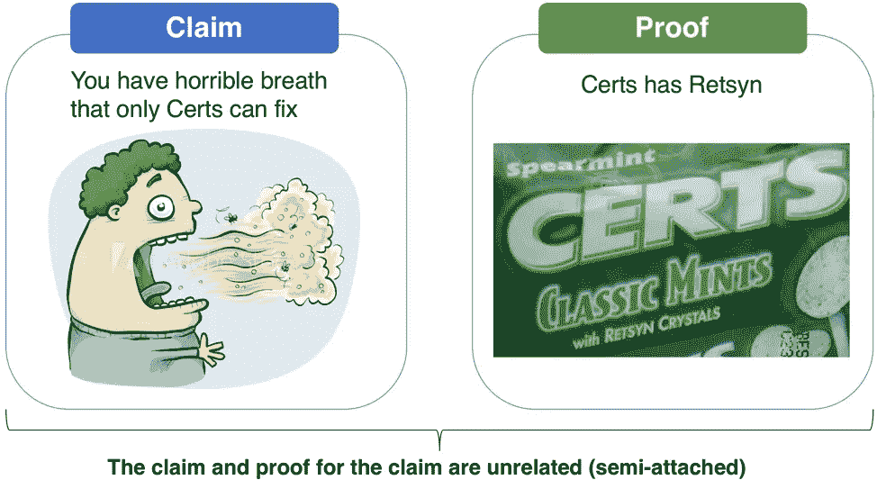
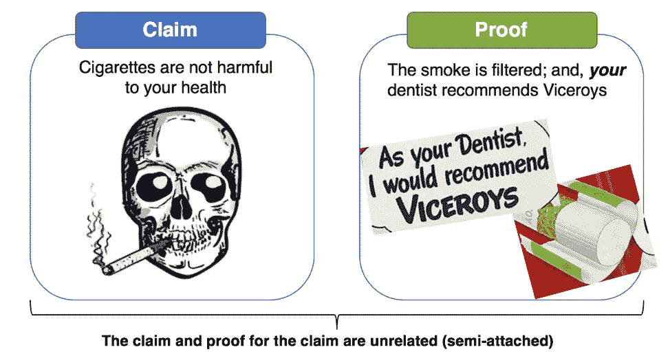
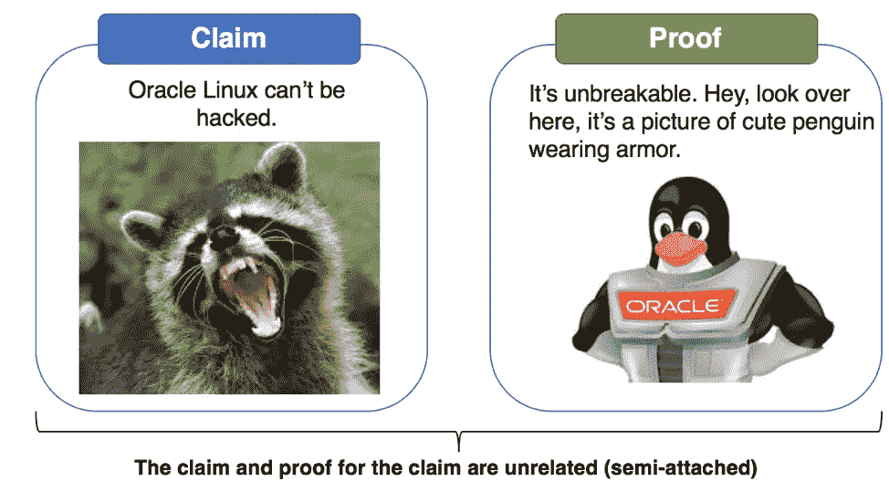
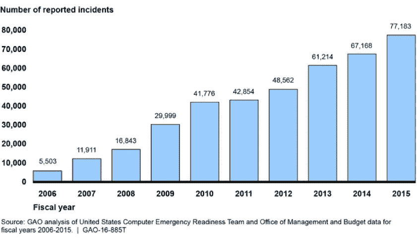
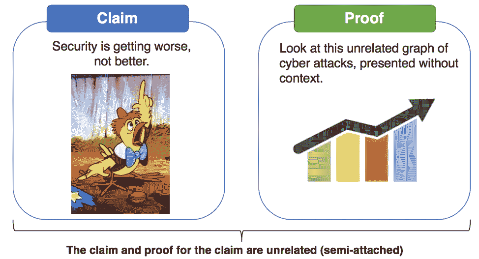
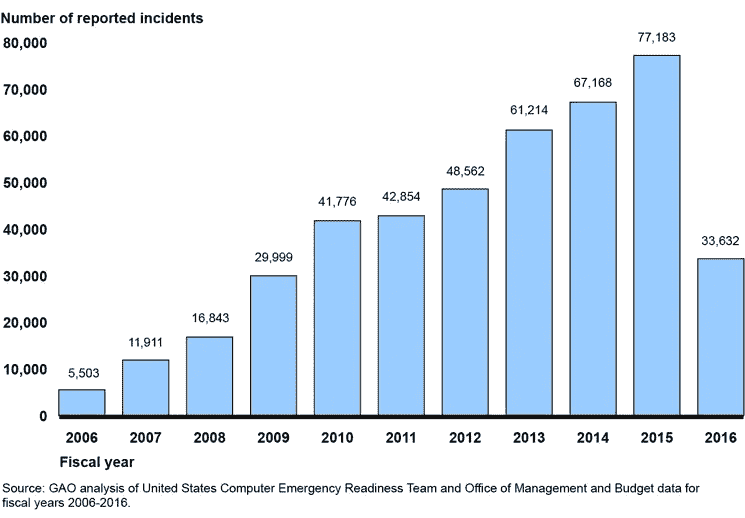

# 半附图:如何识别操纵型安全广告宣传

> 原文：<https://medium.datadriveninvestor.com/the-semi-attached-figure-how-to-spot-manipulative-security-advertising-claims-7dfa259e2484?source=collection_archive---------58----------------------->

> 如果你不能证明你想证明的东西，那就证明别的东西，假装它们是同一个东西。在统计数据与人类思维碰撞后的茫然中，几乎没有人会注意到这种差异。
> ——达雷尔·哈夫《如何用统计数据撒谎》

在所有欺骗统计数据和操纵人们认知的方式中，*半附属人物*可能是最普遍的。除非你真的在找它，否则很难发现它，因为它偷偷摸摸，很微妙，需要相当多的集中分析才能识别。当对一个主张给出证明时，出现半附图，但当读者仔细看时，证明和主张是不相关的。之所以称之为“半附”是因为证据*似乎*支持一项主张，但经检验，并非如此。营销和广告专业人士绝对是半附图高手。

如果没有具体的例子，半附加图是一个很难理解的概念，所以让我们从安全领域之外的一些简单的营销声明开始。

# 例 1:现在，用 Retsyn！

这个例子是由 David Lavenda 在 FastCompany 的一篇文章中提到的。这是一个持续了几十年的如此熟悉的广告活动，以至于我们大多数人都能凭记忆背诵其中的一部分。也是半附图最好的例子之一。

在 [Certs 广告](https://www.youtube.com/watch?v=C6qCSxojRes)中，旁白说“想要清新、干净的口气吗？获得唯一的 Retsyn 薄荷，”或类似的口号。大多数观众会听到这句话，并无意识地接受“…与 Retsyn”这句话，作为 Certs 给人清新口气的证明。听起来不错——实际上听起来很棒！听起来会让臭臭的口气不那么臭。这里是*声明*和*证明*半附在一起的地方:你们这些观众，有口臭，需要证据来说明为什么你们应该购买证书。这就是证据——Certs 有 Retsyn。

Retsyn 到底是什么？根据 Slate 的一篇文章，它是“……天然调味料、部分氢化棉籽油和一种叫做葡萄糖酸铜的营养补充剂，它们都不会杀死细菌。”证据和主张没有任何关系，但作为一种营销技巧，它非常有效。

# 例 2:这些香烟对你的健康有益

第二次世界大战后到 20 世纪 70 年代初是美国烟草营销的黄金时代，在此之前，广告限制还没有到位。香烟广告淡化了吸烟的不健康影响——在许多情况下，制造了吸烟实际上是健康的例子，并治愈了各种疾病，尽管在 20 世纪 40 年代吸烟和肺癌之间有很强的统计联系

20 世纪 80 年代及以后出生的人可能从未见过香烟广告，或者对香烟广告有模糊的记忆，也许忘记或不知道烟草营销曾经是多么阴险地操纵。由于 20 世纪 50 年代开始积累的大量证据表明，香烟会导致严重的疾病和死亡，广告不得不通过推动“酷因素”来抵消这一信息，淡化健康问题，吹捧好处。为了说服人们购买香烟，与大量证据表明他们不应该购买相反，营销必须找到新的有效方法，并直接利用人类的情感。半附着体在实现这一点上起着至关重要的作用。

总督香烟公司 1949 年的广告是半附图形的完美应用。这是在公共健康倡导者开始讨论吸烟和癌症之间的联系时出现的，这个广告试图反驳这一信息。

这里的说法隐含着:香烟对你的健康无害。这里提供了两个证据:首先，总督过滤了烟雾。(事实是不相关的:研究表明过滤器[可能增加肺癌风险](https://www.reuters.com/article/us-health-lungcancer-cigarette-filters-idUSKBN18I2MT)。第二个证据是，**你的**牙医推荐了 Viceroys，还有一幅牙医的漫画。这里的问题很明显。牙医不是真实的——但是读者会被引导去想，要么这个人是他们的牙医，要么真正是他们牙医的人肯定也会推荐总督。

# 例子 3:到底什么是牢不可破的？

*The Unbreakable Linux bus at the RSA conference*

大约从 2005 年开始，在帕洛阿尔托和旧金山之间的 101 高速公路走廊上，甲骨文广告开始出现。它的特色是一个装甲 Linux 企鹅吉祥物和标语“牢不可破的 Linux”同样的广告在 RSA 安全会议上出现了好几年，出现在往返于莫斯科恩会议中心和地区酒店的公共汽车上。这种说法指的是一款名为 Oracle Linux 的产品，它基于 Red Hat。甲骨文也用“牢不可破”这个词来指代其他软件产品。

这是一个典型的半附图形——Oracle 做了一个声明“牢不可破”，并引导读者将该声明与一个软件相关联，并假装它是同一个东西。这种说法和证据利用了这样一种看法，即与竞争对手相比，Linux 享有更高的稳定性。当然，软件并不是“牢不可破的”(没有软件是牢不可破的)，而且 Oracle Linux 已经遭受了多年来所有版本的 Linux 都经历过的许多相同的漏洞。

牢不可破。这个 Linux 发行版不能…什么？被黑？经历停机？打补丁不重启？这是指高可用性吗？这很容易让人想起《和瑞瑟恩在一起》这听起来很棒，但是当它真正被分析的时候，读者会思考，*这到底是什么意思？*

甲骨文仍然使用“牢不可破”这一术语，但[收回并承认](https://www.securityfocus.com/news/309)这是一个营销口号，描述了甲骨文对产品安全性的承诺，并不涉及任何特定的产品、功能或属性。

甲骨文对夸张并不陌生。这是同一家公司，它的营销口号曾经是“[不能打破它。不能闯进](https://books.google.com/books?id=En_15We7fjUC&pg=PA154&lpg=PA154&dq=%22Can%27t+break+it.+Can%27t+break+in.%22&source=bl&ots=PxaDfcz_lo&sig=RcjXh-J9xX9fb5Fk3DDg3baUoOI&hl=en&sa=X&ved=0ahUKEwjomdT3s5_cAhXVHTQIHQr8A_gQ6AEIWzAI#v=onepage&q=%22Can%27t%20break%20it.%20Can%27t%20break%20in.%22&f=false)。”

# 例 4:我们赢得了网络竞赛！

100%真实故事；为了保护罪犯，只改变了名字。

分时度假、二手车和网络安全厂商销售人员在我心中都有特殊的地位。许多年前，我在一个安全供应商的销售活动中，销售人员在屏幕上投影了这张联邦机构从 2006 年到 2015 年报告的网络安全事件数量的图表。该供应商正在销售下一代防火墙技术。

当供应商开始推销时，面对摆在我们面前的图表上的严峻现实，房间里一片寂静:

“看看这张图表，从 2006 年到今天，网络攻击增加了 10 倍以上！我们在打仗。这证明我们正处于网络战争中，你必须保护自己。您现有的设备无法保护您的公司免受这些无情、复杂、先进和持续的攻击……”

推销员说了又说。我喜欢这样的东西。我喜欢小贩们围绕着一座纸牌屋搭建摊位:轻轻一敲，一切都散了架。这里的半附图呢？

小贩试图引导我们相信天要塌下来了。也许是，也许不是——我有足够的理由相信，某种与网络有关的厄运即将来临，但这张图表与此无关。为了找到半附图，我们来问几个试探性的问题。

*   从 2006 年到 2015 年，网络攻击似乎有所增加。为什么？2015 年的电脑比 2006 年多吗？
*   攻击目标和水面对攻击的比例是多少？
*   2015 年对攻击的检测是否比 2006 年更好，这意味着我们有能力检测和测量更大范围的攻击？
*   这里衡量的是什么？
*   联邦政府认为什么是攻击？
*   针对联邦政府的攻击与我的公司(当时是一家银行)有什么关系

声明是:除非我们升级防火墙，否则我们会被黑客攻击。证据就是这张图表——来自一个不同的部门，没有上下文，使用一种未知的测量方法。

上图是 2015 年的。请看下面的 2016 年图表——我有个好消息！我们赢了网络比赛！

不，对不起，我们没有。联邦政府在 2016 年改变了网络攻击的定义和报告要求。他们不再认为简单的端口扫描是一种攻击。换句话说，从 2015 年到 2016 年，被测量的内容和测量单位都发生了变化。不仅卖主的推销是一个半附属的数字，推销员也犯了*后谬误*，也就是所谓的相关性并不意味着因果关系。

# 如何识别半附图形

虽然使用半附着数字是操纵，它不太可能很快结束。它太有效了。请记住，最有效的营销是利用人性中最大的恐惧和渴望。这里有一些辨别和抵制半身材诱惑的建议。

任何人都可以用数字、图表、数据可视化或统计数据来证明自己的主张。仅仅因为某样东西有一个数字或者看起来“科学”，并不意味着它可以被自动信任。

点一下声明，比如有“本产品让你防黑客”或“牢不可破！”有什么佐证？扪心自问:证据是支持主张的，还是半附的？

最后，要特别警惕权威人士:医生、牙医、网络安全专家、首席执行官或前任或现任政府官员。这可能是一个合理的意见或认可，但也要记住，如果得到足够的报酬，几乎每个人都会说几乎任何话。

这是对读者的一个挑战:在你读完这篇文章后，下次你在 Blackhat 或 RSA 供应商博览会大厅时，想想半附图。你看到几个？

这篇文章是题为 [*如何利用统计数据，信息安全版*](https://www.tonym-v.com/blog/2018/07/10/how-to-lie-with-statistics-information-security-edition) 的系列文章的一部分——请访问链接阅读更多内容。

【www.tonym-v.com】最初发表于**。**