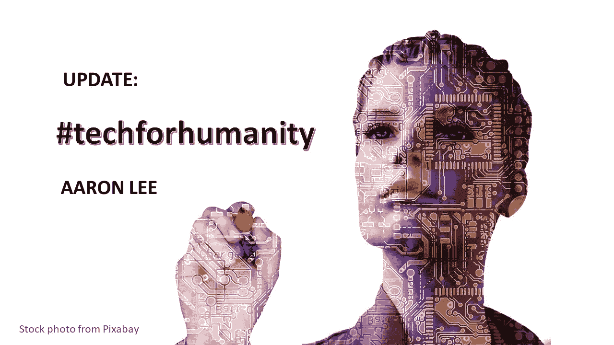
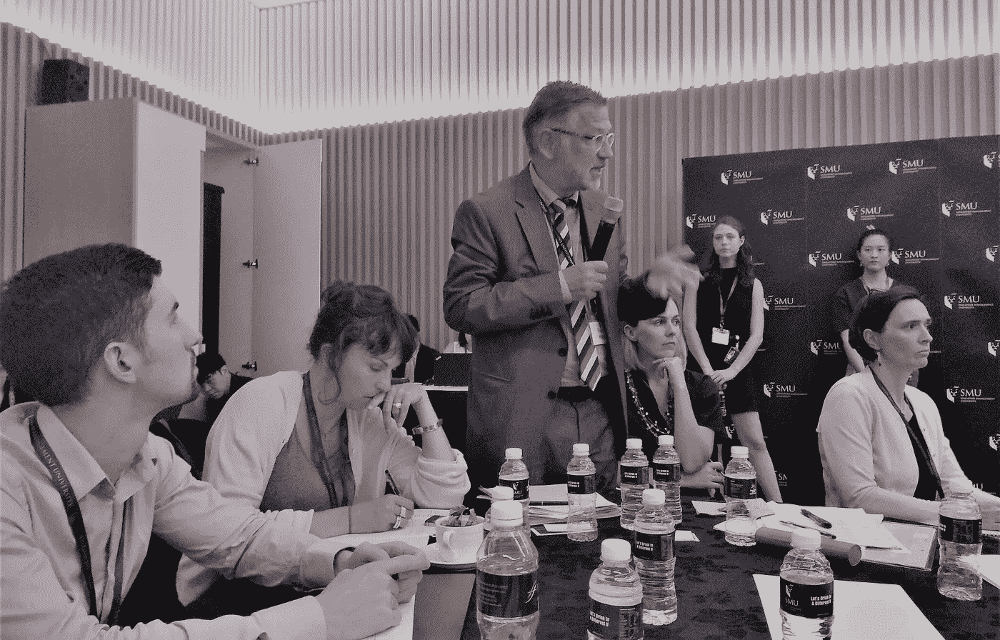
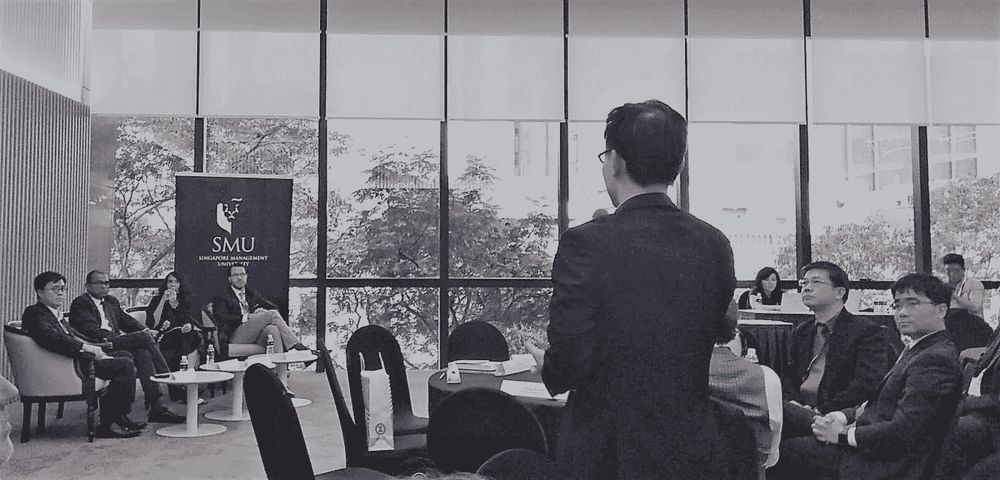

# 秘书长关于人工智能和伦理的对话扩大…

> 原文：<https://medium.datadriveninvestor.com/the-sg-dialogue-on-ai-and-ethics-widens-fa8e5a33b76d?source=collection_archive---------13----------------------->

# 请不要陷入歇斯底里，好像 AI 要抢走我们所有的工作，只剩下我们写诗。—马利维卡·贾亚拉姆

在最近由新加坡管理大学法学院主办的新加坡人工智能会议之后，有很多东西需要思考。这一里程碑式的事件由伯克曼·克莱恩中心(哈佛大学)共同举办，作为其全球人工智能对话系列的一部分。它汇集了几十名法律学者，伦理学家，政策制定者和人工智能技术从业者，分享了各种利益相关者对人工智能的道德和治理的观点。

2018 年 6 月 5 日，新加坡个人数据保护委员会(PDPC)发布了一份关于人工智能的讨论文件，提出了一个基于问责制的框架，用于讨论人工智能商业部署的伦理、治理和消费者保护影响。这篇论文概括了与会者提出的许多想法。

会议开始时，Yeong Zee Kin(PDPC 副专员)说，他期待正在进行的磋商取得一些重要成果:

1.将相关利益相关者聚集在一起，建立一个可信赖的生态系统；

2.通过促进负责任的数据使用的自愿公司治理框架来支持人工智能的采用；和

3.随着人工智能采用的扩大，资助研究以确定和创建法律、监管和政策问题的解决方案。

Yeong 先生敦促所有利益相关者提高思考人工智能和伦理的底线。他告诫不要急于立法和监管。相反，利益相关者可以共同创造法律解决方案，提供清晰度，并帮助采用和负责任地使用人工智能技术。他还承认，道德原则因国家而异，即使在阐明和追求核心原则和价值观时，也应尊重这些差异。考虑到人工智能中激增的用例和能力，我们会以这样一种方式使用这项技术，即每一个决策都是自动化的，还是我们只会自动化一些决策，从而反过来增强人类的判断？

会议的其余时间探讨了其他重要的次主题:扩大参与；数据隐私问题；风险管理模式；技术开发商和供应商的透明度和问责义务；信任是社会契约和基本货币(不止一名与会者重申了这一主题)；人工智能技术中的知识产权保护，甚至政府的不同(可能是冲突的)角色。

*Prof Dr. Reto M. Hilty of the Max Planck Institute for Innovation and Competition, led an exploration of the role of AI in IP creation and vice versa*

在自动驾驶汽车的使用背景下，马克·芬利教授令人信服地谈到了人类能动性的削弱，以及公众信任与普通人的内心息息相关。

在金融科技领域，一位与会者提到，部署人工智能技术的银行将因此降低运营成本，提高竞争力。他承认，其结果是，许多银行家将被机器取代。我有机会回应这个评论——不是否认成本节约，而是预计最新的技术创新对银行的破坏性将比大多数人想象的更大。金融机构的结构和角色必须被重新思考和改革。我补充说，作为一名 RegTech 从业者，我希望人工智能和分析能够帮助银行优先考虑做正确的事情，就像做正确的事情一样。

下午同时举行了三场分组会议，主题是自动驾驶汽车(在人口稠密、土地稀缺的新加坡，陆路交通确实是一个持久的问题)；人工智能和知识产权；以及 AI 技术的政府采购。

整个会议重新召开后，关键要点得到了分享和强化。随后，高级国务部长 Janil Puthucheary 博士、Urs Gasser 教授(伯克曼·克莱因中心)、Malavika Jayaram(数字亚洲中心)和 Yeong Zee Kin (PDPC)进行了自由对话。在所有坦诚的分享中，我认为我看到了新加坡政府在监管人工智能技术方面一种有目的但“温和”的方式。

*The public panel discussion was enriched by questions and observations from the floor*

最后一项事务是由国务资政兼 SMU 总统孔教授正式启动 SMU 人工智能与数据治理中心。SMU 法学院院长吴作栋教授发表了富有远见的演讲并主持了会议。

许多与会者称赞新加坡在人工智能发展领域的参与。这是一件值得高兴的事情，但显然，在开拓性工作和思想领导力方面，人们对我们的期望很高。对我来说，公众的信任是这次会议的一个关键主题，这将需要进一步打开包装。人们普遍意识到，技术颠覆将比我们所知的更深远，对社会更具革命性和变革性。一些影响来自人工智能(洞察力、决策和自动化)的使用，一些来自分散化技术的采用，如区块链，据称不仅值得信任，而且不值得信任。我建议，在人工智能和伦理对话从“风暴”阶段发展到“规范”阶段之前，对话应该升级到议会(公开)，就像在英国和加拿大等国家发生的那样。否则，普通人只会在遇到像 AVs 这样的人工智能产品或为人工智能技术造成的伤害寻求法律救济时，才会第一次考虑自己的权利和责任。AI 臭名昭著的“黑箱”问题可能永远无法解决；然而，为了以人类为中心的方式开发和使用这种技术，lambent 伦理推理必须照亮前方的道路。

# 不要因为想把事情做好而忘了做正确的事情。—亚伦·李