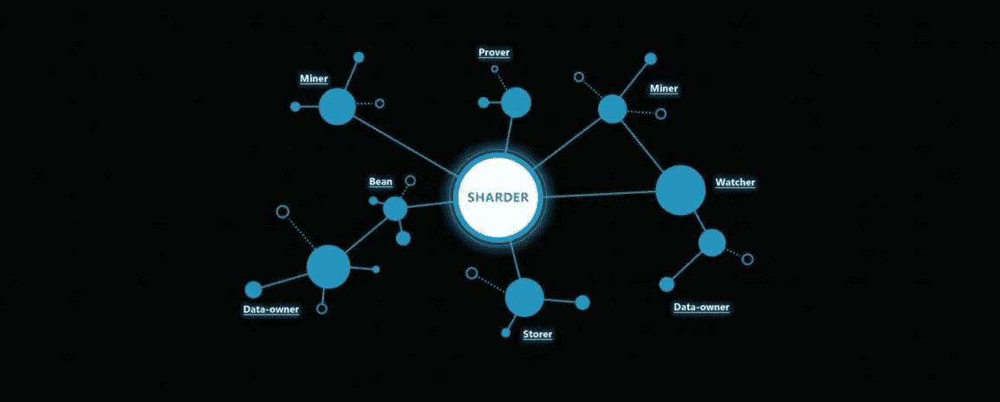
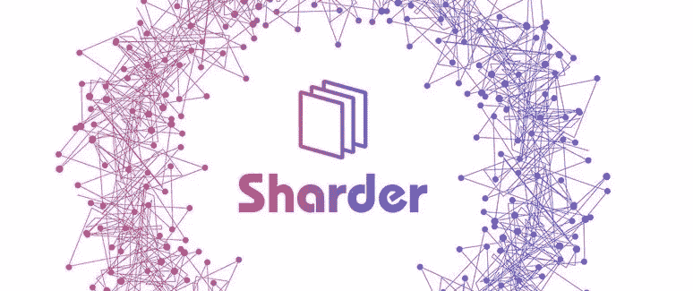
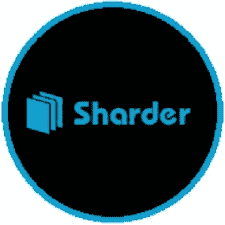

# 碎片集线器和盒子:碎片的硬件

> 原文：<https://medium.datadriveninvestor.com/the-sharder-hub-and-box-the-hardware-of-the-shard-8d0806994e78?source=collection_archive---------16----------------------->

**简介:Sharder 协议的硬件设备**

**The Sharder Protocol Is A Cross-Chain Distributed Data Storage Solution For All Public Blockchains!**

Sharder 协议为投资者提供了从他们的微节点矿工中获利的独特能力，使个人能够终生获得被动收入。2019 年将是我们钟爱的协议取得成功的一年，我们的 Hub 和 box 将在全球推出。Sharder 协议现在正在测试他们的集线器，为最终发布到 populous 做准备。Sharder Hub 是一个微型节点挖掘器，它连接到 Sharder 网络并挖掘发生在 Sharder 网络中的事务。同时，分片器是一个硬件设备，使个人能够因为在协议中扮演不同的角色而获得多倍的金钱奖励。节点可以用于货币补偿的潜在角色的几个例子是存储者、证明者、观察者和挖掘者。一个商店听起来正是它的名字；存储者的任务是为数据存储提供磁盘容量，这使得该节点能够为渴望使用我们协议的数据存储服务的消费者提供网络存储而获得回报。证明者是嵌入在 Sharder 协议中的角色，它将数据转换成数字资产，然后增加数据的公共可信度。证明者的证据数据，结合原始数据对象，将被记录在链上。由于区块链技术中嵌入的不可变特性，所有数据都是可追踪和不可变的。观察者是网络的监督者，防止任何恶意软件或节点破坏网络或篡改整个网络。Watchers 观察整个网络状态，根据安全策略检查安全状态，修复现有或潜在的漏洞。观察者将持续在线，以确保整个网络的保护和完整性。它们对于整个网络的快速收敛至关重要，并且是数据索引的完美选择。当使用碎片盒时，一个人会像一个 MMORPG 人一样玩这些游戏，然后保持网络的安全性、成熟性和完整性，同时得到 SS 硬币的补偿。Sharder Box 和 Hub 实现终身被动收入！

**碎片的令牌:它在碎片硬件设备中的作用**

**The Sharder Token Plays A Pivotal Role Within The Sharder Ecosystem**

Sharder 令牌在 Sharder 生态系统中扮演着关键角色。它被用作交换整个生态系统中使用的服务的一种方式，包括构建在 Sharder 生态系统中的 d'apps，如 Bean Cloud、Sharder Matrix、Sharder Box 和 One Fair。例如，Sharder Token 可用于购买生态系统内的数据，随着 Sharder 生态系统的持续增长，令牌价值的货币到期日得以延续。当使用 Sharder Hub 和 Box 时，必须下注最小数量的 SS 来赢取奖励，这为网络增加了价值主张。到目前为止，还没有什么是确定的，但是，有传言说，当使用中枢时，至少需要 20k 的 SS，当使用盒子时，至少需要 100k 的 SS。这提供了购买令牌以获得被动货币补偿的激励，同时，Sharder 是 DPOS(授权的股份证明)，这意味着个人持有的 Sharder 令牌越多，该特定节点在 Sharder 网络中挖掘更多块并获得更多奖励的机会就越大。随着 Sharder 生态系统开始成熟并在全球舞台上得到利用，有多种途径可以使代币的价值永久化！最后，不仅仅是一个单独的采矿者可以使用这个中心，一个单独的矿工也可以开采 IPFS 金币！这将使个人能够选择他们是否想要开采沙德尔硬币或 IPFS 档案硬币！

**测试测试:Sharder Hub 的进度**

**Over The Course Of The Last Two Months, Testers From Around The World Are Testing Our Hub’s**

在过去的两个月里，四十名测试人员被授予了测试我们的 Sharder Hub 微节点挖掘器的能力和特权。对于在全球范围内测试我们网络的每一个人来说，这次测试无疑是一次成功。迄今为止，从测试开始，没有报告任何错误，中心的设置过程非常简单，我们提供了如何设置中心的手册。矿工可以争夺每天 61，500 SS 奖励的一部分，任何节点都可以通过在 Sharder 网络内进行采矿交易来获得这些奖励。Sharder 团队的目标是在 2018 年第四季度末，最迟在 2019 年 Q1 发布 Sharder Hubs，供全球发布。同时，Sharder Box 将于明年年初发布，因此个人可以购买 Box 和 Hub，将两个主动节点连接到网络，然后通过使用我们的硬件在余生中获得被动收入。目前，Sharder Hub 的成本大约为每台 100-199 美元。您购买的 Hub 越多，当您将 SS 代币作为一个整体下注时，您收到的被动收入就越多，为使用我们 Hub 和 Box 的人提供了金钱利益！随着越来越多的节点由一个个体连接到网络，它们将有更好的机会整体挖掘块。Sharder Hub 的测试将在未来几周内结束，因为我们正在为 Sharder Hub 的全球发布做准备！自 2018 年 11 月 4 日以来，我在运行我的 Sharder Hub 时没有遇到任何困难，整个网络也没有报告任何错误。

**结论:碎片的数学方程式:赌注+ Hub=终身被动收入**

**Sharder Enables Individuals To Obtain Passive Income For Life**

Sharder Hub 是一种廉价的硬件设备，使单个节点能够在利用 Hub 或 Box 时获得经济利益。只花 100-199 美元购买 Sharder Hub，并通过获得金钱补偿来收回这笔钱，这对所有人来说都是一个巨大的经济机会！Sharder Hub 的测试阶段即将完成，团队开始准备 Sharder Hub 的最终生产和发布。很荣幸地声明，在测试中心期间没有记录到任何错误；它为 Sharder 团队在这些 Hub 中付出的辛勤工作开创了一个先例，因为我们准备开始我们的旅程，通过 Sharder Hub 和 Box 获得全球观众的曝光和关注，这是我们的革命性产品，使个人能够终身获得被动收入！

*有兴趣了解加密货币和区块链技术吗？报名参加我在 Udemy 上的课程吧！*[*https://www . udemy . com/cryptocurrency-investment-a-初学者-指南/学习/v4/*](https://www.udemy.com/cryptocurrency-investment-a-beginners-guide/learn/v4/)

*免责声明:加密货币投资需要大量的风险，不要投资超过你能承受的损失！我不是金融顾问，也不对你的任何交易负责。我是 Sharder Token 的投资者，本文中的信息代表我自己的想法和观点。在投资任何东西之前，你都必须做好自己的研究，这是义不容辞的。*