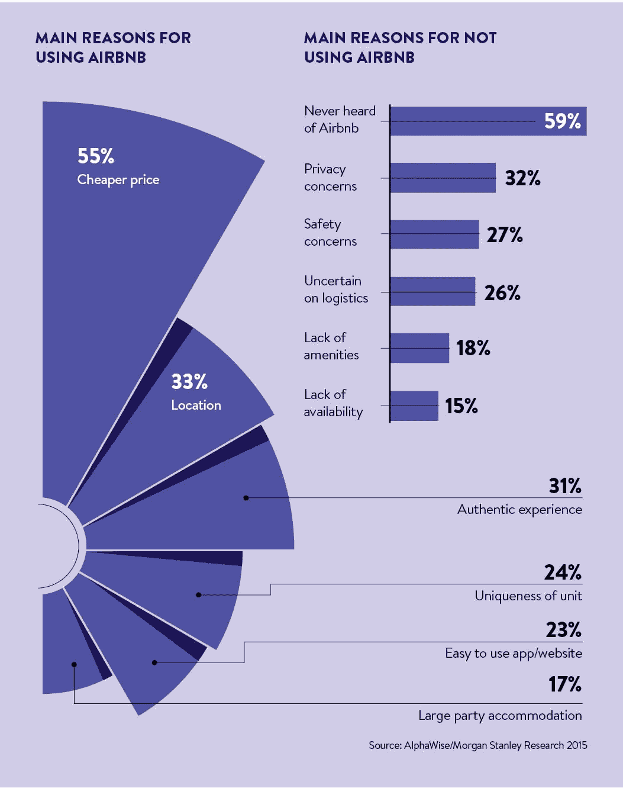

# 共享经济将会继续存在

> 原文：<https://medium.datadriveninvestor.com/the-sharing-economy-is-here-to-stay-9638d710b1ac?source=collection_archive---------6----------------------->

Photo by [Neil Soni](https://unsplash.com/@neilsoniphotography?utm_source=medium&utm_medium=referral) on [Unsplash](https://unsplash.com?utm_source=medium&utm_medium=referral)

不断增长的创业文化席卷全球，颠覆了几个旧行业，同时也创造了新行业。在过去的几年中，一个相对较新的概念“共享经济”被创造出来，许多公司都在探索这个领域。Airbnb 和 WeWork 是世界上估值最高的两家初创公司，总估值接近 1000 亿美元。这些巨头是共享经济“浪潮”的缩影(一些人喜欢这样称呼它)，并且没有放缓的迹象，部分原因是顶级风险投资基金的大笔投资(当然包括软银！)在世界上，部分(也是更重要的)是由于它不断扩大的用户群。虽然有些人可能会认为两者是齐头并进的，如果每月活跃用户在增加，为什么有人会停止向企业投资，但情况并不总是如此，还记得 Vine 吗？(RIP)。但许多其他因素也是共享领域所有公司崛起的催化剂。

什么是共享经济？

A.一种经济体系，在这种体系中，私人之间免费或收费地共享资产或服务，通常通过互联网进行。

 [## 经济就是包容人|数据驱动的投资者

### 建模，数据，最重要的是，人 Tayo Oyedeji 博士在他的食谱中混合了所有这些成分，为一个…

www.datadriveninvestor.com](https://www.datadriveninvestor.com/2019/03/06/economy-is-all-about-including-people/) 

所谓的“千禧文化”是这类企业崛起的关键，或者我应该说，甚至是这类企业的存在。美国千禧一代往往更重视体验而不是物质，我们更关心一个地方(或一个物体)的“审美”而不是任何东西。我们也不介意为此支付更高的价格。此外，我们更喜欢租赁或借用商品，而不是拥有它们。不要忘记，产品/服务应该是“instagramable”，因为如果不是，那还有什么意义呢？对！

这些因素的结合导致了许多创业公司的蓬勃发展。以 Airbnb 为例，谁会想到我们会支付额外的费用去住在一个陌生人在不同国家的地方！很荒谬，对吧？不完全是。为了真正抓住这个地方的精髓和它的文化，你需要抛弃酒店，和当地人住在一起，至少 Airbnb 希望我们这么认为。我真的相信他们的故事卖得很好。2018 年，他们的预订量超过了 1 亿。尽管它有相当多的争议，但它们都设法保持了相对的干净。

WeWork 也是如此，尽管它只是一家办公场所租赁公司，但它喜欢把自己视为一家成熟的科技初创公司。而且它确实被如此重视！(这构成了一个完全不同的职位..稍后将推出)。WeWork 认为，所有使用他们办公室的初创公司都是一个鼓舞人心的社区的一部分，这个社区使他们各自的团队能够提高生产率。他们声称，他们有大量的数据来帮助使用他们办公空间的公司提高生产力，比如办公室的适当照明，咖啡机的正确放置(是的，真的！)之类的。此外，他们使用机器学习和人工智能来决定在哪里以及如何设立他们的办公室。虽然办公室共享的想法并不新鲜，但之前没有哪家公司像 WeWork 一样受到了关注。虽然我必须说他们的办公室确实很漂亮！WeWork 还通过 WeLive now 扩展到住宅区。

有趣的是，这两个创业公司的创始人都没有任何技术背景，事实上，他们是设计专业的学生！Airbnb 和 WeWork 也准备在今年晚些时候上市。

租借对象而不是拥有对象的前提是卷土重来，又如何！这推动了这一领域创业公司的发展。我个人认为，至少在可预见的未来，这种趋势还会继续上升。