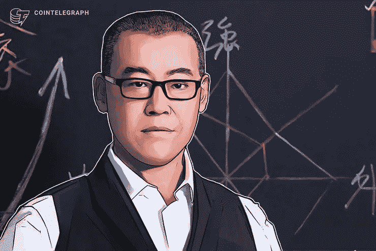
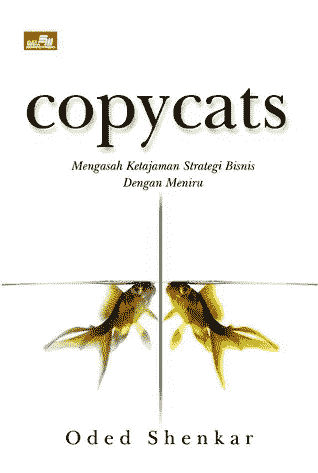
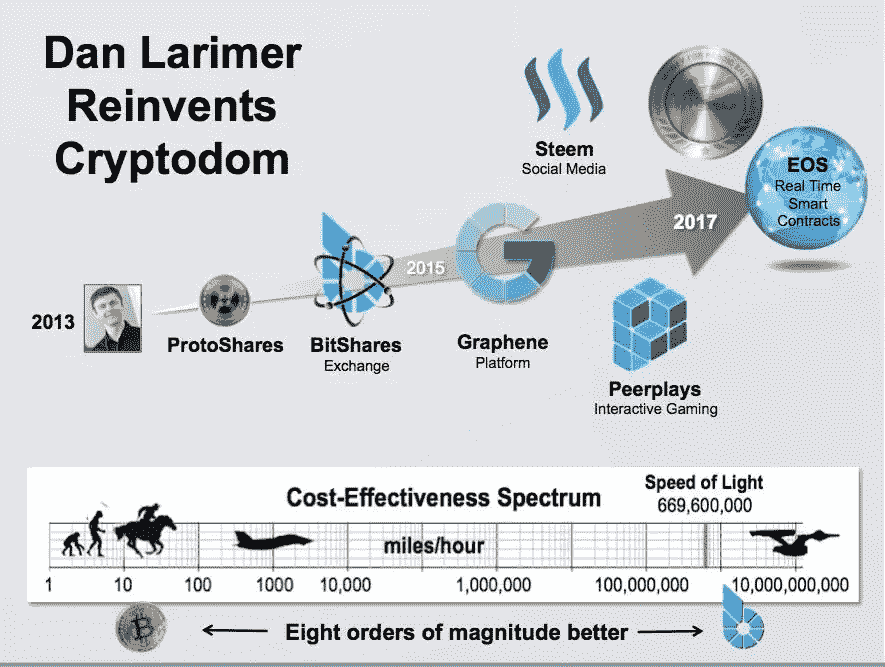
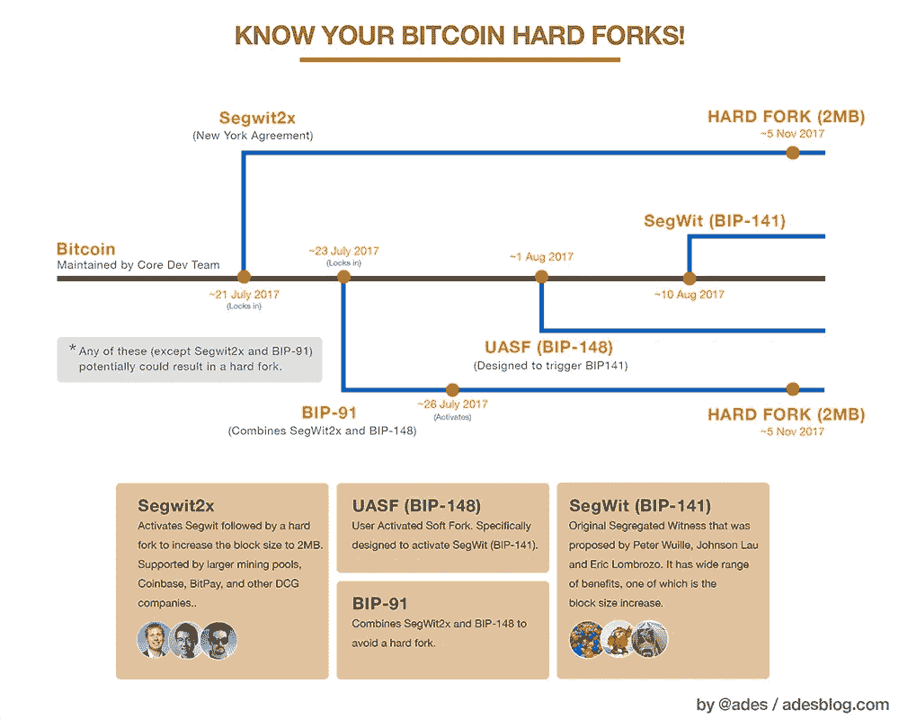
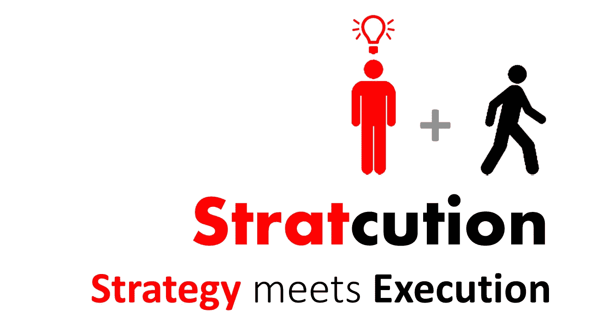
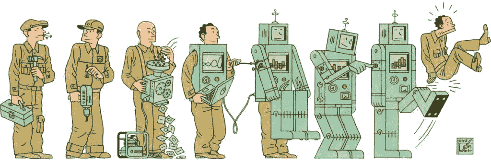
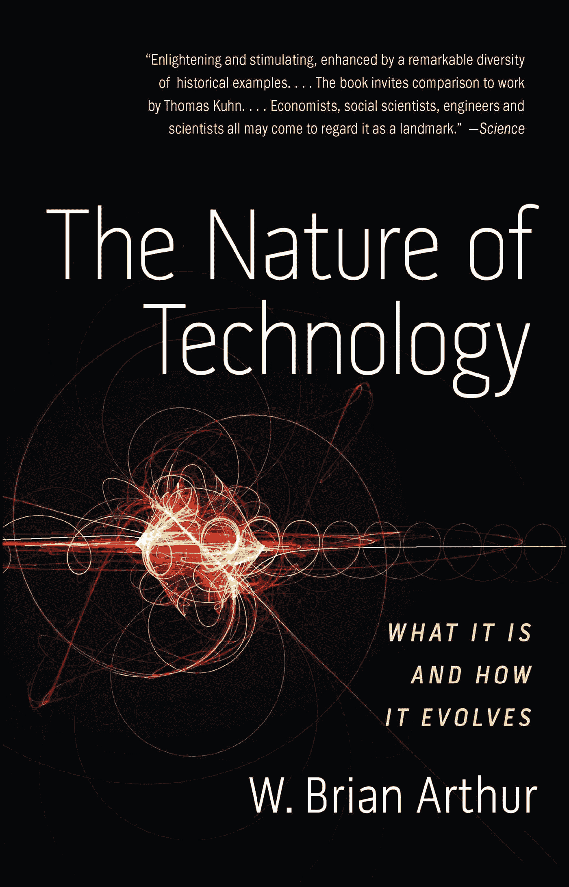

# 忒修斯之船:硬币循环创新的困境

> 原文：<https://medium.datadriveninvestor.com/the-ship-of-theseus-the-dilemma-of-the-coin-circle-innovation-6623324162ab?source=collection_archive---------2----------------------->

*由创新研究机构 X-Order 的研究员 Robin Gu 撰写，该机构试图结合分布式计算、计算博弈论、人工智能和密码学等跨学科领域来发现未来的扩展订单。它的创始人是托尼·陶，他也是 NGC 风险投资公司的合伙人。*

在**开放金融**的背景下，许多可能的创新从区块链范式中涌现出来:从跨链计划到扩张计划和分散交易所(DEX)。这些创新突破无疑推动了一种新技术趋势的快速发展。与此同时，出现了许多非常相似的项目和行为，如分叉项目，以及在集中交换中风靡一时的 ieo。

 [## 十大区块链课程|数据驱动的投资者

### 渴望在区块链发展吗？你想知道区块链是如何工作的，但不知道在哪里？或者就是太多了…

www.datadriveninvestor.com](https://www.datadriveninvestor.com/2019/03/08/top-10-blockchain-courses/) 

模仿在中国各行各业都很普遍，在区块链领域也不可避免。不可否认，大多数人支持原始创新，对模仿和抄袭不屑一顾。

> 然而，模仿真的那么糟糕吗？

在回答这个问题之前，我们先来探究一个古老的故事——忒修斯的**船。**

希腊作家普鲁塔克曾提出一个哲学问题:一艘老旧的木船年久失修，腐朽的木头需要更换。然而，即使我们只更换一小部分木材，我们仍然会把它当作原来的船。

> 但是，如果把船上的板子都换了呢？我们还能把它当成原来的船吗？或者在某种程度上可以认为是新舟？但是，如果你认为这是一艘新船，应该有一个明确的界限，什么时候开始成为一艘新船？

很明显，模仿和创新之间没有绝对的界限。通常情况下，模仿是对原作的修改或改进，并产生一个新的项目。然而，如果修饰的程度不够显著，人们就会倾向于将其视为某种模仿。这也是为什么尽管 IEO 的交易规则和条件不同，人们仍然会认为他们是在模仿币安的 Launchpad。

有趣的是，IEO 的概念并不是币安创造的。早在 2017 年，李笑来就在 BigONE 平台上首次引入了 IEO 的概念:当时 PRS 和 EOS 的直接配对允许一个项目直接在平台上提高 EOS。

因此，我们应该更加平等地对待创新和模仿。强调创新的重要性没有问题，但是我们**往往忽略了模仿**、**尤其是选择性模仿**的作用。

> 福特汽车公司国际业务管理总裁奥德·申卡尔(Oded Shenkar)在《模仿者》(Copycats)一书中描述了一种全方位模仿的巨大影响。他甚至说这种模仿超越了无目的的创新。

其实全方位模仿和百分百抄袭是两个截然不同的概念。这样的概念在生物学领域非常普遍——生物的生存和进化是通过**适应性模仿来实现的。**

与简单的模仿相比，这种模仿更强调理解或复制成功背后的**促成因素，即不是模仿行为，而是模仿其背后的**因果链。因此，在下面的讨论中，我们认为创新和模仿都是必要的，因为它们在不同的方面发挥作用。****

# 创新的两面:先驱者和殉道者

在互联网时代，信息的自由流动大大降低了模仿的成本。而区块链技术的开源性使得项目模仿的成本接近于零。建立一个新项目所需的所有代码都可以很容易地派生出来。

**比特币**是区块链的开端，也是迄今为止最成功的区块链创新。从数字货币出现开始到现在，无论比特币受到了多少批评(如确认速度慢、图灵不完全、缺乏完全匿名性、交易隐私暴露等。)，它作为区块链象征性领袖的地位不会轻易动摇。这从最近市场上比特币价格的强劲拉动也可见一斑。

然而，并不是所有的创新项目都会因为先发优势而蓬勃发展。比如 **BitShares (BTS)** ，甚至作为第一个以 **ByteMaster (BM)** 为首的项目，已经逐渐没落，取而代之的是 **EOS** 。此外，基于 **Cryptonote 协议**开发的第一种加密货币 **Bytecoin** ，已经被**分叉 Monero** 所掩盖。现在从 Monero 直接分叉的项目数量已经超过了 Bytecoin。

创新的成功是由许多因素造成的，**运气**是其中之一。当我们看到一个新项目时，更应该关注的是**项目的成长环境是否足够肥沃**，或者与其他潜在竞品的差异是否足够大。只有允许创新项目自由发展，才有可能充分发挥其潜力，并让**找到合适的位置**。在这种情况下，创新项目将比不那么独特的挑战者具有明显的优势。

虽然比特币诞生之初是开源的，但是从比特币衍生出来的 **fork 项目也是过了两三年才出现的。正是这三年，让比特币有了充足的成长时间，使其相对于后来者和模仿者有了竞争优势。**

由此我们可以看出，创新项目需要**足够“新颖”**才能让别人没有足够的洞察力去模仿项目。这样创新项目才会有足够的时间**获取市场反馈，进行持续迭代，寻找最适合自己的利基**。

# **成功模仿:全方位深度模仿**

当卢克·伦德尔和凯文·拉兰德研究个人成功的社会规律时，他们研究了社会中成功人士的一些行为参数。这包括**学习的比例和实际执行的结果**(学到的技能和随后的结果)**第一次尝试前**的学习周期数**和学习中**的模仿程度。他们的结论是，在一个波动性很大的陌生环境中，个体的成功更多地归因于模仿他人的**社会学习行为**而不是自己探索的非社会学习行为(类似于创新)。

他们还发现，在现实生活环境中实施模仿内容需要**有效的“执行”**才能获得好的结果。执行力的重要性可以超过创新和模仿，这就是为什么我们常说，

> “实践是检验真理的唯一标准。”

你如何评价模仿的结果？**在他人创新的基础上进行全方位的深度模仿加工和改进。既然这是一项改进，其结果的质量就需要一个参照，而这个参照只能来自它将运作的外部环境。**

回到 IEO，每个人都认为币安是 IEO 浪潮中最成功的。以下原因可能是其成功的关键因素:首先，**时机**是一个重要因素；在 ICO 经历了近一年的低迷后，该行业需要一种方法来解决融资问题。此外，**在币安推出的几个项目也在根据市场反馈进行迭代和调整。**例如，在一开始，机器人可以参与 IEO 代币的限量销售，并与人类参与者竞争，拍卖方式逐渐转变为我们现在采用的公平抽签方式。

有趣的是，在逐步迭代和改进细节的过程中，币安还模仿了火币的分配模式，即只有持有交换令牌才能获得参与 IEO 销售的权利。

> 所以一个**全方位深度模仿**需要不断与外界环境互动，在合适的时机提升执行力。

# **模仿与创新的融合**

选择模仿还是创新只是达到目的的手段。对于大多数组织来说，他们最迫切的需求是生存。

创新和模仿代表两个不同方向的能力。Brian Arthur 在**《技术的本质》**中提到，所谓创新，其实就是把不同的技术成分有机地组合成一个更紧密的技术成分，不存在**从无到有的创新。**

> **创新**将现象与技术本身联系起来，或将需要解决的问题与现有技术匹配起来。**仿制**可以理解为个别技术成分的细化。**创新**强调通过想象综合的能力，**模仿**强调局部优化的能力。

总的来说，创新的试错成本很高，这就是为什么成功的创新往往需要一片成长的沃土，让他们尽可能多地尝试和探索。

从研究单个个体的角度来看，社会学习实验揭示了一点:对于**个体**，全方位的深度模仿可能是更好的选择。既然你的对手能够生存，那么通过优化和避免他们因创新而遭受的损失，你肯定能比他们活得更好。

然而，当要检查的对象是一组个体时，该实验没有给出结论。

> 笔者认为，在群体生存的前提下，创新的收益会远大于模仿。因为**创新引入了新的可能性维度**，因此没有创新而模仿的群体总是处于零和博弈的状态。创新增加了群体的利益，引入了正和博弈。

在之前的 IEO 浪潮中，我们可以看到项目获得了充足的资本，交易所也获得了巨大的资金和用户流量。他们作为个人无疑是非常成功的，这似乎是一个双赢的局面。

然而，对于整个行业来说，从一开始人人获利，到最终交易所代币价格暴跌；投资者主张他们的权利，IEO 证券的价格持续下跌……整个过程显然已经成为一个**零和游戏和死亡螺旋**，导致**IEO 模式不可避免的崩溃。**

> 生存是繁荣的前提。

如果整个鸟巢倒塌，没有蛋会毫发无损。在区块链产业和开放金融的浪潮中，我们需要**充分模仿以优化每个组成部分**，以便所有参与者都能获得更好的结果。同时，我们也需要**创新如** **Uniswap 和 Cadcad** 来打破传统，建立新的合成。只有这样，像区块链这样多样化的生态系统才能更加繁荣。