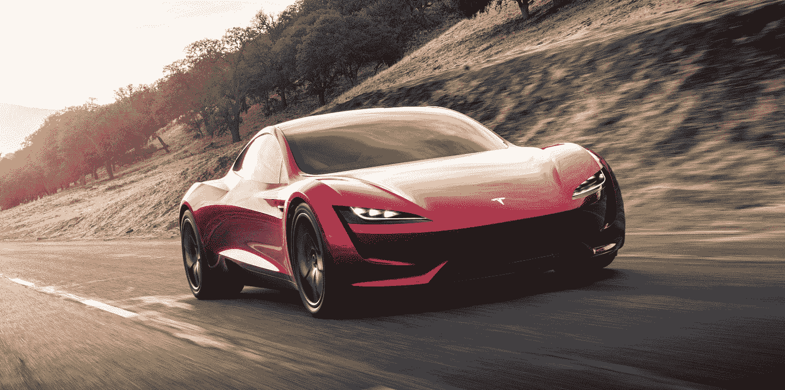
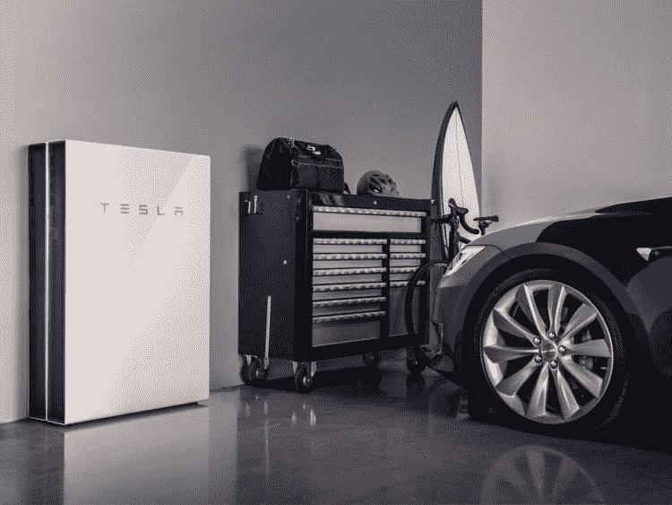

# 电动汽车在 21 世纪的意义

> 原文：<https://medium.datadriveninvestor.com/the-significance-of-electric-vehicles-in-the-21st-century-591d17ff671e?source=collection_archive---------4----------------------->

纵观人类历史，旅行是必不可少的。从步行到骑马，到马拉的马车，再到第一辆汽车，我们人类一直在努力改善旅行的过程。更高效、更舒适、更安全地从 A 点到达 B 点一直是我们在这个星球上的历史主题。近一二十年来，电动汽车在我们的社会中变得越来越普遍。它们主要依靠锂离子电池运行，这种电池越来越便宜和高效。电动汽车的使用，在这里被称为 EVs，是我们未来的发展方向。利用它们有很多好处，但是也有一些负面结果。电动汽车是未来世界的出行方式，至少一旦它们得到完善。

现在，电动汽车对我们的生活、环境和钱包都有一些积极的影响。首先，电动汽车对我们的日常生活和旅行有着巨大的好处。随着“更少的内部噪音和动力系统的振动”，我们可以享受更加安静和舒适的乘坐体验(能源和环境系统委员会，2015 年)。电动汽车，如特斯拉的 S 型、X 型和 3 型汽车，都采用了电力传动系统。这一特性有许多好处。例如，制动性能大大提高。电动汽车没有需要经常更换的传统刹车片，而是使用电池来逆转通过车轮的能量，轻松降低汽车速度。这一过程被称为再生制动，同时将车轮停止时的惯性能量回馈给电池。此外，电动动力系统还提供更平稳、更快速的加速。有了这项技术，它是一个简单的“开和关”开关与发动机同时加速。一旦脚接触到油门踏板，汽车就会利用全部的电池能量，而不是像传统的汽油动力汽车那样慢慢加速气缸。因此，即使只有这两个特征，电动汽车的用户也已经享受到了驾驶电动汽车的巨大好处。最后，电动动力系统的一个更明显也更重要的好处是降低了车内噪音。电动汽车没有真正的发动机，而是一系列锂离子电池，将能量发送到车内的多个不同位置。由于这一点，没有响亮的排气或发动机噪音，从而大大降低了机舱内的噪音。

The new Tesla Roadster: Capable of 0–60 mph in 1.9 seconds and a battery range of ~600 miles

在讨论电动汽车对环境的积极影响之前，必须说明其负面特征。电动汽车不是很实惠的商品，至少目前不是。由于锂离子电池还不太昂贵，购买电动汽车仍然非常昂贵。这听起来是真的，尤其是如果你喜欢更豪华的车辆。特斯拉汽车公司(Tesla Motors)，通常被称为特斯拉，提供两款高端全电动汽车，Model S 和 Model X。他们的四门家庭轿车 Model S 有多种装饰，从 60 年代早期到最新最棒的 P100D。“P”表示他们的性能模型,“D”表示该车有两个电动马达，一个在前，一个在后，特斯拉为客户提供了各种各样的汽车。然而，这些都是有代价的。对于他们 2018 年阵容的入门级车型 Model S 75D，客户将需要支付大约 75，000 美元。这是基本价格，没有任何附加选项，如天窗，碳纤维部件，甚至是增强的音响系统。这个价位的汽车一般不是普通家庭能买得起的，如果考虑到顶级饰件 P100D，价格就更低了。这款车的起拍价为 13.5 万美元。可以看出，豪华电动汽车并不适合所有人。这是一个主要的缺点，因为除非一个人想要一辆远不那么优雅的日产 Leaf，价格在 30，000 美元左右，功能比特斯拉的阵容少，否则很难进入电动汽车市场。

随着对可负担性的讨论的结束，接下来是电池系列。并不是所有的电动汽车在需要充电之前都有很大的行驶里程。例如，前面提到的日产 Leaf 在需要充电之前只能带乘客行驶少得可怜的 181 英里。这个数字也不完全准确。电动汽车的估计里程只有在完全理想的驾驶条件下才是真实的。这意味着，除非你完美地驾驶，以最少的停止和启动，保守地使用油门踏板，否则汽车不会达到它所说的全部里程。然而，特斯拉在续航里程方面处于领先地位，因为他们的电动汽车即使不比大多数传统汽车跑得更远，也能跑得一样远。有多家汽车公司致力于电动汽车这一非常重要的方面，但它尚未完善。更不用说电池续航里程尚未达到最佳水平这一事实了，如果电动汽车的购买者希望在家中为汽车提供动力，他们基本上需要在车库内安装充电基础设施，以便在需要时随时充满电。

Tesla’s charging infrastructure, the “Powerwall”

电动汽车远非完美，但它们对环境的影响是朝着它迈出的一大步，尤其是考虑到汽油动力汽车对我们生态系统的影响。根据 Helms、Kamper 和 Lambrecht (2015)的研究，2010 年，交通部门占欧洲最终能源消耗的 30%以上。在最终能源消耗的 32%中，超过 70%是“道路交通消耗的”(Helms，Kamper 和 Lambrecht，2015)。这对于显示传统汽车排放的有毒二氧化碳对我们的环境有多大意义。已经采取措施来减少汽油车的这些排放，但是这种速度太慢，实际上无法帮助大气从这些化石燃料中恢复。

电动汽车产生零排放。由于它们产生零排放，它们不会通过向大气中释放有毒化学物质来降低空气质量，从而有助于保护环境。中国处理这个问题已经有一段时间了，因为他们是世界上空气质量最差的国家之一。中国大城市周围的雾霾令人发指。它阻止飞行员在机场降落，因为他们“看不到跑道”，公民戴着“口罩和呼吸器”走在街上(Bonopartis，2017)。这是一个主要问题。然而，中国正在发生转变，现在是“可再生能源产业的世界领导者”(Bonopartis，2017)。这个人口超过 10 亿的国家在国内可再生能源研究和基础设施方面的投资是美国的两倍。

可再生能源对我们的世界非常重要，因为它是为电动汽车提供燃料的资源。太阳能是可再生能源的主要来源，许多外部电池充电器都由这个超级供应商提供燃料。事实上，美国多个城市承诺 100%使用可再生能源。雷·布朗(2017)最近的一份报告显示，像“威斯康星州麦迪逊和路易斯安那州阿比特斯普林斯市”这样的城市完全致力于在其社区使用可再生能源。这是向电动汽车即将到来的优越性迈出的一大步。随着这一进步，在不久的将来，可能会有更多的社区采用可再生能源。

电动汽车的总体效果是为人们提供了一种选择。由于其传统和历史，汽油动力汽车很可能永远不会“过时”。拥有电动汽车的意义仅仅在于帮助人们省钱，保护环境，避免化石燃料过早耗尽。电动汽车完全盖过传统汽车的可能性很小。然而，他们会留在这里。无论是特斯拉(Tesla)或保时捷(Porsche)等制造更豪华车型的公司是唯一留下来的公司，还是丰田(Toyota)的普锐斯(Prius)和日产(Nissan)的聆风(Leafs)占据市场的时间一样长，电动汽车只会随着时间的推移变得更好、更高效。出行方式对人类来说是必不可少的，电动汽车只是让它更具未来感。