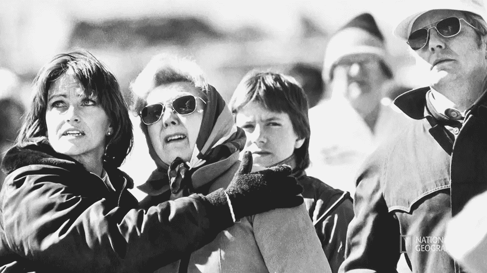
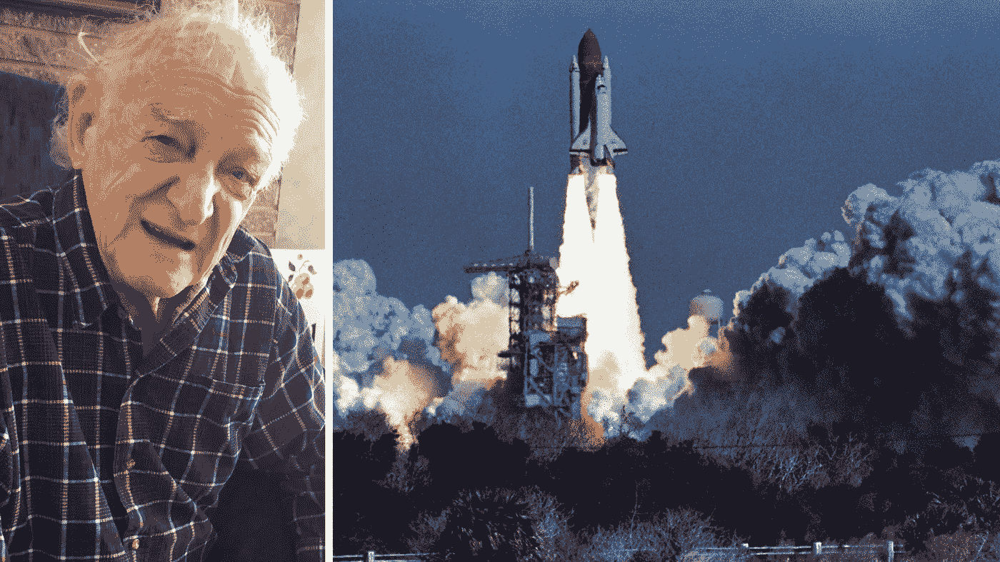
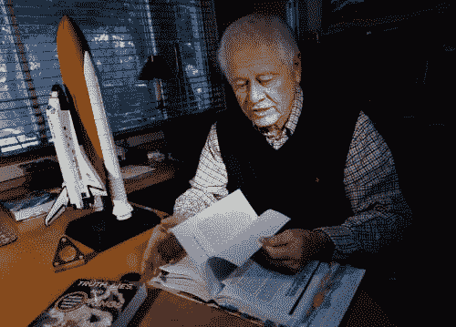
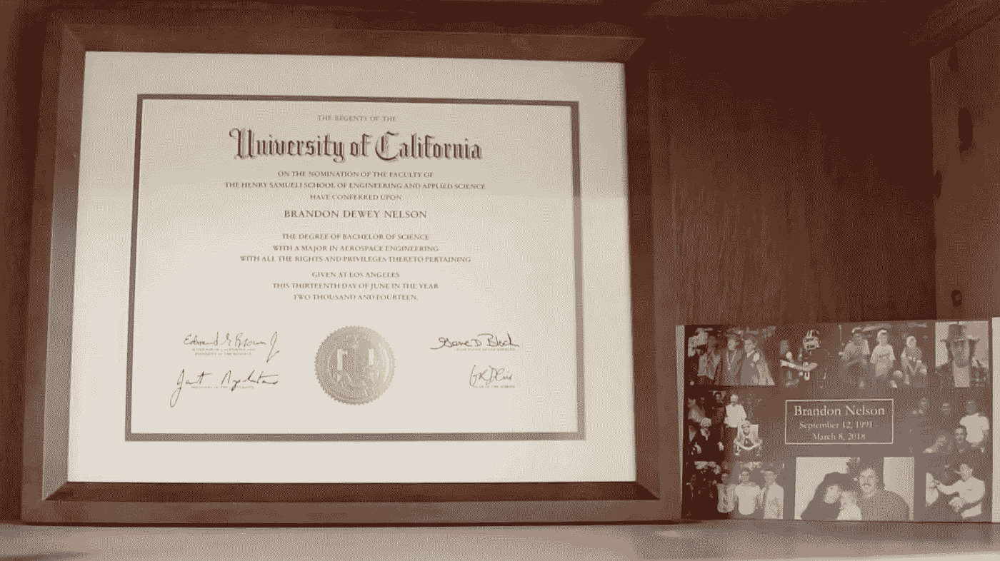

# 防止航天灾难的简单方法

> 原文：<https://medium.datadriveninvestor.com/the-simple-way-to-prevent-aerospace-disasters-a288a251c87c?source=collection_archive---------6----------------------->

Onlookers gasp as they watch the Space Shuttle Challenger’s total-loss, in real-time. Source: National Geographic.

## 航空工程师在预测故障时经常被忽视，黑天鹅风险分析如何帮助我们改进？

1986 年 1 月 28 日，佛罗里达州卡纳维拉尔角的天气异常寒冷。肯尼迪航天中心 39 号发射台附近的温度计读数低至华氏 18 度。在 39B 发射台附近，“挑战者”号航天飞机停在那里，指向天空，为她推迟了六天的低地球轨道载人飞行任务做准备。

当悲剧发生时，对于一个国家，一个家庭，我们会问自己——这本来是可以避免的吗？

一个精英工程师团队试图避免数百万人观看的航天飞机灾难，一个善于分析、有社会意识的年轻人的个人分析，这两者之间的共同点告诉我们，简单地*听取专家告密者的*——*——*就是一个解决方案。

## **精英工程团队**

犹他州莫顿-硫科尔公司的火箭科学家鲍勃·艾伯林提醒他的老板艾伦·麦克唐纳，温度太低，不能安全发射挑战者号。Ebeling 是一名领域专家，他曾帮助建造和维护用于将美国航天飞机送入轨道的固体火箭助推器(SRB)。与美国国家航空航天局一些高级官员的电话会议一直持续到凌晨。在电话中，工程师们强烈主张推迟发射，直到水银上升到可以接受的水平。然而。官员们选择继续进行，尽管麦当劳拒绝签字。

Left: Bob Ebeling in 2016 shortly before his death. Right: The Space Shuttle Challenger on January 28, 1986\. [Source: NPR](https://www.npr.org/sections/thetwo-way/2016/01/28/464744781/30-years-after-disaster-challenger-engineer-still-blames-himself).

一年前，发现号航天飞机的发射预先警告了麦当劳团队。在翻新可重复使用的 SRB 时，工程师们在两个橡胶 o 型圈之间发现了黑色烟灰。通常情况下，这些环可以防止气体从助推器的固体火箭燃料室泄漏。在这种情况下，密封部分失效，团队确定低温是未来发射的一个重要问题。因此，麦当劳团队强调，发射温度(预测为 35 度左右)很可能导致两个 SRB 中的任何一个上的两个 o 形圈*全部*失效。

这一警报无人理会。疲惫不堪，意志消沉，向西两个时区，在犹他州，一个失败的艾柏林回家，后来回忆说，在他睡觉前，他告诉他的妻子达琳，'*它要爆炸了！'”*

挑战者号的七名船员从未被警告潜在的问题或工程师的担忧。几个小时后，美国东部时间 1986 年 1 月 28 日上午 11 点 32 分，他们，“*挥手告别，挣脱地球阴沉的束缚，触摸上帝的面孔*，这是里根总统在几个小时后对震惊全国的[发表的忧郁讲话。](https://www.youtube.com/watch?v=Qa7icmqgsow)

 [## 保护主义、政治和经济动荡|数据驱动的投资者

### 美国股市昨日出现 400 多点的大幅反转，为未来的事情发出了警告信号。市场…

www.datadriveninvestor.com](https://www.datadriveninvestor.com/2018/06/28/protectionism-politics-economic-turmoil/) 

后来确定，发射时的外部温度记录为 36 ̊华氏度——远低于 53 ̊华氏度的标记，在这个标记处，现在臭名昭著的 o 形环[发生了部分故障。](https://www.space.com/31732-space-shuttle-challenger-disaster-explained-infographic.html)

对艾伯林和麦克唐纳来说，这些事件造成了极大的创伤。他们和数百万普通市民一起惊恐地看着他们预测的灾难在全国电视广播中上演。我们中的许多人仍然保留着挑战者号在短短几秒钟内从时速 1480 英里的宇宙飞船变成残骸的闪光灯记忆。

McDonald (at his Provo, Utah home) wrote a book, “Truth, Lies, and O-Rings: Inside the Space Shuttle Challenger Disaster.” [Source: Salt Lake City Tribune](https://archive.sltrib.com/article.php?id=3464503&itype=CMSID).

上个月，我采访了现年 82 岁的麦克唐纳。他承认，“*事故发生后的几十年里，我的三个团队成员都患有创伤后应激障碍。*“麦克唐纳，SRB 团队的领导者和最引人注目的成员，因[就事件向国会](https://www.nytimes.com/1986/05/11/us/engineers-tell-of-punishment-for-shuttle-testimony.html)作证而被降级——然后通过国会联合决议恢复了他的职务(这是历史上唯一一次发生赔偿)。

即使在 30 年后，困扰麦当劳团队的不是莫顿·瑟科尔的惩罚，而是那次发射的受害者。在 89 岁的时候，艾伯林觉得自己对挑战者号机组人员的死亡负有责任。他后来会在国家公共广播电台重新计票，

> “我是少数几个真正了解情况的人之一。如果他们听了我的话，等待天气变化，结果可能会完全不同。”

我们取得进展了吗？工程师们是否更好地准备了在失败发生前预测失败的情绪困扰？航空航天组织、监管机构和实体是否为听取地面工程师的分析做了更充分的准备？

有些人会说不。

## **入门级工程师**

2017 年，布兰登·纳尔逊受雇于加利福尼亚州加德纳的飞机零部件制造商 Permaswage，也是沃伦·巴菲特旗下伯克希尔·哈撒韦公司(Berkshire Hathaway Inc .)的大型子公司 Precision Castparts Corp. (PCC)的一部分。作为 2014 年加州大学洛杉矶分校的航空航天工程学士，布兰登是一个观察力敏锐、有社会意识的年轻人。

Nelson’s PCC name badge. Source: Author.

Nelson 开始担心被称为“Permaswage 配件”的小型液压阀紧固件没有按照客户的规格制造，也没有包含所需的适当润滑。这些配件几乎安装在目前所有有液压系统的飞机上，如可伸缩起落架。事实上，自 1996 年以来，PCC 已经收购了 41 家制造航空零部件和材料的公司，形成了一个有争议的垄断。

Nelson 在震惊地看着他认为有缺陷的零件被运送给客户之前，试图将他的担忧传达给 PCC 的监督链，但没有成功。

类似于 1986 年的 NASA，PCC 的管理是专制的。Precision 过去是——现在仍然是——由首席执行官马克·多内根(Mark Donegan)运营，他的管理风格在 2016 年《T2》《彭博》的一篇文章中被认为是最不专业的:

> *“那些最了解首席执行官的人形容一位管理者高效能，但有时却拘泥于基本礼仪。这些人说，他们目睹了多纳根使用亵渎和暴力的语言，他们中的大多数人因为害怕报复而要求不要使用他们的名字。有人听到他威胁说要用铅笔戳某人的眼睛。另一个人说，首席执行官威胁要扭断一名员工的胳膊，这样他就可以用带血的残肢打人。*

几乎所有的飞机制造商都使用这些液压接头。越来越担心，尼尔森联系了 PCC 客户的高管，包括波音、空客、巴西航空工业公司和洛克希德·马丁公司。纳尔逊的教父查尔斯·塞纳(Charles Sena)后来回忆说，这位年轻的工程师“*强调这些部件可以击落一架飞机*。”

纳尔逊觉得拒绝倾听简直毫无道理。2017 年 9 月下旬，他[沮丧地给哥哥](https://e6f2047d-2bfe-4bb6-93b6-6d8532ef75bc.filesusr.com/ugd/716ad7_2aa92c7dd8424a95bbc7fe21fd7a21d4.pdf)贾斯汀发短信:

> "*飞机上出了问题，是有迹可循的！上层不在乎，伙计，让每个人都变得不诚实并隐藏(不适当的行为)，隐藏是没有用的！*

与麦克唐纳相似，尼尔森最终将事情掌握在自己手中，向联邦航空管理局(FAA)提交了一份[举报者投诉](https://medium.com/@plittle/whistleblower-now-deceased-voiced-737-max-concerns-in-2017-d55d4252463d)。虽然进行了调查，但一名航空专家认为，联邦航空局是在[提前发出通知](https://seekingalpha.com/article/4261185-oracle-sky-precision-castparts-just-boeing-work-do)后才这么做的。此外，美国联邦航空局发言人证实，检查是在 Permaswage 工厂的地板上进行的，而不是对安装在实际飞机上的零件进行检查，这些零件会受到现实生活中的磨损。Nelson 对制造的担心是早期故障，而不是在车间预先选择的零件中可以观察到的。

Nelson’s UCLA Diploma along with a handout from his memorial service rest on a bookshelf in his room at his parents’ home in Santa Monica, CA. [Source: Author](http://bit.ly/brandonnelson).

与艾伯林和麦克唐纳相似，纳尔逊经历了表达他的担忧所带来的短期和长期影响所带来的巨大的情绪压力。不幸的是，布兰登的故事没有一个简洁的解决方案。收到美国联邦航空局的“无发现”信后，尼尔森变得心烦意乱。纳尔逊对投诉仍然伤心欲绝，于 2018 年 1 月住院，并于同年 3 月结束了自己的生命，仍然担心灾难的可能性。

## 我们能学到什么？

我们能从这些故事中学到什么？纳尔逊、麦克唐纳和艾伯林都是专业的、聪明的、有责任心的人，他们看到了只有他们的专业知识和训练才能认识到的缺陷。然而，他们没有一个人准备好面对他们的关注没有被听到的情绪后果。有关机构未能向其雇员充分保证，他们已履行了对公众的责任。这三个人都感受到了对他人安全的个人责任感，并因此受到了伤害。

挑战者号爆炸和纳尔逊死亡的悲剧本来可以避免吗？

今天的航天工业可以被认为是一个[复杂系统](https://link.springer.com/chapter/10.1007/978-3-642-39354-9_16)——难以预测，因为它展示了零件、环境、人为因素和使用之间相互依赖关系的涌现特性。航空故障是[黑天鹅事件](https://www.investopedia.com/terms/b/blackswan.asp)，是由多个重叠故障组成的边缘情况，这使得它们难以预测。这意味着，类似于其他混沌系统，专家反馈是信号，可能会打折扣，但永远不应该被抑制。

最近发生的两起波音 737 Max 事故中的第一起(狮航 610 号航班)发生在印度尼西亚，就在纳尔逊去世 6 个月后，189 人遇难。在一份异常迅速发布的最终报告中，调查人员声称[的多个错误](https://www.flightradar24.com/blog/indonesian-investigators-release-final-lion-air-610-crash-report/)导致了这场悲剧，包括新的机动系统、联邦航空局认证、维护和飞行员失误。

然而，第二起波音 737 MAX 事故在五个月后坠毁([埃塞俄比亚航空公司 302](http://nymag.com/intelligencer/2019/04/what-passengers-experienced-on-the-ethiopian-airlines-flight.html) 航班)，造成 159 人死亡，并引发了所有 737 Max 飞机的全球停飞。调查仍在进行，由法国政府领导。

虽然没有确凿的证据表明纳尔逊对液压系统表示担忧的零件导致了这两架飞机的故障，但调查人员和专家认为这两架飞机都包含有故障的零件，*和*有故障的飞行员。但纳尔逊的苦恼至少部分是因为他的反馈没有得到回应而加剧的。关心乘客的生命是一名工程师的可取品质，麦克唐纳和艾伯林向我们展示了这种关心可以拯救生命。

或许解决办法很简单。因为我们的系统有如此多的移动部件，我们需要[黑天鹅预测系统](https://www.rapidinsight.com/black-swan-events-higher-ed/)，风险分析算法[整合所有来源](https://www.thetimes.co.uk/raconteur/business/risk-analytics-imagining-end-black-swan-events/)。如果任何反馈回路被破坏或抑制，我们的预测模型就不太准确，在航空航天领域，这是一个危险的概念。换句话说，我们的工程师反馈很重要。

像欧内斯特·海明威一样，同样死于自杀的伟大作家推荐道:

> *当人们说话时，要完全倾听。大多数人从来不听*。”

— —

## 作者的披露

*我/我们在提及的任何股票中没有头寸，并且没有计划在未来 72 小时内建立任何头寸。我自己写了这篇文章，虽然它可能是由 Medium 的编辑策划的，但它* ***表达了我自己的观点和可证实的事实*** *。我没有收到任何报酬(除了来自 Medium)。我和这篇文章中提到的股票的任何公司都没有业务关系。*

## DDI 的披露:

本故事及其分析仅代表作者观点，与《数据驱动投资者》(DDI)编辑委员会的立场无关。我们鼓励读者对这一主题和相关主题进行自己的尽职调查和研究。DDI 也没有以任何方式与此话题相关的交易头寸或财务利益。