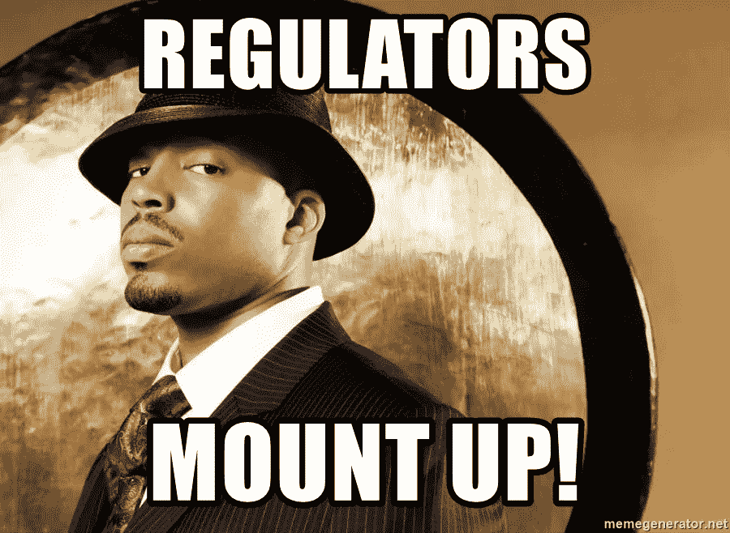
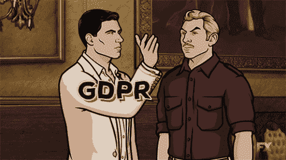
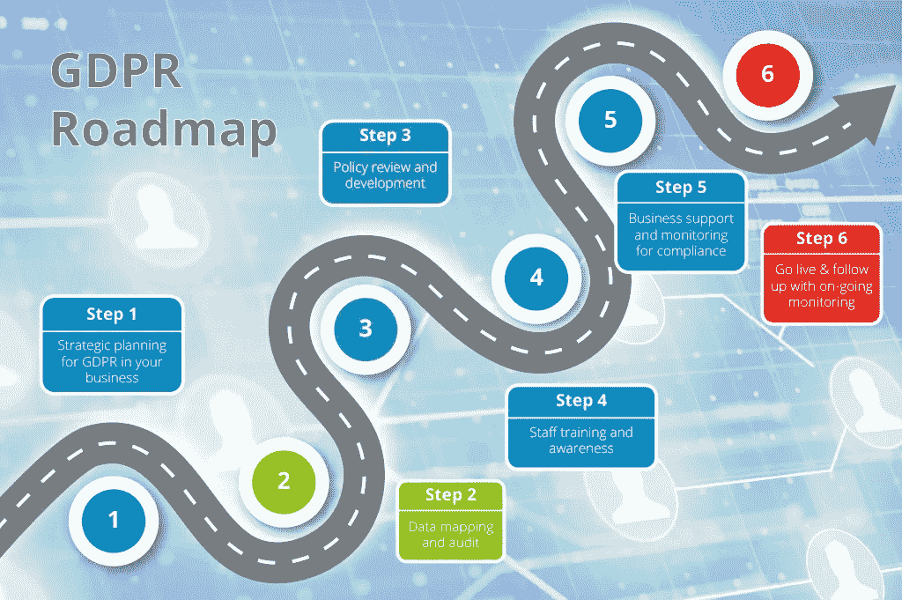
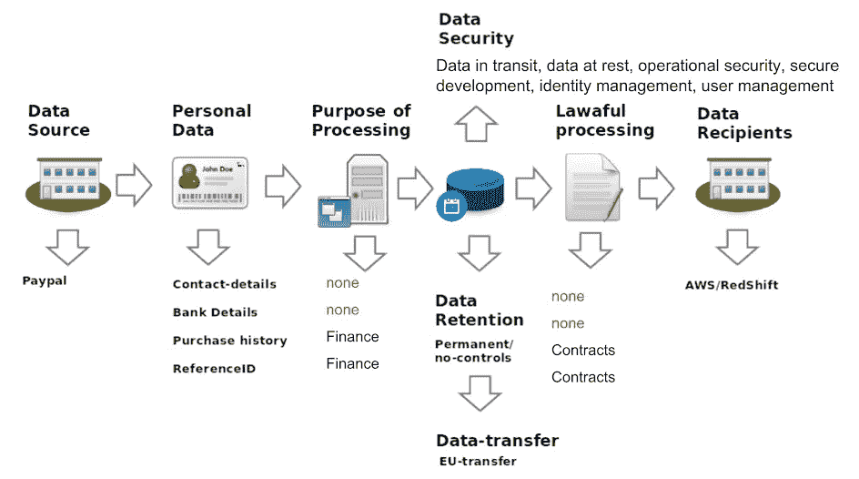
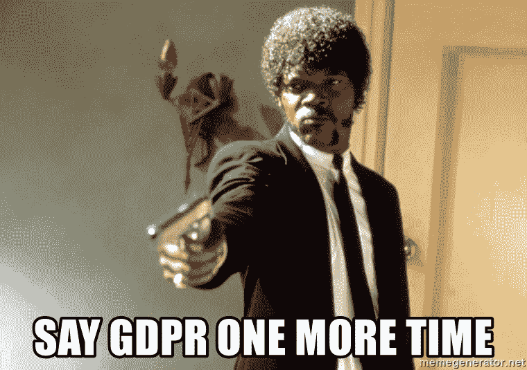

# 20 年来数据隐私法规最重要的变化:GDPR

> 原文：<https://medium.datadriveninvestor.com/the-single-most-important-change-in-data-privacy-regulation-in-20-years-gdpr-b9026b9acfa9?source=collection_archive---------14----------------------->

## GDPR 的简要概述，它对数据科学家的影响，以及数据科学家为确保遵守所有法规应采取的主要步骤。

> “世界上最有价值的资源不再是石油，而是数据。” —经济学家

# 什么是 GDPR？

《一般数据保护条例》规定了欧盟(EU)和[欧洲经济区](http://www.efta.int/eea) (EEA)内与个人数据处理和个人数据自由流动相关的个人保护规则。该条例保护人的基本权利和自由，特别是保护个人数据的权利；这包括将个人数据输出到欧盟和欧洲经济区以外的地区。该法规主要旨在让个人控制其个人数据，并通过统一欧盟内部的法规来简化国际业务的监管领域。至于个人数据的处理——只要个人保护不受损害，个人数据在欧盟内部的自由移动不受限制或禁止。基本上，欧盟希望实现透明度，同时确保个人拥有某些权利、自由和保护。

GDPR 既严格又广泛。整个文件共 261 页，可在 https://gdpr-info.eu/[找到。虽然这不是最有趣的文章，但让数据科学家了解这个主题是至关重要的。](https://gdpr-info.eu/)

## 个人资料

《GDPR》第 4 条将个人数据定义为:*“与已识别或可识别的自然人(‘数据主体’)有关的任何信息；可识别的自然人是指可以直接或间接识别的人，特别是通过参照身份识别特征，如姓名、身份证号、位置数据、在线身份识别特征，或该自然人的身体、生理、遗传、精神、经济、文化或社会身份所特有的一个或多个因素。”*一些可能的数据类型有:

*   名字
*   照片
*   电子邮件地址
*   社交媒体帖子
*   个人医疗信息
*   IP 地址
*   银行详细信息
*   Cookie 字符串

几乎你在互联网上的任何行为都会留下数据痕迹。发送电子邮件、访问网站和发布图片都可以被记录并存储在云中。这些数据可用于洞察公司如何优化业务战略。因为这些数据非常有价值，而且隐私恐慌越来越频繁，消费者要求任何收集个人数据的人都要透明。因此，数据科学家的任务是保护个人数据的安全。

# GDPR 如何影响数据科学家

你公司的规模并不重要。GDPR 的法规影响任何从欧盟公民那里收集数据的组织。任何不遵守 GDPR 法规的人都会面临严重的后果。除了会失去潜在客户、客户和广告商的信任之外，违规者还会被处以高达其全球营业额 4%的罚款，或 2000 万€(约合 2350 万美元)，以较高者为准。

*“但是安德鲁，我们生活在美国……我们为什么要关心欧盟的数据法规？”*实际上，并没有规定您的组织总部设在欧盟就要受 GDPR 的约束。如果组织处理和/或持有来自欧盟居民的任何数据，GDPR 适用于他们。在收集数据时，欧盟公民必须在欧盟境内，以便 GDPR 法律适用于他们。

# 数据屏蔽

如果你以前没有想过屏蔽数据，现在是时候开始了！数据屏蔽通常被定义为更改敏感、机密或个人数据的过程；然后，这些数据被删除或隐藏，并被等效的随机字符、虚假信息或虚假数据所替代。该过程确保敏感用户信息在允许的环境之外不可用。用户培训和软件测试就是数据屏蔽特别常见的例子。

匿名化和假名化是允许数据控制者和处理者使用已经去除了个人标识符的数据的两种技术。《GDPR》叙文 26 将匿名化数据定义为*“以数据主体不可识别或不再可识别的方式匿名呈现的数据。”*从本质上讲，数据是针对数据主体的任何标识符进行擦洗的。《GDPR》第 4(5)条将假名化定义为*“对个人数据的处理，在不使用额外信息的情况下，数据不再能被归属于特定数据主体。一组替换字段可以有一个假名，每个替换字段也可以有一个假名。*匿名化和假名化的明显区别在于每个过程如何被归类为个人数据。匿名数据不能被重新识别，而假名数据仍然允许某种形式的重新识别。加密是第三种可能的数据保护技术。此过程使用密钥将明文转换为哈希代码，只有使用正确的密钥，传出的信息才变得可读。对于没有正确密钥的第三方来说，内容基本上是不可读的，并且只有拥有密钥的授权员工才能访问。这意味着加密是在传输过程中保护数据的最佳方式。

# 确保遵守所有法规的步骤

无论使用何种技术，都必须调查和审核在您的数据环境中存储和使用的个人数据。依靠你认为个人数据可能在哪里的知识或感知不是一个选项。GDPR 要求组织证明他们确切知道个人数据在哪里，不在哪里。一旦确定了来源，下一步就是对其进行检查，并确定在每个来源中可以找到哪些个人数据。员工培训和意识对于贵机构的合规工作至关重要。[隐私规则](https://www.sas.com/en_us/insights/articles/data-management/big-data-privacy-four-ways.html)必须记录在案，并在所有业务部门之间共享，因为合规性要求对数据进行一定程度的控制。组织已经建立了专门处理大量工作的团队，以确保合规性。

Example of a broad-spectrum GDPR pattern

Specific case example

左边的图表是跨威胁建模场景的数据旅程的可重用映射。左边的第一个例子本质上是一个骨架模型，是为特定场景定制的。第二个例子是，当一个服务定期从全球在线支付系统获取数据并将其提供给可伸缩的数据仓库时，可能的威胁模型映射看起来是什么样子。对我来说，这些听起来一点都不好玩…

但是不要害怕数据科学家们，有一些应用程序可以为我们完成大部分劳动密集型工作！

在谷歌上搜索“GDPR 模式”后，我能够找到一个名为 [Varonis](https://www.varonis.com/products/gdpr-software/) 的应用程序，它可以自动识别和分类 GDPR 的数据，其中有 340 多个独家模式，涵盖了所有 28 个欧盟国家。这些模式和分类有助于组织自动对 GDPR 数据进行分类，制定安全策略进行监控，并对受 GDPR 病毒影响的数据发出警报。一个组织发现了 10，000 多份文件，其中包括五个不同欧盟国家的银行账号、信用卡号和国际银行账号( [IBAN](https://www.commbank.com.au/support/faqs/84.html) )等信息。 [Ardoq](https://ardoq.com/gdpr/) 是另一个帮助合规的应用程序，因为它可以帮助公司跟踪进展，可视化差距及其严重性，并有选择地在整个组织内共享数据。

# 保持接触

由于脸书、Alphabet 和微软等公司收集了大量数据，我预测在未来几年，美国将颁布类似的原则数据保护立法。目前，法律只存在于州一级。GDPR 合规不是一时的努力；这是一个持续的过程。随着我们社会的进步，对数据保护法规的需求只会增加，我希望在这个问题上保持知识。