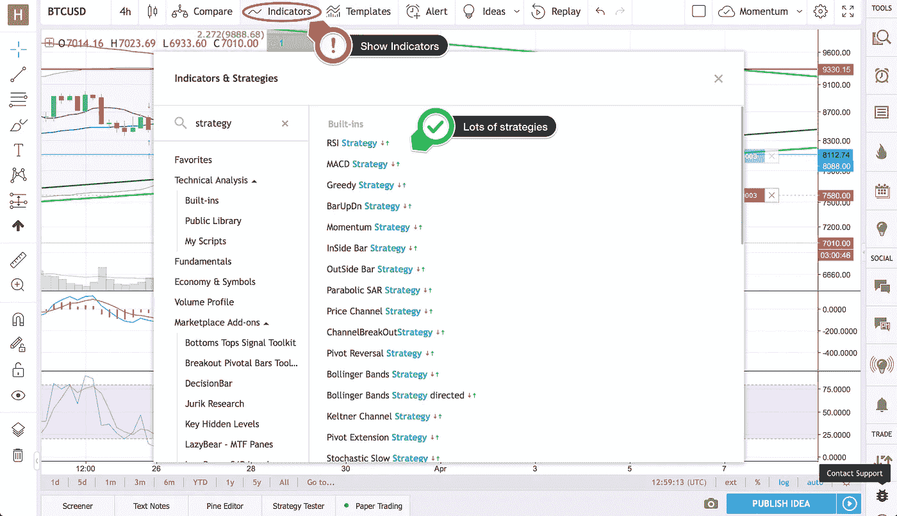
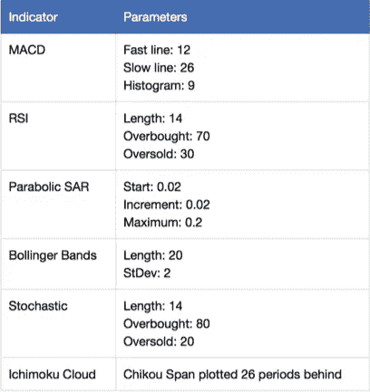
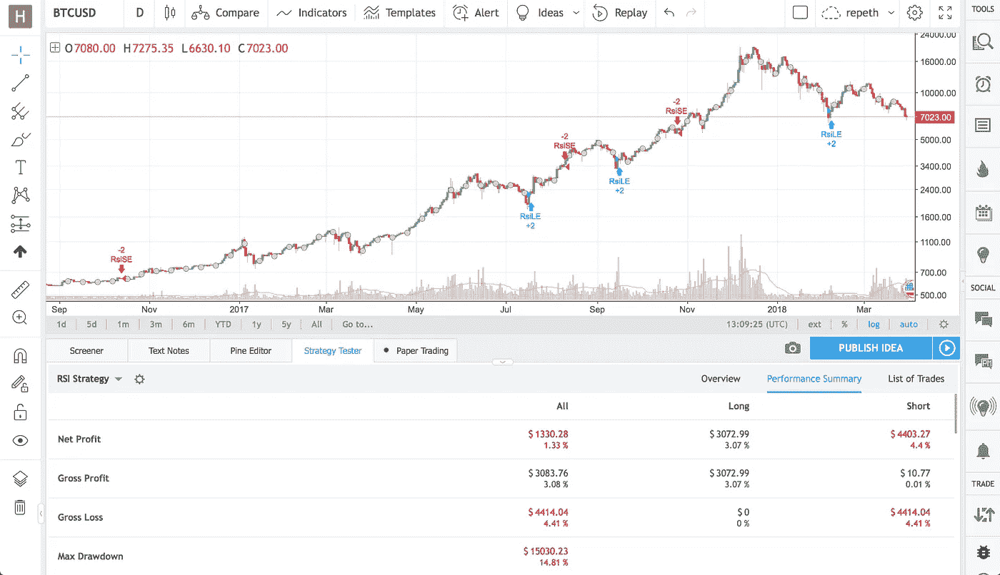
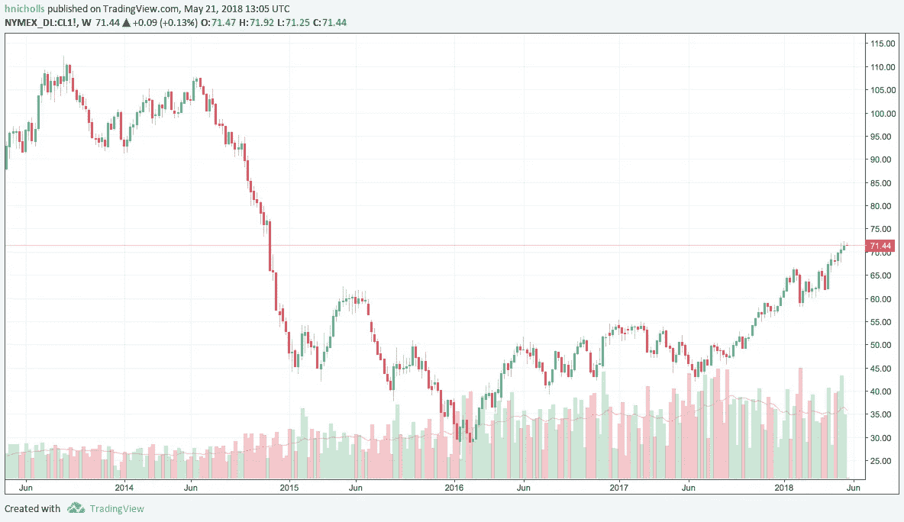
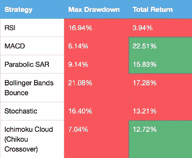
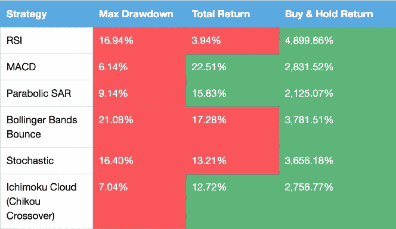

# 最赚钱的比特币指标

> 原文：<https://medium.datadriveninvestor.com/the-single-most-profitable-bitcoin-indicator-4cc8b9f7709?source=collection_archive---------0----------------------->

Photo by [Pepi Stojanovski](https://unsplash.com/@timbatec?utm_source=medium&utm_medium=referral) on [Unsplash](https://unsplash.com?utm_source=medium&utm_medium=referral)

你有没有想过一个最赚钱的比特币指标是什么？在这篇文章中，我将向你展示 6 个主要指标的回溯测试策略的结果，并揭示最有利可图的一个。

如果你不知道最流行的指标是什么，那么先[阅读这篇文章](https://medium.com/@harrynicholls/7-popular-technical-indicators-and-how-to-use-them-to-increase-your-trading-profits-7f13ffeb8d05)，因为如果你知道每个指标是如何工作的，你会从这篇文章中获得更多。

这个实验是为了展示一个指标作为交易信号有多有用。我对基于这 6 个指标的信号买卖 BTCUSD 的策略进行了回溯测试，时间超过 3 年:

*   MACD
*   RSI
*   抛物面 SAR
*   布林线
*   随机的
*   市云

这些是我们在[掌握加密货币交易艺术](https://harrynicholls.medium.com/mastering-the-art-of-cryptocurrency-trading-essential-tips-and-strategies-for-success-4fa43ba59195)中介绍的一些流行指标。

 [## 掌握加密货币交易的艺术:成功的基本技巧和策略

### 对于那些有兴趣掌握加密货币交易艺术的人来说，这是一个全面的指南。

harrynicholls.medium.com](https://harrynicholls.medium.com/mastering-the-art-of-cryptocurrency-trading-essential-tips-and-strategies-for-success-4fa43ba59195) 

我将向大家展示每种策略的表现，将它们相互比较，并与买入并持有策略进行比较。

在做实验之前，我写下了我的假设:

> 单一指标不是好的交易信号，它们不会产生两位数的利润，但会产生两位数的亏损。

使用本文中的信息来改善你在[比特币基地](https://www.coinbase.com/join/nichol_2w)的比特币交易策略。

说完了，我们开始吧！

# 我是如何做这个实验的？

我是 [TradingView](https://www.tradingview.com/?aff_id=9802&source=medium-auto) 的忠实粉丝，所以很自然地我用了他们的策略测试器。这允许你在任何图表上回溯测试任何策略。幸运的是，他们的指标&策略库中已经有了许多策略，所以我可以对所有指标使用预先制定的策略，除了 Ichimoku Cloud。

[*TradingView’s*](https://www.tradingview.com/?aff_id=9802&source=medium-auto) *long list of built-in strategies*

TradingView 有一个名为 Pine 的简单脚本语言，用于编写策略，因此编辑现有的 Ichimoku 云指标源代码以包含策略并不太困难。

[策略](https://www.tradingview.com/script/6fUgoJJy-Chikou-Crossover/?aff_id=9802&source=medium-auto)包括当池口跨度以自下而上的方式穿越价格时进入多头，当池口跨度自上而下穿越价格时进入空头。我花了大约 10 分钟写下了这个简单的策略。

正如我提到的，所有其他策略都已经存在于 TradingView 的库中，所以只需要将它们添加到我的图表中。

为了简单起见，我选择对所有策略使用默认参数。

Indicators and parameters employed for the test

我把这些分别应用到 BTCUSD 日线图上。这里先睹为快:

*RSI Strategy applied to BTCUSD 1D chart on* [*TradingView*](https://www.tradingview.com/?aff_id=9802&source=medium-auto)

如你所见， [TradingView](https://www.tradingview.com/?aff_id=9802&source=medium-auto) 在图表上画出了交易进场点。红色是短条目，蓝色是长条目。他们为你提供了一个很好的结果汇总表！没有比这更容易的了。

# **什么是回溯测试？**

在我们深入研究结果之前，我想给你一些关于什么是回溯测试以及为什么它有用的信息，因为它是你交易工具箱中的一个很好的工具。

我们在[掌握加密货币交易的艺术:成功的基本技巧和策略](https://harrynicholls.medium.com/mastering-the-art-of-cryptocurrency-trading-essential-tips-and-strategies-for-success-4fa43ba59195)中简要介绍了这个主题，所以这里有一个更详细的解释。

 [## 掌握加密货币交易的艺术:成功的基本技巧和策略

### 对于那些有兴趣掌握加密货币交易艺术的人来说，这是一个全面的指南。

harrynicholls.medium.com](https://harrynicholls.medium.com/mastering-the-art-of-cryptocurrency-trading-essential-tips-and-strategies-for-success-4fa43ba59195) 

通过回溯测试，你可以用已经发生的事情来测试交易系统。你可以很快看到某个策略在特定市场条件下的表现。

我们都听说过这样一句话“过去的表现不是未来结果的指标”，这句话没错，但只是在表面层面。如果你分析了不同的市场条件，并理解了为什么你的策略以某种方式表现，那么你就可以调整和完善它，以便它在未来表现得更好。

在 2017 年末我们经历的 2 万美元的上涨过程中，许多策略可能都很有效，但这可能只是侥幸，因为市场正在上涨。但是在我们现在经历的低迷时期，他们可能不会做得这么好。

回溯测试可以让你看到在这两种不同的情况下，你的交易表现会发生什么变化，并为你提供信息来改进你的策略。这只能是一件好事！

要知道，好的回溯测试结果并不意味着你的策略是万无一失的，尤其是在 BTCUSD 这样年轻的市场。或者任何加密货币！你选择的时期不太可能包含所有可能的市场条件。这在 BTCUSD 很明显，因为还没有出现大的熊市。

你可能会说，我们现在正处于其中，但这只是相对于我们过去几年看到的比特币的表现而言。相对于此，是的，这是一个熊市。但它与最近的石油熊市毫无关系。

The multi-year oil bear market (NYMEX Light Crude Oil price shown), [TradingView](https://www.tradingview.com/?aff_id=9802&source=medium-auto)

每桶石油的价格从 2014 年 7 月的 106.9 美元降至 2016 年 2 月的 26.05 美元。这是 19 个月的熊市，仍然没有突破 2014 年 7 月的价格。几个月的比特币盘整不算什么。

会有几天、几周甚至几个月，你的系统会经历巨大的消耗。对你的策略进行回溯测试并看到它在 2016 年的几周内损失了 50%，这很好，但如果这种情况实时发生，会发生什么呢？你对此有何反应？你能忍受连续几周日复一日地看着你的账户被耗尽吗？知道关掉系统就能止血？

进行测试和看到结果，以及实时经历市场的涨跌，有很大的不同。回溯测试不会给你这种体验，只有真实交易会给你这种体验。

关键是，回溯测试并不能保证你的策略在未来的表现是一样的，因为市场是变化的。所以不能一味的相信回测。您需要始终监控正在发生的事情，始终关注性能的变化，并理解为什么会发生这些变化。

对任何人来说，开一个交易账户并做几笔交易都很容易，但长期持续盈利却非常困难。

# **结果**

这是你期待已久的时刻，结果！提醒你一下，我的假设是没有一个指标会有两位数的正回报，它们都会有两位数的下降。请击鼓…

Backtesting results

我们这里真的是鱼龙混杂。他们中的一半人显然做得很差。RSI，布林线，和随机指标，都有负回报和超过 10%的下降。

实际上，我很惊讶，其他 3 个指标(MACD，抛物线 SAR 和一模库云)取得了积极的回报。MACD 甚至获得了超过 20%的回报！这三个国家的下降幅度相当不错，都不到 10%。

MACD 显然是这里的赢家。

仅此而已。MACD 赢得最赚钱比特币指标的称号。下次见！

…

等一下！故事还没完。

从这些指标中的任何一个来看，最好的回报都是 22.51%。请记住，时间跨度超过 3 年。如果你想想在这三年里市场发生了什么，你会发现这并不好！比特币从 300 美元涨到 19，891.99 美元(根据比特币基地的数据)，然后回落到 5，873.00 美元。那些变化超过 22.51%！

看一看与买入并持有相比的策略。买入并持有从该策略的第一笔交易开始。这是变化的，所以相对买入并持有的回报也变化很大。但是买入并持有和指标之间有明显的区别。

Indicators vs. buy-and-hold, there’s an obvious winner…

与买入并持有相比，指标策略显得苍白无力。他们只是不够好！

即使是标准普尔 500 追踪器也会超过这些指标。2014 年 12 月 1 日，S&P 收于 2053.44 美元。3 月 27 日，该股收于 2612.62 美元。这与我研究比特币的同期涨幅为 27.23%。

没错，持有 S&P 指数追踪器可以击败上面所有的策略！

你可以做得更好。

# **有什么意义？**

所以我已经向你展示了单一指标很糟糕。MACD 是 BTCUSD 最有利可图的指标，但它在买入和持有回报上一无所获。

我想在这里指出的一点是，没有任何一种策略是完美的。没有灵丹妙药。所有的指标都有它们的[限制](https://medium.com/@harrynicholls/7-popular-technical-indicators-and-how-to-use-them-to-increase-your-trading-profits-7f13ffeb8d05)它们被严格的规则所约束，使得它们缺乏灵活性。

在波动市场有效的策略可能在趋势市场无效，在波动市场有效的策略可能在平静市场无效。正如在[掌握加密货币交易的艺术](https://harrynicholls.medium.com/mastering-the-art-of-cryptocurrency-trading-essential-tips-and-strategies-for-success-4fa43ba59195)中所讨论的，你需要灵活运用你的方法。学会识别不同的市场条件，以及最适合每种条件的方式。

 [## 掌握加密货币交易的艺术:成功的基本技巧和策略

### 对于那些有兴趣掌握加密货币交易艺术的人来说，这是一个全面的指南。

harrynicholls.medium.com](https://harrynicholls.medium.com/mastering-the-art-of-cryptocurrency-trading-essential-tips-and-strategies-for-success-4fa43ba59195) 

长期来看，最好的方法是随着市场的变化而改变你的方法。在改变你的风格和策略时，坚持僵化和不灵活肯定会赔钱，因为市场不在乎。它会随心所欲地移动，不管你喜不喜欢，你都会被它冲走。

和往常一样，你需要将[风险管理](https://medium.com/@harrynicholls/the-5-most-effective-risk-management-techniques-that-the-pros-use-a3bf7191f682)融入你的战略。无论你对策略有多自信，你都无法预测每一个可能的行动，良好的风险管理意味着你不必这样做！

 [## 专业人士使用的 5 种最有效的风险管理技术

### 风险管理。这是一个在交易博客、书籍和课程中经常出现的话题。但是真的实用吗？我…

harrynicholls.medium.com](https://harrynicholls.medium.com/the-5-most-effective-risk-management-techniques-that-the-pros-use-a3bf7191f682) 

你必须对市场告诉你的做出反应，熊市不会因为你喜欢做多而转向，市场也不会因为你想交易布林反弹而停止趋势。与正在发生的事情保持一致，针对不同的情况制定不同的策略。

不能靠一个指标或者一个策略就让你过关。

如果这篇文章有帮助或者有趣，请点击拍手按钮👏所以更多的人可以看到它！

***随意分享这篇文章，因为你认识的人可能会觉得有用！***

**免责声明:**本文中的信息仅用于教育目的。我不是理财顾问，这篇文章也不包含理财建议。自己做关于风险的决定，或者咨询专业的财务顾问。