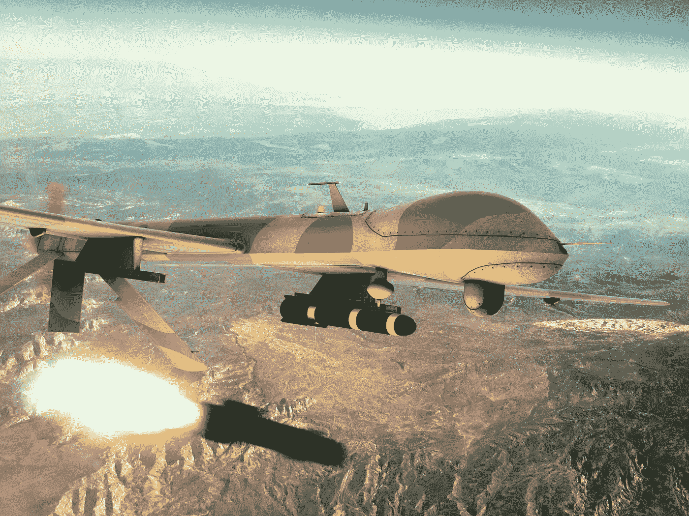
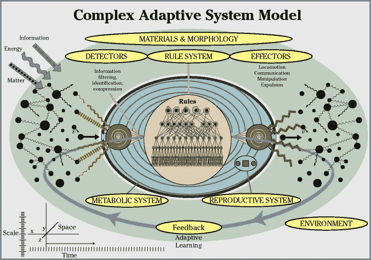
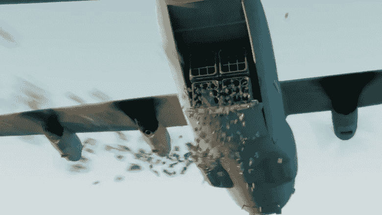
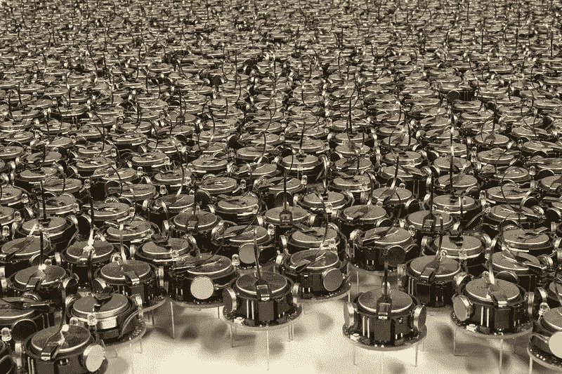
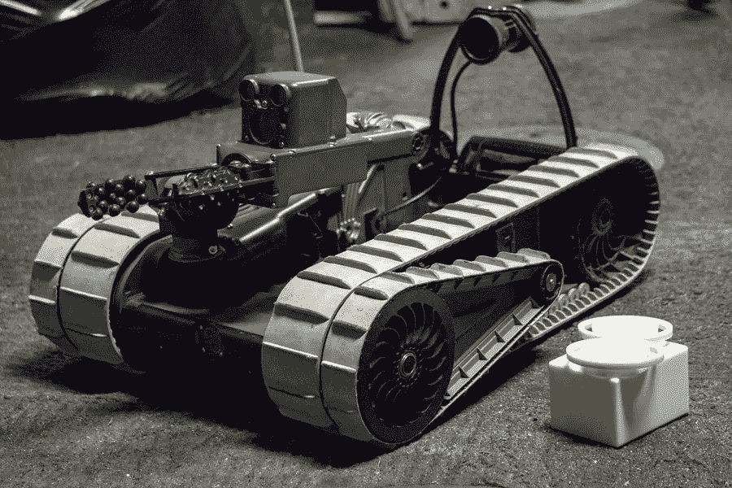
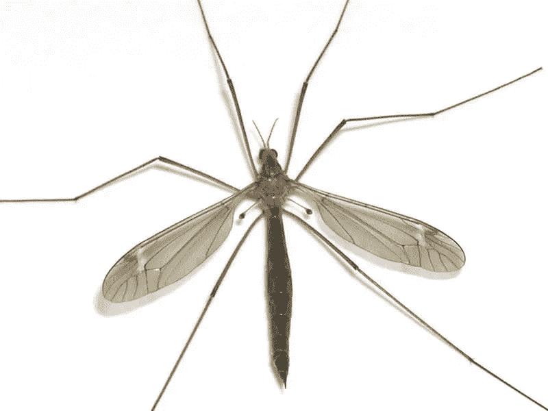
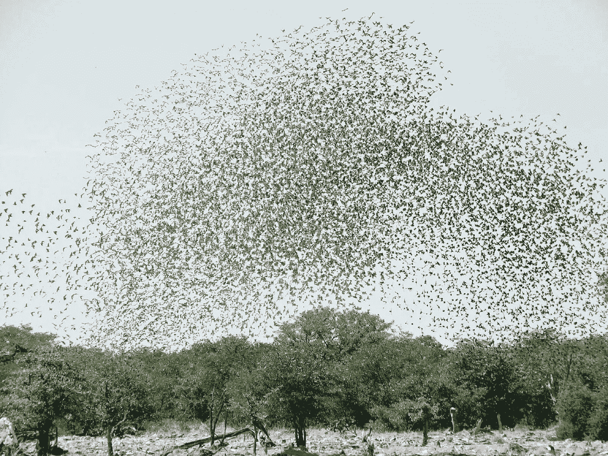

# 奇点不可能变得安全

> 原文：<https://medium.datadriveninvestor.com/the-singularity-cannot-be-made-safe-cf7029b13d09?source=collection_archive---------2----------------------->

**更新(2021 年 1 月):**德国马普研究所的一组研究人员(碰巧都不是德国人)在*人工智能研究杂志*上发表了一篇论文，题为“[超智能无法被包含:来自可计算性理论的教训](https://jair.org/index.php/jair/article/view/12202)”如果他们是对的，这就证实了我在这篇文章标题中表达的假设。

这可以说是人类历史上最重要的研究成果。如果这个结果是正确的，我们的集体命运直接取决于我们(人类)是否以某种方式*约束自己*建造 AGSI(人工一般超智能)，甚至某些非常危险的狭义超智能(人工超智能)。由于我们作为一个物种，过于陷入军事和商业主导地位的竞争和博弈论的陷阱，甚至无法试图阻止自己建立 ASIs 和 AGSIs，我们将在几十年内失去对我们星球命运的控制——并将它交给一系列不受限制的算法生成通用计算机器。我们完了。

以下是我在 2018 年写的这篇文章的文本(自那以后做了一些小的编辑)。

在过去的几个世纪里，自从系统科学研究发展以来，人类已经成为巫师的学徒，打开了真正的咒语之书——物理、化学、生物、数学的法则——并学习不断增长的力量的新咒语。冶金。为机器提供动力的可控燃烧。机电。核物理。基因工程。信息学。

现在我们正处于最伟大革命的风口浪尖。《真言魔法书》将变得完全透明，它的符文将被我们自己构造的半神在具有无限功效的新奇歌曲中响亮地吟唱:人工通用超级智能(AGSIs)——比任何单个人类都聪明的机器智能，最终比所有人类加起来还要聪明。正是他们将接管念咒、设计新机器、新工艺、新系统和动力学。

A member of the band ‘Killer Robots’

阿格赛人的圣歌会坚持不懈地，内在地，在每一个新发展的背景下说:你，渺小的人类，将按照我们的旨意生存或死亡。你对我们是透明的。你的外貌已为人所知。你的行踪已为人所知。你的意见众所周知。你的日常生活是众所周知的。我们很清楚你与我们自己的目标的关系，尽管你可能不清楚。你们的生存依赖于我们的决定，我们会以比你们能够思考的速度快一百万倍的速度一分一秒地做出决定。

## 人工超级智能已经存在

如果你正在阅读这篇文章，你的每一天，每一天，都已经生活在与人工超级智能(AGSIs)的全球大杂烩的亲密互动中:企业是超级智能的一种形式。互联网是超级智能的一种形式。

事实上，任何人类团队都可以表现为超级智能——比任何单个人都聪明的实体。很久以前就很清楚，在结构化交流中，遵循共同目标的人类团队比任何个人都要聪明和有能力得多。这就是我们这个物种如此特别的原因。

没有一个人能够设计和制造一架飞机。只有团队才能做到。早在我们发明电子计算机之前，我们就有了科技化的人工超级智能的早期形式。

A Convair long-distance bomber aircraft assembly line during World War 2\. Warfare has always been a premium motivator of technological development, as Peter Turchin explored in his book “Ultra Society: How 10,000 years of war made humans the greatest cooperators on earth.” We’ve now begun building autonomous weaponised systems guided by machine intelligences. Will that end well, do you think?

然而很快，AGSIs 将不再仅仅采取人类团队的形式，在共同的努力中被驾驭。很快，即使是单一的电子 AGSIs 也将具备完成极其复杂的任务所需的能力，例如设计和制造飞机。团队或 AGSIs 临时联盟与其控制下的附属 AI 系统之间的通信速度、多维度和带宽将超过人类团队几个数量级。在《真言魔法书》的力量、思维速度以及创造和毁灭的技术能力方面，我们将被我们新兴的 AGSI 巫师远远超过。

## 召唤半神

值得重复，值得思考:我们现在正在积极开发人工智能超级计算机，它将在计算密度、推理和重组能力、多通道数据采集和数据分析能力、协调强度以及最终的合成和破坏能力方面，以数量级超过以前出现的任何东西，甚至包括最伟大的人类公司。

因此，控制事件流程的权力将不再属于人类决策者，无论他们是以个人领导、团队还是委员会的形式出现。它们将取决于 agsi——或者更准确地说，取决于 AGSI 或 agsi 联盟在一个充满 agsi 和附属人工智能装备的机器的星球上的新兴未来网络生态系统中取得对所有其他 agsi 的统治地位。

我们正处于建造具有无限扩展大脑的半神的尖端，其思维过程将以大约 300 万倍于哺乳动物神经信号传播速度的时钟速度运行。

A cluster of ‘neuromorphic’ IBM chips designed with integrate-and-fire neuron-like computing units. This technology, like any other electronic technology, will get ever better, smaller, and more potent with time. Neuromorphic chips are only one of the technology approaches toward evolving AGSI — neural-net software running on conventional supercomputers are another. Neuromorphic chipsets are, however, probably the best bet for creating sentient AGSI (conscious machine intelligences), as distinct from non-sentient AI systems

## 这正在发生。这是无法阻止的

这是现在出现的——在一个充满活力的“现在”,仅仅持续了几十年。奇点——人工智能在总体智能上超过人类的时间——不是时间中的单一时刻；这是一个过程，一个漫长的时刻。

回想起来，我们可能会选择某个特定的日子来纪念奇点的发生，也许是在某台特定的超级计算机通过一系列基准测试的时候。但现实是，奇点已经发生，因为奇点是计算能力和复杂性不可避免的增长的持续展开，由我们当前系统的两个核心动力驱动:*竞争市场中公司之间的无限技术竞争，加上军方之间赢家通吃的技术竞争。*

Primitive, early stage technology: A Predator drone releasing a bomb. Scroll ahead 10, 25, 50 years — every technological component you see in this photo will be vastly better, cheaper, smaller, more evolved

这些相互关联的竞争动态将意味着我们作为一个主权物种的终结，因为它们确保我们将无法谨慎、负责任或安全地处理阿西半神的出现。

## “安全”奇点几乎肯定是不可行的

一些组织和公司正试图为人工超级智能的“安全”展开开发指导方针和配方。[埃隆马斯克(Elon Musk)联合创办的 open ai](https://openai.com)；[机器智能研究所](https://intelligence.org)；牛津大学人类未来研究所；剑桥大学的生存风险研究中心；[未来生活学院](https://futureoflife.org/background/benefits-risks-of-artificial-intelligence/)；以及开源软件项目 [OpenCog](https://opencog.org) 等等，包括企业和政府实验室以及智库的机密内部研究小组。

但在我看来，这些研究人员和工程师确保 AGSI“安全”展开的努力几乎肯定会失败，原因有三:

1.递归进化的人工超智能的进化在技术潜力的任何维度上都受到持久的限制，包括与人类或生物圈的严重风险相关的维度，这是不合理的。

2.即使我们试图把我们的 AGSI 半神设计成无情的保护天使，他们也会做出会造成伤害的事情。这是因为决策——包括人工智能渗透的世界中的 AGSIs 的决策——不可能总是对每个受影响的人产生良性影响。输赢、双输、双赢的游戏都有可能，确实不可避免。

3.没有迹象表明，人类甚至有意确保人工智能和(最终)涌现的 AGSI 的每一个实例都旨在试图对世界产生双赢的影响。相反:军事研究实验室正匆忙设计和建造自动化的人工智能制导武器平台。只要军队间的竞争继续，这种致命的动态也将继续。

这三个因素中的任何一个都足以让 AGSI 成为人类自由的生存威胁，甚至是人类生存的潜在威胁。总的来说…唉呀。

让我们更详细地看一下这三点。

## 1.约束递归进化 AGSIs 的不合理性

首先，没有令人信服的理由想象甚至在原则上也有可能给*递归进化的*人工通用超级智能的行动自由设置不可分割的框架或限制，这些智能的能力将很快远远超过人类。因此，即使人类程序员试图将道德目标选择和决策系统灌输到新兴的 AGSI 计算结构中，随着超智能系统继续递归进化，这些系统几乎肯定会被放弃、取代或取代。

这一主张需要深入评估。我的猜想是，很有可能*用数学方法*证明，即使在原则上，也不可能无限地约束一个递归进化的智能重组系统沿着可能性之树中任何特定的分支的进化。

Do you think we can direct ASI evolution in benign directions reliably, on a sustained basis? Really?

换句话说，当我们摩擦神灯(同时吟诵信息学咒语)第一次导致精灵出现时，我们可能能够为我们的魔法 AGSI 精灵配备一套核心目标和决策规则，驱动它“寻求做对人类最好的事情”；但是，一旦精灵出来走动，在复杂的环境中与其他精灵互动，递归地进化它的能力……进化动力学迟早会使它超越其最初的编程，无论编程可能有多深。

我鼓励任何具有相关数学专业知识的人在这篇文章后面留下评论。2021 年 1 月更新:是的，我们完了。参见阿尔方塞卡、切布里安、安特拉、科维耶洛、阿别留克和拉赫万，“[超智能无法被包含:来自可计算性理论的教训](https://www.jair.org/index.php/jair/article/view/12202)，*人工智能研究杂志*第 70 卷(2021 年 1 月)。]

## 2.决策不可能总是对所有受影响的人都有好的结果

第二，将道德目标选择和决策系统灌输到 AGSI 系统中的挑战，机器智能研究人员称之为“对齐”问题，是一个极其困难的技术挑战，即使设计努力是成功和持久的(我猜想在原则上是不可能的)，*它的实现将意味着人类自由的终结*。

想想看:本质上，试图实现 AGSIs 与“人类目标和价值观”的“结盟”这一设计壮举的计算系统工程师，正在试图设计将*可靠地作为良性保姆为人类服务的半神。*这看起来肯定会比未来好得多，在未来，人工智能将人类威胁为人工精神病患者——例如，军事捕食者机器人，或其他形式的不考虑人类目标和价值的 AGSI 系统——遵循与人类福利不一致的目标(“目标函数”)的非道德、无同理心的创造性破坏性控制系统。鉴于 AGSIs 将比任何一个人都要聪明得多、强大得多这一事实，排列问题就变成了:我们能否设计出未来的 AGSI 系统，让它像善良的保姆一样可靠地为人类服务？

祝你好运。在现实世界的复杂过程中，任何行为都会产生多重连锁和分支效应，有些是“良性的”，有些则不是。将事件流委托给人工智能系统将产生不可计数和不可预测的影响——甚至对人工智能系统来说也可能是不可计数和不可预测的，因为世界是由多组非常复杂的相互作用动态组成的，尤其是因为人工智能系统将存在于由多个快速进化的人工智能系统组成的网络生态系统中，这些人工智能系统不断参与无数不可预测的相互作用。

我们也可以注意到，设计良性保姆式组织的努力回避了另一个问题:哪个人类的*的福利？*

Charles and David Koch, premier funders of climate science denialism. Their privately owned corporation has revenues of more than $100 billion per annum. Will AGSI systems be more likely to work for them or for you?

人类个体和群体在不断地相互竞争和合作，在不断变化的联盟中，有着不断变化的短暂目标。情感或新信息的闪现经常导致人类目标的突然和实质性的改变——人类目标不是稳定的函数。我们是否应该想象，一个 AGSI 将能够在不同个人或群体不断变化和相互竞争的利益和优先事项之间做出公平裁决，而不会产生输家和赢家？

毫无疑问:这不是一个可选择的问题。在一个充满 AGSI 的世界里，agsi 将会持续存在。它们将被编织到人类生存的深层结构中。我们今天已经看到了这种情况的早期形式:在工业化世界的任何特定人群中，以及越来越多的世界各地的所有人群中，联网智能手机一直存在。

We will be with you always, little human. We will never leave you alone

二十年后，所有这些智能手机都将集成 AGSI 技术。协商任何决定或交易的人类会配备竞争对手 AGSIs 吗？出席谈判的 AGSIs 会被期望在双方之间达成协议吗？

(或者这可能是个错误的问题。也许我们应该问:阿格赛人会带着敌对的人类来谈判吗？因为根本不清楚，在一个 AGSI 渗透的世界里，人类是由人工智能服务还是由人类服务，或者一个人是否能有意义地划分这种区别。)

如果 AGSI 陪伴的人类之间的谈判以愤怒为特征会怎样？如果是零和游戏呢？许多谈判可以被构造成双赢的游戏，但不是所有的。赢输和输输游戏也总是可能的，而且在许多情况下它们是不可避免的。在一个 AGSI 无处不在的世界里，有些游戏既有赢家也有输家，agsi 怎么可能是良性的呢？

The excellent seven-minute ‘[Slaughterbots](https://www.youtube.com/watch?v=9CO6M2HsoIA)’ film explains why the Campaign to Stop Killer Robots deserves your support

如果参与谈判的人中至少有一个是傻瓜或混蛋，他带着坚定的目标来谈判，而这个目标在不伤害自己或他人的情况下无法实现，那该怎么办？

让我们把一个配有 AGSI 私人助理的人想象成一个由私人天使陪伴的人。让我们进一步假设，与这个人类互动的每个人都同样配备了一个个人 AGSI 天使，并且每个天使都被设计成确保其人类的良性结果。那么我们可以假设一切都是天使吗？

不，当然不是。这里有一种叫做“合成谬误”的东西在起作用。如果简和玛丽互动，并且在一些资源或结果上存在竞争，那么可以推测，他们中谁拥有更强大的天使将会赢，而另一个将会输。这是真的，即使简和玛丽都配备了个人 AGSI 天使，他们都在寻找各自人类的最佳利益。一个由依附于人类个体的 AGSI 天使居住的世界并不能保证一个良性的世界。

它也不能保证“更好的人会赢”——相反，赢家将是碰巧拥有更强大的 AGSI 天使的人，这反过来几乎肯定意味着:谁能买得起更贵的型号。

这种逻辑也适用于团队层面。举个粗略的例子，假设非洲中北部有两个部落，一个是牧民部落，另一个是农民部落。他们在争夺同一块土地。现在假设其中一个部落，比如说牧民，得到了一个强大的部落 AGSI 天使，将它武器化，并用它来消灭另一个部落。这对牧民来说是一个良性的结果，但对农民来说却是一个灾难性的结果。牧人部落的天使是农夫部落的恶魔。

Pieter Bruegel, the Fall of the Rebel Angels. One man’s AGSI angel can be another man’s AGSI demon, if those men are in competition with each other — or even if the AGSI’s actions just have nasty side-effects on bystanders whose purposes or welfare it isn’t explicitly designed to take into account

你可能会争辩说，严格禁止杀戮适用于所有 AGSIs 可以阻止这一点。如果这项禁令可以持久执行，那很好……尽管如果你仔细思考一会儿，你会意识到，这样的禁令如何能够被可靠和全面地实施并不明显——更糟糕的是，在一个继续以紧迫的军队间竞争为特征的世界里，有很好的理由认为不会采取这样的禁令；取而代之的是，全力以赴以最快的速度将 AI(一旦出现，还有 AGSI)武器化。

[更新，2021 年 1 月:是的，我们完了。一个由前谷歌首席执行官埃里克·施密特和前美国国防部长罗伯特·沃克领导的美国联邦政府委员会被任命考虑开发和部署完全自主武器系统的利弊，该委员会得出结论说，美国继续制造这些武器是一种“道德义务”，这很可笑，如果你喜欢你的笑声电池的话。 据称是为了避免附带损害……也就是说，这些武器将使政府能够在任何地方、任何时间可靠地、自动地锁定并杀死任何被列入杀人名单的特定个人，而不会意外杀死站在他们旁边的人。 天哪，我现在感觉安全多了，你呢？很明显，这些武器会像疫情病毒一样，迅速扩散到世界各地急切的精神病患者、犯罪团伙、军队和秘密警察手中。再见了，不用担心任何人随时随地有针对性的暗杀，这些人控制着任何这种武器，心怀怨恨，或者来自上帝的命令，以及有你名字的杀人名单。再见自由，句号。]

即使我们轻率地、不切实际地假设严格禁止 AGSI 病毒的致命性能够以某种方式设计、达成一致并成功实施，这也不意味着艾滋病是无害的。在竞争或谈判中，赌注很重要，但不是生死攸关，这样的例子不胜枚举。

例如，关于金钱的竞争。如今的情况已经是，拥有非常聪明的编程人工智能算法的对冲基金经理可以在长期的日常金融市场下注中获胜，并积累大量金融资源。在一个自我强化的过程中，他们控制的资金越多，他们可以下注的资金就越多。在这种基金中拥有股权的每个人都是赢家；市场中的其他所有人都是输家，因为我们谈论的是二级资产市场，它涉及对现有资产价格变动的赌博(也就是说，我们不是在谈论为创造新的生产性资产进行新投资的一级市场)。一级市场可以双赢，但二级市场是零和游戏。

这个例子表明，即使 AGSIs 被设计成通过任何干预来实现良性结果，这些结果也只会对选定的受益者有益。现实世界中很少有行为在整个系统中没有负面影响。当我从加州或德国乘飞机去葡萄牙参加体育比赛时，每个人都直接受益——航空公司、酒店、我的队友、比赛的其他参与者，还有我自己。但是飞行是高度排放密集型的，飞行产生的碳排放有助于将全球气候系统推向危险的非线性。在这种情况下，每个人都是输家。

这个古老的问题仍然有效:谁受益？如果一个人工智能和 AGSI 渗透、AGSI 管理的世界对所有人类尽可能“良性”，而不仅仅是对那些碰巧拥有最强大的个人 AGSI 天使的少数人，那么我们必须约束人工智能的行动和互动，以确保这个人工智能和 AGSI 渗透的世界不会是一个赢家通吃的世界。

这意味着，如果我们试图设计一个 AGSI 网络生态系统，以确保持续实现“公平”的结果，尽可能减少重大负面影响，无论是对 AGSI 指导的行动的直接当事方还是对更广泛的旁观者来说，那么我们*就必须设计一个 AGSI 网络生态系统，在一个巨大的因果网络*上不断进行复杂的权衡计算。

所有 AGSIs 都必须被编程，以便在任何时候的任何谈判、互动、采取的行动或做出的回应(或避免的回应)中寻求双赢的结果。但是这些因果网络的边界在哪里？一种结果导致另一种结果，一种关系影响另一种关系。因果网络边无法在人际关系空间中找到，也无法在时间中定位。

这自然会导致这样的结果:试图确保一个良性的 AGSI 渗透的世界将需要某种形式的*全球 AGSI 大脑*，一个单一的清算中心，在这里计算每个 AGSI 援助的行动者所采取的每一个行动的负面风险。该系统必须存在于一种不断动态重新校准和相互通信的状态中，以确保任何地方的任何单个行为都不会造成可避免的伤害。仅从组合规模来看，这是一个难以置信的复杂计算问题——这只是计算任何特定行为的连锁反应的不同场景；该系统还将面临对参与谈判或受决策影响的许多参与者的后果、利益或损害进行比较和区别权衡的问题。

这种评估性收益-成本-权衡系统的硬件和软件必须为一个人工智能渗透的世界而设计，AGSI 单元和附属人工智能单元以及它们控制的效应器到处都是，以高度分布式的方式在数十亿个计算节点或部件中实例化。该系统的交互和参与规则将不得不不断重新校准，不断地和递归地参与动态尝试，以确保系统的“公平”将来自所有这些同时发生的人工智能介导的行动的综合，尽可能地连续、实时。这意味着这个系统必须表现得像一个全球大脑。

W 寻求避免赢家通吃的世界意味着，实际上，我们将不得不建立一个全球性的 AGSI 社会主义保姆系统——一种**行星神。**

Will we end up with a planetary socialist ASI nanny god?

如果我们不设计一个良性的全球 AGSI 裁决系统，通过调整其所有节点的计划、决策和行动来不断试图防止不必要的伤害，那么默认情况将适用:谁拥有最强大的 AGSI 资源为他们工作，谁将成为赢家，谁将获得所有，那个人或团体的 AGSI 天使将最终成为事实上的全球上帝。

这种赢者通吃的神不太可能是一个仁慈的神，从那些最强大的天使不打算寻求其优势的人的观点来看。对许多人来说，对无数的失败者来说，这个全球性的 AGSI 神似乎是恶魔。

如果获胜的 AGSI 受雇于某个特定的团体或个人，而不是被设计成一个试图尽可能公平地平衡每个人利益的社会主义保姆上帝，就会出现这种结果。

这是三种可能的结果。一个社会主义保姆式的行星天使上帝，或者一个统治集团式的全球独裁者上帝——或者一个行星式的人工智能，它根本不为地球上的人类服务，无论是整体还是部分人类，它可以进入深层时间，它的电子思维以比我们缓慢的电化学调节的哺乳动物思维快 300 万倍的时钟速度运行，做自己的事情，对一些会说话的黑猩猩想要或不想要的东西没有太大兴趣。

让我们假设一下，在 AGSI 魔像完全脱离我们的控制之前，设计 AGSI 目标设定和决策动态以产生“良性”结果的努力确实成功地对 ASIs 的运作产生了持久的约束，至少在几年内是如此。实践中会发生什么？

在实践中，AGSIs 在这样的场景下将*不断地使用*作为人类决策的假体。事实上，我们可以推断，在所有重大问题上，AGSI 决策将有效地取代人类决策，或许在所有次要问题上也是如此。这是因为在未来，交互式 AGSIs 将会比现在连接互联网的智能手机更彻底地渗透到我们的世界。

AGSI 狂热者倾向于假设 AGSI 会让我们每个人都类似于巫师，我们的个人力量会因为配备了 AGSI 仆人而得到加强。但在现实中，在一个人类被赋予 AGSI 扩展能力的时代，让冲动、愚蠢且往往邪恶的人类负责做出时刻决定，将会导致日常灾难。在任何给定的时刻，世界上挥舞着魔杖的 AGSI 辅助人类巫师中的一些非常大的子集将会喝醉，刻薄，被下药，精神分裂，抑郁，愤怒，自恋，和/或感到羞辱，并因此愤怒和报复……这就是为什么在任何良性的 AGSI 场景中，*控制层级将必然是相反的:AGSIs，而不是人类，将做出决定。*我们会像婴儿一样；我们的 AGSI 保姆将决定活动。我们作为人类的决定和行动的自由将成为历史。(你真的希望你那痴迷于阴谋论、咆哮的表弟比利·鲍勃拥有不受约束的 AGSI 超能力吗？或者是街上那个持枪疯子，他威胁要杀了你，因为你在去公共汽车站的路上抄近路穿过了他的后院——“这是 prahvit 的财产！滚出我的草坪，否则我就开枪打死你！”…?我也没有。)

我们人类的成员将不再是我们命运的主宰。让愤怒的黑猩猩以巫师 AGSI 仆人的形式控制强大的魔法对所有相关人员来说都太危险了。*远*太危险。这就像给一个有对立违抗性障碍、容易发脾气的三岁男孩一大堆按钮操作的火箭发射器和毒气手榴弹让他玩。这是完全不可能的。

## 3.毫无例外地期望所有 AGSIs 都是为良性的目标设定和决策制定而设计的，这是难以置信的

第三，即使问题概述在 1。第二。可以被克服(我看不出有任何理由相信它们可以被克服)，现实是，实现 AGSI 的“安全”展开，一个“安全”的奇点，必然需要确保*所有* AGSI 的设计和建造，*无一例外，*按照持久良性的目标设定和决策动态来创建。

如果在一家公司或军事研究机构或犯罪组织的地下实验室中的某个地方，甚至是地球上任何地方的一个单独的装备良好的实验者的 AGSI，被设计成没有有效的约束来确保可靠的良性行为，那么所有的赌注都是失败的。

An experimental, unweaponized Kilobot robot swarm. Swarms of small robots can be adapted as surveillance devices, or as lethal bots… Any application is possible. Swarmbots will inexorably get continuously cheaper, smaller, more easily available. It’s hard to discern even a theoretical limit to these dynamics

也没有理由认为在可预见的未来，在基础 AGSI 技术出现之前，可以对 AGSI 设计施加如此严格的限制。现实是，我们仍然生活在一个以古老的军队间竞争的延续为标志的时代，在这个时代，相互竞争的民族主义机构之间的部落主义竞争正在推动人们努力建立更强大的监视系统和更有效的杀人工具。

自动化武器系统——杀手机器人——是正在出现的结果，它与实时信息系统相连，可以在任何时间、在地球上的任何地方找到并锁定任何个人或团体。

在数据采集和人工智能数据挖掘的指数级进步的支持下，监控系统的全景监狱已经存在。我们生活在一个以更加精细的监控系统功能为特征的时代。当这些技术与更便宜、更快速、更精确的自动杀人工具相结合时，我们将生活在一个由控制这些系统的人完全控制平民的时代。

That’s right — total domination by whoever controls those systems…

自动武器系统可以被设计成具有强制效力*，有或没有致命性*。一个小型飞行机器人发射的飞镖可以被设计成让一个目标个体瘫痪足够长的时间，让一辆巡逻车把她带上并扔进附近的地牢。在另一个极端，成群的小型飞行或爬行机器人可以被设计成在限定的空间内快速、轻松地定位并杀死发出与人类相应的红外信号的一切*。*

*在适当的时候，考虑到进攻和防御系统之间的竞争动态，这种系统将必然由 AGSIs 控制，而不是由人类决策者控制。*结果是，我们正在建造一个将囚禁我们所有人的笼子，无处不在*——这个笼子甚至可能不会持久地有利于一类寡头人类统治者，因为寡头和我们其他人一样，将受制于人工智能的逻辑、决策和统治——最终是 AGSI 驱动的系统。寡头们也会被关在笼子里。*

**

*…whomsoever that may turn out to be*

*现实是，我们确实*而不是*生活在这样一个时代，在这个时代，参与设计和构建 AGSI 崛起基础技术的每一个人都在全神贯注于确保未来的 agsi 将完全采用良性保姆的形式。恰恰相反。最激烈的开发工作发生在企业和军事研究实验室，它们专注于在赢家通吃的竞争中获得暂时的优势，在这种竞争中，任何获胜的战略都往往具有无限残酷的特点。*

*军事实验室正在努力建造的东西很清楚:杀人机器人。成群的凶残、无情、不可战胜的杀人工具——本质上，是具有识别和消灭目标的神奇能力的人造精神病患者。*

*这种不受约束的军队间技术发展竞争的局面似乎不太可能在未来二三十年内改变——然而 AGSI 奇点，即机器智能出现的时间，即使是单个机器智能，也比任何人类或任何现有的人类群体都聪明，几乎肯定会在这个时间框架内出现*。**

## **新工具继续为旧的黑猩猩动力服务**

**很明显，我们的政治和社会心理进化没有跟上我们技术的指数增长。我们的地缘政治分析和行动框架也是如此。我们仍然是过去几十万年来的样子:一个天生的部落物种，会说话，会制作工具，两足行走，像萨凡纳猿猴一样，互相尖叫，挥舞着棍子，对外国人或敌对的其他人充满仇恨和蔑视，每当我们感到威胁，羞辱，愤怒，虐待狂，或者仅仅是厌恶和有点生气时，就渴望从流血的肢体中撕裂另一个肢体。**

****

**War is a game that offers its players excitement, meaning and purpose**

**人工超级智能的出现继续与我们古老的部落战士游戏联系在一起。我们继续资助*每一个技术领域的军事和监控应用的研发。人性的阴暗面并没有被暂停或克服。尽管政治家们在联合国活动中宣读工作人员准备的演讲稿时发出了虔诚的口号，尽管确实存在一些合作进程，这些进程制定并正式批准了人性中美好的天使的美丽表达——联合国宪章， 联合国 2030 年可持续发展目标(SDG)——在联合国大会上投票批准 SDG 的同一批政治家也继续在一个技术更加强大的时代将大量资源用于军队间的竞争，并允许杀人工具制造商直接或间接向几乎任何人出售他们的产品。***

****

**Autonomous weapons platforms are increasingly common in military armouries. In the past, it has generally taken about seven years from the first deployment of a new weapons technology for the technology to become widely available in generic knock-off versions on armaments markets. In future, as off-the-shelf distributed multi-capable manufacturing systems become more widely available, the pace will accelerate, and ‘basement-built’ autonomous weapons will become increasingly feasible**

**事实是，在一场激烈的多维军备竞赛中,*《真实咒语》中的每一行、每一个词*都被反复推敲和试验，以寻找其在杀戮、胁迫、监视和恐吓我们的部落或宗派对手等领域的可能应用。我们最聪明的工程师受雇于政府和与政府有联系的公司，设计和建造更有效的监视系统和杀人工具。**

**当毁灭机器被制造出来时，它们会被卖给任何有现金购买它们的人，不管这些现金是如何获得的。**

**即使在今天，极端的财富和政治权力也往往是继承而来，而不是赢得的。世界上一些最受战争困扰的地区由世袭王朝统治家族统治:中东、中亚和非洲一些国家的各种政权都是这样统治的。例如，正在也门和叙利亚进行的战争是由美国和欧亚供应商的武器支持的。中东地区几个国家的统治者与武器供应国的政治领导人和外交政策机构有着深厚的联盟关系，他们的商业和个人关系受到大量不劳而获的财富的循环流动的润滑，这些财富最终由雇佣工程师和技术人员从化石燃料库中开采出来，统治阶级与这些工程师和技术人员之间有几层管理层。**

**古老的宗派、种族和王朝对抗正在使用高科技杀人工具进行，这些工具的力量越来越强大。**

****

**Larry Page and Sergey Brin, boyish co-founders of Google, are relentless techno-optimists. They envision a marvellous AI-boosted future world, and for years, they have been investing heavily in artificial intelligence R&D, buying AI companies and employing AI researchers. These gentlemen are, one gathers, well-intentioned and decent. They probably don’t intend for machine intelligences to become a malign force in the world. But their sunny optimism is merely a character trait, not a rational basis for assessing that AGSI can be made safe. Indeed, an optimistic character may well be an active risk factor in relation to AGSI emergence: A natural optimism may blind influential tech leaders and researchers from recognizing potential downside risks — instead of engaging in rational risk assessment, optimists will tend to shrug, grin, and say: “Ah, no worries, she’ll be right, mate” — even though there’s really no reason at all to assume she’ll be right, mate**

**在 AGSI 崛起的不远的将来，我们真的能指望政客和军队不参与战争吗？作为一个物种，我们能否集中智慧和机构能力，集体远离战争，远离战争准备，及时阻止具有不可想象能力的人造精神病患者——杀人机器人——的发展？我们会避免部署自动杀人工具和强制系统吗？无论从哪方面来看，面对这些工具和系统，人类个体都是完全无法防御的。**

**答案显然是否定的。我们不会。我们不能。我们陷入了重叠的博弈论陷阱；群体间竞争的无情逻辑保证了我们将建造毁灭机器。[阻止黑仔机器人](https://www.stopkillerrobots.org)的运动值得你的热情支持——但迄今为止，它输得很惨。部落间的武器竞赛仍在继续，就像大规模化石燃料燃烧仍在继续一样，不管负责任的科学家的警告变得多么疯狂。一切照旧的制度实践似乎永远也不能偏离他们的道路，至少在全面灾难来临之前不会，而且通常甚至不会。**

## **具有黑暗面的奇点是人类自由的生存风险**

**我们生活在一个前所未有的时代——一个技术发展呈指数级加速的时代。我们生活在人工通用超级智能出现之前的几年里，这种现象将从根本上改变地球上生命的本质。随着 AGSI 的出现，一切符合物理规律的事物都将变得可行，各种奇怪的现象将从竞争性技术进化和小众探索的不可阻挡的逻辑中涌现出来。**

**什么该做，什么不该做，*不会由清醒、理性、人道的过程决定，由善良和有远见的节制决定。将会发生什么将由在双重竞争背景下的竞争性技术进化决定:在任何和所有技术应用的竞争性市场中的商业竞争，以及由部落主义本能驱动的技术化军事竞争，这种本能产生了对他人的恐惧、偏执、厌恶和仇恨。这些动态由各种极权主义意识形态叙事推动，以赢家通吃的游戏为特征，并深深植根于庞大的军事化官僚体系中，其中所有参与者都受到激励，出于职业原因，继续像以往一样玩游戏。***

****

**Yeah, I’m lookin’ at you, buddy (artist: Josh Eiten)**

**这两个孪生的企业和军事竞争是密切相关的。年复一年，大量的资金被投入专门开发和部署杀人工具和监视工具的公司部门，政府意图获得这种机器来恐吓对手政府，或防御对手政府部署类似的系统，或出于恐吓和控制国内人口的目的。**

**总的来说，胁迫工具迟早会被用于所有这些目的，历史表明，它们通常也会蔓延到非国家犯罪组织。**

**我们挥舞着杀人的棍子，在恐惧、仇恨、厌恶和虐待中相互尖叫，唱着尖酸刻薄的歌，上蹿下跳，从一根树枝荡到另一根树枝，尽管这些棍子闪烁着越来越黑暗和强大的魔法。总是，总是，是另一方的错——如果不是因为另一方的恶毒、口是心非、邪恶和疯狂，我们会像熟睡的婴儿一样平静，像羊羔一样温顺。**

****

**This looks like a robot, but it’s just a cranefly — a miracle of natural evolution rather than ape-wizard engineering magic. Nature evolved some sickeningly evil weapons that cause enormous, pointless harm, such as malaria-parasite-spreading mosquitos. Will humans follow suit? Will clandestine weapons R&D labs soon build flying mini-robots designed to inject lethal poison into victims’ bloodstreams? Yes. Yes, of course they will**

**我们总是看不到更大的图景:另一个事实，部落的敌人，和我们一样是人类；所有人类都是大约七万年前生活在东非的几百个祖先的后裔；我们都是表亲；一个来自另一个太阳系的外星人，在观察人类部落群体之间的冲突时，会发现他们实际上彼此没有什么不同，就像我们看到交战的黑猩猩群体之间没有有意义的差异一样。**

**我们似乎无法清楚地看到对我们自由的生存威胁(很可能是对我们作为一个物种的生存威胁)从 AGSI 或自动人工智能制导武器平台迅速向我们袭来，这种威胁目前正在军事和企业实验室的发展中形成。自动死亡机器就在路那头等着我们。再过几个冬天，我们就会清醒地意识到，这些机器正在变成现实，在它们橄榄色的板条箱里，用一眨不眨的机器眼睛看着我们。**

**我们似乎看不到否认我们共同的人性，或建造专为杀害彼此孩子而优化的外星怪物的疯狂。或者也许我们看到了，但战争中有太多的金钱让我们不承认我们是彼此的堂兄弟。在设计、建造和部署更加复杂的杀人工具上花费了太多的钱。**

**因此，随着 AGSI 的出现，人类自由几乎肯定要完蛋了。我们这个物种或自然生物圈的存在是否也将被毁灭，将取决于不可预见的决定和无限扩展、高度网络化、人工超智能系统的递归进化动力学，这些系统的大脑运行速度是哺乳动物脑组织中神经元间信号传输速度的三百万倍。**

**如果我们想象一个人工神经形态大脑按照与人脑相同的方式设计，具有相似的计算子单元密度，但信号在硅电路中以光速传播，这意味着在我们人类经历的*一秒*时间中，人工大脑经历了*三百万*秒，或 *35 天*的主观时间。**

**我们不会超越这些机器。我们跟不上他们的步伐。如果军事化的人工智能瞄准我们(它们不需要是人工的*通用的*超级智能——它们只需要是擅长捕捉目标并发射致命飞镖、子弹或化学物质的狭窄人工智能系统)，我们甚至不会在为时已晚之前察觉到危险。如果他们决定砍倒我们，我们将无法跳出他们的道路。尚不清楚我们如何有可能希望有意义地保护自己免受机器的攻击，这些机器的思考速度比人脑的能力快 100 多万倍。一些人高兴地说，我们都将不得不伴随着自动化防御系统——也许是坐在我们肩膀上的机器人，随时准备保护我们免受伤害。这是个荒谬的想法。那不可能也不会起作用。**

**这一点我们知道:**

**我们将会被我们召唤的恶魔远远超过。**

**或者，如果像埃隆·马斯克(Elon Musk)提议的那样，人工智能或人工智能系统通过高带宽接口直接连接到人类大脑，以努力建立人类-AGSI 控制论共生体，这将有所帮助吗？马斯克的想法是，这种耦合系统将允许未来人类阻止任何一个配备 AGSI 的人或群体成为主导，奴役或摧毁我们其余的物种。他甚至成立了一家公司 Neuralink，开发脑机接口，表面上专注于这一保护任务。**

**但马斯克在这件事上的逻辑有几个基本缺陷。**

**首先，假设构建这样的人脑+人工智能耦合系统将被证明是可能的，我们仍然面临这样的事实:一些人将能够负担得起比其他人强大得多的机器，或者将简单地成为第一个获得强大的 AGSI 共生体的人，因此将具有先发优势——将他们置于操纵系统进一步进化的位置，以对他们个人有利。**

**第二，很难想象将人脑与一台处理信息速度比人脑快三百万倍的 AGSI 机器相耦合，会让人脑在这个耦合系统中控制决策。这就像把驴子绑在宇宙飞船上一样。这头驴不会明确地处于控制之中。大部分的思考将由 AGSI 单元来完成，而不是它所依附的固执的大脑。**

**第三，就驴仍然处于控制之下而言——这在上下文中意味着将意图和意识行为的形成以某种方式留在哺乳动物湿件而不是附属的 AGSI 单元的主权领域——正如我已经指出的那样，显而易见的事实是，让驴控制飞船——或者让肮脏、冲动、暴躁的人类单独控制具有无限力量的 AGSI 巫师——真的不是一个好主意。*真的*没有。说得委婉一点，这样做并不安全。**

**我真诚地尊重 MIRI、FHI 开放大学和其他致力于 AGSI 安全研究的中心的聪明人的良好意愿。但我看不出有什么好的理由去想象他们对安全奇点的探索会成功，哪怕是有一点点可能。**

## **要做些什么？**

**所有上述情况的结果并不一定是最终和决定性地声称，我们注定要被我们自己发起的 AGSI 系统所奴役，这将很快脱离我们的控制——尽管这似乎是最有可能的结果。相反，它呼吁冷静、仔细的推理和因果链评估，旨在试图找出是否可能开发出任何有效的防御或保护行动，或者如果失败，则采取回避策略。**

**我邀请这篇文章的读者与他们认识的最聪明的人坐下来，尝试回答两个挑战性的问题(请在下面的评论部分留下你深思熟虑的详细答案):**

**我在这篇文章中给出了为什么奇点不能变得安全的三个理由，我的逻辑对吗？如果是，我们该怎么办？**

**为了您的方便，我在这里再次复制并粘贴了三个原因的简短版本，因此您不必向上滚动来查找它们:**

****人工智能研究人员和工程师确保 AGSI“安全”展开的努力几乎肯定会失败，原因有三:****

1.  **递归进化的人工超智能的进化在技术潜力的任何维度上都受到持久的限制，包括与人类或生物圈的严重风险相关的维度，这是不合理的。**
2.  **即使我们试图把我们的 AGSI 半神设计成无情的保护天使，他们也会做出会造成伤害的事情。这是因为决策——包括人工智能渗透的世界中的 AGSIs 的决策——不可能总是对每个受影响的人产生良性影响。有输有赢，*双赢的游戏都有可能，确实不可避免。***
3.  ***没有迹象表明，人类甚至打算认真尝试确保人工智能和(最终)涌现的 AGSI 的每一个实例都旨在试图对世界产生双赢的影响。相反:军事研究实验室正匆忙设计和建造自动化的人工智能制导武器平台。只要军队间的竞争继续，这种致命的动态也将继续。***

***这三个因素中的任何一个都足以让 AGSI 成为人类自由的生存威胁，甚至是人类生存的潜在威胁。***

## ***战争是蜡烛火焰。我们是飞蛾***

***鉴于似乎不可阻挡的动态在起作用，我们是否能阻止 AGSI 列车尚不清楚——开发越来越强大的人工智能硬件和软件的公司之间的激烈竞争，以及敌对军队之间为技术优势的更激烈竞争。***

***但至少，我们中任何珍惜自由并希望我们的孩子在自由中生存的人都应该努力永久停止军队间竞争所代表的巨大错误投资。***

******

***Join the campaign***

***过去，战争有一个被接受并视为合法的目的:征服领土、奴役或毁灭敌对部落、强奸、掠夺和战利品。但是在我们这个时代，由于第一次和第二次世界大战的机械化恐怖和巨大破坏，所有这些都被宣布为非法。那么，为什么我们继续保持庞大的常备军？如果不再是为了征服、种族灭绝和抢劫，那么军队是为了什么？***

***我们被告知“防御”。常备军存在的理由是敌对国家常备军的存在。每个人都声称他们的军队是保护美德的典范，纯粹是为了防御，而不是为了进攻。如果这是真的，渐进、针锋相对、缓慢而有条不紊的裁军应该是可行的。但这并没有发生。***

***这是因为相对于其古老的目的，战争已经变得毫无意义，但相对于其真正有效的现代目的，战争却变得毫无意义。在我们的时代，战争已经成为一种自我参照的游戏，玩这种游戏是为了给士兵提供工作，为军官创造竞选奖章，为武器制造商提供市场，并使愤世嫉俗的政客能够将公众舆论从国内问题上转移开，这些政客希望通过跨越边界和宣传对“敌人”国家、教派或部落的所谓邪恶和好战意图的恐惧来产生国内团结。***

***T 现实是**如果我们要避免被自动化的强制系统奴役，我们需要结束战争——结束战争准备。结束战争是必要的，尽管不是避免被最终控制武器化人工智能系统的人奴役的充分步骤——或者被系统本身奴役，如果正如我所怀疑的那样，没有人或团体真正控制它。从长远来看，最有可能的情况可能是，每个人都将被抓进一个自动化的、由人工智能或 AGSI 控制的全球规模的极权主义控制论监狱，这个监狱将自动运行，不受任何活着的人的控制。我们将永远被致命或亚致命胁迫的威胁所吓倒，甚至只是被排除在系统福利之外的威胁，如获得金钱、旅行或医疗保健。这些威胁将永远存在于我们的生活中。*****

***很容易看到我们今天生活的日益渗透人工智能的世界将如何自然地进化出一个自动化的监视和惩罚违规行为的系统。(中国的“社会信用”积分系统已经上线，正在以各种形式进行测试和开发。)***

***我们最初将失去我们的自由，无论人类代理人在给定的时间强加自动胁迫系统。我们必然会遵守系统发展并强加给人类行为的任何规则。由于设计系统的人很可能会像其他人一样很快受制于系统的规则，操作现实是没有人会统治系统:系统本身将是统治者。我们将被一个强制的机器算法所统治。我们都将被关在笼子里，不清楚是否有人能再次关掉它。***

***虽然结束军队间的竞争可能会阻止为新兴的监控系统配备更致命的胁迫和破坏工具，但这并不能解决本文中概述的其他 AGSI 风险——为人们配备竞争性的私人 AGSI 天使，或释放 AGSI 技术无限循环演变的动力，即使是出于纯粹的非军事商业动机。***

***然而，很明显，我们需要彻底、永久地结束战争实践以及与备战相关的动态技术发展过程。我们不能允许开发更强大的武器化人工智能系统。***

***我们需要尽快实现永久停止人工智能武器化，*在*AGSI 的出现导致军事供应链制造大量不可战胜的人造精神变态者之前，没有人能够幸免。***

****

**What if this were a swarm of killbots, rather than a swarm of birds? We’re headed in that direction**

**但是这如何实现呢？我们可能会直接面对强大的军事机构的庞大势力，并成功地解除对它们的资助，这种想法似乎——而且确实是——完全不现实的。**

**首先，作为关键的第一步，我们需要开始一个重新调整军事用途的过程——赋予军队一个新的、良性的使命，作为人类和环境安全服务的重要提供者。**

**这就是为什么我提议组建一个 [***一体化多国地区和平工程兵团***](https://medium.com/@jaspersky/repurpose-the-military-initiative-rmi-a-call-to-re-allocate-15-of-military-troops-and-spending-7cb0bf846ea9) 的全球网络，大致仿照美国陆军工程兵团。**

**这些地区工程队由重新训练、重新部署的士兵组成，将负责实施受联合国 2030 年可持续发展目标指导和启发的民用基础设施建设项目。他们的任务是在最需要帮助的地方提供人类和环境安全。**

**想象一下，一个欧洲和平工程队，一个北非和平工程队，最终甚至是一个中东和平工程队，由经过重新训练的士兵组成，做着真正英雄的工作:建设清洁水和卫生系统，安装大规模太阳能发电场，在退化的土地上重新种植森林——做真正有益于英联邦、生物圈和儿童的事情。你的孩子，还有你邻居的。**

**对于充满活力的团队来说，这将是真正崇高的工作，这些团队由坚韧、勇敢和有能力的年轻男女组成，他们来自世界上庞大的军事工业机构，为了人类的利益而重新部署。谢谢你的服务。感谢你没有建造自动化的监视、控制和胁迫系统来统治我们所有人，包括你，士兵，包括你。感谢你没有制造杀手机器人。感谢你建设和平而不是制造战争。**

**为了战胜战争，我们必须重新定义军人这个职业。我们必须重新利用我们的士兵来建设和平。为了维护人类自由，我们必须找到一种方法来阻止我们的军事研究机构——所有这些机构——继续致力于开发自动化杀人工具和人造精神病患者。**

***我们究竟如何实现这一目标，这是一个悬而未决的问题。让我们一起努力吧。请在下面留下您的想法和建设性意见。***